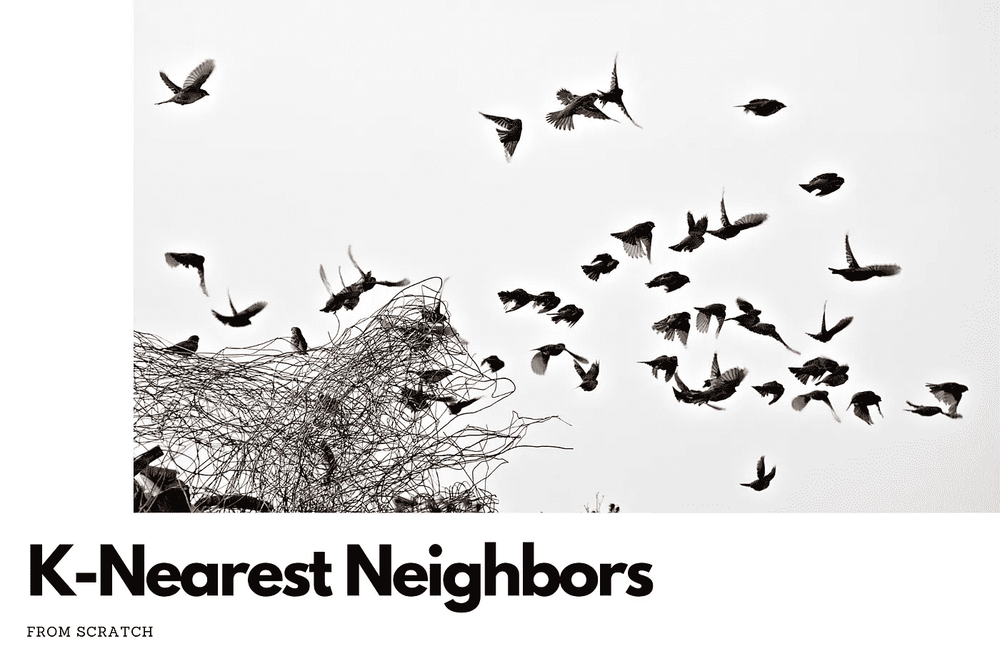
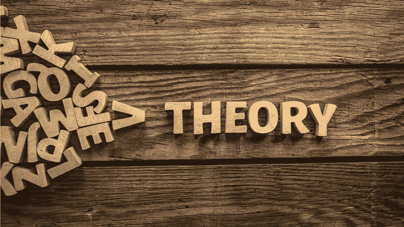
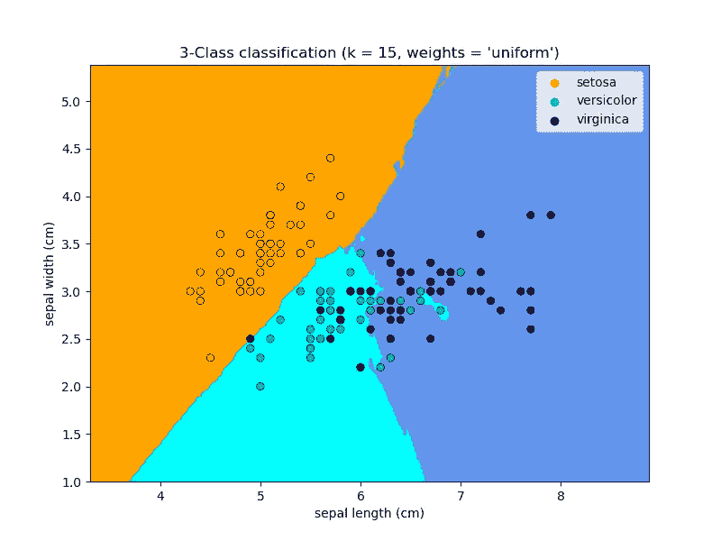
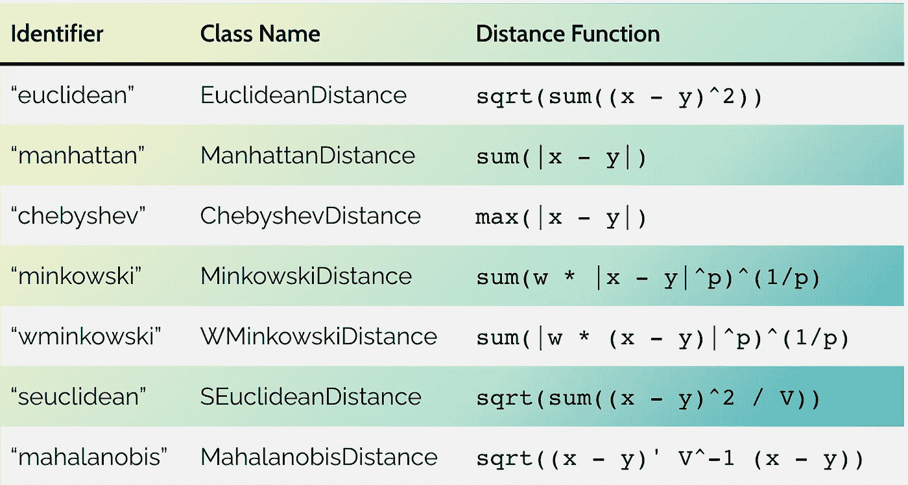

# k-最近邻

> 原文：<https://medium.com/mlearning-ai/k-nearest-neighbors-a8a1cd5c52ef?source=collection_archive---------4----------------------->

[Source](https://keepingupwithdatascience.files.wordpress.com/2022/01/knn.png)

# 介绍

> 人以群分——***威廉调谐器***

上面的引用完美地总结了我们在这篇文章中将要讨论的算法。 **KNN** 代表**K-最近邻**。这是一种简单、易于实现的监督机器学习算法，可用于解决**分类**和**回归**问题。

在这篇博文中，我们将讨论 K 近邻算法的理论。因此，不再赘述，让我们深入 KNN 算法的理论方面。

# k 近邻:理论

[Source](https://cdn.elearningindustry.com/wp-content/uploads/2019/08/learning-theories-in-elearning-affect.jpg)

KNN 算法是一种**懒惰算法**。我说的懒惰算法是什么意思？惰性算法是一种不从给定的训练集中归纳出简明假设的算法，而是将归纳过程延迟到给出测试实例。**简而言之，算法不会开始归纳，直到对其进行查询**。与懒惰算法相反的是**急切算法**，其中系统试图在系统训练期间构建一个通用的、独立于输入的目标函数。

KNN 算法假设**相似的东西**存在于**附近**。例如，如果我们有一个二进制分类任务，其中我们想要将一个测试数据点分类为两个类中的一个，那么 K-最近邻算法将找到 K 个与测试数据点最接近的数据点，并将它分配到 K 个最接近的数据点集合中最常见的类。下图显示了虹膜数据集上 3 最近邻分类器的决策边界。

[Source](https://scikit-learn.org/stable/auto_examples/neighbors/plot_classification.html#sphx-glr-auto-examples-neighbors-plot-classification-py)

KNN 算法使用各种**距离函数**来计算数据点之间的接近度。下表列出了其中的一些功能。

[Source](https://scikit-learn.org/stable/modules/generated/sklearn.metrics.DistanceMetric.html#sklearn.metrics.DistanceMetric)

# 结论

因此，在本文中，我们讨论了机器学习中使用的**基线模型之一**背后的理论概念，称为**K-最近邻**。它可以用来解决回归和分类问题。

我已经在我的网站上写了一篇详细的博文，其中我还用 Python 编程语言从头实现了 **KNN 算法，并使用它解决了一个二进制分类问题。整篇博文和代码可以从我的网站， [**这里**](https://keepingupwithdatascience.wordpress.com/2022/01/30/knn-in-machine-learning-from-scratch/) 。**

我希望这篇文章对你有所帮助。更多关于数据科学和机器学习的内容请访问我的 [**网站**](https://keepingupwithdatascience.wordpress.com/) 。大家学习愉快:)

 [## Mlearning.ai 提交建议

### 如何成为 Mlearning.ai 上的作家

medium.com](/mlearning-ai/mlearning-ai-submission-suggestions-b51e2b130bfb)