# k 近邻算法(KNN)

> 原文：<https://medium.com/mlearning-ai/k-nearest-neighbors-algorithm-knn-8a5c712afc6b?source=collection_archive---------4----------------------->

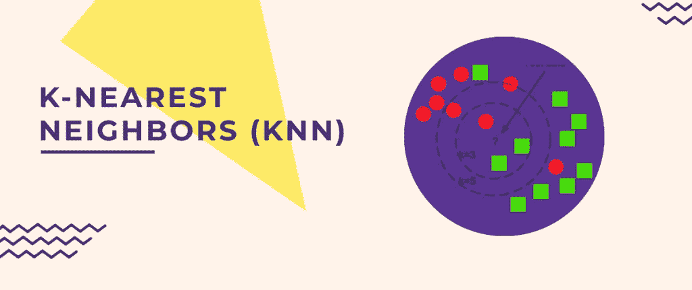

Source:[https://www.newtechdojo.com/k-nearest-neighbor-algorithm/](https://www.newtechdojo.com/k-nearest-neighbor-algorithm/)

嘿又来了！正如我在[上一篇文章](/@jinaneB/what-is-machine-learning-96e40309dbde)中承诺的，我们将开始学习机器学习算法。在这篇博客中，我们将讨论一种常用的分类算法，KNN 算法。

k-最近邻是机器学习中最容易理解但非常重要的分类算法之一。它甚至被称为最懒的算法，读了这篇文章你就知道为什么这么叫了。

让我们开始吧；

> *给定一些训练向量，KNN 算法能够识别我们想要分类的元素的 K 个最近邻，而不考虑标签。*

等等，我知道这个定义绝对非常无聊，而且不会帮助你理解 KNN。事实上，它只是停留在我的脑海里，在互联网上的某个地方看过之后，我不得不把它添加到我的博客上。很抱歉😅。继续读下去，我会让你得到的东西变得更容易、更有趣。这是我的使命😊。

让我们来看第一个例子:

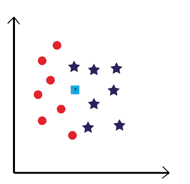

上图显示了一些训练向量，这些向量分为两类:橙色圆圈和蓝色星形。但是还有一个浅蓝色的正方形，上面有一个问号，那是干什么用的？使用 KNN 算法，正方形是我们想要分类的元素。

事不宜迟，让我们按照一些简单的步骤，帮助我们的孤独广场加入这两个班级中的一个:

—我们要做的第一件事，就是选择“K”这个数字。在这种情况下，让我们以 K=5 为例。

—第二件要做的事情是选择 K 个离我们的正方形最近的邻居。换句话说，选择最接近正方形的 5 个元素，而不考虑它们的类别(它们可能是星形或圆形，现在并不重要)。

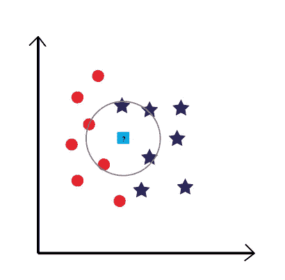

—现在，让我们数一数每个类的最近邻居的数量。正如你在上面的插图中看到的，有 3 个蓝色的星星和 2 个橙色的圆圈被选中。很明显，明星们赢了。可怜的橙色圆圈😢。

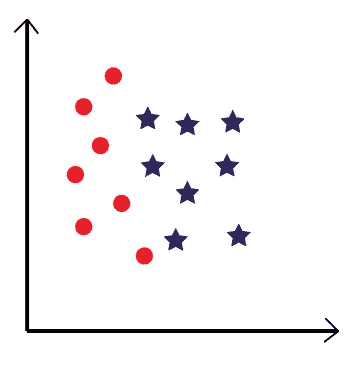

—最后，我们的广场将加入蓝星行列。让我们祝贺他终于有了一个家庭。

你知道吗，让我们再给橙色圈一次机会，也许这一次他们也能赢得一个新成员。为此，让我们假设 ou K=3，看看会发生什么。

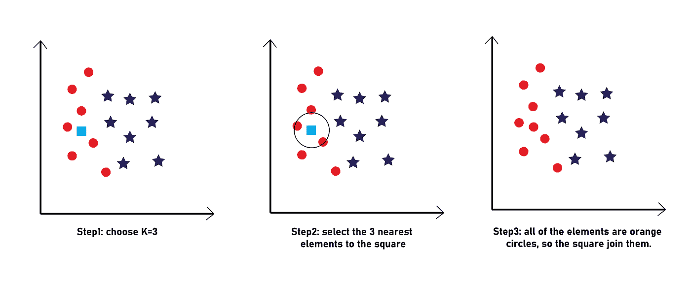

现在，你已经通过一个简单的例子理解了 KNN 算法，让我们通过处理一些真实的数据(不仅仅是圆形、正方形和其他形状)来让事情变得更难一些(不要担心，这不会很难得到)。

让我们以这个小数据为例:

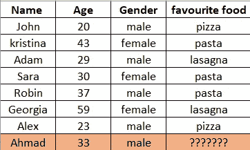

以上数据显示了 8 种不同人群的年龄、性别和喜爱的食物。我们被要求做的是，用 KNN 算法预测另一个人“艾哈迈德”最喜欢的食物。

就这么办吧。

首先，我们来确定一下我们的“K”。让它成为 3。之后，我们必须确定离“艾哈迈德”最近的 3 个邻居。为此，我们必须计算 Ahmad 和我们数据中所有其他人(我们的数据点)之间的欧几里德距离。

> *对于不知道的人来说，两点 A(x1，y1)和 B(x2，y2)之间的欧几里德距离是:*

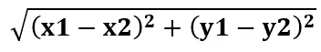

在我们的例子中，A 每次都是我们的数据点之一(John，Kristina，…)，B 是“Ahmad”。x 和 y 代表年龄和性别。

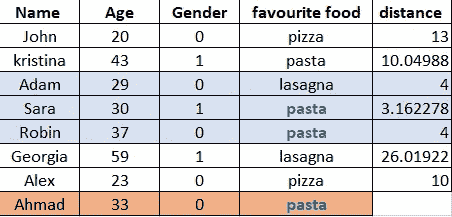

在计算每个人与“艾哈迈德”之间的所有距离后，我们可以看到亚当、萨拉、罗宾是离他最近的 3 个邻居，萨拉和罗宾都喜欢“意大利面”，所以艾哈迈德最喜欢的食物也是“意大利面”。

这看起来很容易，但也很累人！想象一下，有一个+100 行的数据，手动计算所有 100 个距离，然后选择最近的 3 个，这将是非常痛苦的。幸运的是，对于我们来说，Python 让这变得简单了。让我们尝试用 python 实现前面的例子。

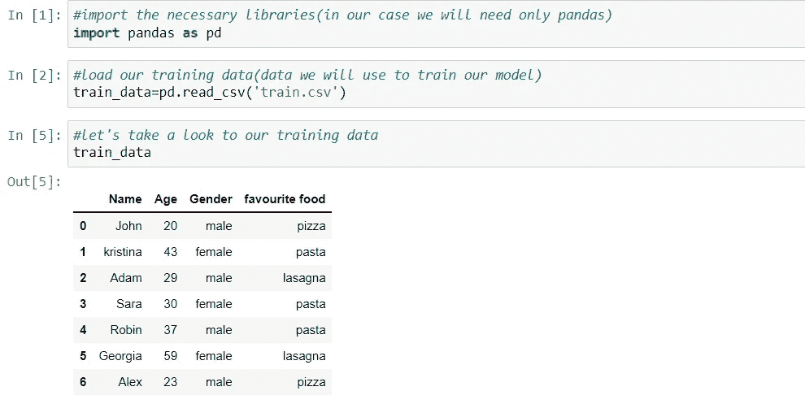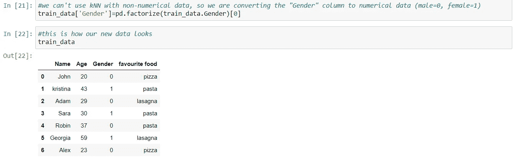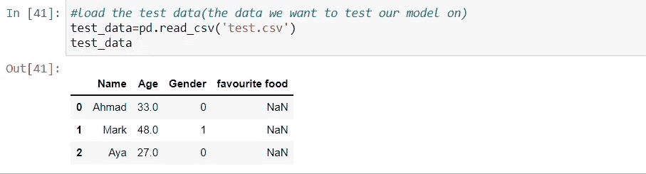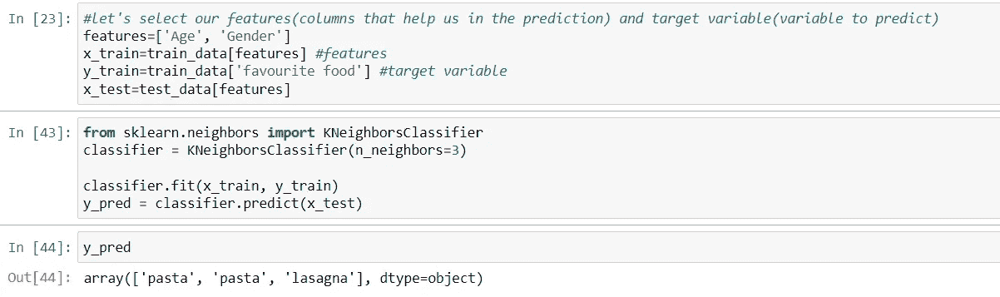

如您所见，Python 让事情变得简单多了。我们得到的结果和我们手动计算距离的结果是一样的。这是一个好迹象，表明我们的模型工作正常。

最后，我们完成了。容易吗？对吗？现在看看为什么我们称 KNN 为懒惰算法？因为没有比这更简单的了。只要确保你选择你的功能是正确的和仔细的。

下期博客再见，我们将继续以有趣的方式学习 ML 算法。

 [## Mlearning.ai 提交建议

### 如何成为 Mlearning.ai 上的作家

medium.com](/mlearning-ai/mlearning-ai-submission-suggestions-b51e2b130bfb)