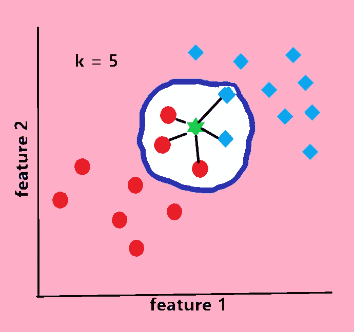
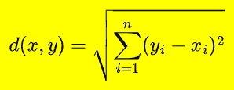
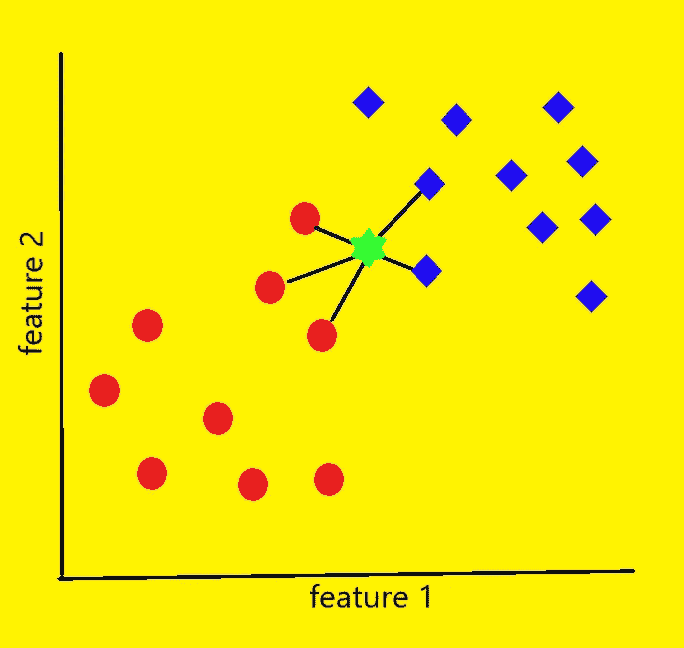
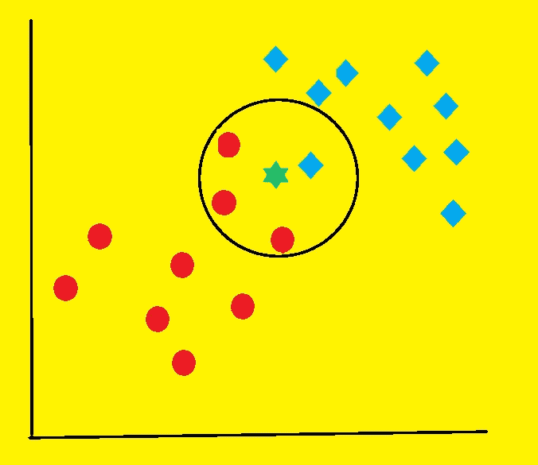

# k 近邻(KNN)解释说

> 原文：<https://medium.com/mlearning-ai/k-nearest-neighbours-knn-all-you-need-to-know-b9b93e22380e?source=collection_archive---------3----------------------->

Photo by [Stas Knop](https://www.pexels.com/@stasknop?utm_content=attributionCopyText&utm_medium=referral&utm_source=pexels) from [Pexels](https://www.pexels.com/photo/white-mug-on-red-background-2916450/?utm_content=attributionCopyText&utm_medium=referral&utm_source=pexels)

## **简介**

当我们听到机器学习这个词时，我们脑海中会出现复杂的计算、假设参数和偏导数。但是，这个不一样。一个简单，轻松，懒散的。没有复杂的计算，没有偏导数，没有超平面。

## **k 最近邻是什么:**

k 最近邻或简称为 KNN 是一种机器学习算法，主要用于分类任务，尽管它也可以执行回归任务。它根据最接近它的数据点所属的组来估计数据点成为一个数据组或另一个数据组的成员的可能性。

## **KNN 如何工作:**

像我之前说的，KNN 是一个懒惰的学习和非参数算法。它被称为懒惰学习算法或懒惰学习器，因为它在训练时不执行任何任务。它只是存储数据。就是这样。没有计算，没有概率估计，没有偏导数或没有训练模型的建立。它什么也不做。它仅在您测试模型或执行查询时构建模型。比如，你通过给一个未知的数据点来问模型它属于哪个类。

## **让我们来了解一下 KNN 的工作方式:**

KNN 使用特征相似性来预测新数据点的值。它是怎么做到的？让我们通过一个流行的伪代码来理解。(我是通过修改其他文章的内容来粘贴这篇文章的)

**第一步:**

数据。加载您的数据集。不过很明显。

**第二步:**

执行数据预处理。处理缺失值，必要时进行降维。

**第三步:**

选择 k 的值。

“KNN”中的“K”代表投票时你要考虑多少个邻近点。我们将在稍后的文章中讨论这个问题。它是一个整数。不要太小也不要太大。

**第四步:**

预言；预测；预告

***4.1*** 计算您的查询示例与每个训练行之间的距离，例如训练中使用的现有数据点。您可以使用任何方法来测量距离:欧几里得距离、曼哈顿距离、闵可夫斯基距离或海明距离。

Euclidean distance

人们使用最多的是欧几里德距离，它很简单。

***4.2*** 按升序排列距离。

***4.3*** 从排序后的数组中选择前 k 行或条目。

***4.4*** 获取这 k 个条目的标签，找到其中最频繁的类(投票)，这将是我们的查询示例的预测类，为查询示例分配该类。

***4.5 **** 对于回归计算那些 k 个最近的数据点的平均值。这将是我们查询示例的标签。

## **投票:**

这是一个简单的程序，可以找到附近最常去的班级。就像现实世界的选举一样。在计算一个地区的票数时，负责的官员计算有限数量的投票响应。并分类哪个候选人得了多少票。并按降序排列。像这样

约翰:14369

施里坎特:9650

劳拉:8771

所以约翰赢了。在 KNN 也是同样的程序。从这 K 个最近的数据点中，我们找到出现次数最多的类别。

在该图中，我们可以看到，在 5 个最接近的数据点中，3 个是红色类，2 个是蓝色类。因此，我们将为我们的查询选择红色类。

## **如何选择 k 的最优值:**

选择“K”没有具体的方法。你必须手动选择它。因此，我们必须使用不同的“K”值进行实验，多次训练模型，测量模型性能，并选择性能最佳的“K”继续前进。

当我们处理二元分类时，最好为“K”选择一个奇数值。否则，可能发生两个类邻居数量相同的情况。以同样的方式,“K”的值不能是当前类别数的倍数。另一种选择“K”的方法是 sqrt(n ),其中 n 是训练中存在的样本数。

k '不应该像 1 或 2 那样非常低。这将导致过度拟合。在这种情况下，它将是嘈杂的，并受到离群值的影响。

在我们查询周围的四个数据点中，三个是红色的，一个是蓝色的，但是蓝色的是最接近的。如果 k = 1，它将选择蓝色类作为最近邻，并归类为蓝色，但我们知道事实并非如此。

在大多数情况下，k 值越大，决策边界越平滑。但是不能太大。否则，数据点数量较少的组将总是被其他组否决。此外，较大的 K 在计算上将是昂贵的。

## **降维:**

当我们有大量数据时，这意味着当我们有太多的特征要处理时，有可能会过度拟合，导致模型不准确。我们的模型将更难测量距离。另一个问题是许多数据点可能是等距。

所以过程降维是方法。在这种情况下，在数据准备步骤中考虑**主成分分析(PCA)** 和**特征选择**。

我们还没有写任何关于这些话题的文章，但很快就会了。

## **KNN 的优缺点:**

**优点:**

1.这很容易实现

2.没有必要建立一个模型，调整几个参数，或作出额外的假设。

3.既可以做回归，也可以做分类。

4.它可以很好地处理多类分类

**缺点:**

1.需要高存储容量

2.需要确定一个合适的“K”

3.对不相关的特征敏感

4.当 n(例子的数量)增加，特征或独立变量的数量增加时，速度明显变慢

5.由于测量训练样本中所有数据点之间的距离，计算成本很高。

## **KNN 的应用:**

KNN 被用于各种领域。

***政治:***

通过计算一些因素和使用 KNN，我们可以知道一个选民会把他的票投给哪个政党。

***银行业:***

KNN 可以在银行系统中用于预测个人是否适合贷款审批。

***推荐系统:***

这是 KNN 分类法的一个伟大应用。我们将很快写一篇关于推荐系统的文章。

## **注:**

1.在建模阶段之前，我们需要很好地清理数据。此外，该实现假设所有列都包含数字数据，并且数据的最后一列有标签，我们可以对其执行一些功能。

2.选择“K”值时，领域知识很重要。

3.对于模型评估，在执行分类时使用混淆矩阵检查模型准确性。

4.其他统计方法如似然比检验也用于验证。

这篇文章就是这么说的。请评论您的反馈。如果有一些错误，请指出。

帮我接通

[Github](https://github.com/shubhendu-ghosh-DS) ， [linkedIn](https://www.linkedin.com/in/shubhendu-ghosh-423092205/) ， [Twitter](https://twitter.com/shubhendubro)

 [## Mlearning.ai 提交建议

### 如何成为 Mlearning.ai 上的作家

medium.com](/mlearning-ai/mlearning-ai-submission-suggestions-b51e2b130bfb)