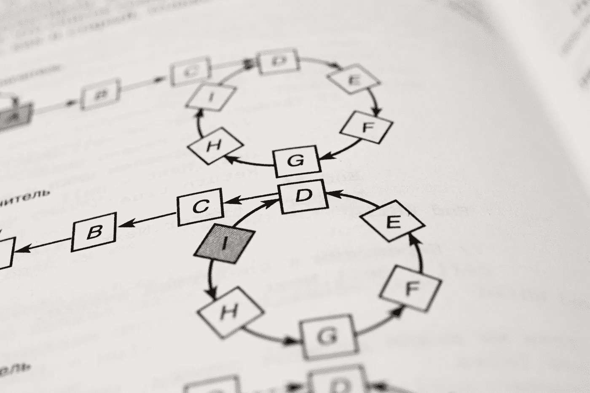
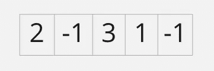
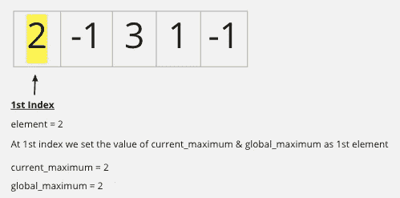
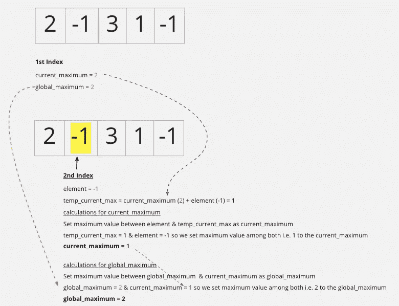
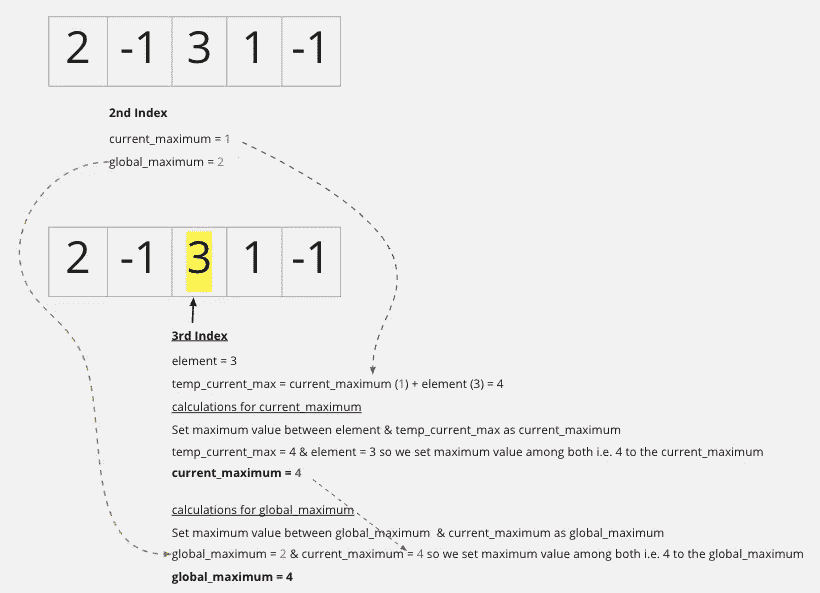
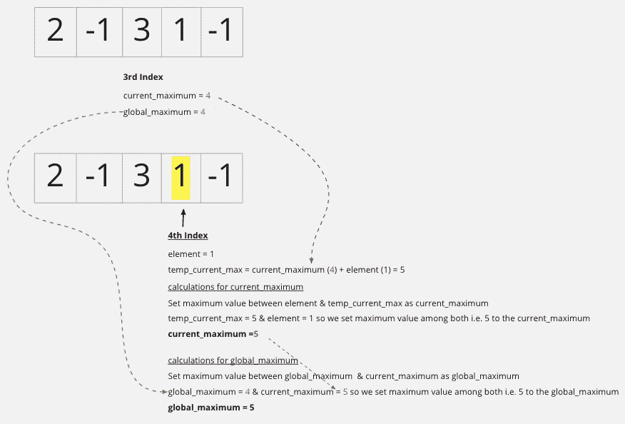
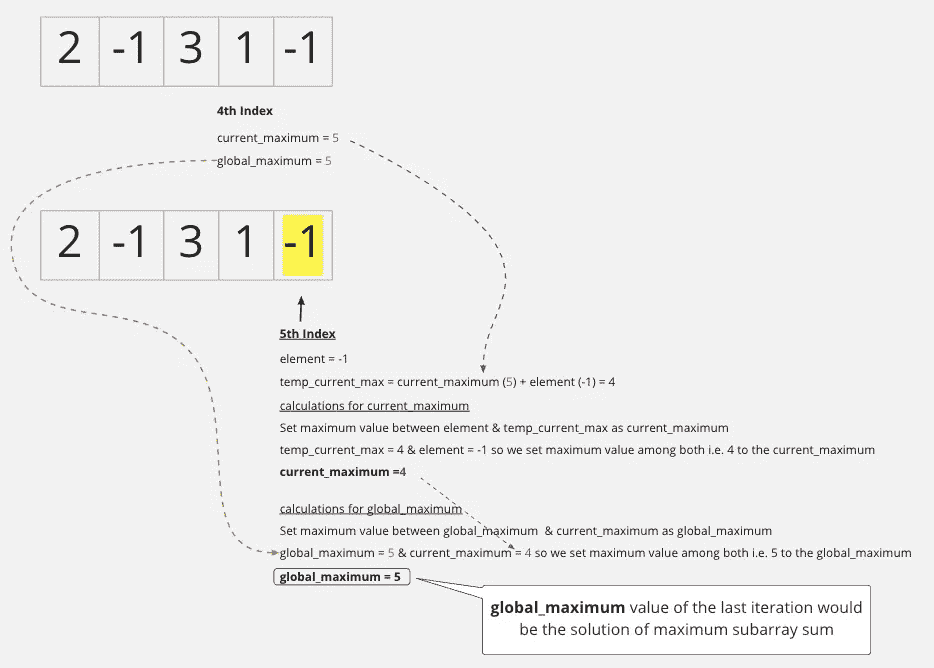

# Kadane 算法(动态规划)解决最大子阵列问题

> 原文：<https://medium.com/mlearning-ai/kadanes-algorithm-dynamic-programming-to-solve-maximum-subarray-problem-d4e3a72f4e1e?source=collection_archive---------2----------------------->

## 卡丹的算法用一种简单的方式解释



image source: [https://unsplash.com/photos/nuz3rK5iiKg](https://unsplash.com/photos/nuz3rK5iiKg)

# 介绍

最近我遇到了流行的编程问题“最大子阵列问题”，并决定尝试一下。在这个过程中我学到了一个非常有趣的算法，叫做“卡丹算法”。在这篇文章中，我将向你展示这个算法是如何工作的。

# 什么是“最大子阵列问题”

最大子阵列是这样一个问题:从给定的整数阵列中，我们必须在所有可能的子阵列中找到一个具有最大和的连续子阵列。

首先让我们试着理解这个问题。

## 什么是子阵列？



子数组基本上是数组中的数组。所以在上面的例子中，子数组可以是[2，-1]或者只是一个元素[3]，也可以是整个数组[2，-1，3，1，-1]。但是如果我们取[3，-1]，那就不是子数组，因为它不是连续的元素。所以子数组是给定数组中一组连续的元素。

## 问题陈述

目标是找到具有最大和的子阵列(在所有可能的组合中)。我的意思是。如果你考虑子阵列[-1，3]，总和就是-1 + 3 = 2。如果你取[3，1]，总和就是 4。对于整个数组[2，-1，3，1，-1]，总和是 4。

在这个例子中，子阵列[2，-1，3，1]的最大子阵列和是 5。我们需要通过编程找到它。

# 强力方法

这个问题最简单的解决方案是强力方法，基本上是检查所有可能的子数组，并选择总和最大的一个，所以我会检查从第一个索引开始的子数组，然后检查从第二个索引开始的子数组，依此类推。这种方法是可行的，但是它需要数组中元素数量的平方时间，这不是最佳的解决方案。

```
Starting with 1st Index 
[possible subarrrays]  [Sum]
[2]                   = 2
[2, -1]               = 1
[2, -1, 3]            = 4
[2, -1, 3, 1]         = 5
[2, -1, 3, 1, -1]     = 4

Starting with 2nd Index 
[-1]                  = -1
[-1, 3]               = 2
[-1, 3, 1]            = 3
[-1, 3, 1, -1]        = 2

Starting with 3rd Index
[3]                   = 3
[3, 1]                = 4
[3, 1, -1]            = 3
.
.
.
and so on...
```

# 卡丹算法

为了优化上述解决方案，我们将使用动态规划的概念。这种算法称为 Kadane 算法，在这种算法中，我们使用前面子问题的解来寻找整体最优解。

## 算法工作

我们来试着理解一下这个算法。

*   我们迭代数组的每个元素，并跟踪该索引处元素的最大和，我们称之为 **current_maximum** 。
*   current_maximum 或者是当前索引处的元素，或者是前一个 current_maximum & current 元素的相加。
*   除此之外，我们还跟踪整体最大值，我们称之为**全局最大值**，如果当前最大值大于全局最大值，那么我们用当前最大值替换全局最大值。
*   在最后一次迭代中**全局最大值**的任何值将是最大子阵列问题的解

这些步骤可能看起来吓人，但这个算法相当简单。让我为上面的例子一步一步地解释这个算法。

我们将遍历所有元素，并在每个阶段计算 Kadane 算法中提到的值。

**第一个元素**



**二次元**



**第三元素**



**第四元素**



**第五元素**



正如您在最后看到的，global_maximum 是 5，这是我们的解决方案。此外，我们在一次迭代中得到结果，因此它是一个线性解决方案，比蛮力方法优化得多。

## Python 实现

让我们试着用 Python 来实现它。

```
Output should looks like this 
Maximum subarray sum for [2, -1, 3, 1, -1] is 5 
Maximum subarray sum for [-3, 1, -8, 4, -1, 2, 1, -5, 5] is 6
```

# 结论

在本教程中，我们看到了解决最大子阵列问题的两种方法。第一种方法不是最佳解决方案。随后，我们讨论了 Kadane 的算法，并使用动态规划在线性时间内解决问题。

希望我能够解释卡丹的算法。如果您有任何问题或任何反馈，请随时发表评论或在 [LinkedIn](https://www.linkedin.com/in/vinodvidhole/) 联系我。感谢您的阅读，下次再见…编码快乐！！

[](/mlearning-ai/mlearning-ai-submission-suggestions-b51e2b130bfb) [## Mlearning.ai 提交建议

### 如何成为 Mlearning.ai 上的作家

medium.com](/mlearning-ai/mlearning-ai-submission-suggestions-b51e2b130bfb)