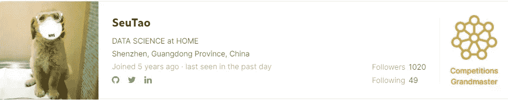
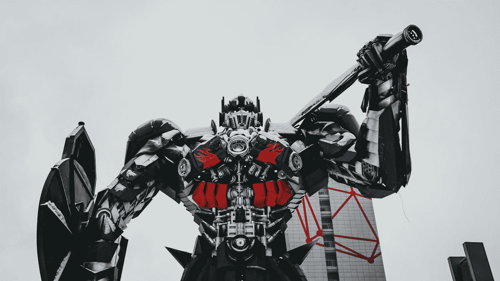
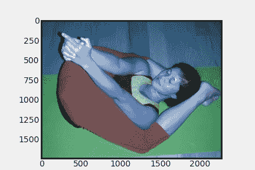
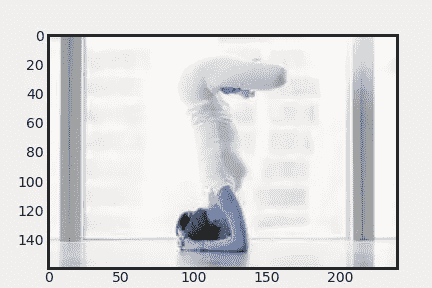
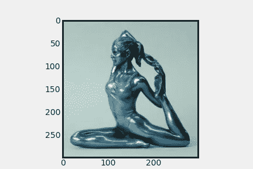
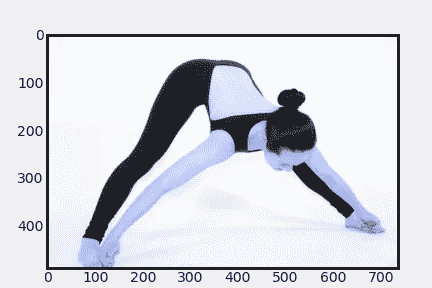
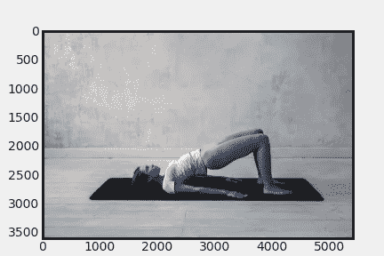
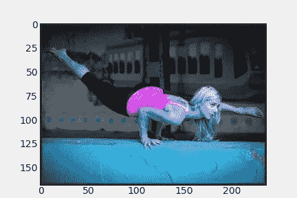

# Kaggle Days 锦标赛—上海

> 原文：<https://medium.com/mlearning-ai/kaggle-days-championship-shanghai-f137a5e823bb?source=collection_archive---------2----------------------->

Photo by [kike vega](https://unsplash.com/@kikekiks?utm_source=medium&utm_medium=referral) on [Unsplash](https://unsplash.com?utm_source=medium&utm_medium=referral)

昨天，11 月 18 日，历史在上海被创造，至少事实上是在上海。这是总共 12 次 Kaggle Days 锦标赛聚会中的第一次，实际上是在上海举行的。你可能想知道什么是 Kaggle Days 锦标赛，谁比组织者自己更能解释这个问题:

The video is redistributed from: [https://kaggledays.com/championship/](https://kaggledays.com/championship/)

见面会以组织者的简短介绍开始，随后是 Kaggle 特级大师沈涛的精彩演讲，他在 Kaggle 上被称为 [SeuTao](https://www.kaggle.com/shentao) 。

他做了 30 分钟的演讲:

# *如何使用变形金刚模型赢得游戏比赛*

Photo by [Arseny Togulev](https://unsplash.com/@tetrakiss?utm_source=medium&utm_medium=referral) on [Unsplash](https://unsplash.com?utm_source=medium&utm_medium=referral)

他首先介绍了 transformer 模型的一些关键方面，如注意力模块、查询键值原则和多头自我注意力[1]。此外，他讲述了一些最明显的变压器用例，如 NLP，但也有创新和前瞻性的用例，如

*   计算机视觉的变形金刚—屏蔽自动编码器[2]和 Swin 变形金刚[3]
*   图形结构化数据的转换器—graphformer[4]

在他的结论中，他还从他训练和使用变形金刚的经历中得到了一些有用的建议

*   请耐心等待超参数调整
*   使用预图层规范化
*   使用预热
*   使用身份映射初始化

但是他也强调变形金刚并不是赢得游戏比赛的全部

> 变形金刚不是你需要的全部

# 不要停下来，直到你倒下！

你可能会问自己为什么这篇文章中的第一张图片是瑜伽姿势，答案是因为第一个 Kaggle Days Meetup 挑战是从图片中识别瑜伽姿势。

Example of all six different poses in the data set [5]

用于模型开发的给定数据集包含 2360 张图片，测试集包含 756 张图片，这些图片是人们做六种不同瑜伽姿势的图片[5]。这是一场经典的卡格尔比赛，但有 4 个小时的截止时间。每个团队有 10 次机会提交他们在测试集上的最佳分类结果。共有 70 个团队提交了他们的预测，包括我们团队，*团队* *超配* ( [这里是我们的解决方案](https://www.kaggle.com/bjoernjostein/kaggle-days-shanghai-2021-accuracy-88-07/notebook))。

你现在的问题可能是:我现在参加还来得及吗？答案是否定的。你仍然可以参加剩下的 11 场聚会。在每一次聚会上，表现最好的三支球队将被邀请参加 2022 年 9 月/10 月在巴塞罗那举行的大决赛。*队！？我没有团队，*你可能会想。别担心，只要在 https://kaggledays.com/championship/meetups/[注册，你就会被邀请到 Slack 频道，在那里你会遇到友好的卡格勒人，他们非常乐意和你组成一个团队。](https://kaggledays.com/championship/meetups/)

# kaggledays # kaggledayschampionship

 [## Mlearning.ai 提交建议

### 如何成为 Mlearning.ai 上的作家

medium.com](/mlearning-ai/mlearning-ai-submission-suggestions-b51e2b130bfb) 

[1] A .瓦斯瓦尼*等人*，《注意力是你所需要的一切》，*arXiv:1706.03762【cs】*，2017 年 12 月，可获得:[http://arxiv.org/abs/1706.03762](http://arxiv.org/abs/1706.03762)

[2] K. He，X. Chen，S. Xie，Y. Li，P. Dollár 和 R. Girshick，*屏蔽自动编码器是可扩展视觉学习器*。2021.

[3] K. He，X. Chen，S. Xie，Y. Li，P. Dollár 和 R. Girshick，*屏蔽自动编码器是可扩展视觉学习器*。2021.

[4] C. Ying *等*，‘变形金刚对于图形表示真的表现不好吗？’，*arXiv:2106.05234【cs】*，2021 年 6 月，可售:[http://arxiv.org/abs/2106.05234](http://arxiv.org/abs/2106.05234)

[5] M .维尔马、s .库马瓦特、y .中岛和 s .拉曼，“Yoga-82:一个新的人体姿态精细分类数据集”，载于 *IEEE/CVF 计算机视觉和模式识别研讨会会议(CVPRW)* ，2020 年，第 4472–4479 页。