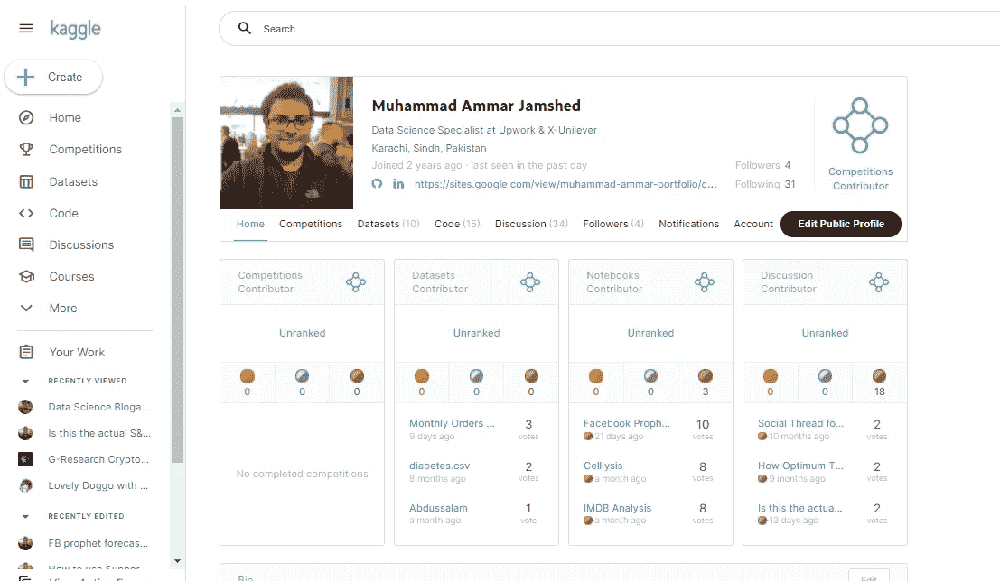
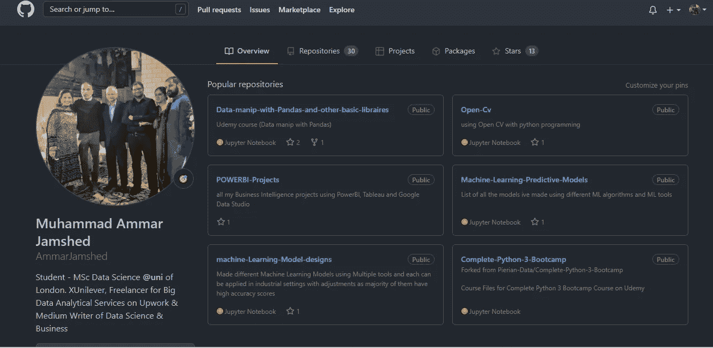
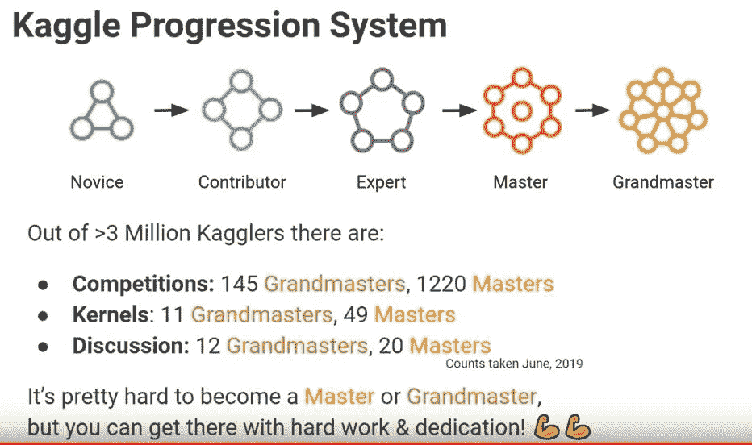
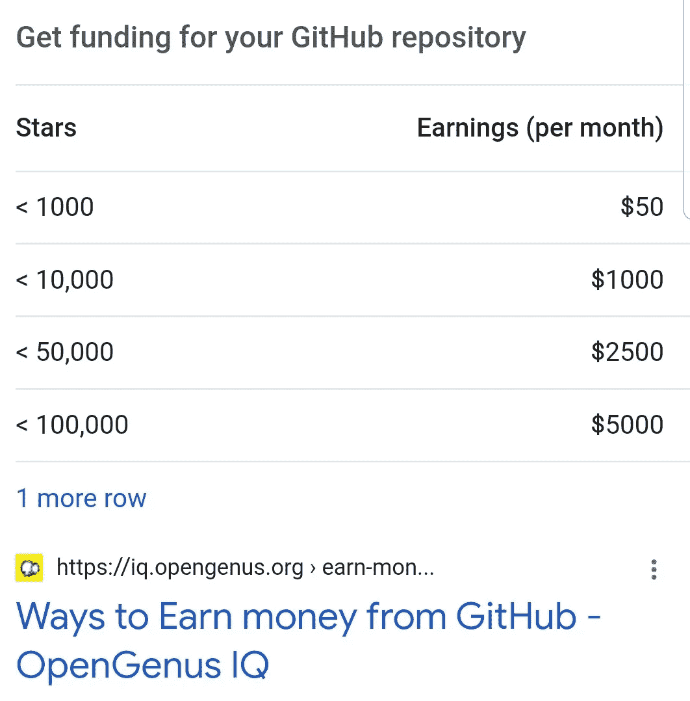

# Kaggle 还是 Github？对于数据科学专业人员来说，哪一个更重要

> 原文：<https://medium.com/mlearning-ai/kaggle-or-github-which-one-is-more-important-for-a-data-science-professional-c797e838e99a?source=collection_archive---------0----------------------->

Uploaded by Ken Jee

对于计算机科学、分析甚至数据科学的主要专业人士来说，这两个都是重要的投资组合数据库。Kaggle 归谷歌所有，GitHub 归微软所有，两者都是目前引领技术创新趋势的科技巨头。

My Portfolio in Kaggle (Still working on it)

My Github Portfolio

# 什么是 Kaggle，它有什么用？

Kaggle 允许您在分析、机器学习中使用大量的 Python 和 R 代码来构建大量的投资组合，并参加各方面的培训课程，最重要的是通过在竞赛中获胜来获得奖励。

## Kaggle 排名系统

Source : Mobile Legends

## 卡格尔的课程

Kaggle 提供机器学习、Python、R 编程和分析方面的多种实践课程。所有的课程都是实践技能学习，你学习如何编写代码并使用它进行分析。

> 上传您的工作或直接在现有数据集上创作分析

许多组织和个人在 Kaggle 上上传他们的数据集，并要求人们对其进行分析和机器学习以找到解决方案。当人们看到你的工作(在这种情况下你应该公开)并投票支持它时，Kaggle 会给你更高的排名，这会给你更多的奖牌。随着你职位的上升，你的技能在寻找数据科学家、ML 工程师或分析师的组织中变得更加明显。你甚至可能会发现一些公司在看过你的 Kaggle 作品集后开始招聘。

## Kaggle 中的投资组合是什么样的？

Kaggle 中的投资组合包括分析案例研究、机器学习模型、自我提供的数据集和讨论，所有参与者都根据其贡献水平进行排名，从新手到大师。

## 能从 Kaggle 赚到吗？

是的，参与者可以通过赢得比赛获得奖励，甚至可以在工作考核后被公司录用。

Image by How-To Geek

## *什么是 GitHub，它有什么用途？*

Github 是编码项目及其框架代码的存储库，基于您应用的设置，这些代码可以共享给任何人或您个人。

## *Github 中的投资组合是什么样的？*

Github 中的文件夹是您构建的代码和工具的集群存储，其他人可能会将其用于学术或商业目的，甚至您可以根据自己的需要进行存储，以便日后重新访问。

数据科学家使用 github 来存储他们的机器学习模型和使用代码或 OpenML 和 PowerBI 等特定工具完成的分析，这些工具也可以以图像、Pdf 甚至代码的形式存储。

程序员使用 Github 来存储用于构建他们的应用程序或软件的代码，因此其他人可以使用它来支付费用或根据代码上的设置给予积分。

Google Search

## 能从 Github 赚到吗？

是的，基于你在你的知识库中获得的星星的数量，如果它是开源的，公司可能会选择使用它，并为你在他们的项目中使用你的代码而付费。你的收入是基于有多少其他的程序员喜欢你的库，拥有多个库并且每个库都有很多喜欢的人也可以每年赚 10 万美元。

# 结论

github 和 Kaggle 都是培养你的技能和保存你的作品用于个人或商业用途来赚钱的重要部分。Kaggle 甚至允许你通过链接到 Kaggle 直接保存你的笔记本/代码内核到你的 Github 库，你可以在 Kaggle 中保存你所有的工作，在 Github 中保存和销售，而不需要单独打开 Github。

作者指出

> 嘿，伙计们，我现在是一名自由职业者，从事 Upwork 的分析工作。如果您对任何基于分析/数据科学/机器学习的项目有任何评论、批评或任何建议需求。请随时在 LinkedIn 上联系我，你可以使用我的 Github/ka ggle python 和 R 代码模板库，并且已经为实现或参考制作了可视化。
> 
> linked ln:https://www . LinkedIn . com/in/goto-resumemuhammad-ammar-jam shed-029280145/
> 
> 吉图布:https://github.com/AmmarJamshed
> 
> https://www.kaggle.com/muhammadammarjamshed

 [## Mlearning.ai 提交建议

### 如何成为 Mlearning.ai 上的作家

medium.com](/mlearning-ai/mlearning-ai-submission-suggestions-b51e2b130bfb)