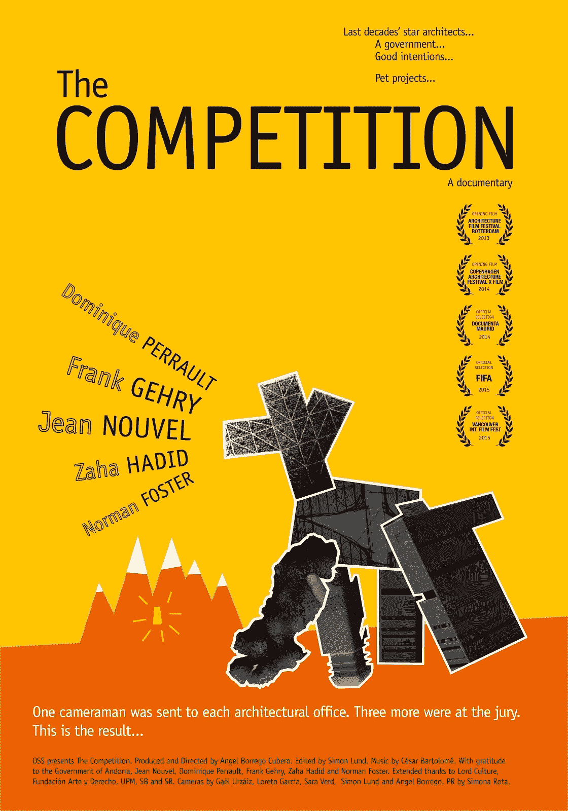

# ka ggle 5 月 21 日的表格竞赛并不像看起来那么简单

> 原文：<https://medium.com/mlearning-ai/kaggles-may-21-tabular-competition-is-not-as-easy-as-it-looks-2290c1d3ef39?source=collection_archive---------6----------------------->

对于那些不知道的人，Kaggle 在 2021 年每个月都会举办一场表格机器学习比赛。作为一名数据科学爱好者，我参加了今年举行的每一场表格竞赛。2021 年 4 月表格比赛的链接可以在这里找到:- [我如何解决 Kaggle 的 2021 年 4 月表格比赛|作者 Tracyrenee | MLearning.ai | Apr 年 4 月| Medium](/mlearning-ai/how-i-solved-kaggles-april-2021-tabular-competition-28b3ed8f465a)