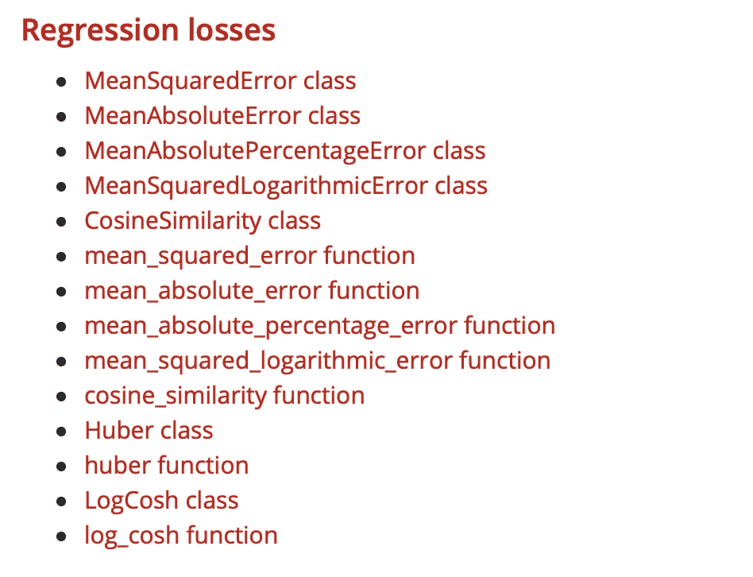

# Keras 损失函数

> 原文：<https://medium.com/mlearning-ai/keras-losses-functions-a61f693a9b2e?source=collection_archive---------3----------------------->

*分类交叉熵损失，二元交叉熵损失 ve MSE 损失*

Photo by [Chris Ried](https://unsplash.com/@cdr6934?utm_source=medium&utm_medium=referral) on [Unsplash](https://unsplash.com?utm_source=medium&utm_medium=referral)

嗨！今天让我们更深入地研究一下这些神经网络，你认为呢？让我们先搞清楚为什么要用损失函数，然后再搞清楚它们的含义。我不得不说。利用我们将在项目中使用的超参数，我们可以很好地捕捉变化。由于这个原因，高于预期的准确率再次通过这些参数的形成。

# 什么是损失函数？

首先，我要告诉你目标函数。用英语来称呼这个会更正确。目标函数是一种函数，用于评估我们创建或使用的优化算法中存在的候选解决方案。事实上，它是优化算法的必要条件。

🏋🏻‍♀️，现在我们来看损失函数。顾名思义，我们在这里有一个损失，所以它对我们有一个负面的结果。我们希望将这种错误率降至最低，以提高我们创建的神经网络的准确性。这些错误率是由一些有效的原因引起的，可以被认为是优化算法中的目标函数。所以我们的目标函数在这里变成了损失函数。损失函数以某种方式伤害了我们的目标。为此，我们尽量将损失值保持在尽可能低的水平。

> 我们想要最小化或最大化的函数称为目标函数或标准。当我们将其最小化时，我们也可以称之为成本函数、损失函数或误差函数。
> 
> —第 82 页，[深度学习](https://amzn.to/2NJW3gE)，2016。

作为注释，我想补充一点，选择权完全在我们手中。由于这个原因，我们必须决定在哪个函数上工作。对此我补充一句好话👇🏻

> 这就是函数忠实地代表我们的设计目标非常重要的原因。如果我们选择了一个不好的误差函数，得到了不令人满意的结果，那么错误地确定搜索的目的就是我们的错。
> 
> ——155 页，[神经锻造:前馈人工神经网络中的监督学习](https://amzn.to/2S8qRdI)，1999 年。

# 使用哪个损失函数？

🪄损失函数的选择甚至影响你创建的人工神经网络层的输出。出于这个原因，我们需要做正确的设计。

🪄，我们需要很好地了解我们的问题，以便能够很好地评估要选择的损失函数。比如有回归问题，要知道通常使用的是 **mean_square_error** 函数。当然，这些功能也有各种选项。让我们转到 Keras 的文档，以便我们可以选择它们。

🧚🏼‍♂️正如我们所看到的，有太多缺少类和函数选项的函数，这完全取决于我们。相同方法的类和函数属性已经给出。刚刚打开一个函数实例事件，我想多接触一点代码。

另一个例子是**compile()**方法。我们在这里创建的结构实际上正在经历 CNN 模型的编译。SGD，即随机梯度下降，被用作优化算法，而 **MeanSquaredError** 被用作损失函数。

另一个缺失的函数是**分类交叉熵**。这是一个我非常熟悉的功能。我们也可以将我们的函数作为一个类来使用，并且有可能在模型中使用它。但首先，让我们稍微了解一下他们。

Keras 的原始文档提到:

> 计算标签和预测之间的交叉熵损失。

嗯，让我们再开一点你的意思是什么？据说当有两个或两个以上标签类时，我们应该使用这个交叉熵损失函数。下面你可以找到这个加载为**类**的损失函数。

以🖇为例，考虑一下时尚杂志的数据。当我们检查这些数据时，我们会看到它由 10 个类别组成。因此，当有多个类别时，使用这个损失函数会更明智。

但是如果我们在创建模型时想要使用它，我们应该编写什么样的代码呢？

📥因此，我们可以在多类分类问题中使用该函数。现在我们有最后一个损失函数，我们将检查。当然是**二元交叉熵**，我们在二元分类中经常用到的！

**二元交叉熵损失函数**用于我们将一个例子分为两类的问题。例如，我们需要确定一个图像是一只猫还是一只狗。在这个阶段，这个损失函数就发挥作用了。例如，狗可以标记 1，而猫标记为 0。

现在来看看它的编码，大家觉得怎么样？

我们看到上面的 **BinaryCrossentropy** 类。因为我们可以将它用作类结构，所以我们也可以将下面的结构加载到我们的模型中。

🎉因此，我们通过使用 **tf.keras API** 在我们的模型中使用了我们的损失函数。

在我的下一篇文章中，我将解释在深度学习领域训练人工神经网络时如何选择损失函数。坚持下去，✨

# 参考

1.  [https://machine learning mastery . com/loss-and-loss-functions-for-training-deep-learning-neural-networks/](https://machinelearningmastery.com/loss-and-loss-functions-for-training-deep-learning-neural-networks/)
2.  [https://machine learning mastery . com/how-to-choose-loss-functions-when-training-deep-learning-neural-networks/](https://machinelearningmastery.com/how-to-choose-loss-functions-when-training-deep-learning-neural-networks/)
3.  https://keras.io/api/losses/