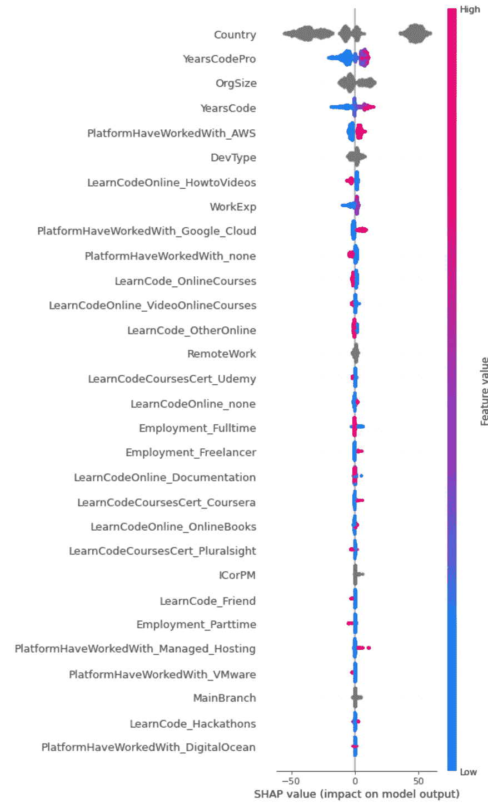
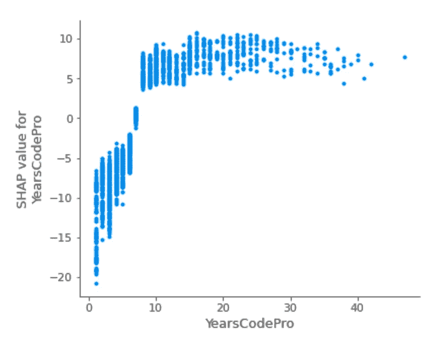
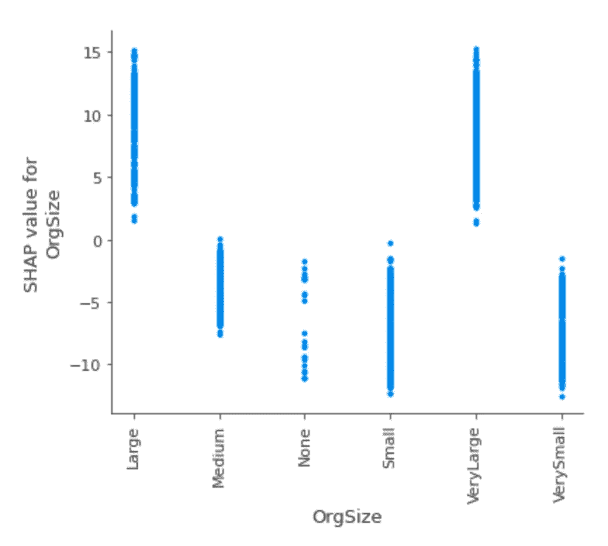
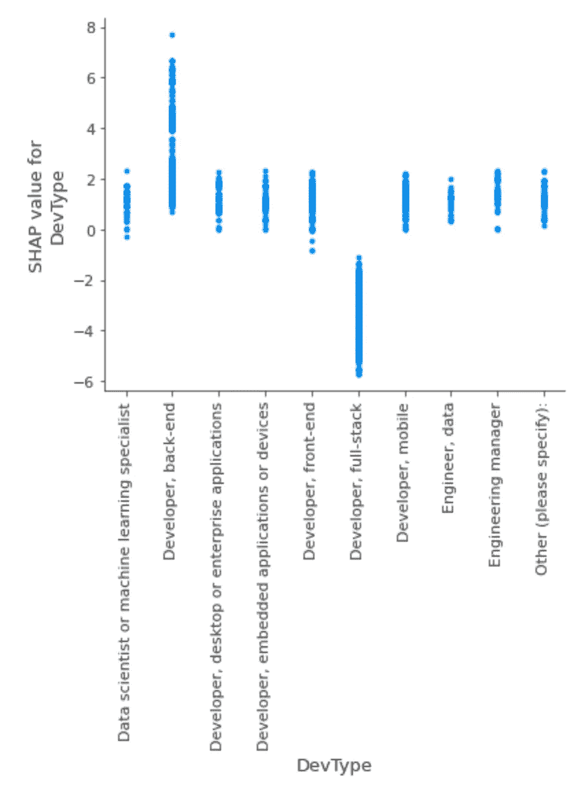
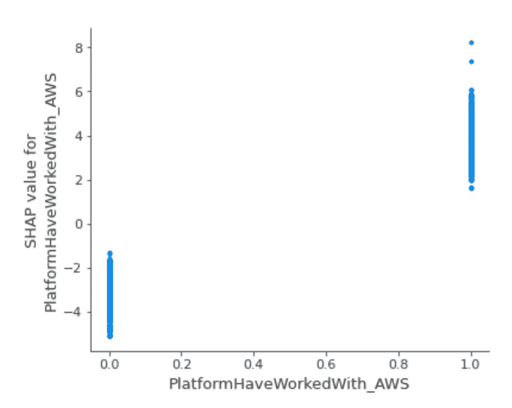
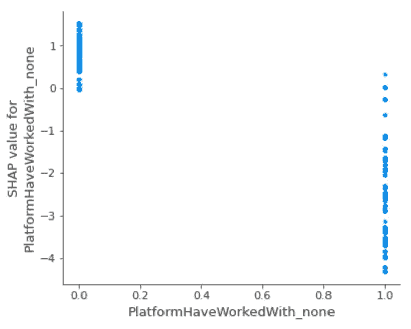

# 2022 年开发人员工资的关键因素——堆栈溢出调查的教训

> 原文：<https://medium.com/mlearning-ai/key-factors-for-developer-salaries-in-2022-lessons-from-the-stack-overflow-survey-ec5bb99f3f79?source=collection_archive---------4----------------------->

本文的目标是**量化不同类型的开发人员**(不仅仅是数据科学家)的薪酬的关键贡献。这项研究依赖于 2022 年 5 月的[堆栈溢出调查，数据集已经](https://insights.stackoverflow.com/survey)[在 Kaggle](https://www.kaggle.com/datasets/dheemanthbhat/stack-overflow-annual-developer-survey-2022) 公开。与之前的故事类似，该分析基于 [SHapley 附加解释(SHAP)](https://shap.readthedocs.io/en/latest/index.html) 值。分析的全部细节也可以在 Kaggle 上的[公共笔记本中获得。](https://www.kaggle.com/dima806/stackoverflowdevelopersurvey2022-explain)

Photo by [Celyn Kang](https://unsplash.com/@celynkang13?utm_source=unsplash&utm_medium=referral&utm_content=creditCopyText) on [Unsplash](https://unsplash.com/s/photos/money?utm_source=unsplash&utm_medium=referral&utm_content=creditCopyText)

# 步骤 1 —数据预处理

这里，数据预处理包括以下步骤:

*   选择具有代表性的大量响应者的国家和开发商类型；
*   将标签列重新调整为 kUSD/year；
*   移除具有最大(最小)补偿的 5% (5%)响应者；
*   删除对此分析不感兴趣的列；
*   替换空值。

# 步骤 2-设置机器学习模型来预测年度薪酬

上一步准备的数据在训练样本和测试样本之间随机拆分，并使用明确考虑分类特征的 [CatBoostRegressor](https://catboost.ai/en/docs/concepts/python-reference_catboostregressor) 模型建模。所得模型的[均方根误差](https://scikit-learn.org/stable/modules/generated/sklearn.metrics.mean_squared_error.html) (RMSE)为**约 55 kUSD/年**，与基准模型 RMSE 的约 73 kUSD/年相比有所提高**(假设同样的**年补偿约 101 kUSD/年**用于每个**响应者的**)。**

# 步骤 3——对获得的机器学习模型的解释。

在这里，我们使用[SHapley Additive exPlanations(SHAP)](https://shap-lrjball.readthedocs.io/en/latest/index.html)方法，一种最常见的探索机器学习模型的可解释性的方法。因此，SHAP 价值的单位是 kUSD/年。

首先，我们研究我们感兴趣的前 30 个特征的 SHAP 值的跨度:

Image source: author, [StackOverflowDeveloperSurvey2022_Explain | Kaggle](https://www.kaggle.com/code/dima806/stackoverflowdevelopersurvey2022-explain)

正如我们所见，**SHAP 值的最大跨度是由于它们所在的国家**。国家间 SHAP 值的更详细视图**显示了最高收入国家(美国)和最低收入国家(印度和巴西)之间约 90 kUSD/年的差异**:

Image source: author, [StackOverflowDeveloperSurvey2022_Explain | Kaggle](https://www.kaggle.com/code/dima806/stackoverflowdevelopersurvey2022-explain)

影响开发者年报酬的另一个重要因素是**专业编码的年数** ( **YearsCodePro** 变量)。在这里，我们看到拥有 10 年以上专业编码经验的开发人员比只有 1 年经验的开发人员平均每年多获得**大约 20 kUSD**，在 10 年以上经验后**变化非常小**:

Image source: author, [StackOverflowDeveloperSurvey2022_Explain | Kaggle](https://www.kaggle.com/code/dima806/stackoverflowdevelopersurvey2022-explain)

毫不奇怪，在较大的组织中工作( **OrgSize** variable)也会导致较高的年薪，在非常大的组织(5000 多名员工)中工作的**开发人员比在非常小的组织(最多 19 名员工)中工作的开发人员平均每年多获得 16 kUSD**:

Image source: author, [StackOverflowDeveloperSurvey2022_Explain | Kaggle](https://www.kaggle.com/code/dima806/stackoverflowdevelopersurvey2022-explain)

然而，正如我们在下面注意到的，这种增加应该与从增加的编码经验( **YearsCode** 列)和工作经验( **WorkExp** 列)获得的 SHAP 值相结合。

有趣的是，不同类型的开发人员( **DevType** 变量)之间的差异并不显著——平均而言，**后端开发人员的年薪比全栈开发人员高约 6 kUSD**，而其他类型(包括数据科学家、数据工程师或工程经理)则介于这两者之间:

Image source: author, [StackOverflowDeveloperSurvey2022_Explain | Kaggle](https://www.kaggle.com/code/dima806/stackoverflowdevelopersurvey2022-explain)

以前与[亚马逊网络服务(AWS)](https://aws.amazon.com/) 平台合作的经验应该会增加**大约 6.7 kUSD/年**的工资单金额:

Image source: author, [StackOverflowDeveloperSurvey2022_Explain | Kaggle](https://www.kaggle.com/code/dima806/stackoverflowdevelopersurvey2022-explain)

更重要的是，如果开发人员没有任何 AWS 等平台的经验，平均工资单**每年平均减少 3.2 kUSD**:

Image source: author, [StackOverflowDeveloperSurvey2022_Explain | Kaggle](https://www.kaggle.com/code/dima806/stackoverflowdevelopersurvey2022-explain)

换句话说，**如果开发者从对其他平台没有经验的状态中获得了对 AWS 的适当体验，那么 2022 年的预期薪酬平均增幅为 6.7+3.2 = 9.9 kUSD/年**！同样适用于多年的经验，因此 SHAP 值对于专业编码经验( **YearsCodePro** 列)、编码经验( **YearsCode** 列)和工作经验( **WorkExp** 列)也应该一起考虑。

希望这些结果能对你有用。如果有问题/评论，请不要犹豫，在下面的评论中写下或**通过 [LinkedIn](https://www.linkedin.com/in/dima806/) 或 [Twitter](https://twitter.com/dima806_dima) 直接联系我**。

您也可以 [**订阅我的新文章**](/subscribe/@dima806) ，或者 [**成为推荐媒体会员**](/@dima806/membership) 。

 [## Mlearning.ai 提交建议

### 如何成为 Mlearning.ai 上的作家

medium.com](/mlearning-ai/mlearning-ai-submission-suggestions-b51e2b130bfb)