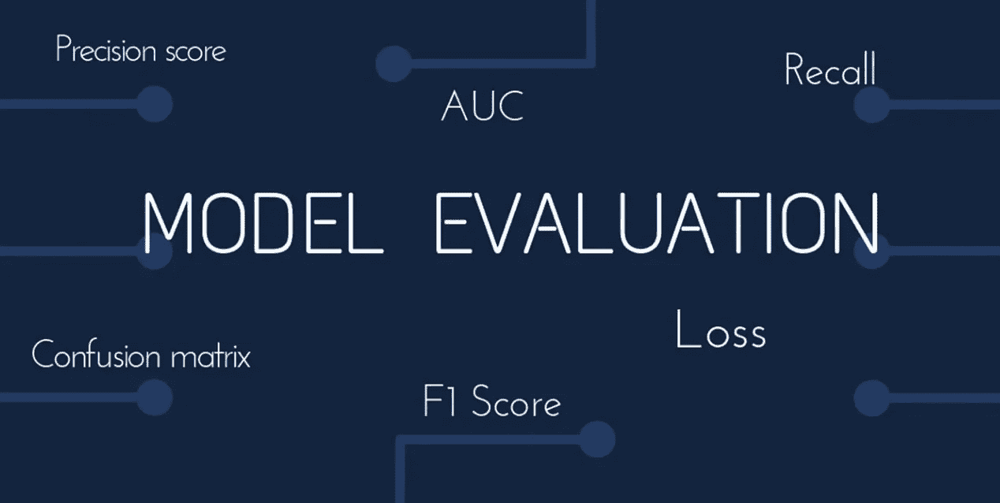
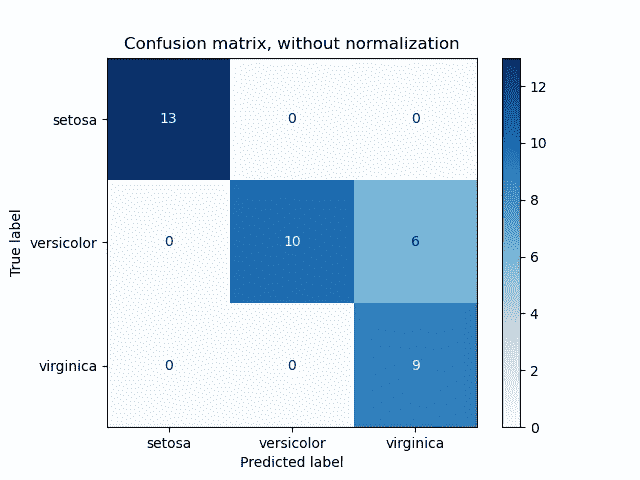
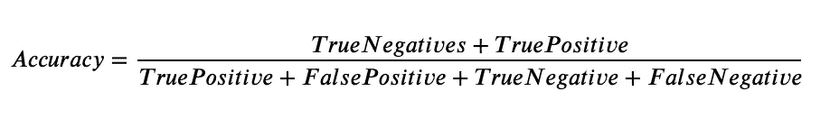
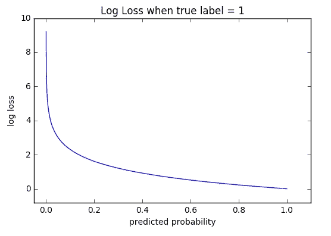
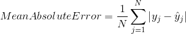
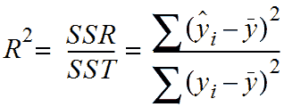

# 机器学习指标解释

> 原文：<https://medium.com/mlearning-ai/key-machine-learning-metrics-explained-27d857e53b1b?source=collection_archive---------0----------------------->

## 分类和回归度量的简明介绍

比较机器学习模型的性能指标是评估模型预测效果以及其输出是否为生产质量的关键部分。根据您选择的指标，结果可能看起来非常不同，因此您需要确保根据正确的标准进行评估。**下面我解释回归和分类问题的顶级机器学习指标，包括何时以及如何使用它们。**

根据您处理的是分类问题还是回归问题，度量标准会有所不同。**分类**是关于预测一个标签，或者一个数据点可能属于的离散类或类别。这意味着您经常比较 0 和 1(一个数据点属于或不属于一个类)。**回归**是关于预测一个数量或者任何连续的数字输出，所以你可以比较任何范围的数字。

> ***分类指标:***
> 
> 混淆矩阵
> 
> 准确(性)
> 
> 特异性/精确度/真阴性率
> 
> 敏感度/回忆率/真阳性率
> 
> 曲线下面积
> 
> F1 分数
> 
> 对数损失
> 
> ***回归度量:***
> 
> 平均绝对误差
> 
> 均方根误差(RMSE)
> 
> 稀有

# 混淆矩阵

[https://scikit-learn.org/stable/auto_examples/model_selection/plot_confusion_matrix.html](https://scikit-learn.org/stable/auto_examples/model_selection/plot_confusion_matrix.html)

混淆矩阵将实际类别(y 轴上)中的数据点数量与预测类别(x 轴上)中的数据点数量进行比较。矩阵可以包含一个、两个(二元分类)或多个类别(> 2)。每个预测都可以用以下四种方式之一进行分类:

**真**表示你的预测是准确的:

*   真阳性:预测是，实际是。
*   真正的否定:预测没有，实际没有

**假**表示你的预测不准确:

*   误报:预测是，但实际不是
*   假阴性:预测为否，但实际为是。

比如上面的多类矩阵，真阳性可以对角测量；setosa 有 13 个真阳性，versicolor 有 10 个真阳性，virginica 有 9 个真阳性。然而，也有 6 个数据点实际上是杂色的，但被错误地预测为海滨。

**用于**:二元和多标签分类问题。

# 准确(性)

准确性是正确预测与总预测数的比率，因此它会告诉您总预测中正确的部分。

当属于每个类别的样本数量为*等于*时，精确度是一个很好的衡量标准。例如，如果你的数据集是对一种罕见但致命的疾病进行分类，其中 99.9%的患者是健康的，0.01%的患者患有这种疾病，那么你就有一个高度不平衡的类别，只要预测每个人都是健康的，就可以达到 99.9 **%** 的训练精度。在这里，准确性不是一个有意义的衡量标准。

**用于**:二元分类问题。

# **敏感度/召回率/真阳性率:**

召回所有 阳性样本中的*为真阳性(真阳性+假阴性，或被误认为阴性但实际为阳性的点)。例如，在收件箱中的每封垃圾邮件中，垃圾邮件文件夹实际上捕获了多少封？你希望这个分数尽可能的高。真实的肯定率反映了回忆分数是如何随时间波动的。*

**用于**:二元分类问题。

# **特异性/精确度/** **真阴性率:**

精度为真阳性*出来的所有* 样本都确定为阳性(正确与否)。例如，在所有被识别为有缺陷的玩具中，有多少玩具被正确识别为有缺陷。你希望它尽可能的高。然而，如果分母中有很多假阳性，或者大量玩具在安全的情况下被错误地归类为有缺陷，这将降低精确度。真正的负比率是这个精度分数如何随时间波动。

**用于**:二元分类问题。

# 曲线下面积

AUC 是受试者工作特征(ROC)曲线下的面积(橙色),该曲线描绘了假阳性率与真阳性率，或 TP 和 FP 之间的权衡。理想情况下，您希望有尽可能多的真阳性，因此 ROC 曲线紧靠 y 轴，并且其下方的区域尽可能大。

**用于**:二元分类问题。

# F1 分数

F1 分数是精确度和召回率之间的调和平均值，将这两个指标总结为一个。范围从[0，1]，数字越大越好。它告诉你你的分类器有多精确(它正确分类了多少个实例)，以及它有多健壮(如果它没有遗漏大量实例的话)。

**用于**:二元和多标签分类问题。

# 对数损失

对数损失表明预测概率与相应的实际值有多接近。其范围从 y 轴上的[0，∞)到 x 轴上的预测概率。如果事件的概率范围从 0 到 1，其中任何大于 5 的概率都表示是，那么由于 L 形对数损失曲线，您希望损失尽可能低，以便概率尽可能接近 1。

在上面的函数中，分类器为所有的*样本的每一个***【M】***类(即二进制类 1 或类 0)分配一个概率，其中 ***y*** 指示样本 ***i*** 是否基于其概率*属于类**

*****用于**:二元分类问题。***

# ***平均绝对误差***

***MAE 是实际值和预测值之差的平均值。换句话说，平均而言，预测与实际相差多少？虽然我们知道 MAE 差异的大小，但我们不知道误差的方向，即我们的预测是高于还是低于平均实际值。***

******

*****用于**:回归问题。***

# ***均方根误差(RMSE)***

***RMSE 与 MAE 的不同之处在于，它采用误差的平方的平均值来抵消差值的正负，然后用平方的平方根来取消平方。因为我们在 RMSE 平方错误，较大的错误变得更加明显或受到惩罚。你希望 RMSE 越低越好。***

******

*****用于**:回归问题。***

# ***R 的平方***

***r 代表回归模型中由自变量解释的因变量方差的比例。换句话说，输入变量的变动在多大程度上影响了输出变量？模型的 R 越高，它所包含的输入变量对模型输出的影响就越大。例如，如果模型的 R2 是 0.50，那么观察到的变化的一半可以由模型的输入来解释。***

******

*****用于:**回归问题。***

## ***我希望这能对你有所帮助。感谢阅读！***