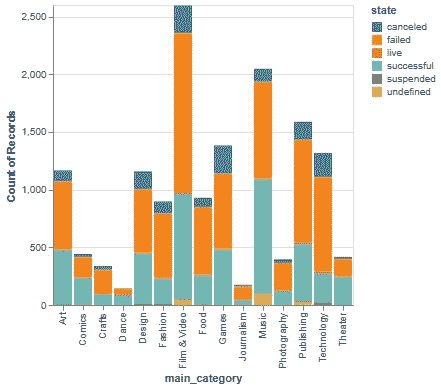
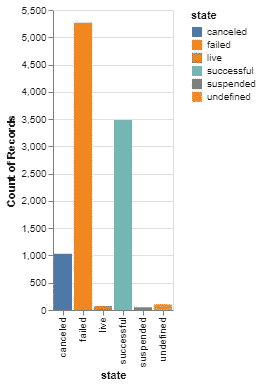
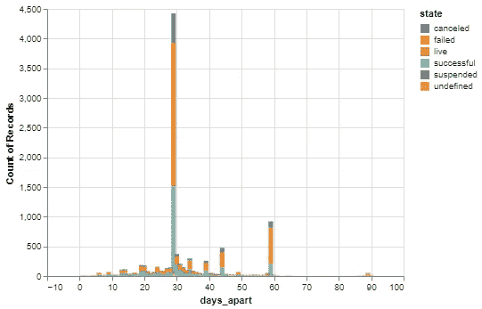
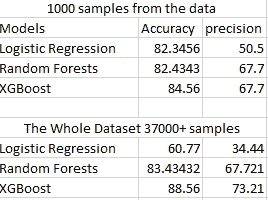
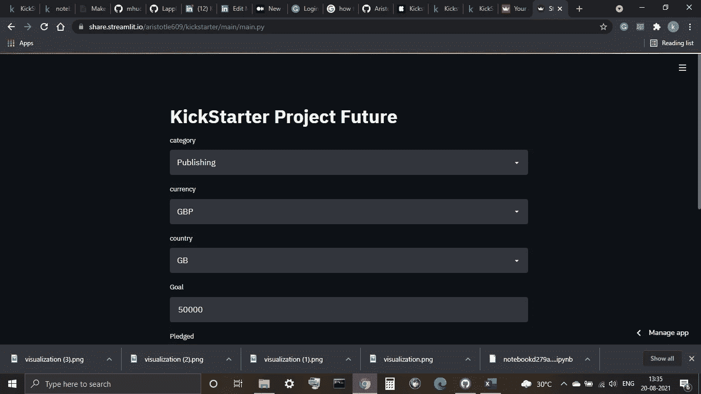

# Kickstarter 项目模型部署

> 原文：<https://medium.com/mlearning-ai/kickstarter-project-44718775d6c2?source=collection_archive---------3----------------------->

Photo by [Mykola Makhlai](https://unsplash.com/@ko1unb?utm_source=medium&utm_medium=referral) on [Unsplash](https://unsplash.com?utm_source=medium&utm_medium=referral)

# 介绍

这个项目的目标是建立一个模型，预测公共资助的 Kickstarter 项目的成败。这个项目的数据可以在[这里](https://www.kaggle.com/kemical/kickstarter-projects)找到。要查看完整的项目，请访问 [GitHub](https://github.com/Aristotle609/kickstarter) 页面。我将在这里分享的笔记本可以在 Kaggle 中查看。

# 问题是

每年都有数千个项目在 https://www.kickstarter.com/[平台](https://www.kickstarter.com/)上众筹，这是一个发布你的项目并获得公共资金的公共平台。这个平台上每年都有数千个项目失败，得不到资助。我们的目标是制作一个可以预测项目是否会成功的应用程序。

# 该过程

和所有项目一样，我从我的 [EDA](https://www.kaggle.com/aristotle609/kickstarter-project-eda) 开始，发现了一些有趣的信息

项目最多的类别似乎是电影和视频，相对成功次数最多的类别是音乐和戏剧，相对失败次数最多的类别是技术。大多数文科似乎在 Kickstarter 上做得很好，这是有道理的，因为与需要设备和更有经验的员工的技术 Kickstarter 相比，它们需要的资本很少。

Considering the Sample size, the number of successes isn’t that bad.

Most Projects get funding between 1 -2 months

然后我开始为数据制作模型。我总是从制作基线模型开始，这是最不复杂的，这样我就可以和其他模型进行比较。在制作笔记本时，我使用了总训练数据的子集，然后在远程笔记本(在 Kaggle 上)上运行整个数据集。我从逻辑回归基线模型开始，并获得了出色的结果。我用决策树得到了类似的结果，只有用 XGBoost 得到了稍微好一点的结果。然而，对于整个数据集，线性回归表现最差，而随机森林分类器和 XGBoost 分类器保留了它们的分数。最后，我选择了 XGBoost 型号，因为它的效果最好。

# 应用程序

我使用 streamlit 构建了一个简单的应用程序，并使用 streamlit share 部署它。申请可以在[这里](https://share.streamlit.io/aristotle609/kickstarter/main/main.py)查看。

# 尾注

这个项目是我的系列 25 项目挑战的一部分。如果你想看更多或者想亲自参加，请访问[介绍页面](https://keeganfdes03.medium.com/f2150afe053?source=friends_link&sk=5ae10ad6072aa80c0f1ed3865a0196a8)。