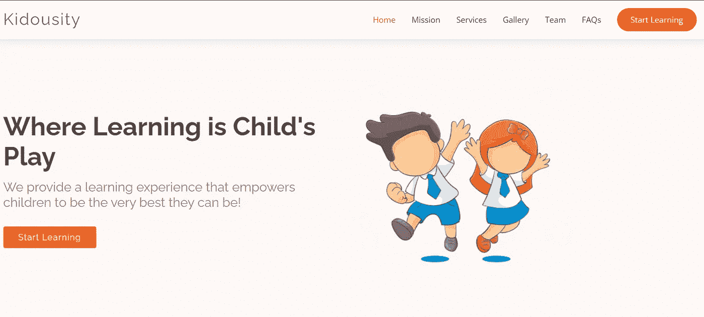
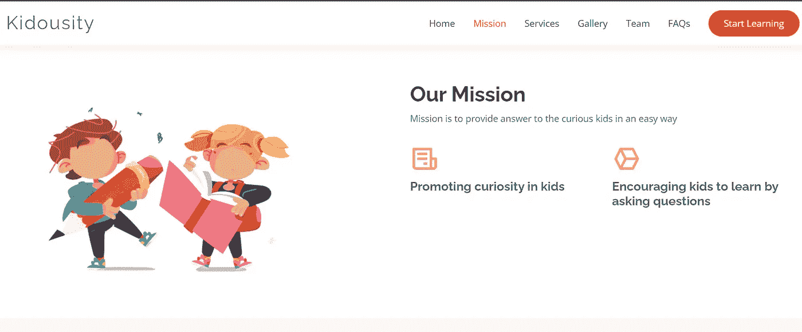
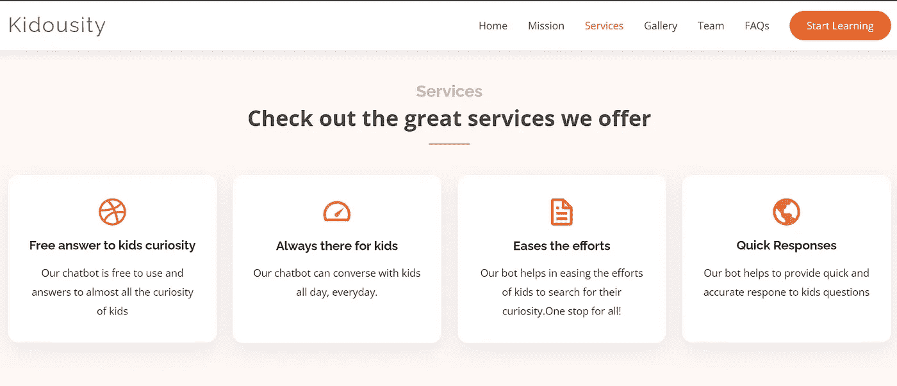
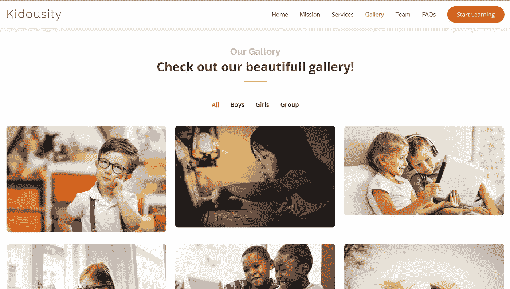
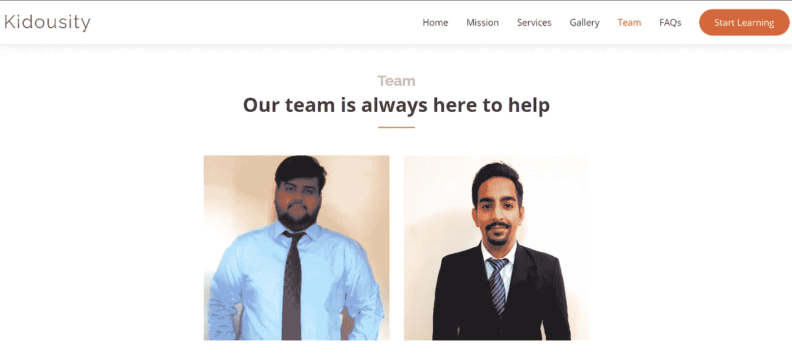
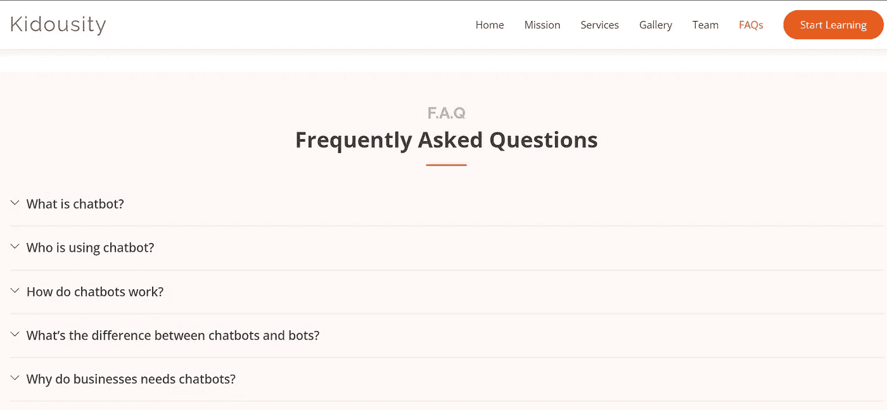
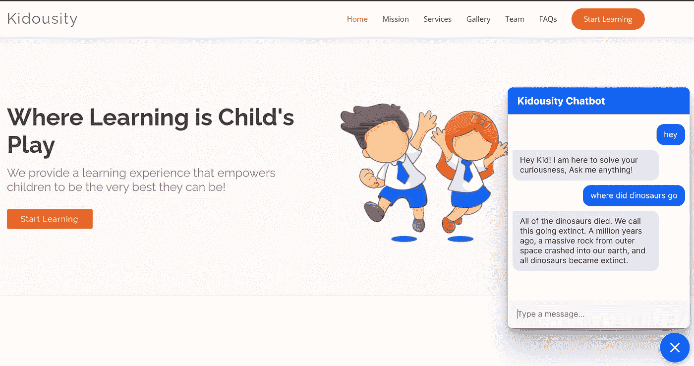
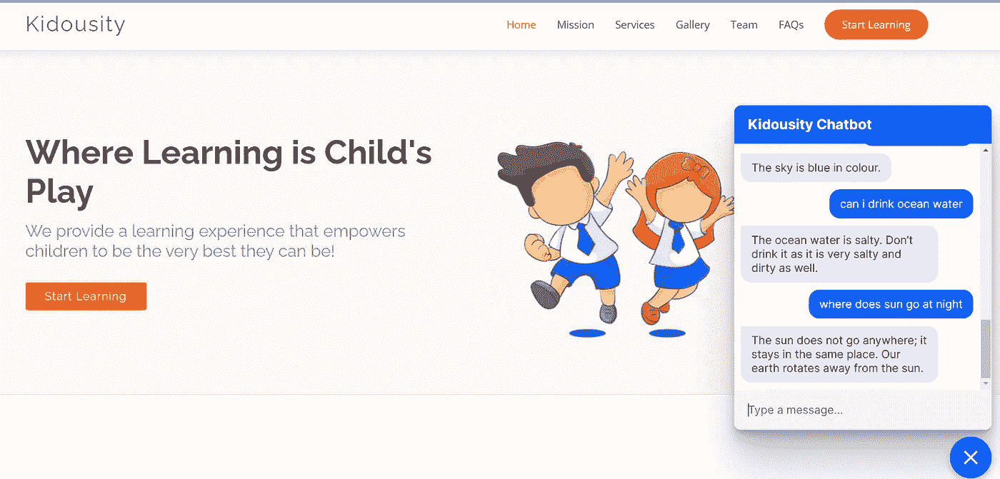

# 童趣:孩子们求知欲的一个好去处

> 原文：<https://medium.com/mlearning-ai/kidousity-one-fine-stop-to-kids-intellectual-curiosity-a6c5e13c96ca?source=collection_archive---------9----------------------->

Photo by [Jeremy McKnight](https://unsplash.com/@jeremymcknight?utm_source=medium&utm_medium=referral) on [Unsplash](https://unsplash.com?utm_source=medium&utm_medium=referral)

# 介绍

聊天机器人是一种模拟类似人类对话(书面或口头)的程序，允许人类与机器互动，就像他们在与真人对话一样。如今，聊天机器人被广泛应用于众多领域，如卫生、教育、金融、国防、社交媒体、人力资源、旅游、房地产、电子商务、酒店等。它们帮助预约医生、订票、FAQ 查询、医疗提醒和其他用例。健康和银行是聊天机器人技术的主要受益者。

聊天机器人全天候可用。聊天机器人的强大之处在于其个性化对话的能力。因此，它可以丰富用户的互动和参与。聊天机器人提供快速、一致和准确的响应。它们可以被编程并且高度灵活。

健康地考虑机器人*；这个免费的机器人提供来自可靠来源的健康信息，允许用户为他们的健康做出最好的决定。HDFC 的聊天机器人 *Eva* 帮助消费者满足基本的银行需求，例如检查贷款状态、付款以及快速获得常见问题的答案。*

*今天，每一个成功的企业都以这样或那样的形式使用聊天机器人。在我们的项目中，我们的目标是使用聊天机器人技术解决一个现实世界的问题。*

# ***问题陈述***

*好奇心是童年的本质。作为孩子，我们经常质疑一切，质疑帮助我们更好地了解我们周围的世界。问题因孩子而异，这种好奇的问题必须得到娱乐，因为它们有助于改善孩子的个性，使他/她在未来成为一个好的学习者。由于缺乏时间或缺乏知识，父母常常无法回答孩子的问题。这就是我们项目的想法所在，我们的目标是通过聊天机器人技术回答一个孩子的问题。解决这个问题的一个常见的解决方案是搜索引擎的存在，只需点击一下，搜索引擎就有能力回答最棘手的问题。然而，这种解决方案的缺陷在于，诸如 Google 之类的搜索引擎具有与搜索查询相关的数百万篇文章。另一方面，YouTube 等平台拥有通过互动视频回答问题的能力，但即使是这样，也有成千上万的视频可供观看。冗长的文章和视频让孩子们很难找到合适的答案来满足他们的好奇心。那么，我们如何解决孩子们的好奇心问题，同时牢记效率的需要呢？*

# *解决办法*

*阿尔伯特·爱因斯坦曾经说过，永远不要停止提问是很重要的，好奇心有它存在的理由。一些研究表明，孩子们每天会问 200 到 300 个问题，其中可能包括太阳是什么颜色，或者水是什么味道等等。这些问题构成了孩子学习过程的主要部分。研究还表明，儿童通过互动学习得更好。智能手机和数字设备统治着当今世界，可以说现在大多数孩子都有智能手机。根据 2019 年的 SellCell 民意调查，35.6%的儿童每天使用手机一到两个小时。因此，记住所有这些，我们的想法是专门定制聊天机器人，以满足 6-10 岁孩子的求知欲。他们将能够以文本形式提出问题，并再次以文本形式获得对他们的问题的简短、干脆和准确的回答。这将有助于孩子们进行互动学习，并保持提问的好奇心。使用我们的聊天机器人，孩子们可以得到他们想要的许多问题的答案，并得到快速的回应。孩子们通过互动学习得最好，因此这个对话式人工智能聊天机器人将是孩子们的一个很好的学习工具。我们已经为孩子们开发了一个网站，将有一个聊天机器人嵌入我们的项目。*

# ***RASA 框架的特点***

*我们已经使用 RASA 框架实现了我们的聊天机器人。RASA 是一个基于机器学习的开源聊天机器人框架。它有助于构建聊天机器人，并将其部署到我们的网站或社交媒体平台，如 Telegram、脸书、WhatsApp 等。文档简单明了，高度结构化，易于理解。RASA 侧重于上下文信息，并理解来自用户的各种查询和意外输入。RASA 的安全性很高，通过它构建的聊天机器人可以很容易地部署在云上。*

# *网站实施*

****************

## *Github 项目*

* [## GitHub-pulkitkhandelwal 29/Kidousity-Chatbot

### 此时您不能执行该操作。您已使用另一个标签页或窗口登录。您已在另一个选项卡中注销，或者…

github.com](https://github.com/pulkitkhandelwal29/Kidousity-Chatbot) 

## Github 档案

1.  普尔基特·汉德尔瓦尔—【https://github.com/pulkitkhandelwal29 
2.  divyangshu Dasgupta—【https://github.com/divyangshudasgupta 

## Linkedin 个人资料

1.  普尔基特·汉德尔瓦尔—[https://www.linkedin.com/in/pulkit-khandelwal-27a7b0215/](https://www.linkedin.com/in/pulkit-khandelwal-27a7b0215/)
2.  divyangshu Dasgupta—[https://www.linkedin.com/in/divyangshu-dasgupta-4645b314a/](https://www.linkedin.com/in/divyangshu-dasgupta-4645b314a/)

 [## Mlearning.ai 提交建议

### 如何成为 Mlearning.ai 上的作家

medium.com](/mlearning-ai/mlearning-ai-submission-suggestions-b51e2b130bfb)*