# 工程中的缺陷

> 原文：<https://medium.com/mlearning-ai/kinks-in-the-works-2a1e2b609cc9?source=collection_archive---------5----------------------->

增加神经网络的功能复杂性

(事实上，我差点把这本书命名为《让我们变得古怪吧！》但最终，谢天谢地，我说服了自己不去想它……)

在关于神经网络的[上一篇文章](/mlearning-ai/machine-learning-for-zombies-be707e02712c)中，我们看到了如何利用 ReLU 激活来提取几个神经元，并产生一组如下所示的预测:

Fine, if two kinks are enough for you…

请注意，对于我们网络中的每个神经元，我们能够定义另一个铰点，或线中的“纽结”，将其添加到函数中，以便预测线的斜率会基于所有神经元的总和而变化。在这种情况下，我们有两个神经元，因为它们的激活点不同(x=5 和 x=14)，这导致了这些点上的两个扭结。

虽然这是一个比标准线性分类器能够产生的预测函数复杂得多的预测函数，但它可能仍然不够复杂。如果我们想在我们的预测中得到另一个扭结，我们可以通过简单地增加第三个神经元来实现。

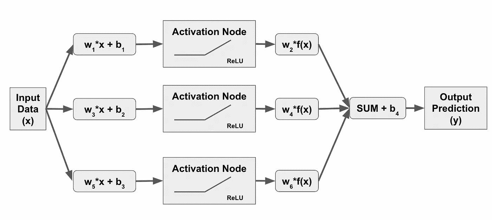

I, for one, welcome our new robot overlords.

三个神经元的神经网络可能会产生类似于以下内容的预测线:

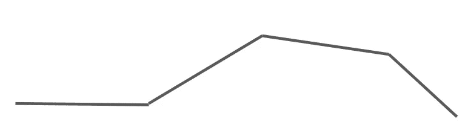

We’ll call this one the big dipper!

对于我们网络中的每个新神经元，我们能够向我们的预测线添加另一个纽结，每个纽结的斜率基于激活点(由 ReLU 激活函数确定)而变化。)如果两个神经元碰巧有相同的激活点，我们就能减少神经元的扭曲。

那么，你需要试验的一件事是，你需要多少个扭结才能得到最佳预测函数线(为了简单起见，我使用术语线，但你可以假设我指的是二维数据以外的任何超平面…)开始时，你真的不知道你需要最小化预测损失的形状的复杂性。同样，这是数据“科学”,需要通过实验来揭示您正在处理的数据的本质！

当你怀疑你需要一个真正的曲线函数时会发生什么？在我之前的一篇博文中，当我在高层次上讨论深度学习时，我们假装提前知道我们的函数形式是什么，并说它看起来像这样:

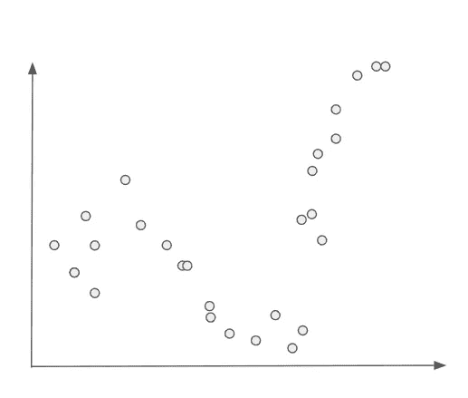

Roller coaster, anyone?

然后，我们举例说明了使用 ReLU 激活的 4 神经元神经网络的输出:

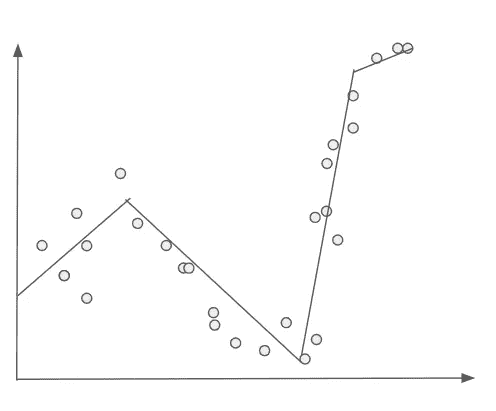

The 0-slope portion (flat line) begins at the y-axis. Trust me. :)

但是如果我们真的需要变得更精确呢？我们可以简单地不断增加神经元，直到我们的功能看起来像这样:

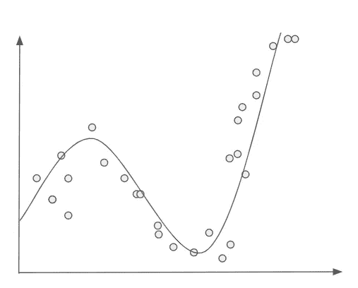

Smooth like Keith Stone

尽管我们的 ReLU 形状本质上是铰接/扭结的，但理论上你可以添加任意数量的形状来适应任何潜在的弯曲形状。所以这绝对有可能。问题是，你需要多少神经元才能到达这里？1,000?10,000?几百万？

添加越来越多的神经元以增加预测线的复杂性的问题是，它会显著增加神经网络的计算能力要求，并且更难确保每个神经元的权重足够不同，以产生良好的结果并避免过度拟合。为了稍微减轻这些问题，我们需要更深入。(双关语)

# 隐藏层

另一种增加复杂性的方法是在你的神经网络中增加一个激活/隐藏层。因为我们正在给我们的神经网络增加深度，这通常被称为“深度学习”例如，我们可以采用我们最初的神经网络，只保留两个神经元，但如果我们想产生一个具有四个铰链的函数，我们可以简单地添加另一个两节点隐藏层。我们的第一个隐藏层的输出得到处理，就好像您正在生成两个输出(下一层中的每个节点一个)，这些函数被求和，然后作为输入馈入，就像在原始数据层中一样。它是这样工作的:

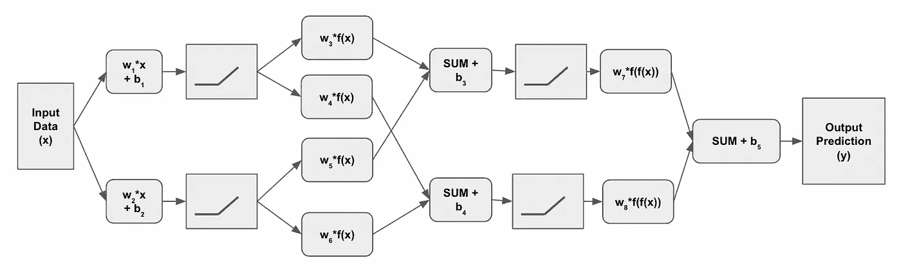

# 通常显示的方式

让我们在这里暂停一会儿，部分是为了确保你知道，我知道这与你通常看到的不同。在我看过的几乎所有试图解释深度学习过程的博客、视频、教科书和幻灯片演示中，他们都用了一个看起来与我刚才给你们展示的非常不同的图表。相反，他们会这样解释这个概念:

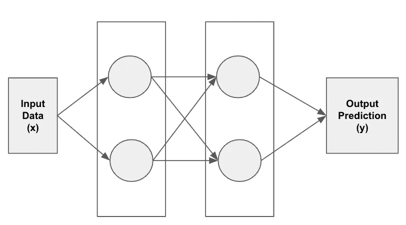

Simple, right?

如果我诚实的话，这个关于深度学习神经网络如何工作的脑海图像最终让我感到困惑，同时试图理解幕后实际发生了什么。我努力寻找一个解释，关于第一个和第二个隐藏层之间发生了什么，不包括(过度？)复杂的数学符号。我已经形成了一个假设，第一层的每个节点的输出由第二层的节点独立处理，这意味着实际上有四个计算在第二层执行，而不是在第一层发生的两个。

It’s like he’s got cameras installed in my house, probably laughing the entire time I’m trying to figure this stuff out. NDT can be such a buzz kill. [https://www.smbc-comics.com/comic/inaccuracy](https://www.smbc-comics.com/comic/inaccuracy)

我把它想象成这样，每一层都比前一层复杂得多:

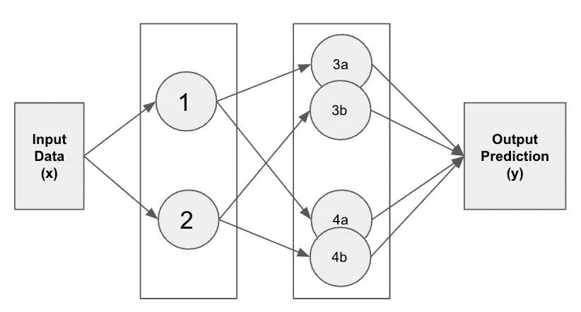

从程序的角度来看，这是错误的。典型的可视化虽然在逻辑上可能是准确的，但在我看来，这是一种次优的方式来教授深度学习正在做什么，除非你首先完全解释了层节点之间实际发生的事情。

正如我们将看到的，第二层的节点与第一层的节点没有任何不同。他们所做的只是接受一个输入，并在使用 ReLU 激活功能时，根据分配给输入的权重添加纽结。该输入恰好是在第一层中定义的函数，而不是原始数据本身，但是当您从一个隐藏层移动到下一个隐藏层时，过程没有什么不同。

# 分解流程

让我们将第一步定义为生成第一个激活函数输出:

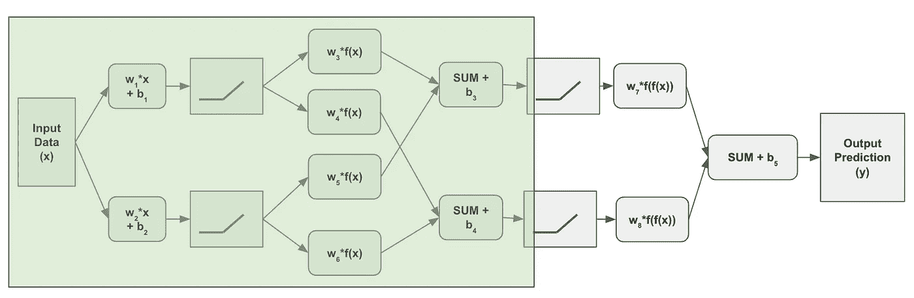

在这个阶段，我们获取数据并为每个神经元生成一个铰链函数，这些铰链函数将会非常简单。但是现在，我们将为下一层中的每个神经元生成一个输出，而不是让它们通过一次加权并生成一个输出。此外，我们将对每个求和使用随机权重和偏差值，因此传递到第二层的函数可能看起来非常不同:

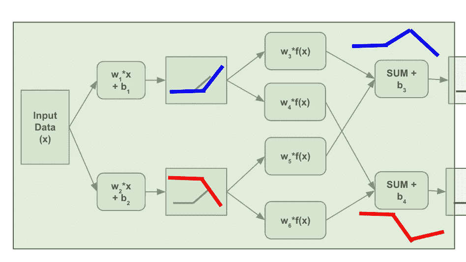

现在，我们获取这个组合输出，并通过与我们运行原始数据点完全相同的一组步骤来运行它。如果这就是结局，我们将会得到一个四扭结预测函数。

当你添加第三个隐藏层时，这变得非常有趣。请注意，第一层产生的纽结数量是两个，第二层将为我们产生的每个输出提供四个纽结*。*

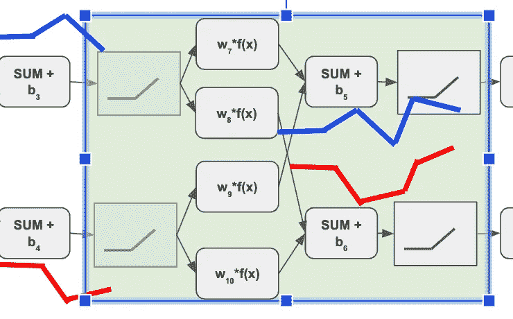

如果我们将其扩展到第三层，那么当我们执行最后一步时，我们将两个中间函数相加，这样就产生了一个有八个纽结的最终函数。

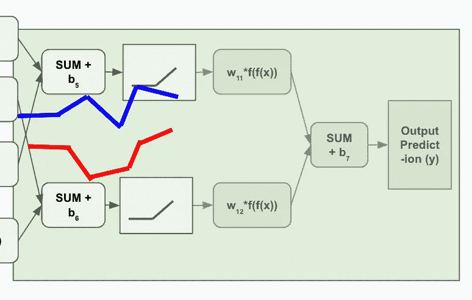

I don’t have the patience or skill to draw the purple line with eight kinks. I’m assuming you can use your imagination for that one.

因此，三层深度神经网络的端到端过程看起来像这样(用你的想象力填充最终函数可能看起来像什么…):

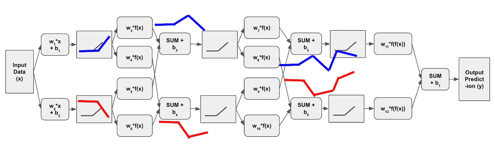

Well that was easy! *cough*

# 那又怎样？

这种方法与具有八个节点的单个隐藏层有什么区别？两者产生的扭转次数不会一样吗？

虽然这在技术上是正确的，但有两个重要的考虑因素。第一个是单层方法将只基于数据本身的变化，而深度学习方法从数据开始，然后基于数据的抽象产生变化。这被证明是一种[正则化](https://jasondeden.medium.com/when-getting-it-right-gets-it-wrong-86052e31cb41)的形式——这意味着，随着神经网络变得更深，它不太容易过度拟合，因此倾向于更好地概括(翻译:在测试数据上表现得更好)。我们仍然需要考虑正规化，我们可以采取许多方法——这些将是未来讨论的主题。

第二个考虑:我需要实例化多少个节点来创建我的八铰链函数？只有六个，而对于相同数量的扭结，单层方法有八个。如果我想做 16 个弯呢？在单层方法中，我需要将节点数量再增加一倍，而在深度学习方法中，我可以简单地添加两个节点的第四层来完成同样的事情——换句话说，使用八个节点来创建与单个 16 节点层相同的复杂性。如果您需要 1，000 个节点，则只需要 10 个双节点层，总共 20 个节点，而单层方法需要 1，000 个节点。

这并不是说增加宽度没有价值！事实上，如果我们将节点数默认为四个而不是两个，那么每层的复杂性将增加一倍，这意味着我们将在两层中获得 16 个结，而不是四个(在五层中获得 1，000 个结，而不是两节点方法的 10 个)。每一层做得越宽，它所能创建的函数就越复杂，而这些函数是下一层的起点。

此外，每层也没有相同数量的节点。你可以有一个神经网络，开始时很宽，然后随着深度的增加而变窄，或者相反。或者，您可以在某些值之间随机化每层的节点数。或者……可能性只受到你的想象力和可用计算能力的限制。

# 定义正确的公式

如果你是一个经常阅读的人，你应该已经知道我对“我的神经网络的宽度和深度应该是多少？”

难倒我了。

这真的取决于你的数据的性质。作为一般的(但不是普遍的)规则，为了减轻过度拟合问题，你会想要比你的宽度更深，但是多少深度对宽度会使你得到最低的测试误差在开始时是完全不可知的。一般的假设可能是错误的。

您可能希望选择最小的神经网络结构来获得最佳结果，以便保留计算能力(以及奥卡姆剃刀/简约原则)，但在某些情况下，可能是宽度为 4，深度为 20，在其他情况下，可能是宽度为 16，深度为 1000，而在其他情况下，可能是宽度为 20，深度为 12。或者 100 到 100，000，或者…希望你明白了。你根本不知道开始的时候正确的答案会是什么，而且直到你尝试了才知道。

这些实验也可以超越简单的节点选择。你可能会发现你的神经网络可以从[特性扩展](https://jasondeden.medium.com/expand-your-horizons-d72f15e7ffa)中受益。看看[这个实验](https://playground.tensorflow.org/#activation=relu&batchSize=10&dataset=xor&regDataset=reg-plane&learningRate=0.03&regularizationRate=0&noise=0&networkShape=4&seed=0.22083&showTestData=false&discretize=false&percTrainData=70&x=true&y=true&xTimesY=false&xSquared=false&ySquared=false&cosX=false&sinX=false&cosY=false&sinY=false&collectStats=false&problem=classification&initZero=false&hideText=false)在 tensorflow 操场上。

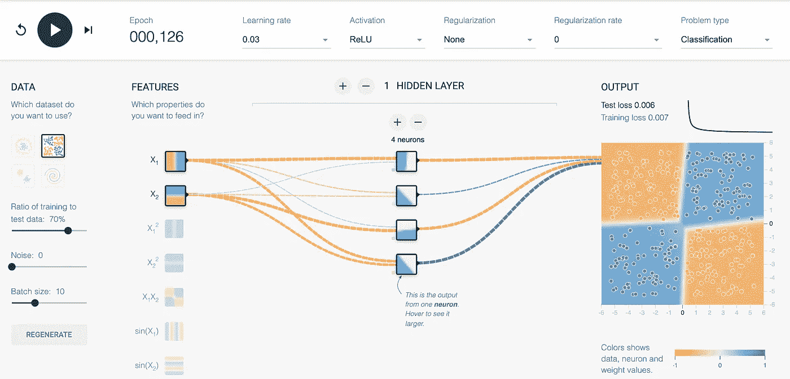

我照原样接受数据集，并决定尝试单层方法。为了在测试和训练数据上达到 99%的准确性，在隐藏层中使用了 4 个节点和略多于 100 个时期(这是通过数据的——当我们谈论反向传播时会有更多的内容)。

在接下来的实验中，我采用了不同的方法。我决定将自己限制在隐藏层中的两个节点，但是尝试不同的可用特性扩展。当我在正确的服务器上登陆时，我能够稍微超过我的四节点模型，并且在大约 1/3 的时间内完成:

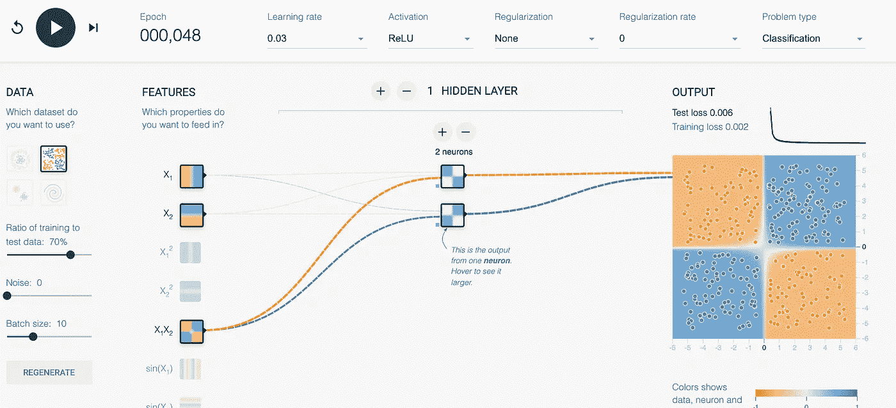

***给读者一个练习:重现第二个实验，但只用一个神经元而不是两个。这会影响解收敛的速度吗？就正确数据的价值与更多的计算复杂性而言，这意味着什么？***

这是很重要的一点。随着我们进一步深入深度学习(*sad trombone*)，我们将专注于使深度学习和神经网络独一无二的东西，然而在现实世界中，我们讨论的许多其他建模方法的优化技术也可以用于神经网络，并且可能更强大，这取决于您的数据的性质。

对我来说，这是让这个领域变得如此有趣、令人兴奋的一个重要原因。专注于数据、数据增强、关于数据和/或标签的假设的方法之间可能的相互作用和交换，以及在新数据集上尝试之前无法知道的各种可能的输出和结果，使得每个全新的项目要么是潜在的金矿，要么是巨大的时间浪费。可供探索的路线多得难以想象。数据科学家是一名探险家，您希望确保自己的背包中有所有合适的工具，并且在踏上旅程时知道如何以及何时使用它们。

 [## Mlearning.ai 提交建议

### 如何成为 Mlearning.ai 上的作家

medium.com](/mlearning-ai/mlearning-ai-submission-suggestions-b51e2b130bfb)