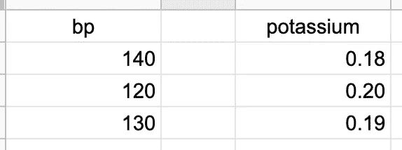
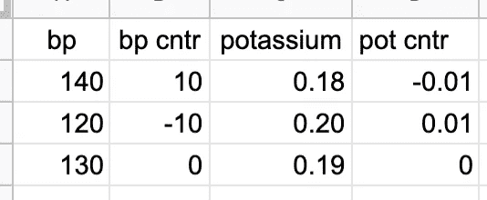
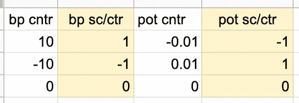
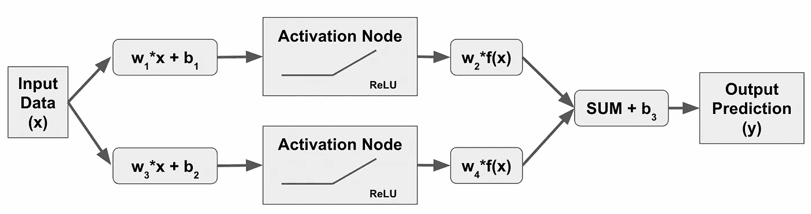
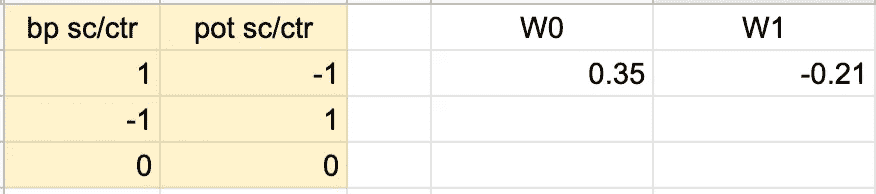
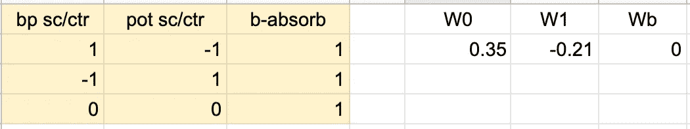

# 接吻神经网络

> 原文：<https://medium.com/mlearning-ai/kissing-neural-networks-cef12dab6d01?source=collection_archive---------8----------------------->

简化和增强正向传播

在圣诞节发表这篇文章的时候，这里有一个关于槲寄生的笑话。

到目前为止，我们已经定义了[什么是](/mlearning-ai/machine-learning-for-zombies-be707e02712c)神经网络以及它们做什么，然后更深入地解释了[深度学习如何工作](https://jasondeden.medium.com/kinks-in-the-works-2a1e2b609cc9)——至少在理论上是如此——当数据值在网络中前进时，它如何被评估和转换。现在，在我们实际运行一个端到端的示例之前，让我们讨论几个适用于所有机器学习的数据管理概念(但它们将在我的博客中首次得到处理)，并解释为什么我在上一篇帖子中复习矩阵乘法的基础知识。

# 扩展和集中您的数据

您在处理数值数据时遇到的一个问题是，数值在类别之间的缩放比例不同。一个经典的例子是健康数据——用于测量血压的范围是从十到 100(希望如此)的数字，范围从 60 到 200 左右，而如果你在测量血液中的钾，你可能会以克为单位测量大约 0.16 到 0.20。如果你将这些数字原始输入到机器学习算法中，因为它正在计算乘积，血压数字会淹没钾数字，即使钾的小偏差可能比血压的大偏差更重要。

为了纠正这一点并将这两个变量放在同一个竞技场上，我们做了两件事——首先我们居中，然后我们缩放我们的数据。

为了使数据居中，我们看一下给定特征/变量的值，然后减去平均值。假设我们有三个观察结果，其中我们观察了三个患者的血压值和钾读数:

对于 bp，平均值是 130，所以我们从每个值中减去它。对于钾来说，平均值是 0.19，所以我们再一次把它减去。这为我们提供了如下居中值:

缩放数据意味着将值除以它们的标准偏差。在这种情况下，血压的标准偏差= 10，钾的标准偏差= 0.01。将所有内容分开会产生以下缩放值和居中值:

请注意，数据集的缩放和居中导致每次观察的值介于-1 和+1 之间。在我们的简单示例中，这些是唯一的值，但是您可以有介于-1 和+1 之间的任意数量的值。还要注意，从数学上讲，血压相对变化的影响与钾的相对变化处于同一水平。这可能有助于我们的模型做出更好的预测。

# 矩阵乘法简化了数学

回到我学习标准感知器的时候，[我学到了一个技巧](https://jasondeden.medium.com/outputting-the-offputting-offset-6f73e518b281)，你可以用它来简化 y = w*x + b 的大量计算，然后[用数学方法展示了](https://jasondeden.medium.com/coding-the-perceptron-offset-trick-39559a58d5cf)它是如何工作的。让我们再来看看我们简单的神经网络:

请注意，所做的所有数学运算只是 w*x + b 的一次迭代。让我们创建一些虚拟数据，然后在第一轮中应用一些随机权重:

我们可以像图中所示的那样，一次性地将所有东西相乘，然后在最后添加一些随机的 b 值。然而，另一种选择是将我们的偏差值吸收到我们的权重向量中，并简单地将另一个值为 1 的特征添加到我们的数据中。修改如下所示:

因此，现在我们所要做的就是用我们的数据值乘以我们的权重向量来解释所有的权重和偏差。我们可以使用矩阵乘法来一举完成这一点，如 w.T @ x(我们必须[转置我们的权重向量](https://jasondeden.medium.com/matrix-multiplication-e2cf007d0755)以获得内积的正确数字)，在这种修改后的形式中，这将产生一个相同的解决方案来执行每个乘法和偏置设置手写。

作业:对于我们数据中的每一个值，你能使用矩阵乘法计算出传递给激活函数的值吗？

— — — — — — —

基础工作已经完成。我们已经学会了如何集中和缩放我们的数据(以及为什么它很重要)，我们已经使用矩阵乘法来简化我们的数学，现在是时候为我们的简单神经网络运行一个完整的循环，然后再次为我们的简单深度学习神经网络运行。这才是真正有趣的地方！

 [## Mlearning.ai 提交建议

### 如何成为 Mlearning.ai 上的作家

medium.com](/mlearning-ai/mlearning-ai-submission-suggestions-b51e2b130bfb)