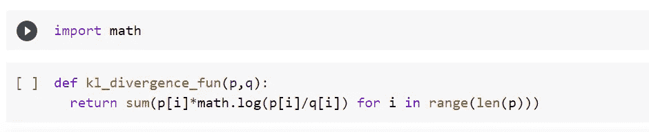
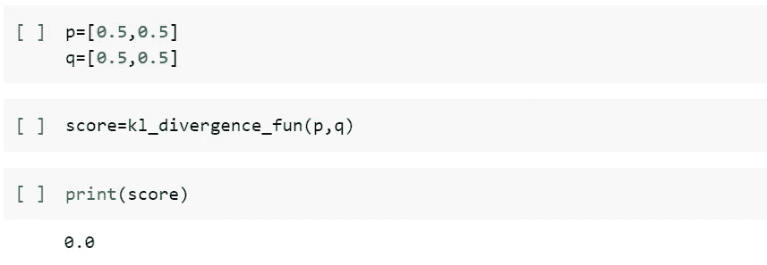

# KL 散度

> 原文：<https://medium.com/mlearning-ai/kl-divergence-3469b881a3c9?source=collection_archive---------12----------------------->

KL 散度检验基本上是说一个概率分布和其他概率分布有多大的不同。

让我们借助一个例子来理解这一点！

一个人有两枚硬币，一枚是无偏的，另一枚是有偏的。

**情况 1:对于无偏硬币，**

头部概率=尾部概率= 0.5

**情况 2:假设，在硬币有偏差的情况下，**

头部概率= 0.1，尾部概率= 0.9

所以在有偏的情况下，我们经常得到尾部，因为它的机会是 90%。

因此，如果我们比较概率，我们会看到情况 1 中头部的概率为 0.5，而情况 2 中头部的概率仅为 0.1，**因此，这两种分布之间存在很大差异。**

**离散和连续概率分布:**

*DKL(P | | Q)= sigma(P(x)log(P(x)/Q(x)))*

DKL( P || Q) =积分(p(x) log(p(x)/q(x)) dx)

**理论太多！！现在让我们编码并编写一个函数。**

1.  kl_divergence_fun 有两个参数(p，q ),它们是我们要比较的分布。

2.示例:上面解释的给出了 0.51082 的 kl 散度分数

3.**例 2 :** 如果两个分布相同会发生什么？有什么猜测吗？我们用刚刚写的函数来验证一下。

same distributions

在这种情况下，两个分布有相同的概率，所以我们得到的 KL 散度为零。

**注:KL 散度分数不对称，**

也就是如果我们计算 KL(P || Q)，它将不同于 KL(Q || P)。

仅此而已。谢谢你。我希望你喜欢并学会了关于 KL 散度测试的简短而精确的解释。

 [## Mlearning.ai 提交建议

### 如何成为 Mlearning.ai 上的作家

medium.com](/mlearning-ai/mlearning-ai-submission-suggestions-b51e2b130bfb)