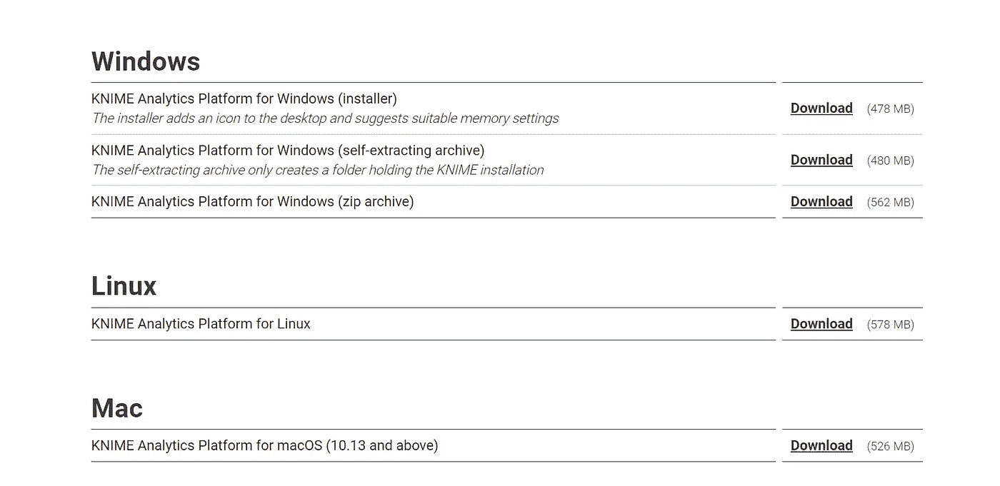
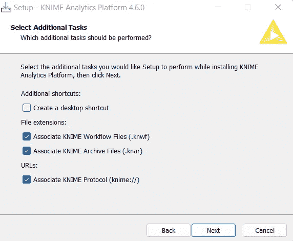
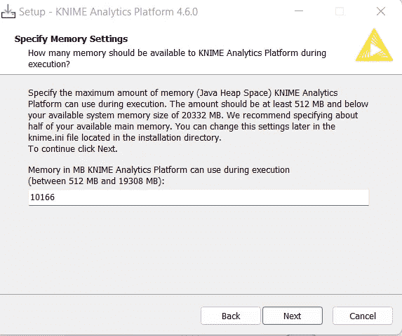

# knime——数据科学家的重要选择。

> 原文：<https://medium.com/mlearning-ai/knime-a-key-lime-pie-for-data-scientists-f15015ffa066?source=collection_archive---------8----------------------->

说到数据科学，首先想到的是编程语言或统计工具，即。:Python、R 或 SAS，这些反过来又经常出现在非编码人员或初露头角的数据科学爱好者的梦中。原因是这些语言有点代码密集，因此许多用户在一段时间内就失去了兴趣。本文的唯一目的是介绍一个高度用户交互的数据分析、报告和集成平台，它可以消除构建头脑风暴模型和机器学习算法的担忧。你需要知道的只是统计学的基本概念和学习的热情。

介绍 KNIME，这是一款分析开源软件，可以处理从加载数据到清理数据的所有数据科学相关生命周期，无论是删除空值还是输入缺失值，可视化，甚至是构建 AI 和 ML 模型。我们将在未来几周发布的 KNIME 系列文章中深入探讨该工具的本质，通过这些文章，Stack Errors 将尝试用我们的第一手经验来解释该工具的用法。

## 首先，让我们开始在系统上安装 KNIME。

1.  点击[此处](https://www.knime.com/downloads)下载工具。
2.  在表单中填写所需的详细信息，以便在桌面上设置 KNIME。

3.选择操作系统:Windows/Linus/Mac

4.设置工作空间和工作目录。确保为目录选择正确的路径，因为所有的项目都将存储在那里。

6.为 KNIME 指定一个内存，以便它可以用于处理工作流。通常，它在需要分配的过程中自己决定一个数字。

7.现在已经提供了所有的细节，单击 next 并安装 KNIME。

8.一旦安装完毕，点击启动按钮，你就可以在 KNIME 上构建你的第一个项目了

# Knime 社区

在全球范围内有一个由开发人员、用户、教育工作者和研究人员组成的令人惊叹的论坛，人们可以在那里获得资源和文档。联系 [KNIME 社区](https://www.knime.com/knime-community)获取更多信息。

在下一篇文章中，我们将详细介绍 KNIME 的不同部分，尤其是节点存储库和 Knime Explorer，这是使用该工具所必需的。

StackErrors 由 [Ankita91](https://medium.com/u/79bf804fb2df?source=post_page-----6bd721732204--------------------------------) 和 [Sreedev](https://medium.com/u/49e4c41be3dd?source=post_page-----6bd721732204--------------------------------) 管理。跟随 Kaggle 中的[堆栈错误，探索我们的数据科学项目。
我们一起来学习吧。💙](https://www.kaggle.com/stackerrors)

 [## Mlearning.ai 提交建议

### 如何成为 Mlearning.ai 上的作家

medium.com](/mlearning-ai/mlearning-ai-submission-suggestions-b51e2b130bfb)