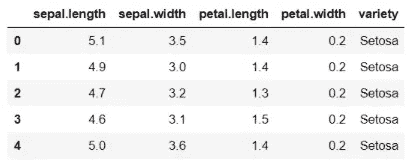

# 从零开始的 KNN——很容易

> 原文：<https://medium.com/mlearning-ai/knn-from-scratch-easy-peasy-6c119ae2f582?source=collection_archive---------1----------------------->

Photo by [Daniel K Cheung](https://unsplash.com/@danielkcheung?utm_source=medium&utm_medium=referral) on [Unsplash](https://unsplash.com?utm_source=medium&utm_medium=referral)

这篇文章将带你在绝对 python 中轻松地完成 KNN 的工作。绝对的 python 是我就是喜欢 python 的一种很好的说法。 ***#Java 烂透了。***

我已经在下面的链接中讨论了 KNN 的工作、算法、属性、假设等等:

 [## 去 KNN 的一站

### 最近的邻居？这些邻居有多近？嗯，希望他们不要咬人！

medium.com](/@priyanshsoni761/k-nearest-neighbors-knn-1606989b7ee0) 

**大纲—**

1.  [算法步骤](/p/6c119ae2f582#bb35)
2.  [带代码块的算法步骤](/p/6c119ae2f582#4735)
3.  [完整代码](/p/6c119ae2f582#14fc)

# 1.KNN 算法

如果你不熟悉 KNN 的工作背景，请参考上面提到的链接。仅仅 10 分钟的读数。

对于那些知道的人来说，算法相当简单:

*   对于训练数据集中的每个点，**计算其与测试点****的距离(欧几里德距离是最常用的)**
*   ****将这些距离**存储在有序字典/列表中**
*   ****排序**按数值的升序排列距离**
*   ****从列表中选择前 K 个点**(K-最接近测试数据)**
*   **基于问题类型(回归/分类)，从这些 k-最近点做出适当的预测**

# **2.带代码的算法步骤**

**我们的代码目标是实现 3 个功能:**

1.  ****eulidaindistance—**用于计算并返回测试点和训练点之间的欧几里德距离**
2.  ****拟合—** 用于将训练数据拟合到我们的模型**
3.  ****预测—** 用于预测给定测试点的输出类别。**

*****数据集:*** 假设我们有著名的虹膜数据集，有 4 个数字特征，我们要输出花所属的类。所以数据集头看起来像这样:**

****

**现在，该数据集的训练点将类似于: **[5.1，3.5，1.4，0.2，Setosa]**
类似地，该数据集的测试点将类似于:**【4.7，2.9，1.8，0.5】****

**因此，每个训练点和测试点实例将分别具有 5 个和 4 个特征。**

*   ****欧几里德距离** 我们会做一个函数，计算一个测试点***【testPt】***和一个训练点***【train pt】之间的欧几里德距离。*** 这个距离将是测试点的每个特征与训练点的相应特征的欧几里德距离之和。
    通过分配“__”，该函数将成为私有函数。这意味着它不能在类外使用。**

*   ****拟合** 我们将创建一个函数，将训练数据 ***(X_train，y_train)*** 分配给我们的模型。由于 KNN 是一个懒惰的学习者，训练数据只是被存储，在训练期间不执行任何操作。欧几里德距离和最近邻的计算是在测试期间测试点进入时进行的。因此 ***fit*** 方法只是将训练数据存储到一些同名的变量中，然后在预测过程中使用。**

*   ****预测** 我们将创建一个函数，该函数将预测传递给它的每个测试点(X_test)的标签。创建这样一个预测函数的步骤如下。为了更好地理解，请逐步参考代码:**
*   **迭代 X_test 中的每一点。我们迭代索引。**
*   **迭代 X_train 中的每一点。仅索引。现在对于每个测试点，我们迭代所有的训练点。**
*   **对于一个测试点，我们找到每个训练点的欧几里德距离。我们将这个距离存储在字典/映射中，用关键字作为训练点索引，用值作为欧几里德距离。**
*   **这个循环帮助我们对每个测试点重复上面的步骤。**
*   **现在，我们根据欧几里德距离的值对字典进行升序排序。因此，对于特定的测试点，最近的邻居将出现在字典的开始处。**
*   **然后，我们通过从字典中选择前 k 个值来获得特定测试点的 k 个最近邻。这些将是训练点索引值，因为我们在循环中迭代索引。**
*   **现在我们生成对应于这些 k 个最近邻居的标签。这是通过为 k 个最近的训练点索引中的每一个从 y_train 获得 y_label 的值来完成的。**
*   **然后，我们将为每个 k 个最近的训练点生成的标签的模式存储到另一个字典中，将关键字作为测试点，将值作为输出(标签的模式)。**

# **3.KNN 的完整代码**

**下面是将上述所有代码块组合成一个类的更通用和可用的版本:**

**回归问题的代码是类似的。我们只需从 y_train 中获取距离特定测试点最近的每 k 个训练点的值。然后我们取这些值的平均值。该平均值将是该特定测试点的输出值。**

***~塔达斯！***

** [## Mlearning.ai 提交建议

### 如何成为 Mlearning.ai 上的作家

medium.com](/mlearning-ai/mlearning-ai-submission-suggestions-b51e2b130bfb)**