# 知道你的距离

> 原文：<https://medium.com/mlearning-ai/know-thy-distance-f74a3e480250?source=collection_archive---------8----------------------->

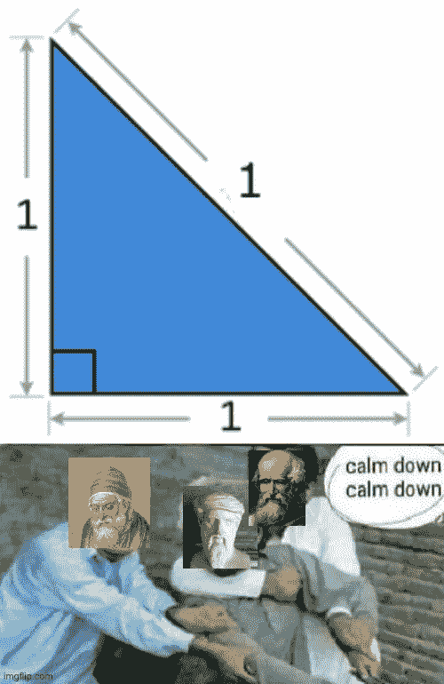

meme by Author | source: [https://imgflip.com/memegenerator/157920290/Calm-down-Albert-Einstein](https://imgflip.com/memegenerator/157920290/Calm-down-Albert-Einstein)

距离度量(或者度量，如果我们想严格要求的话)在机器学习领域非常重要。它们在监督和非监督算法中都有应用。对距离度量的掌握允许机器学习科学家创建更好的模型和新颖的解决方案。以反事实为例，它被定义为产生不同输出的“假设”实例。通过使用距离度量，我们可以量化产生反事实的容易程度，这将概述您的机器学习模型的对抗性鲁棒性。

不幸的是，大多数人只熟悉欧几里得距离，顺便说一下，它非常有用。然而，欧几里德距离本身只是冰山一角。还有更多同样有用的方法(也令人兴奋！)取决于使用案例。在这篇文章中，我们将探索其中的一些。

## 欧几里得距离

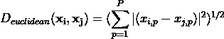

全能而有用的欧几里得。度量代表两点之间直线的长度。在机器学习领域，这可以用作空间中连续特征之间的相似性的度量。默认情况下，Kmeans 和 KNN 等经典聚类算法使用此度量将观察值分组在一起。

## 哈弗线距离

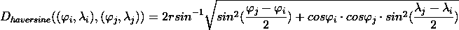

你有没有想过为什么飞行中的导航地图显示的是曲线路径而不是直线路径？两点之间最短的距离不是直线吗？如果地球是平的，那么最短的距离是一条直线。但是，由于地球是球形的，最短的距离实际上是一个圆弧，它是用哈弗线距离计算出来的。

要使用上面的公式，我们需要三个变量:

*   地球的半径
*   A 点的经纬度
*   B 点的纬度和经度

根据以上信息，很明显，当我们处理地理空间数据时，哈弗线距离效果最好。

## 匹配准则和 Jaccard 距离

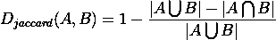

与连续变量相比，测量离散变量之间的距离需要不同的方法。一种方法是使用样本集的交集和并集。用外行人的话来说，我们是在统计共同价值观的数量。计算 Jaccard 距离的简单方法是首先计算 Jaccard 指数:

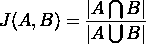

看上面的公式，Jaccard 指数简单来说就是常用项的比例。Jaccard 距离将为

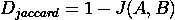

不像欧几里得和哈弗辛是无界的(尽管必须是正的)，雅克卡距离是在 0 和 1 之间有界的。此外，虽然 Jaccard 距离也可用于比较具有 1 个以上分类变量的两个数据点，但更有效的方法是利用以下匹配标准:

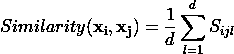

在哪里

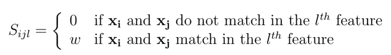

虽然 **w** 通常为 1，但我们可以为不同的特征分配不同的 w 值，以强调重要性。然后可以通过用相似性度量代替 Jaccard 指数来计算距离。使用这个的唯一警告是 **w** 必须在 0 和 1 之间，否则，距离可能是负的！当我们处理由纯分类特征组成的数据时，这种距离度量是正确的选择！

## 余弦距离

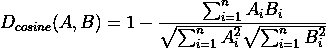

余弦距离度量内积空间中两个非零向量的“不同”程度。余弦距离的一个应用是测量一组文本是否可能包含相同的术语。

为了计算距离，我们将首先通过计算文本中包含的术语数量，将文本转换为它们的向量表示。例如，假设我们排除代词和将来动词，句子“嗨，我是一个全职书呆子”的向量表示将在“嗨”轴(x 轴)方向上为 1 个单位，在“全职”轴(y 轴)方向上为 1 个单位，在“书呆子”轴(z 轴)方向上为 1 个单位。之后，我们将计算余弦相似度(上式中的第二项)。余弦相似度实际上限制在-1 到 1 之间。分数为-1 意味着向量具有彼此相反的方向，而分数为 1 意味着它们具有相同的方向。分数为 0 表示它们是垂直的。但是，当我们计算文本中包含的术语时，余弦相似度限制在 0 和 1 之间，因为术语的数量永远不会为负。因此，余弦距离也限制在 0 和 1 之间。

## 莱文斯坦距离

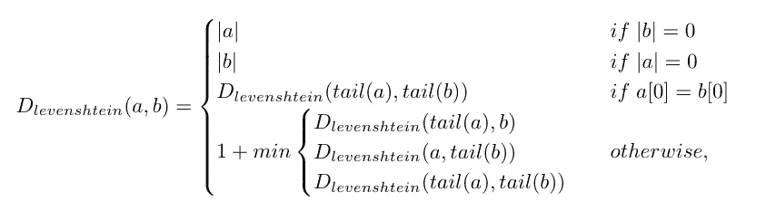

Levenshtein 距离测量两个序列之间的差异，特别是将一个单词改变为另一个单词所需的编辑次数(无论是插入、删除还是替换)。当我们想要执行模糊文本匹配时，它特别有用。例如，一个可能的应用是我们都熟悉的自动校正功能。为了理解这个等式，我们来举个例子。

假设我们想找出单词“glove”和“cove”之间的 Levenshtein 距离。那么 Levenshtein 距离将是 2，因为将“glove”转换为“cove”涉及两次编辑:

*   从“手套”中去掉 g
*   用 c 代替 l

这个距离度量是对称的，将“cove”转换为“glove”也将产生 Levenshtein 距离 2。

## 瓦瑟斯坦距离

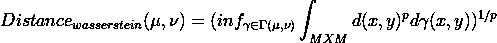

Wasserstein 距离属于统计距离家族，用于测量两个概率分布之间的距离。虽然还有其他数不清的指标，如 Kullback-Leibler 散度，但 Wasserstein 有一个更好的直觉——这个指标可以被解释为将一种概率分布转换为另一种概率分布的最小“成本”。Wasserstein 距离的一个有用的应用是创建合成数据。好的合成数据必须尽可能与原始数据“相似”，而“相似性”可以通过两者的分布有多接近来衡量。这是因为我们可以将我们的数据(无论我们有多少个特征)视为多元分布的集合。因此，Wasserstein 距离可以用作成本函数，通过诸如生成对抗网络(GAN)的算法进行优化。

## 我如何实施这些措施？

为了实现和应用这些措施，我们可以使用 python 包，除非你想自己实现算法，这可能是一个很好的辅助项目。以下是我能找到的可用 python 包列表:

*   sci kit-了解成对指标
*   文本距离
*   半正矢
*   scipy.stats

## **奖励内容——了解文化基因**

如果你想知道，毕达哥拉斯是我们的主要人物。他的定理肯定是我们所有人都熟悉的。利用他的定理，斜边的长度是 1.41。然而，如果我们考虑切比雪夫距离，斜边的长度实际上是 1！

**介绍-切比雪夫距离**

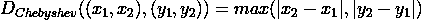

切比雪夫距离也称为棋盘距离。它测量任意坐标维度上两个向量之间的最大差值。一个很好的类比是象棋游戏中的国王，距离可以被视为从一个方格移动到另一个方格所需的移动次数。因为他可以向各个方向移动，从一个方块对角移动到另一个方块只需要 1 步，因此，切比雪夫距离也是 1。

[1]https://axon.cs.byu.edu/Dan/678/papers/Cluster/Xu.pdf

[2][https://arxiv.org/pdf/1701.07875.pdf](https://arxiv.org/pdf/1701.07875.pdf)

 [## Mlearning.ai 提交建议

### 如何成为 Mlearning.ai 上的作家

medium.com](/mlearning-ai/mlearning-ai-submission-suggestions-b51e2b130bfb)