# 了解你的机器:机器学习中聚类的简化解释

> 原文：<https://medium.com/mlearning-ai/know-thy-machine-a-simplified-explanation-of-clustering-in-machine-learning-22c968addd39?source=collection_archive---------6----------------------->

在我的[上一篇博客](/@rithvik.jandhyala/learn-machine-learn-enter-the-era-of-intelligence-633dec2441a0)中，我讲述了机器学习和人工智能的基础知识。虽然上一篇博客让你对机器学习和人工智能有了概念性的了解，但在这篇博客中，我们将通过简单的插图更深入地了解一种叫做聚类的机器学习技术。首先，让我们回顾一下聚类。

**聚类是对相似数据的分组或划分。这应该是为了模拟人类对物体进行分组的自然趋势。**例如，由于形状、颜色和质地等多种因素，一个孩子(不需要成为爱因斯坦)将能够区分苹果、梨和草莓。同样，计算机区分数据并形成不同的分类，也称为聚类。

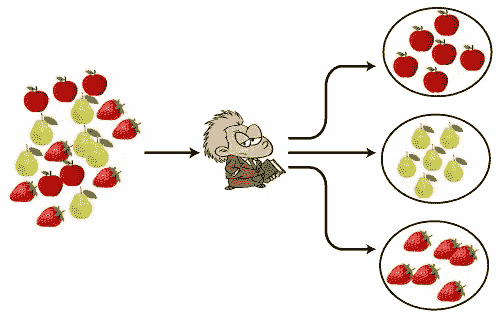

Child Making Clusters of Apples, Pears, Strawberries

作为人类，我们从很小的时候就被教导如何区分某些事物并形成集群，但计算机如何区分信息/数据呢？这就是无监督机器学习发挥作用的地方。

# 群集的物理演示

在我的高中俱乐部 SpaceTech，为了解释这个集群的概念，我决定做一个物理演示，而不是坚持使用幻灯片。我让每个人站起来，随机在教室里散开。这个演示的目标是将我的俱乐部成员分成三个组。它看起来类似于下图。

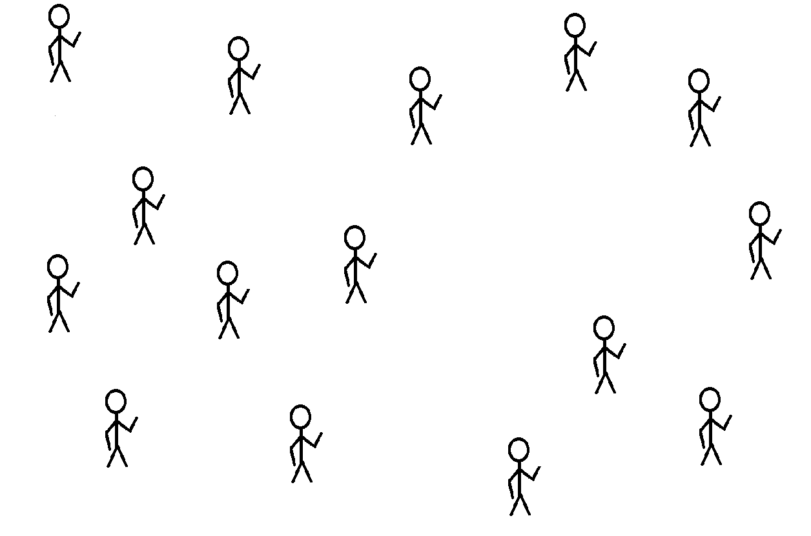

我随机选择了三个人，让他们每人戴一顶红色、绿色或蓝色的帽子。然后我给了他们每人几张与他们帽子颜色相对应的卡片。这三个人将代表集群头。它看起来类似于下图。

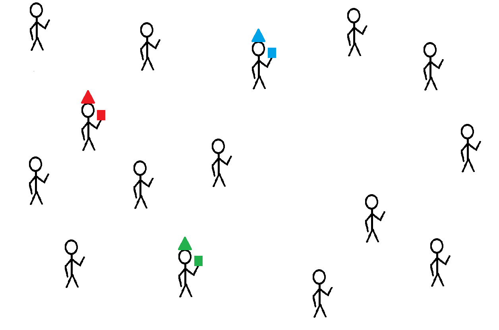

然后我让房间里的每个人去从最近的戴帽子的人那里收集一张卡片，然后回到他们原来的位置。房间看起来如下图所示。

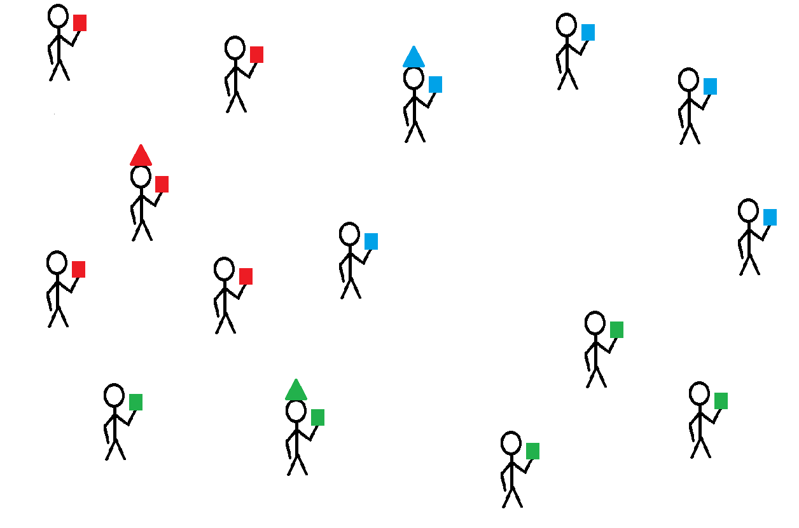

然后，我让组长(戴帽子的人)大致移动到所有相同颜色的其他人的平均位置。如下图所示。从这张图中，我们可以看到红色的星团头没有移动太多，但是蓝色和绿色的却移动了。

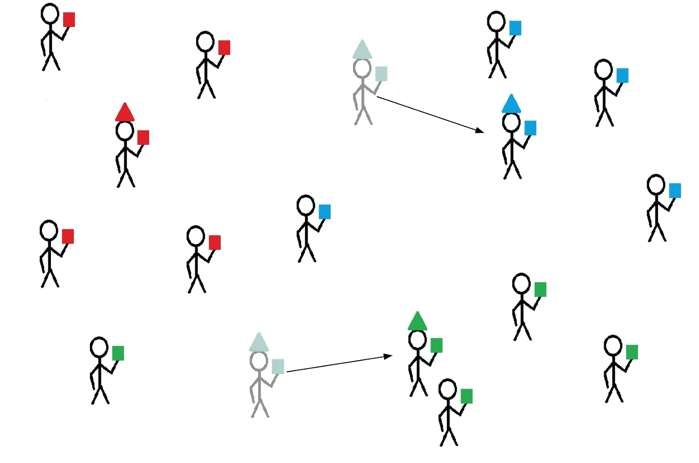

然后我让房间里的每个人去最近的组长(戴帽子的人)那里收集一张卡片。如果他们的卡片颜色已经与最近的簇头的颜色相匹配，那么就没有必要收集卡片。然而，如果他们的笔记卡与最近的簇头的不匹配，那么他们必须从最近的簇头收集笔记卡。房间看起来如下图所示。**正如我们在下图中看到的，一个拿着蓝色便签卡的人和一个拿着绿色便签卡的人换成了红色便签卡。**

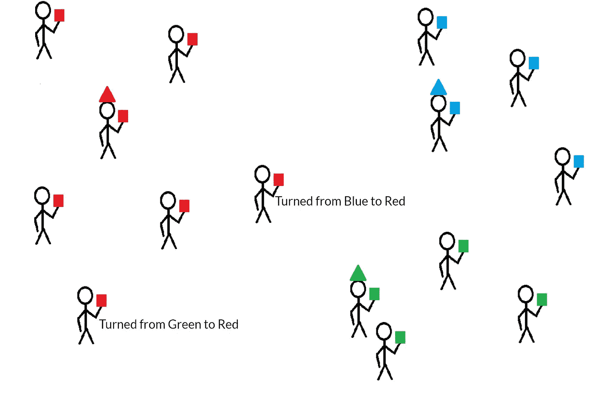

最后，簇头移动到所有其他举着相同颜色卡片的人的平均位置。如下图所示，绿色和蓝色的簇头更接近它们自己的组。经过两次重新评估颜色和移动簇头的迭代，**三个簇成功形成，如下图**所示。

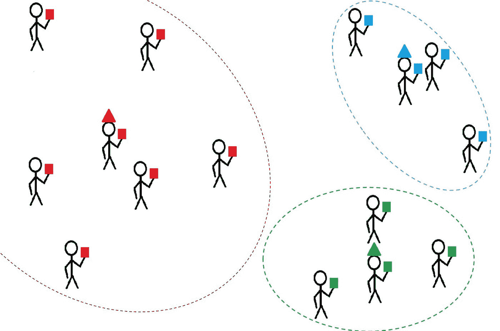

# 计算机是如何形成集群的？

计算机形成簇的方式是通过形成分区和调整簇头位置的过程，使用众所周知的聚类技术，如 **K-Means** 。K-Means 是一种基于距离的聚类技术，其中 K 表示要形成的聚类的数量。K-Means 的目标是创建簇，使得簇内距离(簇内数据的距离)最小化，簇间距离(簇之间的距离)最大化。这很容易理解下图。用于创建聚类的大量计算来自数学领域，称为**线性代数。**

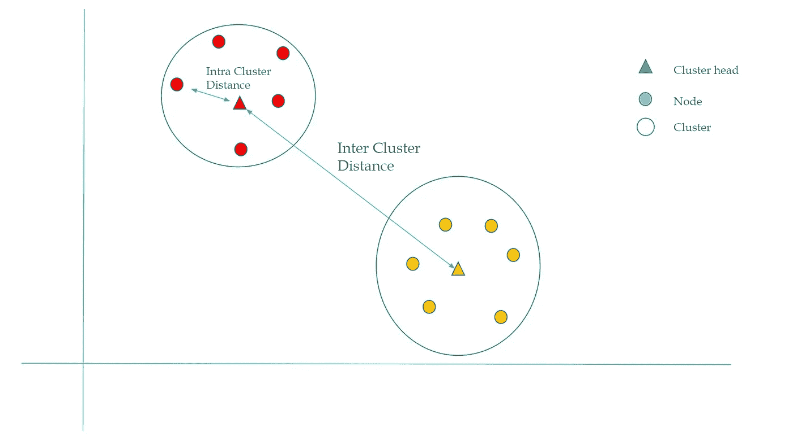

Inter-Cluster Distance vs. Intra-Cluster Distance

让我们看一个例子，说明计算机如何执行 K 均值的聚类，其中 K = 2 个聚类。让我们假设一台计算机被给予了关于人的体重和身高的原始数据。如下图，每个点代表一个人，x 轴代表体重，y 轴代表身高。我们想把人分成体重和身高相似的两组。

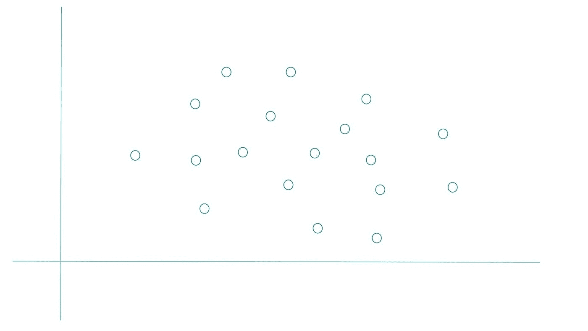

## 第一步

计算机的目标是创建两组:红色组和黄色组。计算机将首先随机选择两个数据点作为簇头。

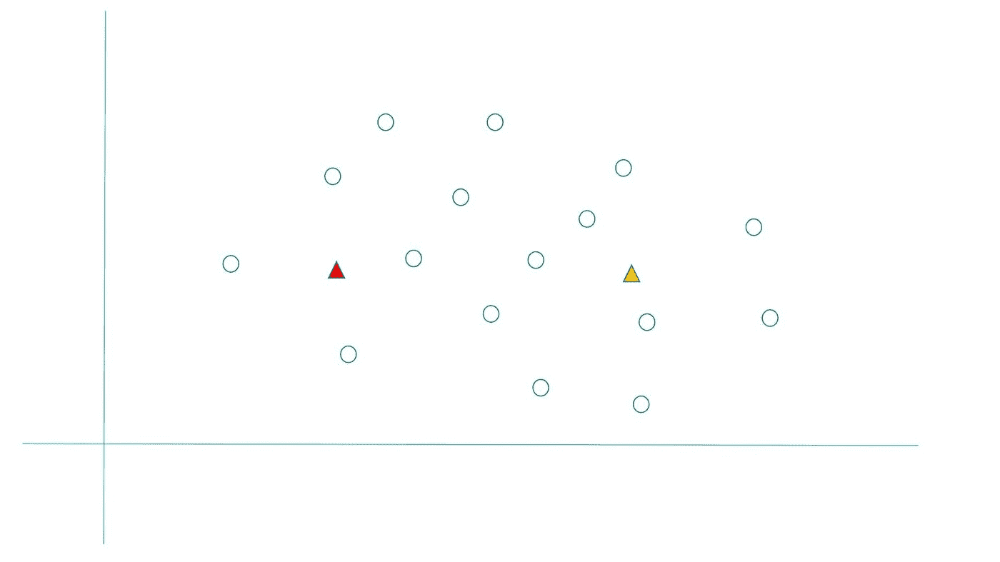

## 第二步

然后计算机会在数据中形成分离。这是通过找到连接两个簇头的线来实现的。然后，计算机将创建另一条线(分区)，该线垂直于连接两个簇头的线。隔板将连接两个簇头的线完美地一分为二。

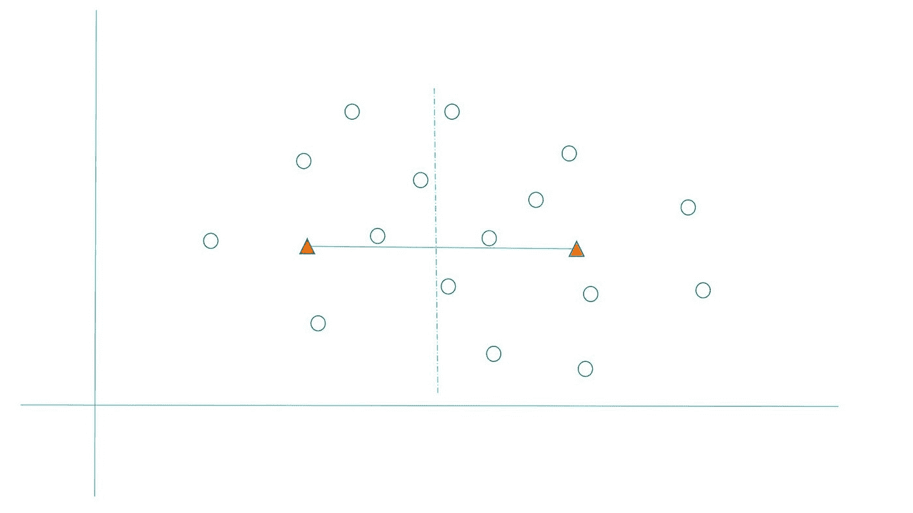

## 第三步

分隔线左侧的任何数据点都成为红色组的一部分，分隔线右侧的任何数据点都成为黄色组的一部分。

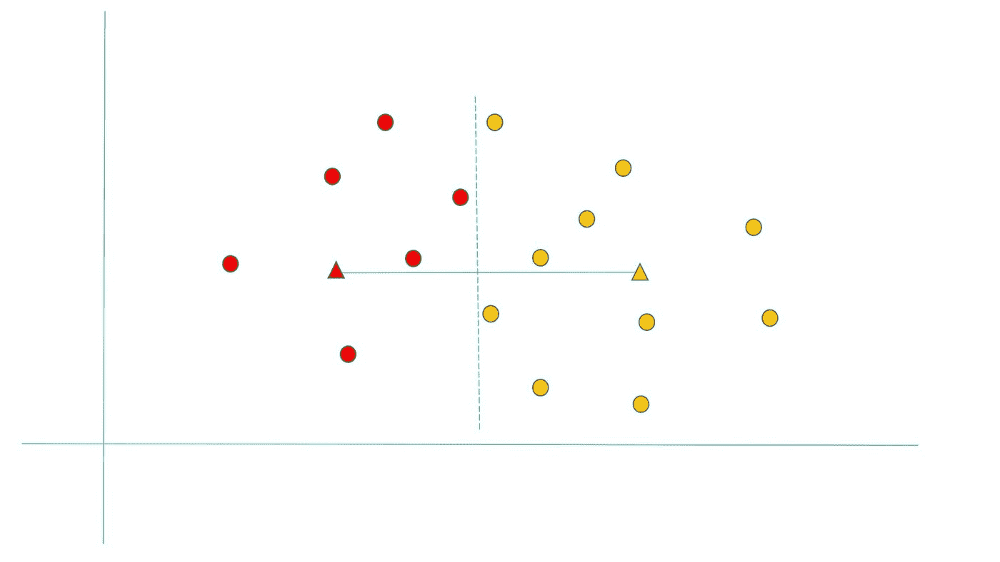

## 第四步

现在，计算机将重新调整簇头，使其成为所有点的平均值。例如，红色簇头将移动到所有红色点的新平均值，这同样适用于黄色。

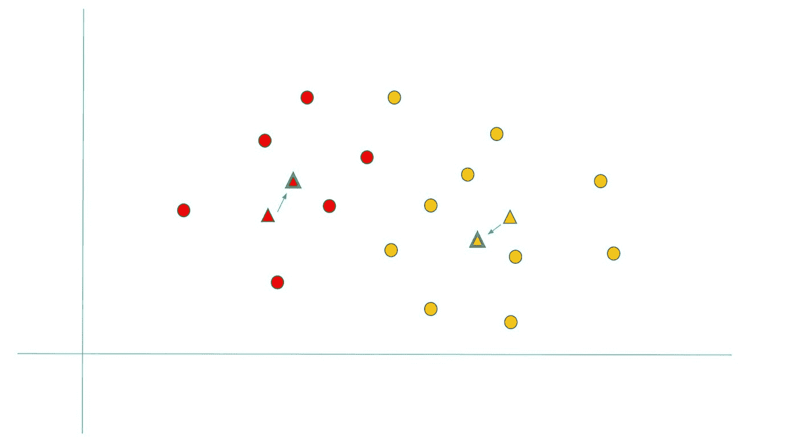

## 第五步

现在，我们将重复步骤的过程，并发现一个黄色的点是左分割线。

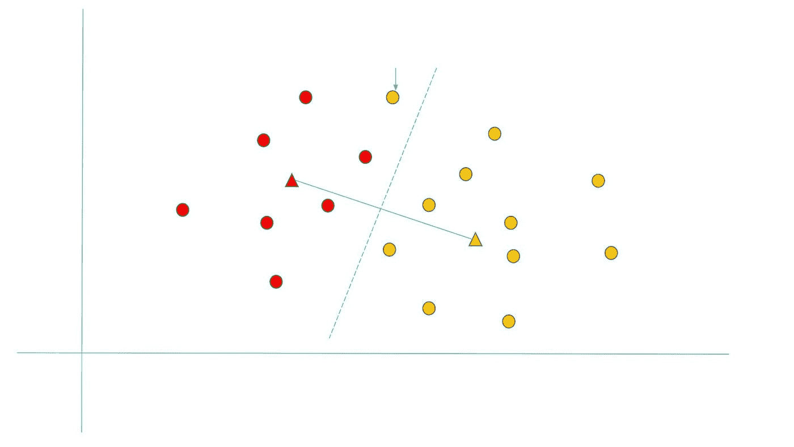

## 第六步

这意味着这个黄色的节点会变成一个红点。

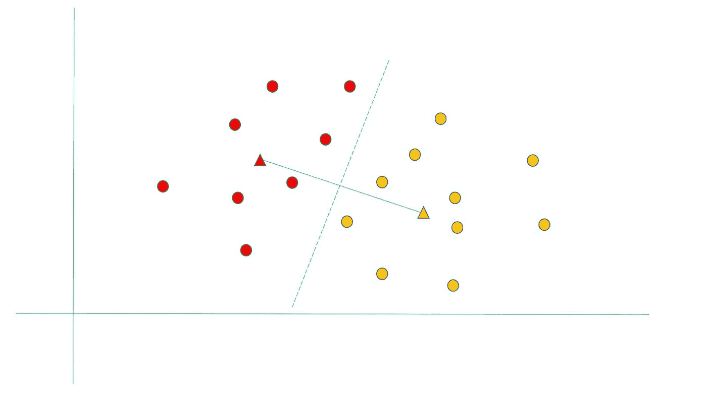

## 第七步

接下来，我们必须再次重新调整每种颜色的簇头，使其成为给定颜色的所有节点的平均值。

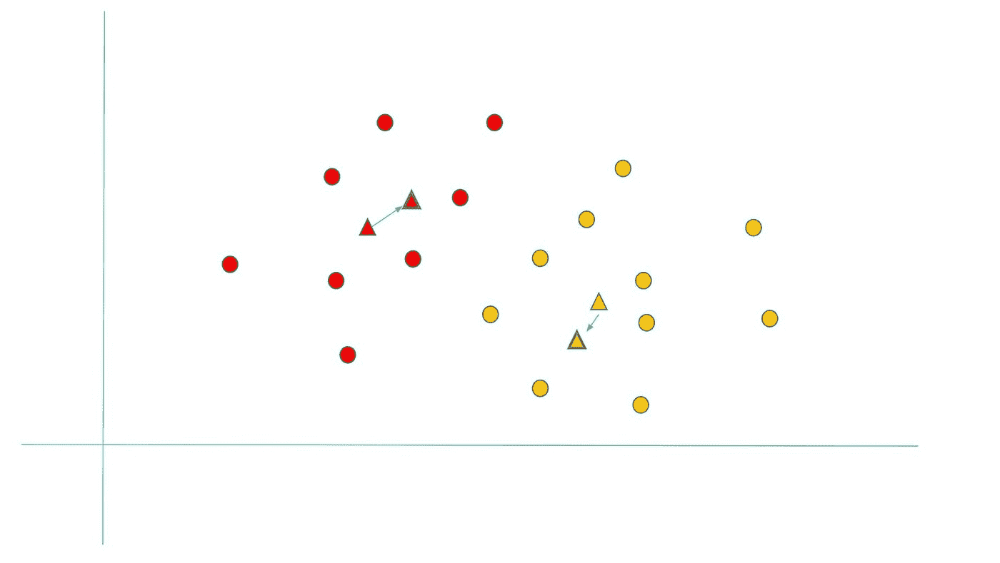

## 第八步

现在我们再次重复这个过程，我们发现已经成功地形成了两个集群，每个点属于其中一个集群。

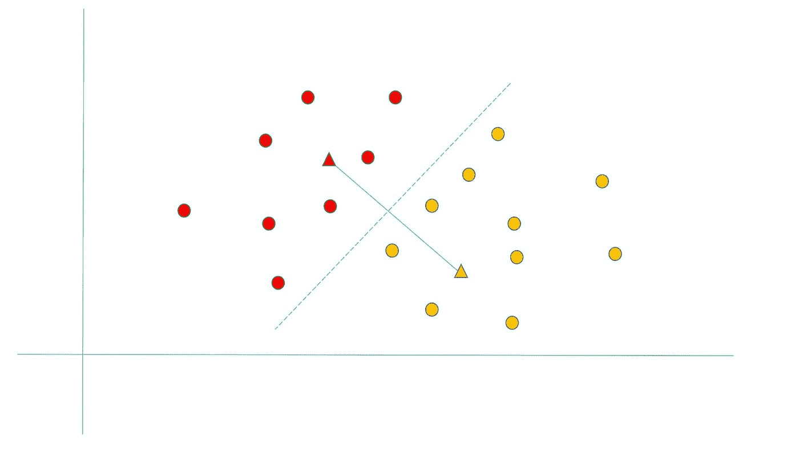

## 聚类的代码

对于有技术背景和编程技能的读者来说，这里可以让您轻松地用 python 编写关于执行集群的代码。下面的 python 代码根据作为源数据提供的 excel 电子表格中的纬度和经度，将六个国家分为三组。

# 最后的想法

恭喜你！您已经了解了无监督机器学习，并对聚类有了概念性和实践性的理解。拍拍自己，因为这是一个巨大的成就，你是通过与数据科学家交谈，跳过行话取得的。然而，我们只是触及了表面，还有很多东西要学。您只需在网上搜索，就可以了解更多关于聚类方法的信息，如层次聚类、空间聚类、基于密度的聚类等。

接下来将探索监督机器学习！你准备好了吗？

 [## Mlearning.ai 提交建议

### 如何成为 Mlearning.ai 上的作家

medium.com](/mlearning-ai/mlearning-ai-submission-suggestions-b51e2b130bfb)