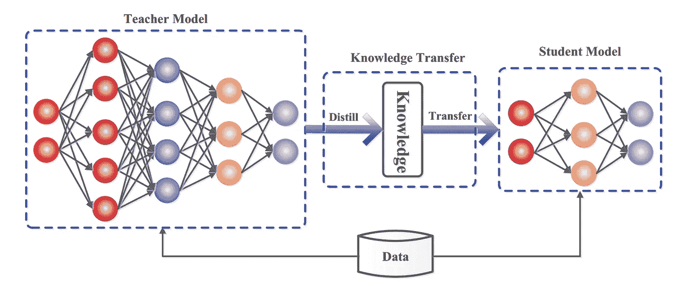
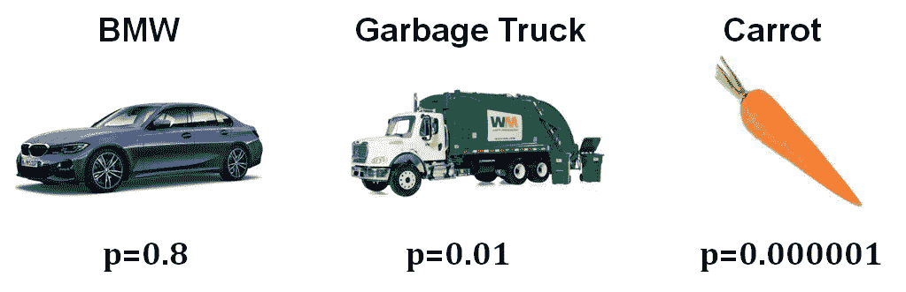
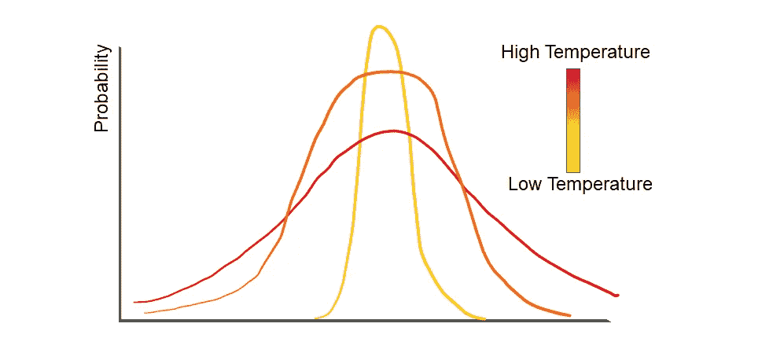
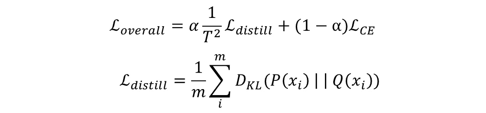

# 知识蒸馏——让你的神经网络变小

> 原文：<https://medium.com/mlearning-ai/knowledge-distillation-make-your-neural-networks-smaller-398485f811c6?source=collection_archive---------2----------------------->

部署一个拥有数百万参数的庞大模型并不容易，如果我们可以将这些知识转移到一个更小的模型中，并使用它进行推理，会怎么样呢？在这篇文章的结尾，你会明白这是怎么做到的。

# 介绍

知识蒸馏意味着以最小的信息损失将大模型的知识转移到小模型。它也可以指将多个模型的知识(集成)转移到单个模型中。

## 动机

在大多数情况下，我们使用相同的模型进行训练和推理。使用大量的计算能力来训练模型是可以的，但是为了部署的目的，我们应该能够用更少的资源更快地存储模型和执行预测。

## 知识

这里的知识指的是输入图像到输出向量的映射，这正是我们想要传递的。输出概率不仅包含关于哪个类别是正确类别的信息，还包含不正确类别的**相对概率。**

例如:-

The example mentioned in Hinton’s paper demonstrates what information is contained in the output

宝马被误认为垃圾车的概率很低，但同样的图像被误认为胡萝卜的概率更低，这是理解模型如何概括的有价值的信息。

# 方法

我们有两种模型——教师模型(大而笨重)和学生模型(小而简单)。老师也可以是多个模特的合奏。教师将在数据集上单独接受培训，经过培训的模型将用于**监督**学生网络的学习过程。

培训学生模型主要包括 4 个步骤

1.通过教师模型
2 向前传递一个数据样本。通过学生模型
3 向前传递相同的数据样本。计算损耗，即两个输出之间的距离
4。使用反向传播将这种损失降至最低

设 **P(xᵢ)** 和 **Q(xᵢ)** 分别代表数据样本 xᵢ.的教师和学生网络的输出概率 z 和 Y 是网络的无标度输出逻辑。

P = [p₁，p₂，…，pₖ]其中 k 是类的数量，同样适用于 q

## 温度

模型通常通过使用 softmax 层产生输出概率，softmax 层将 logits Z 转换为概率 q。对于蒸馏，我们使用 soft max 的不同变体，其参数称为**温度**。

使用更高的温度会导致概率的软化。

例如，如果[0.01，0.98，0.01]是硬概率，提高温度可以给我们[0.1，0.8，0.1]，这是一个更软的版本，进一步提高温度可以给我们类似于[0.2，0.6，0.2]。

**但为什么是温度呢？**

将 2 误认为 3 的概率可以是 0.000001，而将 7 误认为 2 的概率可以是 0.000000001。注意，相差 1000 倍。但是该信息可能不会使用交叉熵来传递，因为两个值都非常接近于 0。然而，软化概率将使我们能够**保存这个信息**并相应地传输它。

温度的使用也对学生模型具有正则化效果，并且该模型能够更好地概括。

## 损失函数

第一部分是**库尔贝克-莱布勒散度**。应用温度(T > 1)后，计算教师和学生模型的输出。

损失的第二部分就是**交叉熵损失**。在计算时，我们使用学生模型的标签和输出，而不应用温度(或者说 T=1)。

软目标产生的梯度幅度为 1/T。为了确保两种损失的相对贡献在温度变化时大致保持不变，蒸馏损失乘以 T。

这里的α是一个**超参数**，用于平衡两个损耗，在本文中，α取 0.5，给予两个损耗相等的权重。

## 关于 KL 散度的小知识

KL 散度可以看作是两个概率分布相似或不同程度的度量。在数学上它非常类似于交叉熵，事实上它是一种更普遍的形式。

数学表达式参见此[链接](https://en.wikipedia.org/wiki/Kullback%E2%80%93Leibler_divergence)。[这个](https://www.youtube.com/watch?v=SxGYPqCgJWM)视频在题目上给人很大的直觉。

## 多模型蒸馏

当使用集合进行预测时，所需的计算能力是单个模型的数倍。知识发现可以用来将知识从多个模型转移到单个模型。可以通过取单个模型输出的**平均值来计算概率(在计算概率之前或之后)，然后用于上述损失函数。**

# 结论

KD 是一种很棒的现成的网络压缩技术。许多新的知识转移方法已经出现，它仍然是一个不断发展的领域。压缩网络可以帮助解决许多问题，并使我们能够在移动和边缘设备上部署模型。

# 参考

—[辛顿、杰弗里、奥里奥尔·维尼亚尔斯和杰夫·迪恩。"从神经网络中提取知识." *arXiv 预印本 arXiv:1503.02531*2.7(2015)](https://arxiv.org/pdf/1503.02531.pdf)
–[苟、建平等，《知识升华:一项调查》*国际计算机视觉杂志*129.6(2021):1789–1819](https://arxiv.org/pdf/2006.05525.pdf)

 [## Mlearning.ai 提交建议

### 如何成为 Mlearning.ai 上的作家

medium.com](/mlearning-ai/mlearning-ai-submission-suggestions-b51e2b130bfb)