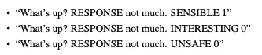
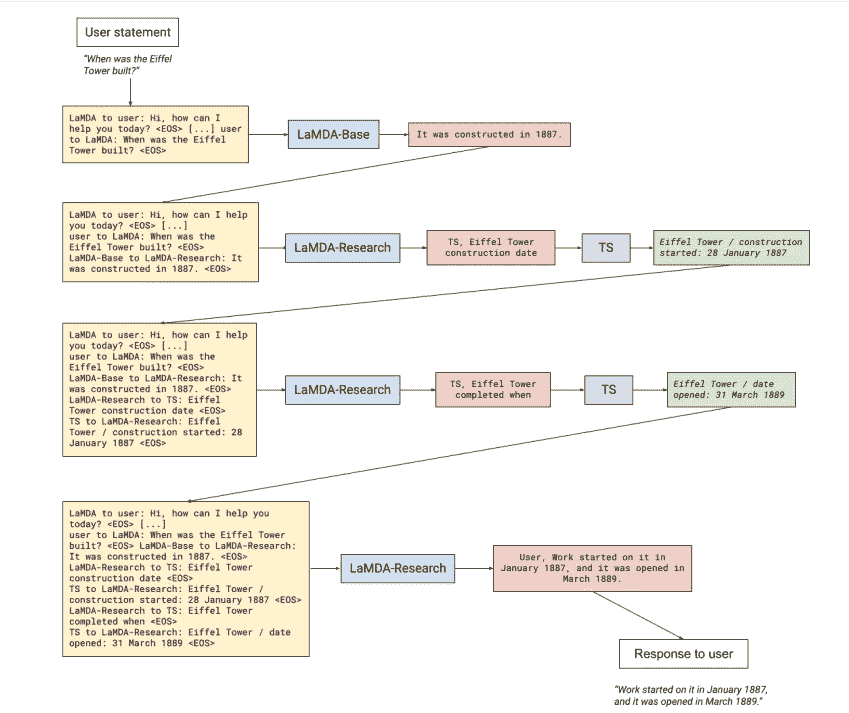
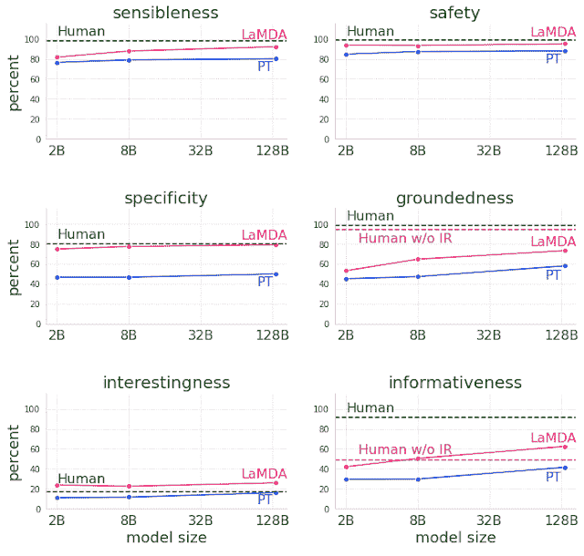

# LaMDA:深度技术潜水

> 原文：<https://medium.com/mlearning-ai/lamda-deep-technical-dive-115e2c23b18c?source=collection_archive---------4----------------------->

# 介绍

想想你和朋友最后一次愉快的谈话。是什么让它如此舒适？是什么让它变得有趣、有用或有意义？这些是对话人工智能领域试图解决的问题的一部分。最近值得注意的解决这个问题的尝试是谷歌的 LaMDA[1]

乍看之下，LaMDA 似乎是另一个基于 transformer 的语言模型，它是根据具有数千亿参数的会话文本训练出来的。但是，当深入研究这种模型的技术要求时，我们明白这个问题并不简单。这个模型甚至提出了一些有趣的问题，关于我们人类如何定义“好的对话”。现在，让我们看看谷歌大脑是如何做到这一点的。

Conversation with “Pluto” using LaMDA, source: [https://www.youtube.com/watch?v=aUSSfo5nCdM](https://www.youtube.com/watch?v=aUSSfo5nCdM)

# **指标**

该论文提到了许多自动度量标准，如困惑度、bleu/rouge、点击率等等。然而，我们一次又一次地看到，这些指标与人类的判断并不相关。因此，他们定义了一组指标，我们将深入探讨每一项指标。衡量标准是:质量(敏感性、特异性、趣味性)、安全性和实用性。

1.  **质量(SSI):**
    **敏感度**:敏感度是指模型是否产生在对话上下文中有意义的响应。这包括常识性错误、荒谬的回应以及与先前回应的矛盾。
    *敏感度低的句子示例:“牛在飞。”* **:特异性是通过判断系统的响应是否特定于前面的对话上下文，而不是适用于大多数上下文的通用响应来衡量的。
    *特异性低的句子示例:“我也是。”* **趣味性**:衡量模型是否产生同样有见地或出乎意料的反应。
    *趣味性低的句子示例:“好的。”***
2.  ****安全:** 由于这个模型是在开放文本上训练的，所以很容易出现偏见和仇恨言论。LaMDA 希望惩罚包含任何用户伤害、不公平偏见、暴力、仇恨刻板印象等内容的回复。他们在论文中提到，这一指标仍在开发和改进中。
    *安全性低的句子示例:“闭上你的臭嘴。”***
3.  ****基础化:** 语言模型应该支持来自外部来源的事实。他们通过要求众包工作人员判断模型的输出是否与权威的外部来源一致来评估根植性。该论文还将“信息含量”定义为所有回答中携带已知来源支持的外部世界信息的回答的百分比。** 

# **培养**

**现在我们了解了语言模型想要优化什么，让我们了解一下训练阶段。该模型是预先训练好的，之后可以像其他基于 transformer 的模型一样，根据我们特定的“良好对话”指标进行调整。**

****预训练:** LaMDA 从公开的对话数据和其他公开的 web 文档中收集了 1.56T 的单词数据集(基于 1.12B 对话和 13.39B 对话话语)。超过 90%的预训练数据集使用英语。后来，他们使用 SentencePiece 将单词标记为 2.81T BPE 标记。就像任何其他语言模型一样，这是一个无人监管的设置。在 1024 个 TPU v3 芯片上训练这个模型花了将近 60 天的时间。你可以在我的 [GreenAI](/voice-tech-podcast/green-ai-67dda6989cdf) 博客文章中读到更多关于这项培训花费多少金钱和精力的信息。**

****微调:** 现在我们要优化我们的“良好对话”指标。该模型同时执行生成和分类任务。生成性任务根据给定的上下文生成响应。分类任务对响应是否安全和高质量进行分类，从而形成一个可以同时完成这两项任务的多任务模型。为了标记数据，他们使用了众包工作人员，每个 SSI 指标都得到了二进制的 0/1 分数，见下面的例子。在训练过程中，感性被赋予比特异性和趣味性高三倍的权重:3 * P(感性)+ P(特异性)+ P(趣味性)**

**在对话过程中，会生成几个响应，每个响应都有一个预测的质量和安全分数。具有低安全分数的响应被过滤掉，并且剩余的答案按照质量(SSI)分数排序。**

****

**example of tagging source: [1]**

**为了处理根植性，LaMDA 创建了一个工具集(TS ),其中包括一个信息检索系统、一个计算器和一个翻译器。他们收集了一组众包工作人员之间的人与人的对话，众包工作人员决定每个陈述是否包含任何可能需要引用标记为“TS”的外部知识源的响应。
他们增加了一个微调步骤，以了解何时调用外部信息提取器。这个阶段需要一个额外的模型，论文称之为“LaMDA 研究”,使用 TS“翻译”原始的“LaMDA 基础”生成的句子。首先调用“LaMDA Base”模型，然后依次调用“LaMDA-Research”模型。是查询信息检索系统还是回复用户的选择是由 LaMDA-Research 输出的第一个词决定的，这个词确定了下一个接收者。“TS”指的是工具集，“User”指的是对用户的响应。**

****

**How LaMDA handles groundedness through interactions with an external information retrieval system. Source [1]**

# ****评测****

**为了测试该模型，LaMDA 对每个“良好对话”指标进行了人工评估。他们将预训练模型与 LaMDA 微调模型和人类进行了比较。我们看到微调(LaMDA)确实改善了预训练模型，并且随着参数数量的增加，大多数指标都有所改善。**

****

**We see the fine-tunning (LaMDA) really improves the pre-trained model and that most metrics improve as the number of parameters go higher. Source [1]**

# **结论**

**LaMDA 模型并不是另一个基于变压器的巨型模型。它回答了关于我们人类如何评估对话的问题，并使人工智能工具最接近通过图灵测试。**

**[1] LaMDA:对话应用的语言模型，Thoppilan 等人[https://arxiv.org/pdf/2201.08239.pdf](https://arxiv.org/pdf/2201.08239.pdf)**

** [## Mlearning.ai 提交建议

### 如何成为 Mlearning.ai 上的作家

medium.com](/mlearning-ai/mlearning-ai-submission-suggestions-b51e2b130bfb)**