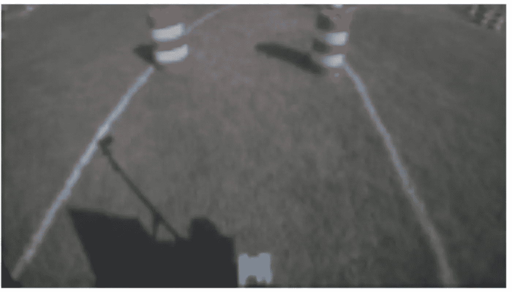
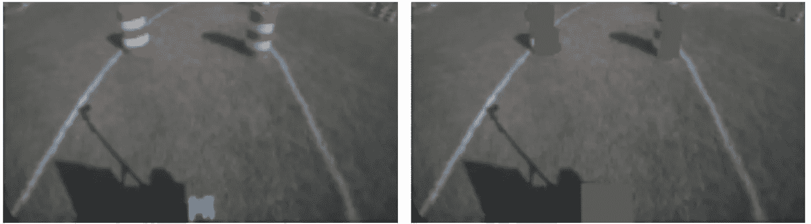
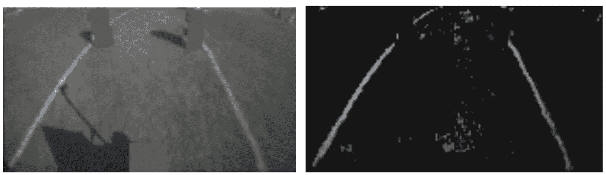
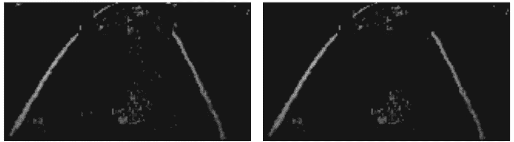
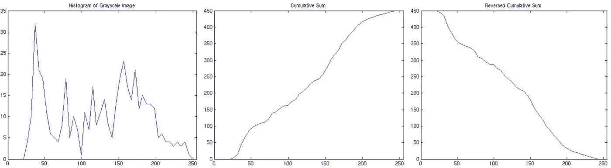
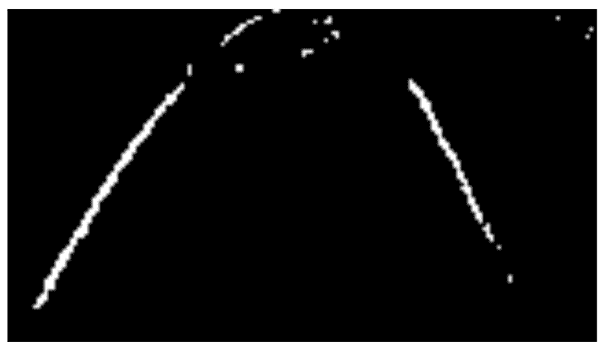

# 使用自适应滤波器的车道识别

> 原文：<https://medium.com/mlearning-ai/lane-identification-using-an-adaptive-filter-31c150d04e94?source=collection_archive---------1----------------------->

## 计算机视觉青铜时代的幽灵

很久以前，我们曾经梦想实时处理图像。我努力编写代码来为自主机器人识别车道线。我设计的最令人愉快的过滤器之一被我命名为低过滤器。我发现这是一个很好的去噪方法，下面我总结一下。

All images by author

# 图像预处理:障碍消除

首先，我注意到橙色桶看起来类似于白线，所以我根据我对它们的预期，通过一些简单的检测来消除它们。大约在 2006 年，这在当时的竞争中足够强劲。

Left: Typical course image — barrels and white lines on grassy terrain. Right: Image with barrels set to the average color.

# 低滤波器:自适应统计滤波器

我注意到线条的强度在统计上比周围的草和其他噪音要大。基于这种观察，开发了一种自适应统计滤波器，称为低通滤波器。“低”滤镜的目的是丢弃根据统计信息认为值太低的像素。

低滤光器分别在每个颜色平面上逐行工作。删除小于由局部平均值和标准偏差的加权组合确定的阈值的像素。阈值以上的像素不变。该滤波器独立地应用于所有三个颜色平面，因为线被假定为白色或强度接近白色。

下面为图像的每一行定义了所使用的阈值，并且该阈值根据行而变化。

> 阈值(行)=平均值(行)+ A *标准值(行)，其中 A 是用户定义的常数。

低通滤波器滤除了行中被认为是噪声的大部分像素，同时它不会增加没有行的行中的噪声，如下所示。

Left: Preprocessed Image. Right: Image after low filter.

然后我应用了一个 9×16 的局部统计区域过滤器。该过滤器计算每个区域的平均值，并删除平均值低于用户定义阈值的区域。结果可以在下面看到，中间的一些噪声被消除了。

Left: Gray scale image after the low filter. Right: Image after the area filter.

接下来，使用反向累积直方图找到低滤波图像的阈值。该直方图允许程序根据所使用的箱的数量，在任何给定的阈值下找到图像中会留下多少像素。直方图以正常方式计算，除了省去箱 0(由于大量黑色像素)。然后计算累积和。最后，如果在特定直方图面元值处取阈值，该累积和被反转以表示图像将具有的像素数量。

Left: Histogram of grayscale. Middle: Cumulative sum of the histogram. Right: Reversed cumulative sum of the histogram

这允许基于只允许在图像中留下一定数量的像素来设置阈值。这个数字是基于对每张图片中线条粗细的了解(对于所使用的缩小图像，大约是三个像素)。例如，假设 45 行中有两行，则需要保留 270 个像素(3×45×2)。下图显示了阈值化后的测试图像。

这些年来，我发现这种过滤器在其他领域也很有趣，最近是在咖啡渣领域。因此，我为对如何将其应用于咖啡渣颗粒分析有更深兴趣的人整理了这个简短的解释。

# 论文引用和摘要

麦肯，罗伯特&波利克，马克&克里希南，莫汉。(2006).自主移动机器人的车道识别和路径规划。 [6384。10.1117/12.686278](https://www.spiedigitallibrary.org/conference-proceedings-of-spie/6384/63840S/Lane-identification-and-path-planning-for-autonomous-mobile-robots/10.1117/12.686278.short) :

“这项工作是与 2006 年智能地面车辆竞赛(【www.igvc.org】T2)中底特律大学 Mercy 的 ECE 系自主车辆参赛项目一起进行的。IGVC 要求工程专业的学生设计自动驾驶汽车，并参加各种无人驾驶汽车比赛。

“比赛中穿越的赛道包括一条由草地上的画线划分的车道，两条车道线中的一条可能会被故意遗漏在赛道的某些部分。该课程还包括其他具有挑战性的人工制品，如沙坑、坡道、坑洞和改变场景颜色构成的彩色油布，以及使用橙色和白色施工桶设置的障碍。

本文描述了一种复合车道边缘检测方法，该方法使用三种算法来实现噪声滤波器，从而能够在应用图像阈值处理之前增加噪声的去除。

第一种算法使用行自适应统计滤波器来建立强度底限，随后是基于反向累积强度直方图和关于车道厚度和间距的先验知识的全局阈值。

第二种方法首先通过实现蓝色平面(RGB 格式)和修改的饱和平面(HSI 格式)的算术组合来提高图像的对比度。然后基于强度图像的平均值和用户定义的偏移应用全局阈值。

第三种方法将 Sobel 掩模的水平分量应用于图像的修改灰度级，随后是类似于第二种方法中使用的阈值方法。

霍夫变换被应用于每个结果二进制图像，以选择最可能的候选线。最后，确定一个基于启发式的置信区间，并将结果发送到一个单独的基于模糊极坐标的导航算法，该算法将图像数据与激光扫描仪产生的数据进行融合(用于障碍检测)。”

如果你愿意，可以在 Twitter 和 YouTube 上关注我，我会在那里发布不同机器上的浓缩咖啡视频和浓缩咖啡相关的东西。你也可以在 [LinkedIn](https://www.linkedin.com/in/robert-mckeon-aloe-01581595?source=post_page---------------------------) 上找到我。也可以关注我[中](https://towardsdatascience.com/@rmckeon/follow)。

# 我的进一步阅读:

[故事合集首页](https://rmckeon.medium.com/story-collection-splash-page-e15025710347?source=your_stories_page-------------------------------------)

[浓缩咖啡系列文章](https://rmckeon.medium.com/a-collection-of-espresso-articles-de8a3abf9917?source=your_stories_page-------------------------------------)

[个人故事和关注点](https://rmckeon.medium.com/personal-stories-and-concerns-51bd8b3e63e6?source=your_stories_page-------------------------------------)

[乐高故事启动页面](https://rmckeon.medium.com/lego-story-splash-page-b91ba4f56bc7?source=your_stories_page-------------------------------------)

[摄影启动页面](https://rmckeon.medium.com/photography-splash-page-fe93297abc06?source=your_stories_page-------------------------------------)

[水果公司的故事](https://rmckeon.medium.com/fruit-company-stories-splash-page-1674e7ec3d8?source=your_stories_page-------------------------------------)

在苹果公司面试时穿得太正式了

我在苹果的第一周

好的文化和好的管理的双重性

[手腕上的神奇体验](https://uxdesign.cc/magical-experience-on-my-wrist-70d0189a3f55?source=your_stories_page-------------------------------------)

[人脸识别:从婴儿期到产品的 3D 人脸识别](https://towardsdatascience.com/face-recognition-3d-face-recognition-from-infancy-to-product-209126575b56?source=your_stories_page-------------------------------------)

[平衡创造力和专注度](https://becominghuman.ai/balancing-creativity-and-focus-578db1332dfb?source=your_stories_page-------------------------------------)

[我的聋/盲英雄们](/@rmckeon/my-deaf-blind-heros-46e40ef625b?source=your_stories_page-------------------------------------)

[巨人的肩膀](/@rmckeon/the-shoulders-of-giants-930654c55ee9?source=your_stories_page-------------------------------------)

[以协商一致方式做出决定](/overthinking-life/decisions-by-consensus-83f201404ae1?source=your_stories_page-------------------------------------)

[团队合作实践:谦逊](/@rmckeon/teamwork-in-practice-humility-b78cf3b96ecd?source=your_stories_page-------------------------------------)