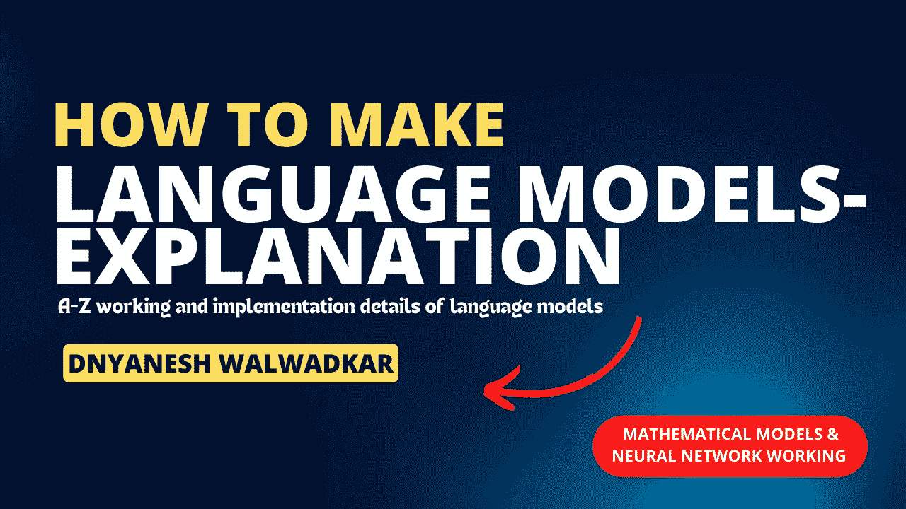

# 语言模型解释

> 原文：<https://medium.com/mlearning-ai/language-models-explanation-906881367c40?source=collection_archive---------6----------------------->

## 语言模型的实现细节

语言模型是一种统计模型，它被训练来预测给定语言中单词序列的可能性。这通常是通过将序列中的单词表示为数值，例如实值向量，然后使用向量作为数学模型(例如神经网络)的输入来完成的。



语言模型的目的是为每个可能的单词序列分配一个概率，表示该序列出现在给定语言中的可能性。该概率是使用诸如 softmax 函数之类的数学函数来计算的，该函数将输入向量映射到预定义词汇上的概率分布。

简而言之，语言模型的工作原理是将单词表示为数值，使用数学模型来预测单词序列的可能性，并通过从预测的概率中进行采样来生成文本。这允许模型以给定的语言生成连贯且语法正确的文本。

# **例子**

假设我们有一个在英语文本语料库上训练过的语言模型，我们想用这个模型来预测以下单词序列的可能性:“quick brown fox”。

首先，我们将序列中的每个单词表示为一个数字向量，使用诸如单词嵌入之类的技术，将单词映射到连续空间中的向量。例如，表示单词“quick”的向量可能是[0.2，0.5，0.1，0.8]，表示单词“brown”的向量可能是[0.6，0.3，0.9，0.2]。

接下来，我们将通过语言模型传递代表序列中单词的向量，语言模型通常是一个神经网络。神经网络将变换应用于输入向量，以便提取有意义的模式和特征。然后，神经网络最后一层的输出通过 softmax 函数，该函数将输出映射到单词词汇表上的概率分布。

例如，softmax 函数可能会将神经网络最后一层的输出映射到以下概率分布:

*   【产品规格】:0.05
*   【快速】:0.25
*   【棕色】:0.35
*   【狐狸】:0.35

这表明语言模型将 0.35 的概率分配给序列“The quick brown fox”，表明模型认为这个序列很可能出现在英语文本中。

```
# pseudocode
def preprocess_data(data):
  # Tokenize the data
  tokens = tokenize(data)

  # Remove stop words
  filtered_tokens = remove_stop_words(tokens)

  # Stem the remaining tokens
  stemmed_tokens = stem_tokens(filtered_tokens)

  # Create numerical vectors for the preprocessed tokens
  vectors = create_word_vectors(stemmed_tokens)

  return vectors

# Preprocess the training data
data = preprocess_data(raw_data)

# Split the preprocessed data into training and validation sets
train_data, val_data = split_data(data)

# Create a language model
model = create_language_model()

# Train the model on the training data
train_model(model, train_data)

# Evaluate the trained model on the validation data
evaluate_model(model, val_data)

# Fine-tune the model by adjusting hyperparameters and training again
model = fine_tune_model(model, train_data, val_data)

# Preprocess the input data
input_data = preprocess_data(raw_input_data)

# Use the trained and fine-tuned model to make predictions on the input data
predictions = predict(model, input_data)

# Output the predictions
output_predictions(predictions)
```

# 神经网络作为数学模型

更详细地说，语言模型通常使用神经网络作为其基础数学模型。这意味着代表序列中单词的输入向量经过多层计算，称为神经元，神经元对输入进行转换，以提取有意义的模式和特征。最后一层神经元的输出被用来预测单词序列的可能性。

神经网络在给定语言的大型文本语料库上训练，使用随机梯度下降的变体来优化模型的参数。这包括重复地向模型呈现输入序列及其相应的目标序列，并基于预测概率和真实概率之间的差异更新模型的参数。随着时间的推移，这使得模型能够学习语言的模式和结构，并对单词序列的可能性做出越来越准确的预测。

一旦模型经过训练，就可以通过在每个时间步长从预测的概率分布中进行采样来生成文本。这包括根据模型的预测选择最可能的单词，并将其用作下一个时间步骤的输入。根据从训练数据中学习到的模式和结构，可以根据需要重复该过程，以生成连贯且语法正确的单词序列。

# 模型细节

数学模型的具体细节取决于神经网络的结构，该结构可以根据层数、每层中神经元的数量、神经元所应用的变换类型以及其他因素而变化。然而，大多数语言模型使用一种称为递归神经网络(RNN)的神经网络，这种网络非常适合对文本等数据序列进行建模。

在 RNN 中，每一层中的神经元不仅与下一层中的神经元连接，还与前一时间步中同一层中的神经元连接。这允许 RNN 捕捉输入数据中的时间相关性，并基于整个输入序列而不仅仅是当前输入进行预测。

RNN 的输出通常是单词词汇表的概率分布，表示每个单词出现在序列中的可能性。这个概率分布是使用数学函数计算的，例如 softmax 函数，它将最后一层神经元的输出映射到概率分布。

为了训练该模型，向 RNN 提供输入序列及其对应的目标序列，并且基于预测概率和真实概率之间的差异来更新模型的参数。这通常使用随机梯度下降的变体来完成，这是一种调整模型参数以最小化预测概率和目标概率之间的差异的优化算法。

# 用这种模型计算损失

为了计算语言模型的损失，我们通常使用单词序列的预测概率和真实概率之间的差异的度量。这种方法被称为损失函数，它提供了模型性能的量化指标。

有许多不同的损失函数可用于语言建模，每一种都有自己的优势和局限性。一些常用于语言建模的损失函数包括交叉熵损失、困惑损失和 BLEU 分数。

**交叉熵损失**是两个概率分布之差的度量，常用于分类任务。在语言建模的上下文中，通过将单词词汇表上的预测概率分布与从目标序列中导出的真实概率分布进行比较来计算交叉熵损失。交叉熵损失通常被计算为预测概率的负对数，并且在训练期间被最小化以提高模型的性能。

**困惑损失**是两个概率分布之间差异的另一种常见度量，它经常用于自然语言处理任务。在语言建模的上下文中，通过取交叉熵损失的指数来计算困惑损失，并且它提供了模型为了生成目标序列而必须做出的选择的平均数量的度量。困惑度越低，模型的性能越好。

# 此类模型的数据预处理

为了使用语言模型，数据必须以特定的方式进行预处理。这通常包括几个步骤，如标记化、词干提取和停用词移除。

记号化是将输入文本分解成单个记号的过程，例如单词、标点符号和数字。这通常使用标记器来完成，标记器是一种根据预定义的规则将输入文本分割成标记的软件。

词干化是将单词简化为其基本形式的过程，目的是提高模型归纳为看不见的单词的能力。例如，单词“running”、“ran”和“runs”在词干提取过程中都将被简化为基本形式“run”。

停用字词删除是删除对语言模型没有用的常用字词的过程。例如，像“the”、“a”和“an”这样的词经常被作为停用词删除，因为它们在文本中频繁出现，但没有太多意义。

一旦数据经过预处理，通常使用诸如单词嵌入之类的技术将其表示为数字向量，该技术将单词映射到连续空间中的向量。这些向量然后被用作语言模型的输入，该语言模型被训练来预测给定语言中单词序列的可能性。

# 调查研究工作

在自然语言处理(NLP)领域，已经有大量关于语言模型的研究。这一领域的一些研究实例包括为语言建模开发新的神经网络体系结构，如递归神经网络(RNNs)和转换器；使用无监督和半监督学习技术来提高语言模型的效率和有效性；以及将语言模型应用于各种 NLP 任务，例如语言翻译、文本摘要和情感分析。

除了这些技术上的进步，还有大量关于语言模型的伦理和社会含义的研究。这包括对语言模型中固有的潜在偏见和歧视的研究，以及大规模语言模型对隐私和信息控制等问题的潜在影响。

1.  GPT-3(Generative pre trained Transformer 3)是由 OpenAI 开发的大规模语言模型，已被广泛用于各种自然语言处理任务。
2.  BERT(Transformers 的双向编码器表示)是由 Google 开发的大规模语言模型，已用于一系列 NLP 任务，包括语言翻译、文本摘要和情感分析。
3.  XLNet (eXtreme Language Net)是由谷歌和卡内基梅隆大学开发的大规模语言模型，它使用一种新颖的自我关注机制来捕捉文本中的长期依赖关系。
4.  RoBERTa(Robustly Optimized BERT Approach)是由脸书人工智能开发的大规模语言模型，已被证明在各种 NLP 任务上优于 BERT。
5.  T5(文本到文本转换转换器)是由 Google 开发的大规模语言模型，可以针对广泛的 NLP 任务进行微调，包括语言翻译、文本摘要和情感分析。

[](/mlearning-ai/mlearning-ai-submission-suggestions-b51e2b130bfb) [## Mlearning.ai 提交建议

### 如何成为 Mlearning.ai 上的作家

medium.com](/mlearning-ai/mlearning-ai-submission-suggestions-b51e2b130bfb)