# 语言翻译

> 原文：<https://medium.com/mlearning-ai/language-translation-8e24b4e40928?source=collection_archive---------13----------------------->

意大利语到英语

让我们来谈谈语言翻译。我花了一个月的时间来理解这一点，并注意和实施它。所以，今天我写这篇文章是为了让你不必花更多的时间去想。这项任务有多种模型，但今天我们将使用 SEQ2SEQ。

SEQ2SEQ 模型包含两个部分编码器和解码器，我们将输入传递给编码器，获得相应句子的编码向量，并将其传递给解码器以获得相应的输出。

## 建筑看起来像

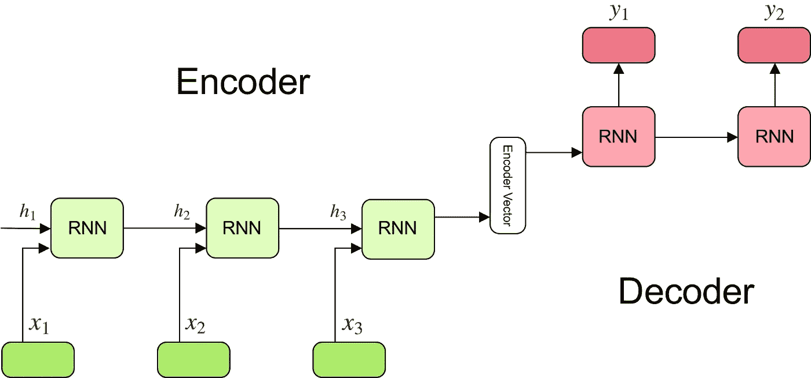

Encoder decoder model

在图中，x1、x2、x3 表示在特定时间标记处对 RNN/LSTM 的输入，其中 h1、h2、h3 表示隐藏状态，并且它在特定时间标记处缺少单元状态 c。

编码器向量是我们从编码器传递给解码器的(**单元和隐藏状态**)。

**让我们开始编码部分**

如果你想继续，你可以下载意大利语到英语的数据集。

## **第一步——数据预处理**

每个自然语言任务的第一步是预处理数据并理解它。

所以如果你下载了数据，就可以查看。

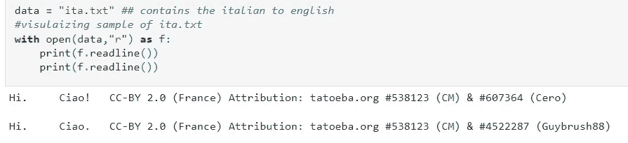

数据包含第一个用制表符分隔并包含 HI。/tCiao！/tCC —这里我们只需要英语和意大利语，所以我们删除了版权部分。为此，我们将迭代 txt 文件，用制表符(\t)分隔行，只取第 0 和第 1 个索引。我们准备好了。然后我们处理文本，这是所有自然语言任务的标准。

比如:

1.  去掉标点符号。
2.  删除特殊字符。
3.  删除多余的空格。
4.  像 don't to do not 等词的连接。

我在这里为此创建了一个类，并在类内保存了上述所有工作。

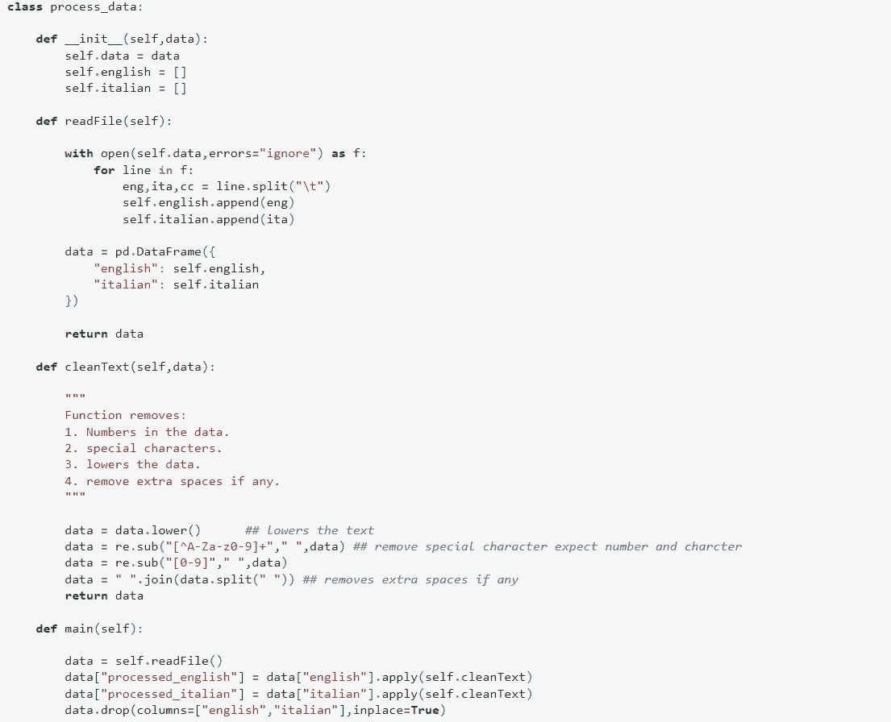

processing.

现在只需用文件调用 main，它将返回如下输出

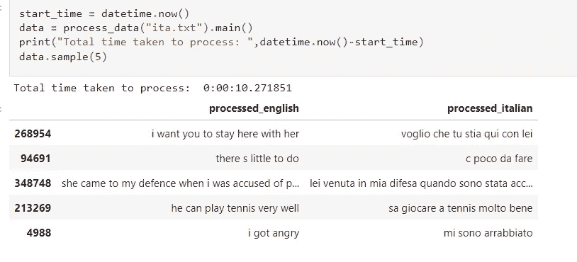

Outputs.

**第二步:制定输入输出格式。**

我们将处理过的意大利语传递给编码器层，将英语传递给解码器层。解码器包含英语作为我们的输入，必须预测给定输入的下一个单词，所以我们的输出也将是英语，所以从技术上来说，我们的模型将是多对多的。

我们为意大利语和英语添加了<start>和<end>来表示句子的开始和结束，稍后我们将需要停止我们的模型。</end></start>

所以，

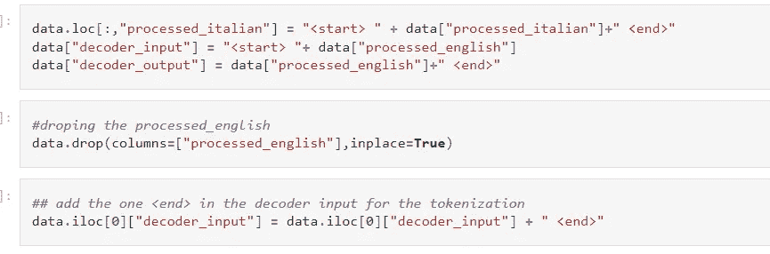

token

因此，我们将最终得到如下输出

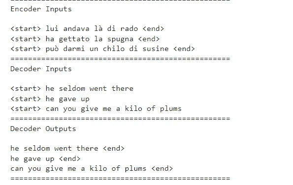

Input and output decoder

## **步骤 3:标记化**

由于模型不理解英语/意大利语单词，我们需要将其转换成某种数值。为此，我们在这里使用标记化。

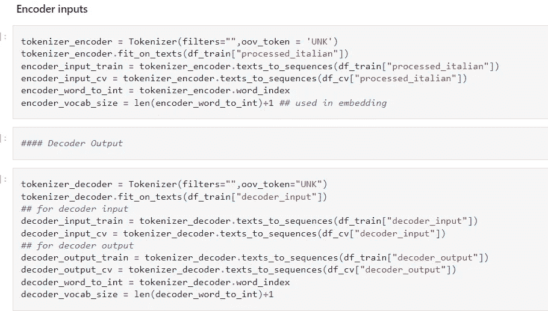

Tokenization language translation.

**第三步:填充**

我们首先需要找到可以填充句子的最佳位置。填充通常是指如果句子长度超过填充长度，就对其进行剪裁，并添加零使其达到合适的长度。我们通常这样做是为了批量输入模型，这样我们的训练会变得更快。

为了找到我们可以使用的所有英语/意大利语句子的长度，并绘制它的计数图和分布图，你可以填充两个不同长度的句子，我已经做了一个。

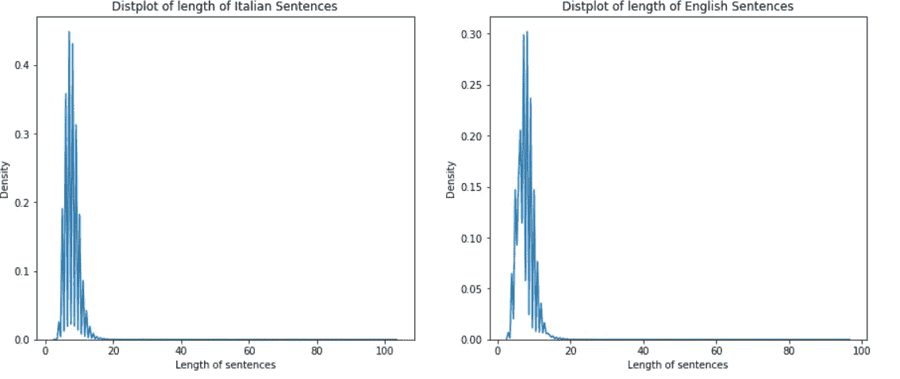

kdeplot

从图中我们可以看到，大部分单词的长度都在 0-20 之间，所以我们将其剪切为 20。这一点可以看得更清楚，如果你计算情节，这是对观众的锻炼。

填充至长度 20:

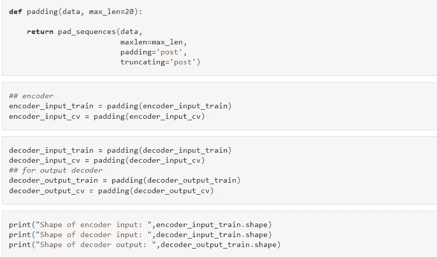

padding

## 步骤 4:创建数据加载器

我就不多说了，因为我已经写了如何创建一个定制的数据加载器，你可以看看

 [## 用于深度学习的定制数据加载器

### 为深度学习的任务编写自定义数据加载器与训练模型一样重要。好的数据…

medium.com](/@ashishjamarkattel123/custom-dataloader-for-deep-learning-8757bab0cd21) 

因此，该任务的数据加载器的代码如下所示

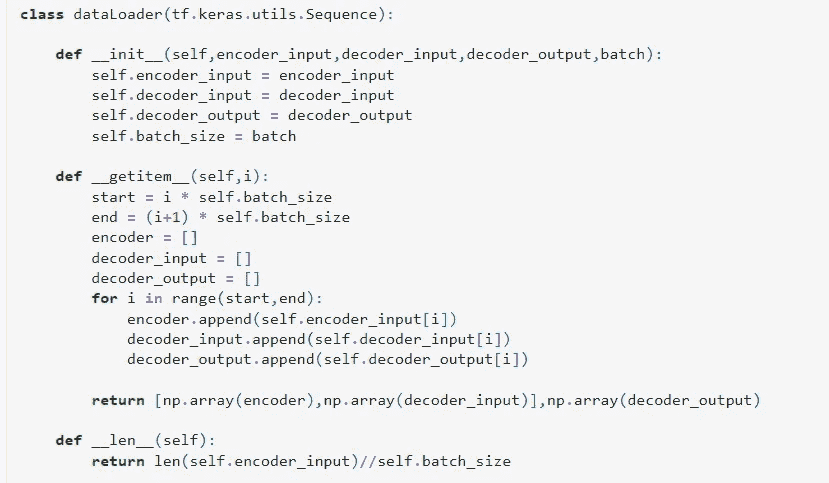

custom dataloader

**步骤 5:创建编码器层**

在编码器层中，我们将传递带有每个时间戳的意大利语句子，就像您如何训练经典的 LSTM 并从 LSTM 获取 state_hidden 和 state_cell 一样。为了获取状态值，我们定义 return_state = True 和 return_sequences = True，这将返回 encoder_output、encoder_h_state 和 encoder_c_state。我们将编码器 _h_state 和编码器 _c_state 组合起来传递给解码器。

让我们看看编码器，你会清楚得多。我为编码器和解码器都创建了一个自定义模型，但你仍然可以使用语言翻译编码器的 Keras 文档，这是类似的，但使用功能 api。

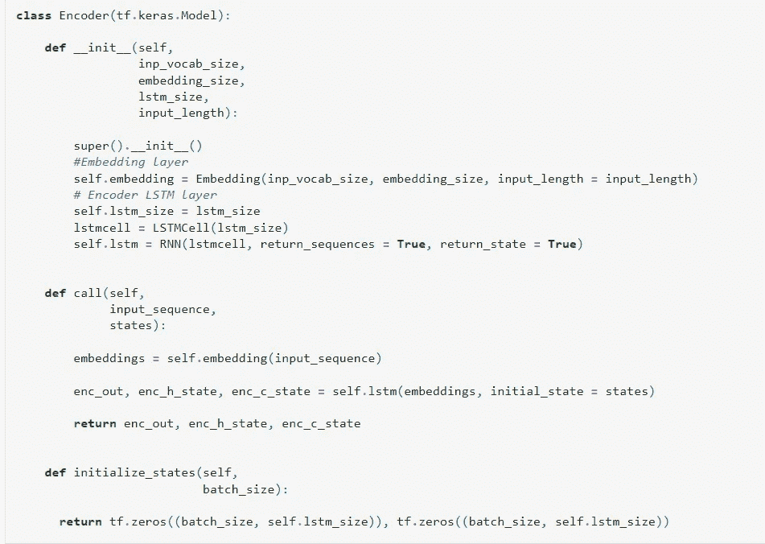

encoder layer

在自定义层中，我们需要单独创建 LSTMCell，并将其传递给 RNN，作为我所知道的 LSTM 层。

initialize_state 包含 state_h 和 state_c 的大小，当我们传递 batch size 时，它们给出编码器初始状态的 state_h 和 state_c。**注意:你可以在任何地方定义这个，不需要在这里定义。**如前所述，encoder 将返回 encoder_output、encoder_h_state 和 encoder_c_state。

这里隐藏状态和单元格状态将是(batch_size，lstm_unit)的形状。

## **步骤 4:创建解码器层**

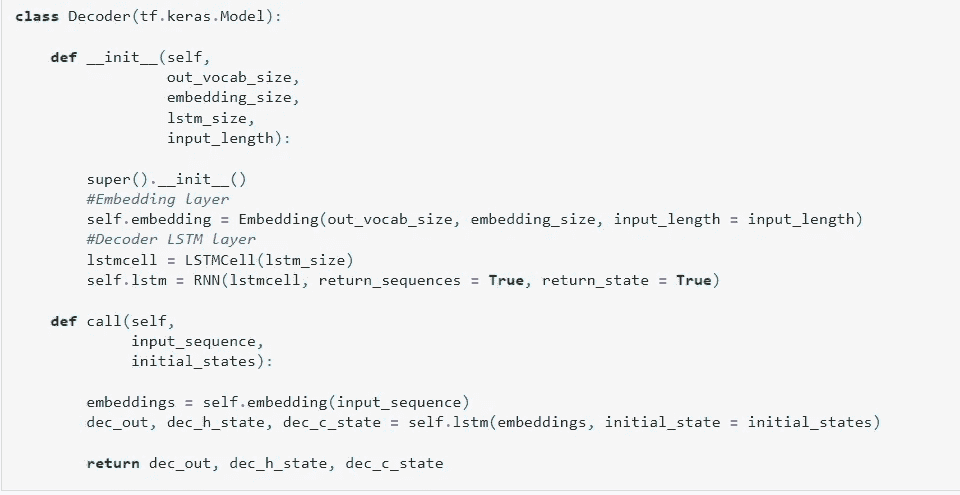

decode layers

解码层的工作类似于编码器，唯一的区别是我们在这里用 encoder_h_state 和 encoder_c_state 初始化初始状态，而我们用零初始化编码器。我们将 decoder_output 传递给密集层，获得预测值并计算损失。

这是我们执行编码器/解码器模型的方式。

为了训练模型，我们简单地

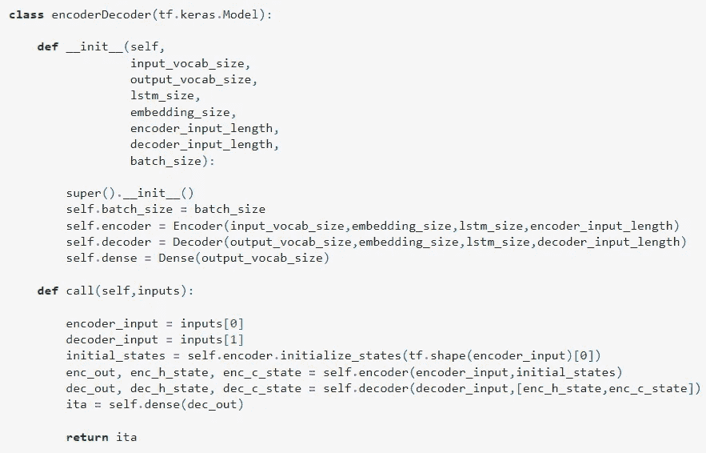

finallayer encoder decoder

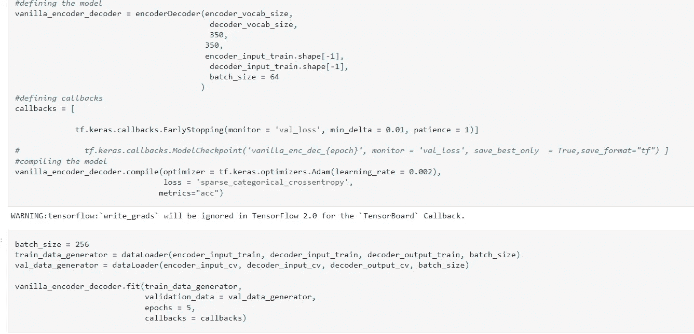

final layer

## 第五步:预测

对于训练后的预测，对编码器重复与训练模型相同的过程，获得 state_h 和 state_c，并将其传递给解码器。唯一不同的是，我们现在只将<start>令牌作为输入传递给解码器，并从密集层获得输出，该输出成为解码器的下一个输入。这个过程一直持续到我们找到<end>令牌，这就是我说的我们以后需要的。</end></start>

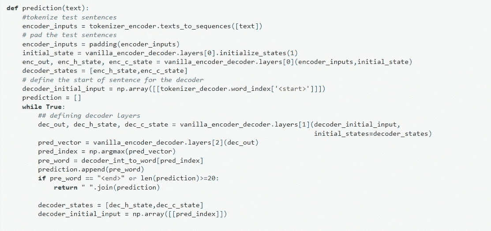

prediction

如果你训练这个模型，你的输出看起来像这样

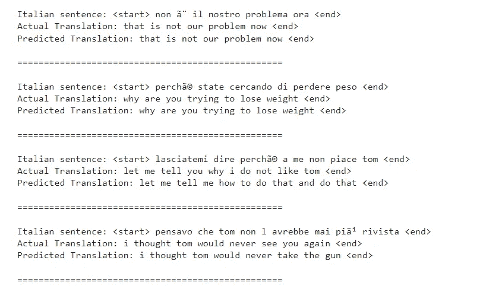

final output

希望你喜欢这篇文章。

如果你学到了一些东西，那会激励我写更多。

继续学习！！！！！

完整代码可在此处找到:

[**GITHUB**](https://github.com/ashishjamarkattel/Language-Translation--Italian-2-English)

 [## Mlearning.ai 提交建议

### 如何成为 Mlearning.ai 上的作家

medium.com](/mlearning-ai/mlearning-ai-submission-suggestions-b51e2b130bfb)