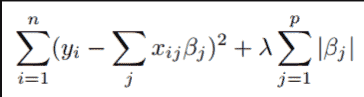
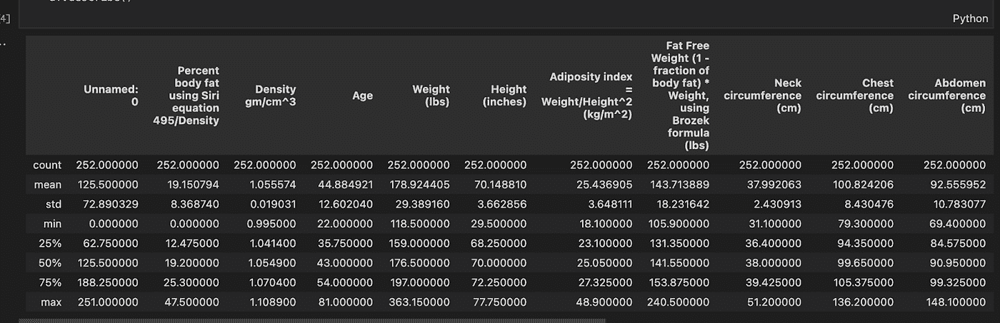
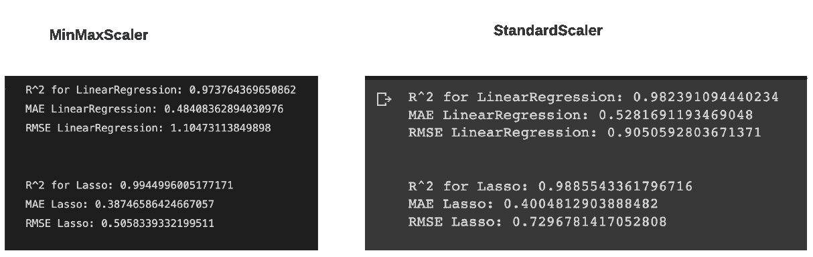
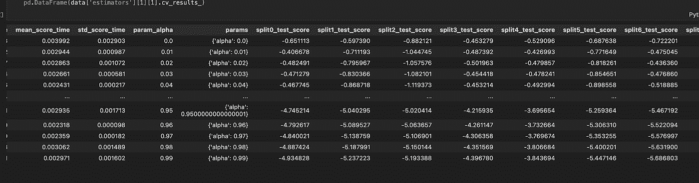
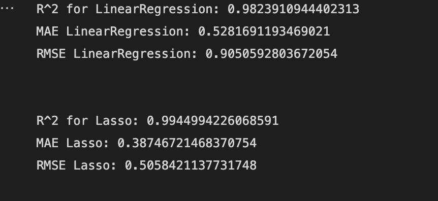
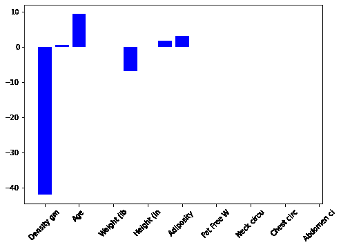
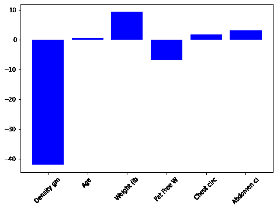
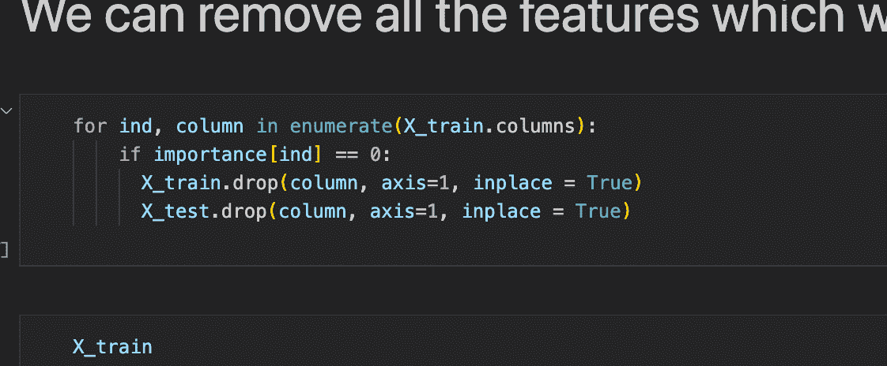

# 使用 sklearn 进行 Lasso 回归和超参数调整

> 原文：<https://medium.com/mlearning-ai/lasso-regression-and-hyperparameter-tuning-using-sklearn-885c78a37a70?source=collection_archive---------1----------------------->

# 介绍

深度学习模型要求高端 GPU 在合理的时间内接受大数据训练，包括财务和计算。这些 GPU 非常昂贵，但没有它们，将深度网络训练到高性能是不可能的。快速 CPU、固态硬盘存储和快速大容量 RAM 都是有效使用此类高端 GPU 所必需的。经典的 ML 算法，如线性或 Lasso 回归，可以用一个像样的 CPU 来训练，而不需要尖端的硬件。因为它们的计算成本更低，所以允许我们更快地迭代，在更短的时间内尝试更多的技术。

为了探索关于回归模型的更多信息，我们使用 Lasso 回归和超参数调整建立了一个体脂预测模型。我们在使用 sklearn 完成数据清理、特征工程、数据可视化和模型评估等任务的同时，也在做所有这些工作。

# 什么是套索回归？

最小绝对收缩和选择操作符缩写为“套索”套索回归是一种正则化。它比回归方法更适合于更精确的预测。该模型利用收缩，收缩是数据值向称为平均值的中心点收缩的过程。L1 正则化用于套索回归。当有许多特征时使用它，因为它自动执行特征选择。Lasso 回归的主要目的是通过对这些系数应用惩罚来找到最小化误差平方和的系数。

## 套索回归模型



Figure 1.1

*   λ表示收缩量。
*   λ = 0 表示考虑了所有特征，这相当于线性回归，其中仅考虑残差平方和来构建预测模型
*   λ = ∞表示不考虑任何特征，即当λ接近无穷大时，它会消除越来越多的特征
*   偏差随着λ的增加而增加
*   方差随着λ的减小而增加

## 描述数据集

**图 1.2** 简要概述了所提供的数据集。存在的特征总数是 18。存在的实例数量为 252，平均体脂百分比为 19.1%。在研究了数据集之后，我们可以看到未命名的:0 列只是用于索引，对于估计身体脂肪来说不是一个好的特性，因此它被放弃了。



Figure 1.2

# 数据预处理

规范化是一个广义的术语，指的是变量的缩放。缩放将一组变量转换成具有相同数量级的另一组变量。因为它通常是线性变换，所以不影响特征的相关性或预测能力。

为什么标准化我们的数据是必要的？这是因为特性的数量级会影响某些模型的性能。例如，如果一个要素的数量级等于 1000，而另一个要素的数量级等于 10，则一些模型可能“认为”一个特征比另一个特征更重要。数量级没有告诉我们任何关于预测能力的信息，因此它是有偏差的。我们可以通过改变变量使它们具有相同的数量级来消除这种偏差。

标准化和规范化是这些转换中的两种，它们将每个变量转换为 0-1 区间(将每个变量转换为 0 均值和单位方差变量)。理论上，标准化优于规范化，因为它不会导致变量的概率分布在异常值出现时缩小。但是对于给我们的数据集，我们使用 MinMaxScaler 得到了比 StandardScaler 更好的 RMSE 分数，这表明了更好的拟合。两个结果的比较如图 1.3 所示。



Figure 1.3

因此，对于数据预处理，我们使用了 MinMaxScaler，它单独缩放和转换每个特征，以便它落在训练集的给定范围内，例如在 0 和 1 之间。该变换由下式给出:

```
X_std = (X — X.min(axis=0)) / (X.max(axis=0) — X.min(axis=0)) X_scaled = X_std * (max — min) + min
```

下面的代码块描述了如何使用 MinMaxScaler 来规范化我们的数据。

```
from sklearn.preprocessing import MinMaxScaler
def scale_numerical(data):
 scaler = MinMaxScaler()
 data[data.columns] = scaler.fit_transform(data[data.columns])
```

# 构建模型

我们同时使用了线性回归和 Lasso 回归模型来有效地衡量这两种模型之间的差异。对于 Lasso 回归，我们使用了 100 个 alpha 参数，并将其输入 GridSearchCV 进行超参数调整。

```
from sklearn.linear_model import Lasso, LinearRegression, LogisticRegression
from sklearn.model_selection import train_test_split
from sklearn.model_selection import GridSearchCV
from sklearn.metrics import mean_absolute_error,r2_score,mean_squared_errordef construct_model():
 # the list of classifiers to use
 regression_models = [
 LinearRegression(),
 Lasso(),
 ]linear_model_parameters = {}lasso_parameters = {
 ‘alpha’: np.arange(0.00, 1.0, 0.01)
 }parameters = [
 linear_model_parameters,
 lasso_parameters
 ]data[‘estimators’] = []# iterate through each classifier and use GridSearchCV
 for I, regressor in enumerate(regression_models):
   clf = GridSearchCV(regressor, # model
     param_grid = parameters[i], # hyperparameters
     scoring=’neg_mean_absolute_error’, # metric for scoring
     cv=10,
     n_jobs=-1, error_score=’raise’, verbose=3)
   clf.fit(X_train, y_train)
   # add the clf to the estimators list
   data[‘estimators’].append((regressor.__class__.__name__, clf))
```

## 交叉验证和 GridSearchCV

交叉验证是一种用于估计机器学习模型性能(或准确性)的统计方法。它用于防止预测模型中的过度拟合，尤其是在可用数据量有限的情况下。交叉验证包括将数据分成固定数量的折叠(或分区)，对每个折叠进行分析，然后平均总误差估计值。

GridSearchCV 使用交叉验证方法为字典中传递的每个值组合评估模型。使用该函数的结果是，我们可以计算每个超参数组合的精度/损失，并选择具有最佳性能的组合。对于我们的模型，alpha 参数的最佳值被选择为 0.01，这使我们的平均测试分数为-0.560748，随后的排名为 1。超参数的参数得分在**图 1.4** 中描述。



Figure 1.4

# 模型评估

**图 1.5** 显示了我们的模型的表现以及它对实际体脂百分比和预测体脂百分比之间关系的逼近程度。我们用 R2、梅和 RMSE 进行评估。



Figure 1.5

## 平均绝对误差

这只是目标值和预测值之间的绝对差值的平均值。当异常值突出时，不建议使用。从我们的指标中可以看出，Lasso 回归器的 MAE 误差为 0.38。

## r 平方或决定系数

此指标表示可由模型的自变量解释的因变量方差的比例。它评估我们的模型与因变量关系的强度。我们的 Lasso 回归方程给出了 0.99 的分数，这意味着模型代表了因变量的方差。

## 均方根误差(RMSE)

残差平方的平均值的根就是 RMSE。我们知道残差表明这些点离回归线有多远。因此，RMSE 量化了这些残差的分散性。我们的 Lasso 回归方程给出了 0.50 的分数，表明该模型可以相对准确地预测数据。

# 特征重要性

下面的代码块显示了我们如何计算和绘制 Lasso 回归模型所使用的最重要的特征。

```
import matplotlib.pyplot as plt
from textwrap import wrapdef rf_feat_importance(model, df):
 importance = model.coef_
 keys = list(df.keys())
 # summarize feature importance
 for i,v in enumerate(importance):
 print(‘Feature: %s, Score: %.5f’ % (keys[i],v))
 labels =[x[:10] for x in keys]
 fig = plt.figure()
 ax = fig.add_axes([0,0,1,1])
 ax.bar([x for x in range(len(importance))], height=importance, color=’b’)
 ax.set_xticklabels([labels[i — 1] for i in range(len(importance) +1)], rotation=45)plt.show()
 return importance
```

图 1.6 显示了我们的模型在去除低重要性特征之前和之后的曲线图。



Figure 1.6

通过排除低价值的因素，我们似乎可以只使用一部分列，仍然可以获得好的结果。所以我们已经移除了所有重要性为 0 的特征(**图 1.7** )。



Figure 1.7

这给我们留下了 5 列:

*   密度克/厘米
*   年龄
*   重量(磅)
*   无脂肪重量(1-身体脂肪的分数)*重量，使用布罗泽克公式(磅)
*   胸围(厘米)
*   腹围(厘米)

我们可以很有可能得出结论，上述测量值是计算体脂百分比的最基本的方法。

# 结论

Lasso 回归在我们回归模型的开发中被广泛使用。通过使用 GridSearchCV 进行超参数调优，我们获得了 0.99 的 R 平方分数。在我们的模型中，用 MinMaxScaler 标准化对减少偏倚和增加方差有显著影响。我们还使用模型系数来确定计算体脂百分比所需的最重要的特征。

# 参考

*   代码库:[nandangrover/lasso-regression](https://github.com/nandangrover/lasso-regression)
*   【https://www.statisticshowto.com/lasso-regression/ 

[](/mlearning-ai/mlearning-ai-submission-suggestions-b51e2b130bfb) [## Mlearning.ai 提交建议

### 如何成为 Mlearning.ai 上的作家

medium.com](/mlearning-ai/mlearning-ai-submission-suggestions-b51e2b130bfb)