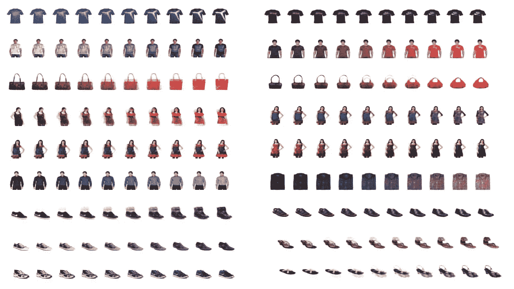

# 潜在空间(第二部分):变分自动编码器的简单指南

> 原文：<https://medium.com/mlearning-ai/latent-spaces-part-2-a-simple-guide-to-variational-autoencoders-9369b9abd6f?source=collection_archive---------1----------------------->

在之前的教程([https://medium . com/mlearning-ai/latent-space-representation-a-hands-on-auto encoders-in-tensorflow-57735 a1 c0f 3 f](/mlearning-ai/latent-space-representation-a-hands-on-tutorial-on-autoencoders-in-tensorflow-57735a1c0f3f))中，我们了解了潜在空间、自动编码器及其在 tensor flow 中的实现。在本教程中，我们将扩展自动编码器的概念，看看自动编码器的一种特殊情况，称为变分自动编码器。

Figure 1: An example output of a Variational autoencoder on Fashion Product Dataset