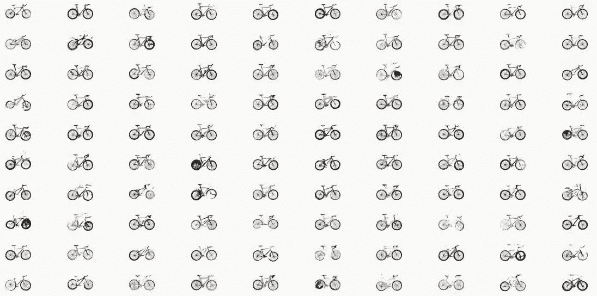

# 潜在空间(第三部分):深度卷积生成对抗网络的实用介绍

> 原文：<https://medium.com/mlearning-ai/latent-spaces-part-3-a-practical-introduction-to-deep-convolutional-generative-adversarial-8c6169bbf9b0?source=collection_archive---------3----------------------->

在之前的教程([https://medium . com/mlearning-ai/latent-spaces-part-2-a-simple-guide-to-variable-auto encoders-9369 B9 abd6f](/mlearning-ai/latent-spaces-part-2-a-simple-guide-to-variational-autoencoders-9369b9abd6f))中，我们了解了变分自动编码器及其在 TensorFlow 中的实现。在本教程中，我们将探索另一种深度学习架构，称为生成性对抗网络(GAN)。

Figure 1: An example output of a DCGAN trained on Bicycles Dataset