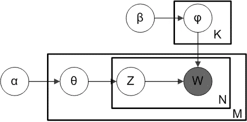
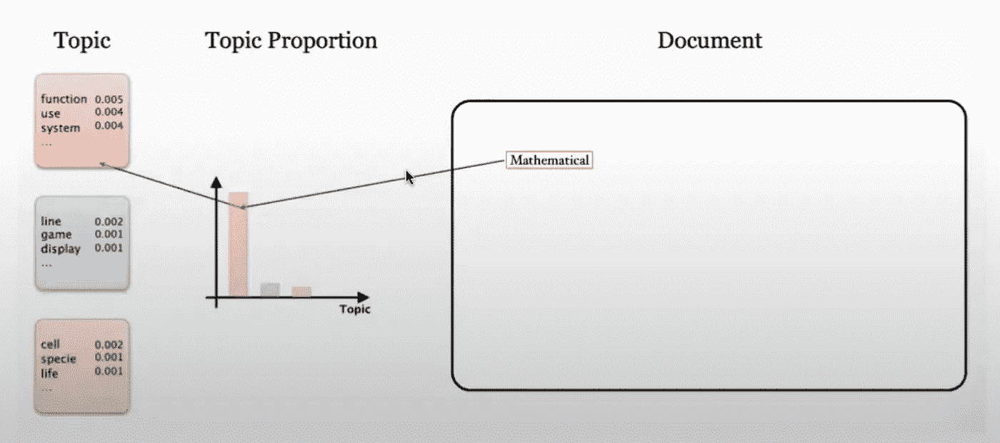

# 非统计人员潜在狄利克雷协会。

> 原文：<https://medium.com/mlearning-ai/lda-latent-dirichlet-association-for-non-statisticians-b72cb1bed181?source=collection_archive---------6----------------------->

一开始就很难理解。我找到了一个很好的研究来源，在这里我重新翻译成一个更简单的故事版本。

只有当你从 LDA 文章的数学中迷失之后，你才能更好地理解我的文章。我将有目的地不使用任何单一的公式。

现在，暂时忘记下面的图形描述。只有在你了解了 LDA 的全部情况后，才能阅读图表。

所以，让我们来看看这个故事。

1.  LDA 是模型方法。与深度学习不同，这里我们有模型。**一个统计模型。**
2.  这个模型是一种在假想世界中生成(或创建)文档的引擎。(这不是真实的文件，但我们的真实文件类似于这些假设的文件)
3.  就像其他统计模型一样。我们在这里也假设一个分布。这不是正态分布。 ***确切地说，这里我们需要知道狄利克雷分布*** (我们不需要知道数学背景)。
4.  狄利克雷分布本身是另一个分布的样本。所以无论何时你从狄利克雷分布中抽取样本，你都会得到一个分布。这个分布是多项式分布。多项式分布只是二项式分布的一个多版本。(即骰子采样)
5.  现在，让我们回到我们的模型。我们的模型(或引擎)生成包含许多单词的文档。每个文档都与某个主题(或多个主题)相关联。通过多项式分布，我们只知道文档与哪些主题相关联。
6.  这个多项式分布是狄利克雷分布的一个例子。

> 我想现在我们需要休息一下。让我们来看看。每个文档都与具有概率分布(概率质量函数)的特定主题相关联。因为我们观察的是文档中的一个单词词汇表，所以我们只能为每个单词关联主题。因此，我们对文档中的每个单词都进行这一过程。这就是为什么我们需要一个使用狄利克雷分布的抽样过程。我们从狄利克雷分布中抽取多项式分布样本以获得另一个样本(单词),直到我们到达文档的末尾。

Screenshot from the link above

7.我们从给定主题为单词的每个位置创建或生成单词的方式是完全相同的。我们需要这个词的另一个多项式分布样本。我们再次从狄利克雷分布得到这个分布。暂时忘记 alpha 和 gamma 参数。请记住，我们需要主题和单词的两个样本分布，因为 LDA 是一个两步过程。

8.最后，从生成单词的过程中使用两个步骤来创建假设文档。只有当我们有一个好的模型时，这个文档才有意义(**虽然这个假设的文档不是制造人类可读的句子，但是文档里面的单词让人们猜测主题是什么**

9.现在！我们将推断狄利克雷分布的每个参数(α，γ),使得这个狄利克雷分布为主题和单词采样出一个体面的多项式分布，其类似于我们的真实单词文档(语料库)

这个推论涉及到 MCMC 或 VEM 过程(参考视频链接)

10.最后，我们现在可以使用我们的模型计算给定文档中带有该单词(真实单词句子)的主题的概率。(我们的模型由两个狄利克雷分布组成。)

—如果你不熟悉贝叶斯推断，这部分就有点棘手了。记住，我们需要计算给定文档中所有单词的主题比例的概率。

Tada！

你可以回到图(随处可见的图形模型)，现在试着读一下。