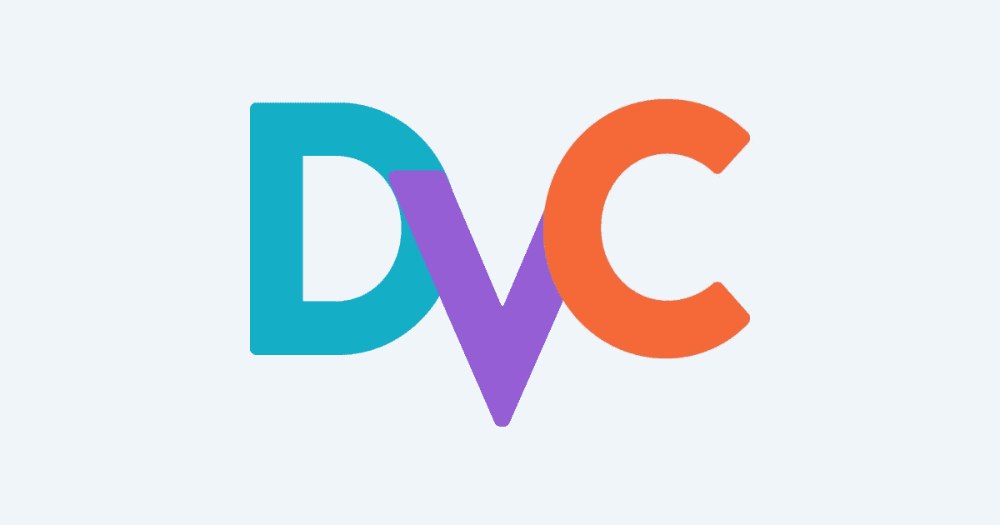

# 数据版本控制:一个独立的深入教程

> 原文：<https://medium.com/mlearning-ai/learn-how-to-integrate-data-version-control-into-your-ml-workflow-in-7-steps-b5c65d68abe0?source=collection_archive---------6----------------------->

# 什么是数据版本控制(DVC)，为什么要使用它？

Git 非常擅长对代码进行版本控制，但是它不能很好地对图像和模型工件进行版本控制。大多数情况下，代码在 Git 中被跟踪，并且需要维护一个电子表格来跟踪用于训练模型的数据，其中…