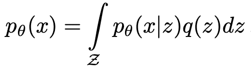
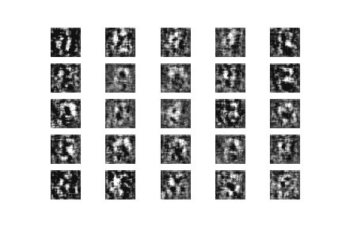
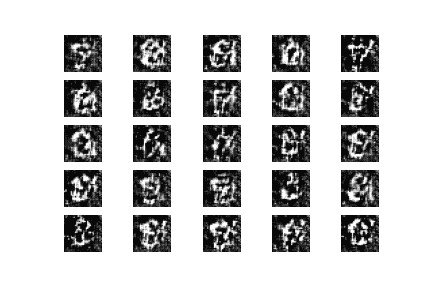
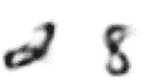
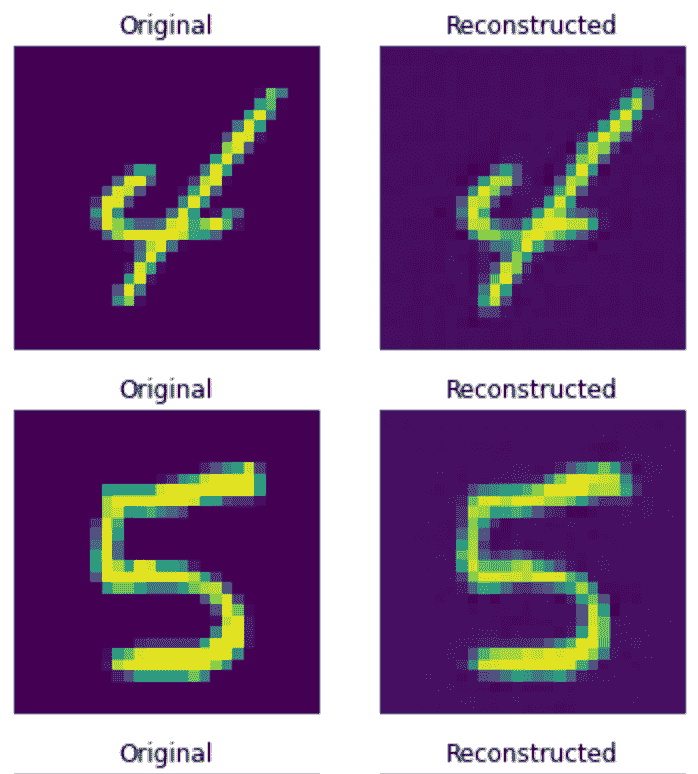
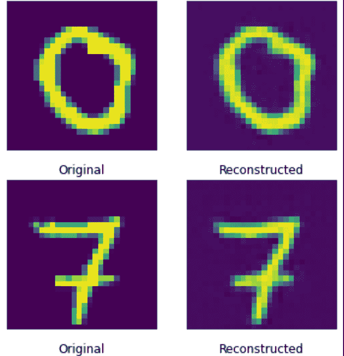
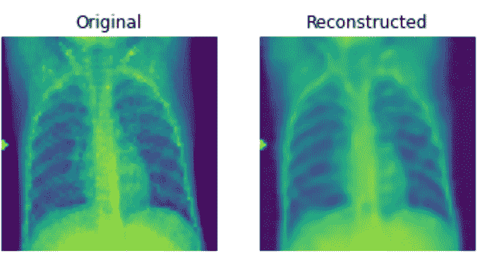
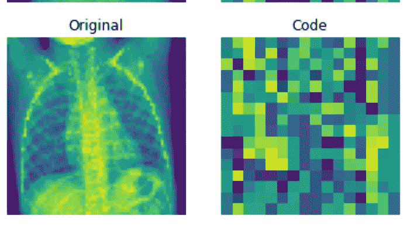
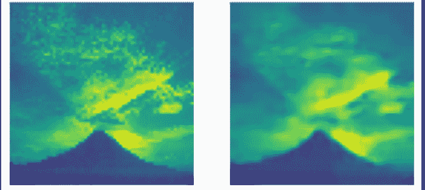
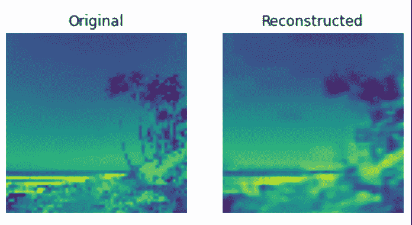

# 使用 VQ-Vae 的学习数据扩充

> 原文：<https://medium.com/mlearning-ai/learned-data-augmentation-using-vq-vae-339a8e12b779?source=collection_archive---------4----------------------->

**摘要:**

**在这篇论文中，我提出了一种简单且易于再现的方法来增强和扩展数据集，从少至 1000 幅图像到多达 10000 幅图像，或者本质上是用户需要的那么多。我的方法结合了适当的 VAE 潜在空间模型，然后使用称为矢量量化的过程进行修改。利用这些技术以及增强的模型参数化和训练，简单的卷积神经网络可以在合成数据上实现高达 93%的准确度，这被证明是非常有用的，尤其是在处理具有很少图像的数据集时。**

**简介:**

机器学习是计算机科学中规模最大、发展最快的领域之一，也是数据最密集的领域之一，行业可接受的模型需要近百万张图像。像 GPT-3 和 BERT 这样的模型是当前自然语言处理的旗舰，它们在数千亿个单词上进行训练，BERT-Base 在 4 个 TPU 上训练需要 4 天以上[1]，请记住，TPU 是专门为训练机器学习模型而构建的，相比之下，在 8 个 GPU 上训练 BERT-Base 需要 7 天以上[2]。主要的要点是，机器学习模型需要极其大量的数据和长时间的训练。如果不改进硬件或云计算或额外的计算库(如 JAX)，机器学习的时间因素就不容易克服，这些计算库可以显著加快矩阵计算的速度，而数据因素可以使用线性变换(如裁剪、调整大小或随机噪声生成)来解决。虽然这些方法本身是有效的，但它们不能解决缺乏数据的固有问题。线性变换是相同的图像，只是在一定程度上进行了修改，对数据的缺乏没有提供真正的优势；它们只是为过度拟合问题提供了一个解决方案。为了解决数据问题，研究人员多年来一直在尝试学习数据增强的方法[3][4]，然而，这些方法中的大多数利用了需要大量计算资源的生成对立神经网络，或者利用了在从潜在空间做出有意义的表示方面不如 vq-vaes 有效的变分自动编码器。视觉上的差异将在文章的最后讨论。

**变型自动编码器:**

2013 年，Diederik P. Kingma 和 Max Welling 首次提出了可变自动编码器。变分自动编码器试图从 Z 或潜在空间中再现原始 X 数据，该潜在空间存在于比原始数据更低维度的空间中。它被编码器压缩。等式可以写成:

其中表示样本分布，通常表示为高斯噪声或伯努利分布。解码器是另一个神经网络。它的输入是表示 z，它输出参数到数据的概率分布，并且有权重和偏差 *ϕ* 。以 mnist 数据集为例，假设手写数字图像是黑白的，将每个像素表示为 0 或 1。然后可以使用伯努利分布来表示单个像素的概率分布。解码器获得数字 *z* 的潜在表示作为输入，并输出 784(在 28×28 图像的情况下)伯努利参数，图像中 784 个像素中的每一个都有一个伯努利参数。然后，解码器获取潜在空间，并试图将潜在空间返回到传递到编码器中的原始数据，但是因为所有数据不能包含在缩减/压缩的数据中，所以解码器经常在重建图像中产生某些变化，这在这种情况下是非常有利的，因为需要增加数据。

**矢量量化变分自动编码器:**

矢量量化变分自动编码器(简称 VQ-VAE 编码器)于 2013 年在一篇题为“神经离散表示学习”的论文[6]中首次提出。VQ-Vae 提供了优于诸如基本变分自动编码器或甚至 GANs 的方法的多个优点，在某种意义上，VQ-Vae 的使用将防止“后验崩溃”,这是由于 Vae 中极其强大的解码器导致某些延迟被忽略而发生的现象。这造成了一个主要问题，尤其是在处理数据生成时，因为被忽略的潜在空间会导致数据丢失，从而从潜在空间形成不正确的图像。为了解释这个问题的重要性，让我们举个例子。在医学成像(CT 扫描、肺炎识别等)的情况下。)如果解码器遭受后验崩溃，作为产生有意义的数据表示的手段就变得无用。这可能会带来一个重大问题，特别是对于医疗数据，当模型的准确性可以挽救患者的生命时，这意味着模型再现的数据必须足够准确，以允许识别器模型(如卷积神经网络)能够复制这种准确性。然而，VQ-维斯利用了离散的潜在空间，这导致了运行反向传播的问题，其中模型不能通过潜在空间运行反向传播。这个问题通过使用称为直接到梯度的方法来解决，该方法将梯度从解码器复制到编码器，从而绕过 VQ-Vae 产生的“码本”向量。如前所述，这是反向传播产生误差的原因，因为潜在空间是不可微的，并且梯度不能被推过瓶颈，而瓶颈是用前面提到的通过复制梯度的过程解决的。

**实验运行:**

为了探索和相对于其他型号(如 GAN 和)的优势，我训练了最流行的发电机型号的每个变体，作为与和比较的基线。让我们深入研究结果

深度卷积生成对抗神经网络(DCGAN)产生的结果。利用卷积神经网络通过鉴别器进行更好的图像分类。

25 个时期后的结果(每个模型的时期基线数)

结果经过 550 个时代的训练。

这些结果真实地说明了实现能够产生有意义的数据表示的生成性对抗网络的成本有多高。大约需要 5000 个历元才能产生与原始数据非常相似的图像，这还没有考虑到我们可以访问的数据量。

变分自动编码器在 25 个时期的训练后产生的结果。还不错，但还不足以解决数据不足的问题。

现在对于矢量量化变分自动编码器:

30 次训练后的结果。绝对惊艳。它能够产生几乎直接复制模型的表示，除了在重建图像中有一点噪声。让我们看另一个例子。

虽然这确实令人惊讶，但我们确实需要进一步测试这种方法。从数值中创建一个有意义的表示，其复杂性很小或没有，无法与图像(如大脑或人类肺部的 CT 扫描)的复杂性相比。因此，让我们用 kaggle[7]的肺炎数据集进一步测试该方法。

相当不错，尤其是只有 500 个纪元。同样重要的是要考虑这样一个事实，即原始表示也非常嘈杂，这意味着重建图像可能不太准确，但该表示确实包含与原始图像一样的重要特征。如果我们运行模型 5000 个或 10000 个历元会好得多，但考虑到广泛的用例，让模型训练 430000 次更新可能会更好，因为 Dall-E 被训练为包括当然更高计算效率的设备，如 GPU 和 TPU。解构的图像和潜在的空间显示了编码器网络在仅仅 500 个时代后是多么强大。

作为一个实验，我想利用一个具有各种场景和照明效果的数据集[8]，看看该模型是否可以重建一个具有主要差异的图像，这些差异是由于数据集中原始图像之间的各种图像造成的。

300 个时代后的最佳代表。几乎没有区别的是云的位置和山的形状。连灯光好像都配！然而，山的高度略有不同。

最糟糕的表现。图像具有相同的总体形状，但噪声极大。

**模型推进方式:**

一如既往，总是有多种方法来改进模型。在这种情况下，可以使用 PixelCNN 作为编码器。PixelCNN 是一个非常强大的卷积神经网络，可以使用 CNN 的特征提取功能来对数据进行有意义的表示，从而使解码器更容易重新映射原始图像。也有可能使用某种形式的歧管取样，在低样本设置规模，如这里提出的[9]。

**结论:**

总之，我提出了一种将具有相对少的图像 4000 或更多的数据集扩展到极大数量的数据的方法，该数据在理论上可以无限扩展，但是引入了图像稀释的问题，导致特征的过度损失，但是至少是数据量的两倍。我还提出了一些方法，读者可以利用这些方法有效地改进 VQ-VAE 法案的给定基线。检查代码来运行你自己的实验[10]。

**资源:**

[1] [在大学培训 BERT——迈向数据科学 https://Towards Data science . com Training-BERT-at-a-univ…](https://towardsdatascience.com/training-bert-at-a-university-eedcf940c754)

[2] [在大学培训 BERT——走向数据科学 https://Towards Data science . com Training——BERT-at-a-univ…](https://towardsdatascience.com/training-bert-at-a-university-eedcf940c754)

[https://arxiv.org/pdf/2105.00026.pdf](https://arxiv.org/pdf/2105.00026.pdf)

[https://arxiv.org/pdf/2012.00848.pdf](https://arxiv.org/pdf/2012.00848.pdf)

[https://arxiv.org/pdf/1312.6114.pdf](https://arxiv.org/pdf/1312.6114.pdf)

[https://arxiv.org/pdf/1711.00937.pdf](https://arxiv.org/pdf/1711.00937.pdf)

【7】[https://www . ka ggle . com/datasets/paultimothymooney/chest-x-ray-pneumonia](https://www.kaggle.com/datasets/paultimothymooney/chest-xray-pneumonia)

[https://www.kaggle.com/datasets/arnaud58/landscape-pictures](https://www.kaggle.com/datasets/arnaud58/landscape-pictures)

[https://arxiv.org/pdf/2103.13751.pdf](https://arxiv.org/pdf/2103.13751.pdf)

[https://github.com/arnavdantuluri/Vq-Vae-Image-Generation](https://github.com/arnavdantuluri/Vq-Vae-Image-Generation)

 [## Mlearning.ai 提交建议

### 如何成为 Mlearning.ai 上的作家

medium.com](/mlearning-ai/mlearning-ai-submission-suggestions-b51e2b130bfb)