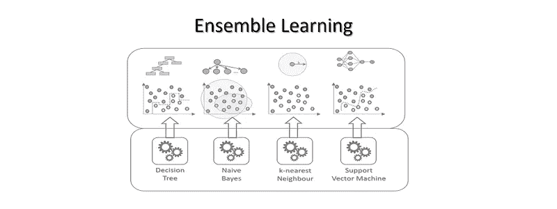
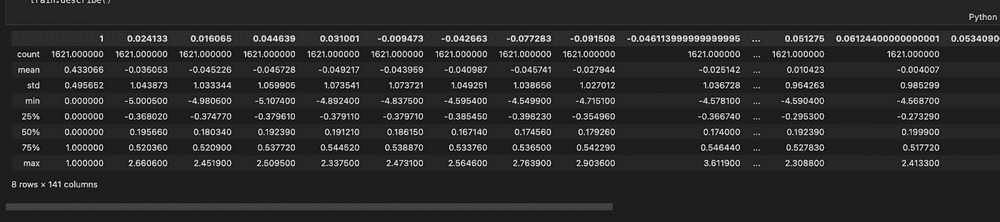
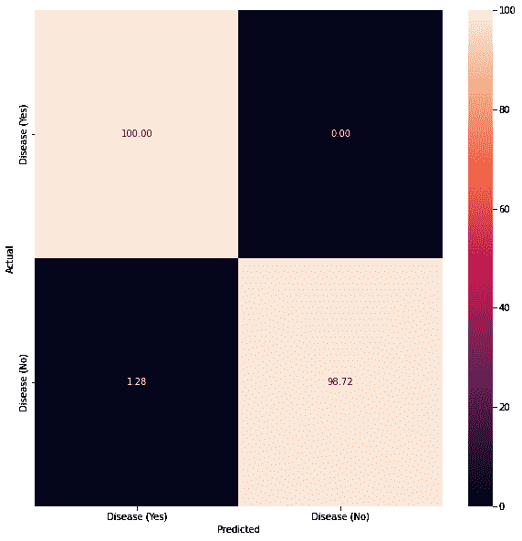
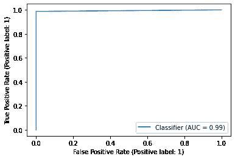
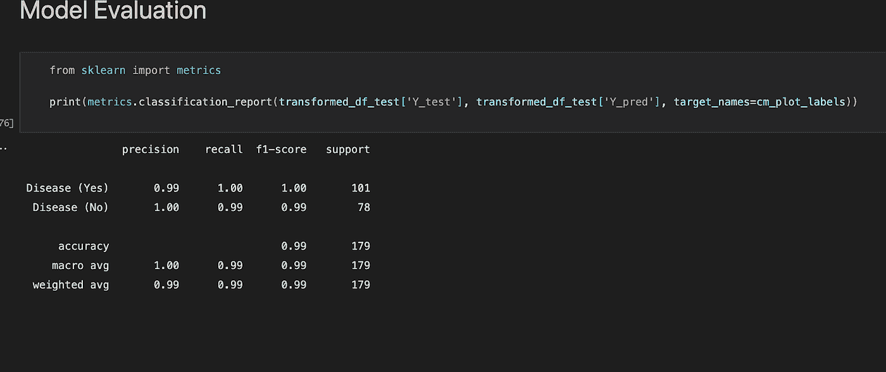
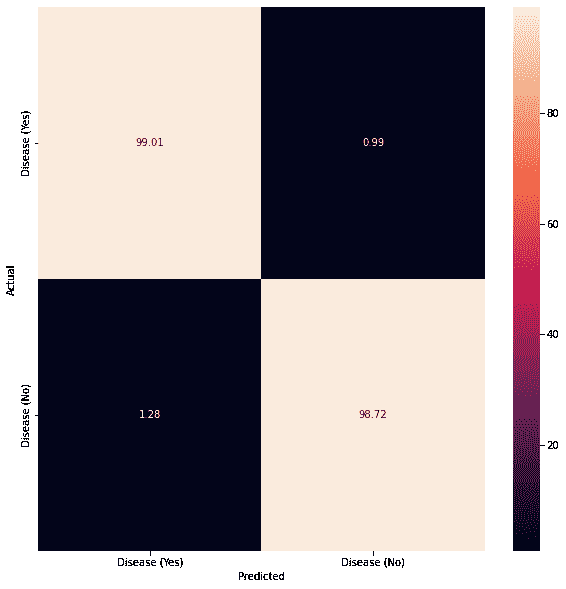

# 基于学习的分类模型

> 原文：<https://medium.com/mlearning-ai/learning-based-models-for-classification-c21513e14621?source=collection_archive---------7----------------------->

# 介绍

在机器学习领域已经开发了成千上万种学习算法。科学家通常会从这些算法中进行选择，以解决特定的问题。他们的选择常常受限于他们对这些算法的熟悉程度。在这个经典/传统的机器学习框架中，科学家被迫做出一些假设，以便使用现有的算法。虽然这在某些情况下可能是限制性的，但它可以提供速度、低成本计算和易用性的好处，作为过拟合和降低精度的折衷。

在本文中，我们建立了多个基于学习的模型，用于对序列数据(ECG)进行分类，以检测心脏病的概率。集成学习、支持向量机、伯努利朴素贝叶斯、K 近邻和随机森林分类器在我们的分类任务中得到了深入研究。您可以在这个[存储库](https://github.com/nandangrover/learning-models)中签出代码和数据集。



# 朴素贝叶斯

朴素贝叶斯分类器使用贝叶斯定理和所有预测因子相互独立的假设将数据分类。假设一个类中一个特征的存在与其他特征的存在无关。

例如，如果一个水果是绿色的，圆形的，直径为 10 英寸，它就是西瓜。这些特征可能是相互排斥的，但是每一个都独立地导致了所考虑的水果是西瓜的可能性。这就是为什么这个分类器的名称中会出现“Naive”这个词。

以下是贝叶斯定理，它是该算法的基础:

```
P(c|x) = P(x|c) * P(c)/P(x)
```

在这个等式中，“c”代表类，“x”代表属性。P(c/x)代表预测值的类别后验概率。P(x)是预测值的先验概率，P(c)是类的先验概率。P(x/c)表示基于类的预测值的概率。

## 它如何用于我们的数据集？

我们将使用朴素贝叶斯的一个特殊版本，称为伯努利朴素贝叶斯。这种情况下的预测器是布尔变量。所以我们的选项是‘真’和‘假’(对心脏病是真，对心脏病不是真)。

它是最常见的朴素贝叶斯模型类型之一:其操作与多项式分类器的操作相同。另一方面，预测变量是独立的布尔变量。例如，它可以确定文档中是否存在特定的单词。BernoulliNB 是为二进制/布尔特性设计的。由于我们的特征集是一组离散的二进制值，伯努利朴素贝叶斯特别适合从我们的数据集中预测心脏病。

# k-最近邻

k-最近邻(KNN)算法是一种数据分类方法，它根据最接近数据点的数据点来估计数据点属于两个组之一的可能性。

监督机器学习算法 k-最近邻用于解决分类和回归问题。但是，它主要用于解决分类问题。

考虑以下两组:A 组和 b 组。

该算法检查附近数据点的状态，以确定一个数据点属于 A 组还是 b 组。如果大多数数据点属于 A 组，则所讨论的数据点几乎肯定属于 A 组，反之亦然。

简而言之，KNN 需要通过检查最近的带注释的数据点(也称为最近邻)来对数据点进行分类。

## 它如何用于我们的数据集？

当 KNN 用于分类时，输出是 K 个最相似实例中频率最高的类。本质上，每个实例为它们的类投票，投票最多的类被选为预测。

类别概率可以被计算为属于每个类别的新数据实例的 K 个最相似实例的集合中的样本的归一化频率。例如，在二进制分类问题中(类为 0 或 1)，

```
p(class=0) = count(class=0) / count(class=0) + count(class=1)
```

我们使用了 K (np.arange(1，25，2))的一系列值，并让 GridSearchCV 为 n _ neighbours 找到最佳参数。这有助于我们以高精度执行分类。

# 支持向量机

弗拉迪米尔·N·瓦普尼克和阿列克谢·亚创造了第一个 SVM 算法。1963 年的切尔沃嫩基斯。当时该算法还处于早期阶段。唯一的选择是为线性分类器绘制超平面。Bernhard E. Boser、Isabelle M Guyon 和 Vladimir N Vapnik 在 1992 年提出了一种通过将核技巧应用于最大间隔超平面来创建非线性分类器的方法。Corinna Cortes 和 Vapnik 于 1993 年提出了当前标准，并于 1995 年发布。

支持向量机可用于执行线性分类。除了使用核技巧的线性分类之外，SVM 还可以有效地执行非线性分类。它允许我们将输入隐式映射到高维特征空间。

## 它如何用于我们的数据集？

支持向量机的主要目标是在给定的数据集中找到一个支持向量之间具有最大可能间隔的超平面。在接下来的两步中，SVM 寻找具有最高边缘的超平面

*   创建尽可能好的分类超平面。有许多超平面可以用来对数据进行分类。我们应该寻找这两个类之间有最大间隔的超平面。
*   所以我们选择超平面，使得它和每一边的支持向量之间的距离尽可能短。如果这样的超平面存在，则称为最大间隔超平面，并且它定义的线性分类器称为最大间隔分类器。

支持向量机(SVM)是用于分类和回归的机器学习算法。支持向量机是用于分类、回归和异常值检测的最强大的机器学习算法之一。SVM 分类器创建一个模型，将新的数据点分配到给定的类别之一。因此，它是非概率二元线性分类器。因为我们的特征集是一组离散的二进制值，所以支持向量机是从我们的数据集中预测心脏病的理想选择。

# 集成学习模型

对于给定的数据集，单一算法可能无法做出最佳预测。机器学习算法有局限性，创建高精度的模型很难。我们可以通过构建和组合多个模型来提高整体准确性。然后通过聚集每个模型的输出来实现模型的组合，并牢记两个目标:

*   模型误差减少
*   保持模型的概括性

## 随机森林

随机森林是一种用于解决回归和分类问题的机器学习技术。它利用集成学习，一种结合许多分类器来解决复杂问题的技术。

随机森林算法由许多决策树组成。使用 bagging 或 bootstrap 聚合来训练随机森林算法的“森林”。Bagging 是一种元算法，通过集成方法提高机器学习算法的准确性。

结果由基于决策树预测的(随机森林)算法决定。它通过平均或平均各种树的输出来预测。结果的精确度随着树的数量的增加而提高。

## 投票分类器

VotingClassifier 在概念上组合不同的机器学习分类器，并使用多数投票或平均预测概率(软投票)来预测类别标签。这种类型的分类器可用于平衡一组表现相似的模型的各自弱点。

## 它如何用于我们的数据集？

我们决定使用加权平均概率(软投票)作为我们的投票分类器。软投票将类标签作为预测概率之和的 argmax 返回。权重参数可用于为每个分类器分配特定的权重。当提供权重时，每个分类器的预测类概率被累加，乘以分类器权重，然后进行平均。然后，具有最高平均概率的类别标签被用于生成最终的类别标签。

# 描述数据集

我们的数据集已经标准化，如**图 1.1** 所示。它总共有 140 列和 1621 行。我们仍然需要规范化我们的数据库，因为伯努利朴素贝叶斯不能接受负值。当我们遇到伯努利朴素贝叶斯分类器时，我们通过创建一个管道并在管道中添加 MinMaxScaler 来实现这一点。

```
classifier = Pipeline([(‘Normalizing’,MinMaxScaler()), (‘BernoulliNB’,BernoulliNB())])
```

缩放将一组变量转换成具有相同数量级的另一组变量。因为它通常是线性变换，所以不影响特征的相关性或预测能力。

为什么有必要对我们的数据进行标准化或规范化？这是因为特性的数量级会影响某些模型的性能。例如，如果一个要素的数量级等于 1000，而另一个要素的数量级等于 10，则一些模型可能“认为”一个特征比另一个特征更重要。数量级没有告诉我们任何关于预测能力的信息，因此它是有偏差的。我们可以通过改变变量使它们具有相同的数量级来消除这种偏差。

标准化和规范化是这些转换中的两种，它们将每个变量转换为 0-1 区间(将每个变量转换为 0 均值和单位方差变量)。理论上，标准化优于规范化，因为它不会导致变量的概率分布在异常值出现时缩小



Figure 1

# 构建模型

我们先后使用了支持向量机、伯努利朴素贝叶斯、K 近邻和随机森林分类器来有效地衡量所有模型之间的差异。对于 KNN，我们使用了 n _ neighbours 的不同参数(步骤 2 大小为 1 到 25)来为我们的分类器找到最佳参数。GridSearchCV 使用交叉验证方法为字典中传递的每个值组合评估模型。使用该函数的结果是，我们可以计算每个超参数组合的精确度/损失，并选择具有最佳性能的一个。

```
from sklearn.model_selection import GridSearchCV
from sklearn.neighbors import KNeighborsClassifier
from sklearn.ensemble import RandomForestClassifier
from sklearn.naive_bayes import BernoulliNB
from sklearn.ensemble import RandomForestClassifier
from sklearn import svm
from sklearn.svm import SVC
import warnings
warnings.filterwarnings(‘ignore’)
from sklearn.preprocessing import MinMaxScaler
from sklearn.pipeline import Pipeline

processed_data = {}
def construct_model(dataframe):
 # the list of classifiers to use
 # use random_state for reproducibility
 classifiers = [
 SVC(probability=True, random_state=42),
 BernoulliNB(),
 KNeighborsClassifier(),
 RandomForestClassifier(random_state=42),
 ]

 svm_parameters = {
 ‘gamma’: [‘auto’]
 }

gaussian_parameters = {
 }

knn_parameters = {
 ‘n_neighbors’: np.arange(1, 25, 2)
 }

rf_parameters = {

 }
 # stores all the paramete rs in a list
 parameters = [
 svm_parameters,
 gaussian_parameters,
 knn_parameters,
 rf_parameters
 ]
 processed_data[‘estimators’] = []
 # iterate through each classifier and use GridSearchCV
 for i, classifier in enumerate(classifiers):
 if i == 1:
 classifier = Pipeline([(‘Normalizing’,MinMaxScaler()), (‘BernoulliNB’,BernoulliNB())])
 else:
 clf = GridSearchCV(classifier, # model
 param_grid = parameters[i], # hyperparameters
 scoring=’accuracy’, # metric for scoring
 cv=10,
 n_jobs=-1, error_score=’raise’)
 clf.fit(dataframe[“X_train”], dataframe[“Y_train”])
 # add the clf to the estimators list
 processed_data[‘estimators’].append((classifier.__class__.__name__, clf))
```

我们还建立了一个集成模型，特别是加权平均概率(软投票)分类器。软投票将类标签作为预测概率之和的 argmax 返回。权重参数可用于为每个分类器分配特定的权重。当提供权重时，每个分类器的预测类概率被累积并由分类器相乘。

```
from sklearn.ensemble import VotingClassifier

ensemble = VotingClassifier(processed_data[‘estimators’],
 voting=’soft’,
 weights=[1,1,2,1], n_jobs=-1) # n-estimators

ensemble.fit(transformed_df_train[“X_train”], transformed_df_train[“Y_train”])
```

# 模型评估

**图 1.2** 显示了我们的最后一个模型，即集合投票分类器的表现，以及它通过使用混淆矩阵来逼近患病与未患病之间关系的程度。



Figure 2

**图 1.3** 显示了 ROC 曲线，**图 1.4** 报告了模型在一系列指标上的表现，如精确度、召回率、准确度和 F1 分数。



Figure 3



Figure 4

## 模型评估的正当性

**混乱矩阵**

这里有四种可能的结果:真阳性(TP)表示模型预测了真实的结果，并且实际观察是真实的。假阳性(FP)表示模型预测了真实的结果，但是观察到的结果是假的。假阴性(FN)表示模型预测了错误的结果，而观察到的结果是正确的。最后，真阴性(TN)表示模型预测了错误的结果，而实际结果也是错误的。我们的模型预测疾病的真阳性为 100%(是)，假阳性为 1.28%，这是衡量准确性的良好指标。随后，真阴性为 99.72%，而真阳性为 0%。

**投票分类器中不同的权重如何影响准确率？**

我们决定使用加权平均概率(软投票)作为我们的投票分类器。软投票将类标签作为预测概率之和的 argmax 返回。权重参数可用于为每个分类器分配特定的权重。当提供权重时，每个分类器的预测类概率被累加，乘以分类器权重，然后进行平均。然后，具有最高平均概率的类别标签被用于生成最终的类别标签。简而言之，在对用于软投票的所述权重取平均值之前，为每个分类器分配一个权重序列，以对预测类别概率的出现进行加权。

**实验一**

**分类器**:投票分类器

**权重** : [1，1，1，1]

**观察** : **图 1.5** 显示了我们用上述权重得到的混淆矩阵


Figure 5

**推断**:在所有分类器的权重均匀分布的情况下，所达到的准确度是所有集成分类器的平均准确度，即支持向量机、伯努利朴素贝叶斯、K 最近邻和随机森林分类器的平均值。达到的平均准确度约为 98.8%。

**实验二**

**分类器**:投票分类器

**权重** : [1，1，2，1]

**观察** : **图 1.6** 显示了我们用上述权重得到的混淆矩阵



Figure 6

**推论**:由于 K 近邻在所有其他分类器中具有最好的准确性，我们给 KNN 分类器更多的权重。结果，我们的准确度跃升至约 99.4%，比实验 1 中达到的准确度高。

# 结论

集成学习、支持向量机、伯努利朴素贝叶斯、K 近邻和随机森林分类器都在我们的分类模型的开发中大量使用。使用 GridSearchCV 进行超参数调整，并使用投票分类器对所有现有模型进行最终集成，我们实现了 99.4%的最大准确度。

# 参考

1.  [https://github.com/nandangrover/learning-models](https://github.com/nandangrover/learning-models)
2.  https://en.wikipedia.org/wiki/Support-vector_machine
3.  aure lien ge Ron 使用 Scikit-Learn 和 Tensorflow 进行机器实践学习

[](/mlearning-ai/mlearning-ai-submission-suggestions-b51e2b130bfb) [## Mlearning.ai 提交建议

### 如何成为 Mlearning.ai 上的作家

medium.com](/mlearning-ai/mlearning-ai-submission-suggestions-b51e2b130bfb)