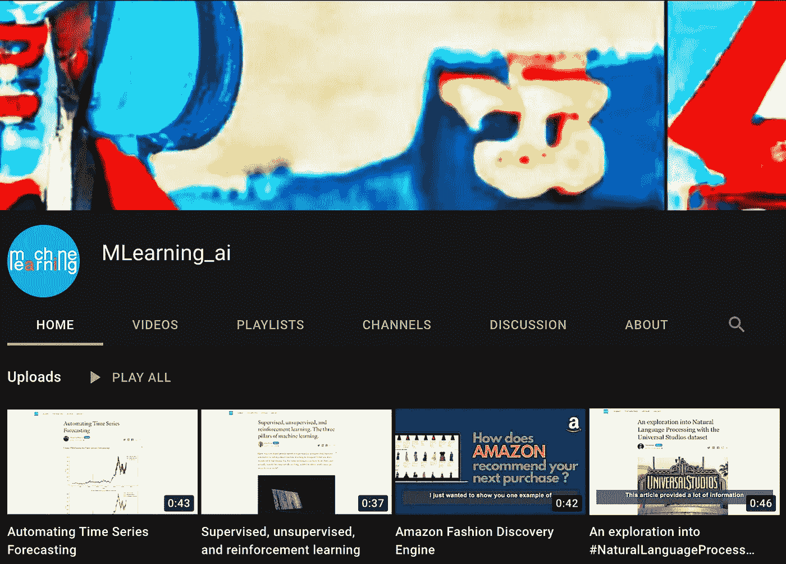

# 更好更快地学习

> 原文：<https://medium.com/mlearning-ai/learning-better-and-faster-7e52615a1b44?source=collection_archive---------3----------------------->

## 4 个视频，4 个作者，四大话题

[https://www.youtube.com/channel/UCbXfATzjJhosN7F_ukUycUg](https://www.youtube.com/channel/UCbXfATzjJhosN7F_ukUycUg)

MLearning.ai 出版物在不断发展。我们邀请您观看关于最新文章的[短视频](https://www.youtube.com/channel/UCbXfATzjJhosN7F_ukUycUg)。它们很有创意，写得很漂亮。

**4 个视频，4 个作者，四大话题**

**1。** [**【环球影城数据集自然语言处理探索】**](/mlearning-ai/an-exploration-into-natural-language-processing-with-the-universal-studios-dataset-527644d42f4e)