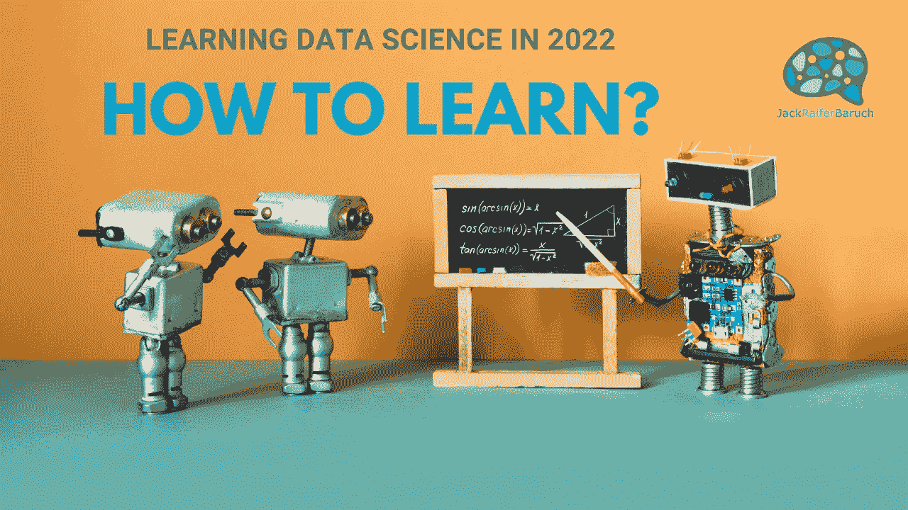

# 2022 年学习数据科学第二部分:如何学习？

> 原文：<https://medium.com/mlearning-ai/learning-data-science-in-2022-part-2-how-to-learn-eda02c341a39?source=collection_archive---------0----------------------->

上一次[，在第 1 部分，我深入探讨了我认为数据科学家应该学习的东西](/mlearning-ai/learning-data-science-in-2022-part-1-what-to-learn-4edbc5113cce)。今天，我们正在寻找不同的方法来实现这一点，从传统和复杂的高等教育系统，到学习你想要什么，当你想要在线的方法。

首先，就教育而言，没有放之四海而皆准的标准。对一些人来说，比如我自己，自己动手的方法很有效，而另一些人则需要更有条理的学习方法。所以在这里，我们将看看我经历过的不同方法，以及我认为每种方法的优缺点。

让我们进入 2022 年如何学习数据科学:

一个常见的问题，特别是自疫情以来，是教学的方式，从面对面，到在线同步，到在线按自己的速度混合。我不会参与这场辩论，因为我们没有足够的数据来自信地说哪种方法更好，更不用说像数据科学这样具体的东西了。尽管如此，我下面提到的所有方法都属于这一类。

同样，这里没有正确的答案，我写的都是我的知情意见，但只是我的意见，希望我提供信息的方式对你有用，是的，你，现在正在阅读这篇文章的人。

现在，我们来看看怎么样:

**1。大学学位(学士、硕士、博士)**

第一条也是最传统的途径是获得大学学位。数据科学是相当新的，所以它不一定在 BS 级别可用，尽管它变得越来越受欢迎。如果你想从一个支持未来数据科学的学位开始，你可以选择数学和统计学等领域，或者你可以从计算机科学或计算机工程开始深入数字领域。

如果你已经有大学学位，你也许可以找到一个数据科学硕士或博士项目。考虑到如果你来自非数学背景(像我一样，来自心理学)，你将需要做一些额外的工作。

我在这里的建议是，如果你有机会在大学环境中学习，那么就这样做，因为你在数据科学方面的大学学位资格可能会让你在未来超越大多数其他候选人。还有，大学的经历是值得的。

话虽如此，进入数据科学领域实际上并不需要大学学位，还有很多其他方法可以做到这一点。永远不要把没有大学学位或者没有相关领域的学位当成障碍，这不是。

最大的优势是，你倾向于接受全面的教育，不局限于你的研究领域，你会遇到人，并建立长期持久的关系和联系。当然，拥有一个公认的学位也会有所帮助。

获得大学学位的最大障碍是时间，即使是最短的课程也要至少 2 年(对于硕士学位来说)，并且取决于国家和学校，金钱，有些课程非常昂贵。

**2。基于平台的**

第二种可能的学习方式是加入越来越多的致力于数据科学教学的平台。现在，所有这些平台都是“按你自己的速度学习”，自己动手的平台，尽管其中一些平台有社区，你可以在那里加入，与你的同伴见面，问问题，并在你遇到困难时获得帮助。所有这些都有涵盖主题的结构化路径，有些路径比其他路径更多，但它们都有一个指导方法，让你从完全初学者到对你正在做的事情有一些想法。其他人甚至会提供一些像数据科学面试这样的课程。

我发现这里有两种类型，第一种是以视频为中心的课程，包括讲解视频和练习，我以前用过的两种是[365 数据科学](https://365datascience.com/)和 [Pluralsight](http://referral.pluralsight.com/mQoFf7t) 。365DataScience 完全致力于发展您作为数据科学家(或数据分析师)的技能，而 [Pluralsight](http://referral.pluralsight.com/mQoFf7t) 提供编程、工程等其他服务。他们都提供一些免费的内容，所以你可以看看他们提供什么，什么更适合你。

然后是阅读和基于练习的平台，你可以阅读解释概念的小文章，紧接着是帮助你更好理解和练习的练习。它们都包括一个 [IDE(集成开发环境)](https://en.wikipedia.org/wiki/Integrated_development_environment)来进行编程，而不需要在本地安装任何东西，如果你是新手，这是一个很大的优势。

在这个类别中，我以前用过的是 [Dataquest](app.dataquest.io/referral-signup/2x7nzgcl/) 和 [Datacamp](https://www.datacamp.com/) ，它们都高度致力于数据科学家和分析师的技能，还有 [Codecademy](https://www.codecademy.com/) ，一个更广泛的平台，有许多学习编程的途径，包括一个专门针对数据科学的。同样，他们都有一些免费的内容，所以你可以检查一下，挑选一个你最喜欢的。

所有这些都提供特定课程的证书以及结业证书。

这些平台的最大优势是，你可以在一个地方获得大量你需要的内容和大量的练习，甚至是一些帮助你入门的项目。

最大的缺点是，获得帮助取决于社区的活跃程度，如果你想深入了解，你将主要涉及基础知识，而不是很多细节。当然，它们是付费服务，尽管如此，它们的月费或年费往往很低(现在有些甚至有终身项目，但价格稍贵)。

尽管如此，对于那些仍然不确定自己是否想学习数据科学，只想轻松入门的人来说，这是一个很好的入门方式。

**3。基于课程**

现在我们到了我最喜欢的选项，这是我如何从大约 2012 年开始学习各种惊人的东西，以及我如何实现我的职业生涯向数据科学的转变。

不过有一点要提醒的是，这条路并不适合每个人，它有时会令人沮丧，尤其是因为你可能会感到迷失，但请坚持和我在一起，我会给你一些建议让它发挥作用。

自从 2012 年我拿起我的第一门 MOOC，我就迷上了这种模式。在这里，你可以接触到来自世界各地的成千上万的课程，它们要么是免费的，要么价格很低。

MOOC 平台有三种类型，一种是你可以获得你从来不知道自己需要的所有大学课程，比如 [Coursera](https://www.coursera.org/) 和 [EdX](https://www.edx.org/) ，一种是每个人都可以授课(在那里你可以找到一些令人难以置信的珠宝)的平台，比如 [Udemy](https://www.udemy.com/) ，最后一种是更加结构化的平台，专注于特定的主题或行业，比如 [Udacity](https://www.udacity.com/) 和 [Kahn Academy](https://www.khanacademy.org/) 。

我爱他们。但是让我们仔细检查一下。

Coursera 和 [EdX](https://www.edx.org/) 可能是最大和最知名的。在那里你可以找到世界各地大学的课程。最棒的是，他们几乎所有的目录都是免费的。只需转到您想要的课程并选择审计选项。如果你和我一样是证书囤积者，你也可以在每门课程和专业结束时付费获得一个证书。但是同样，您可以审计几乎所有内容。 [Coursera](https://www.coursera.org/) 也有 Plus 选项，允许以一年的价格通过证书访问他们目录的大部分(类似于第 2 点中提到的平台)。

Udacity 非常特别，因为它有许多免费的高质量内容，都是面向科技的。然后是纳米学位，这些都是针对特定事物的很好的项目(它们有一些专注于数据科学和数据工程)，但是它们运行起来很昂贵。尽管如此，与合作伙伴一起，他们有大量的奖学金，我鼓励你去看看。

[我提到 Kahn Academy](https://www.khanacademy.org/) 是因为在这里你可以获得所有数学方面的免费指导，包括统计学、概率、线性代数和微积分，这些都是你在通往数据科学的道路上需要的。

最后还有 [Udemy](https://www.udemy.com/) 。这里的大量内容可能看起来令人生畏，但这里有一些伟大的导师和老师。你只需要耐心地查看评论、内容，当然还有评论，找到合适的。大多数课程都是付费的，但也有大量的免费课程，如果你等待他们不断的促销，你将能够以不到 20 美元的价格在 Udemy 上获得几乎任何课程。

这种方法的优点是，你可以在需要的时候学习你需要的东西，而且你可以在你的预算范围内这样做，从完全免费到你想支付的任何东西。

缺点是外面有很多，可能会令人生畏，而且不能保证你学的课程涵盖了你需要的所有东西。

以下是一些建议:

-首先花时间了解你需要学习什么。列出具体科目及其顺序。

-然后开始研究第一个主题的课程，慢慢寻找你想学的课程。

-计划在特定时间内完成课程。

-如果您正在购买课程，请确保一次购买一门课程，以避免积压您永远无法获得的付费资源(根据个人经验)。

**4。训练营**

首先，训练营是一个特殊的品种。许多课程，尤其是 Udemy 上的课程，上面都有 bootcamp 这个名字，但它们不是。

训练营意味着一组特定的时间(从第 Y 天到第 Z 天的 X 周数)，一个现场的全职教练(现场或完整的视频)，有时还有一个助理教练和一群同学。他们还声称要在短时间内掌握大量知识，并倾向于要求全职投入(和大量额外的改变)。

我已经写了一篇关于[我的训练营经历的长文，你可以在这里找到](/mlearning-ai/are-data-science-bootcamps-worth-it-b78f462ace6)，所以我能说的是，如果你决定走这条路，请确保你阅读了它，并至少采纳了那里的一些建议。

这种方法的优点是，你可以得到一个完整的课程，包括你找工作所需的一切，一个全职的有经验的教师，以及很多支持。

缺点是它们非常昂贵，需要全职投入，如果你有像我这样的经历，那将是浪费大量时间和金钱。

**打造自己的路…**

最后，你是那个想要学习的人，所以建立你自己的方法。它可以完全基于 YouTube 视频(有一些明星，如 [Josh Stramer 的 StatQuest](https://www.youtube.com/c/joshstarmer) 、 [Ken Jee](https://www.youtube.com/c/KenJee1) 和 [Data Professor](https://www.youtube.com/c/DataProfessor) )，你可以混合和匹配不同的方法，或者你可以走老路，简单地通过阅读获得知识(有大量令人惊叹的学习数据科学的书籍)。对 [FreeCodeCamp](https://www.freecodecamp.org/) 最后一次大喊，我只是不适合我的类别，但完全免费学习编码或一些数据科学是值得的。

最后，你会做最适合你的事情，而我所能做的就是努力照亮一片光明，这样你就能更好地找到自己的数据科学之路。

如果你有任何问题，请随时在推特或 T2【LinkedIn】和我联系，并给我留言。也可以看看我的 [YouTube](https://www.youtube.com/channel/UC87srlfQBy6AcglQAvlHr3A) 频道，如果你喜欢这篇文章，就在 [Medium](https://jackraiferbaruch.medium.com) 上关注我。

杰克·雷弗·巴鲁克
数据科学家

邮箱:[jackraiferbaruch@gmail.com](mailto:jackraiferbaruch@gmail.com)
领英:[https://www.linkedin.com/in/jackraifer](https://www.linkedin.com/in/jackraifer)
推特:[https://twitter.com/JackRaifer](https://twitter.com/JackRaifer)
媒介:[https://jackraiferbaruch.medium.com](https://jackraiferbaruch.medium.com)
YouTube:[https://www.youtube.com/channel/UC87srlfQBy6AcglQAvlHr3A](https://www.youtube.com/channel/UC87srlfQBy6AcglQAvlHr3A)

 [## Mlearning.ai 提交建议

### 如何成为 Mlearning.ai 上的作家

medium.com](/mlearning-ai/mlearning-ai-submission-suggestions-b51e2b130bfb)