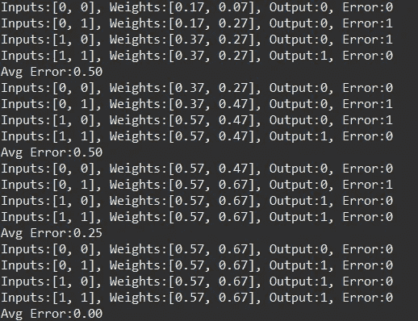
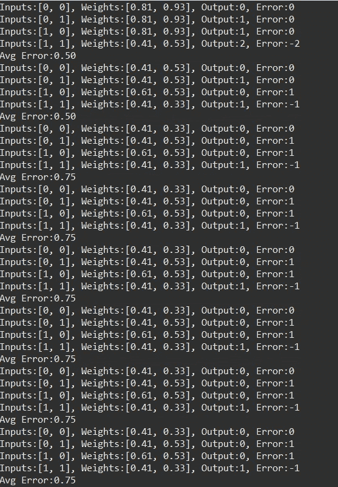
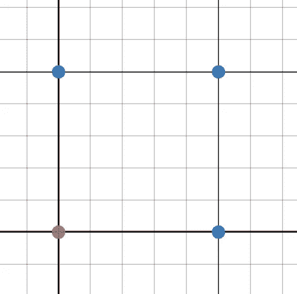
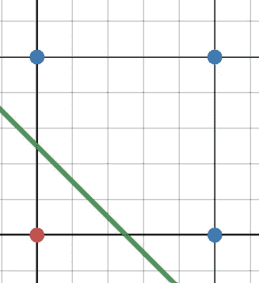
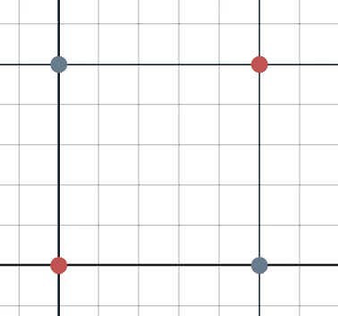

# 从零开始学习——我的机器学习入门

> 原文：<https://medium.com/mlearning-ai/learning-from-scratch-my-introduction-to-machine-learning-fd84f5a258a0?source=collection_archive---------4----------------------->

欢迎来到我的第一篇中型博客，也是一系列帖子中的第一篇，在这些帖子中，我将记录与我的数据科学和机器学习研究相关的个人项目列表。


Photo by [AltumCode](https://unsplash.com/@altumcode?utm_source=medium&utm_medium=referral) on [Unsplash](https://unsplash.com?utm_source=medium&utm_medium=referral)

## 目录

*   关于我
*   目的和目标
*   项目概述
*   设计和创造
*   测试和结果
*   结论

## 关于我

在我开始深入了解这个项目之前，先简单介绍一下我自己。我是奥斯汀德克萨斯大学的电子和计算机工程专业的学生。在撰写本文时(2022 年 7 月)，我正准备开始大二的学习，目前正在攻读学士学位。我计划走数据科学的技术路线，并在机器学习方面建立我的职业生涯。

我对这个领域的兴趣可以追溯到我高一的时候，那时我第一次接触到神经网络的想法；我对有办法打破计算机科学最基本的规则之一感到惊讶——“机器和程序员一样聪明。”从那以后，我花了大量的时间和精力来研究和创建这些模型，总是一小步比一小步先进。

## 目的和目标

我写这一系列博客帖子的主要目的是记录我所做的项目，并展示我投入这一热情的工作。我希望从头到尾记录我在这个领域的旅程，包括在我真正称之为我的职业之前发生的事情。

我的主要目标是用这个博客作为示范，向潜在的招聘者展示我的工作和对这个领域的理解水平。在过去，我很难在采访中证明我的经历，因为在专业背景下描述个人项目是多么困难，我打算用这一系列来详细解释我的工作。我希望这篇文章的读者能学到一些新的东西，也许，甚至会受到启发，开始一段类似于我自己的旅程。

我将在这篇文章中详细介绍的项目是我完成的第一个与机器学习相关的项目，写于我的高二年级。我的另一个目标是，随着本系列的进展，编写的代码的质量和“专业性”会随着整个项目的复杂性而增加。

## 项目概述

我在这篇文章中展示的项目是一个单层感知器。这个项目以及我展示的所有未来项目都是仅使用内部库编写的。这意味着没有建立深度学习库。这一系列项目也是用 Java 编写的，而不是数据科学的流行选择:Python。

**为什么？—** 首先，我想解决房间里的大象:用于机器学习的 Java？
尽管这种语言普遍受到批评，尤其是对于机器学习，但我选择用 Java 编写这些项目仅仅是因为我喜欢这种语言。Java 是我学习的第一门语言，因此对我来说一直是最直观的。此外，我对不使用已建立的库的限制意味着使用 Python 的最大优势是不相关的。
其次——为什么我要限制外部库？
通过从头开始编写这些项目，我不仅学到了机器学习的重要性和能力，还学到了模型如何工作的复杂性。

**模型信息** —单层感知器(SLP)是机器学习最基本的模型之一。也许有点误导，单层感知器拥有两层，而不是一层:一个输入层和一个输出层，但没有像更高级的多层版本那样的隐藏层。此外，在大多数情况下，激活函数被简化为本质上是离散的舍入函数。


Perceptron Model Visualization, Source — [https://www.javatpoint.com/single-layer-perceptron-in-tensorflow](https://www.javatpoint.com/single-layer-perceptron-in-tensorflow)

## 设计和创造

正如本文前面所暗示的，这个项目在我学习编程的过程中进行得如此之快，在这个项目中编写的代码包括多个糟糕的决策，最明显的是主要数学类的设计只有静态变量和方法。也就是说，我确实认为反思我完成的项目的进展是很重要的。

因为 SLP 的简单性，*和相当明显的缺乏详细的、有组织的代码*，所以解释起来也同样简单。首先，初始化以下变量以保存网络操作。

```
static int[] inputs = new int[2];
static double[] weights = new double[2];
static int error = 0;
static int target = 0;
static int output = 0;
```

*   输入由用户设置，以运行测试用例。集合大小 2 表示给定函数中输入的总数，在这个项目中，我使用 2，因为该项目旨在使用 SLP 来解决 2 个输入逻辑门。
*   权重是随时间调整的网络参数，以提高操作的有效性。集合大小 2 表示层间需要的连接数；由于该网络由一个 2 节点输入层和一个 1 节点输出层组成，因此需要的连接总数为 2。
*   误差代表目标值和计算输出值之间的差异。
*   目标是一个已知值，是一组给定输入的期望结果。目标值，有时称为“标签”，是监督学习的一个主要定义因素，在监督学习中，网络的训练包括在网络做出猜测后揭示正确的答案。
*   最后，输出是通过将输入向前传递到输出层而计算出的值。因为这个网络只需要 1 个输出，所以它被保存到一个变量中，但是，如果输出的数量增加，它将被表示为一个数组。

创建时，所有权重都是随机的，这个过程相当简单:

```
public static void initializeWeights() {
  for(int x = 0; x < weights.length; x++) {
   weights[x] = Math.random();
  }
 }
```

在用户初始化输入和目标之后，就可以进行正向传递了。这是通过网络移动输入值以达到输出的过程。
在这个网络中，由于只有 2 个输入节点连接到 1 个输出节点，因此前向传递算法是一个简单的表达式:
o = (i₁ * w₁) + (i₂ * w₂)
其中“o”是输出，iₙ是索引 n 处的输入，wₙ是索引 n 处的权重

要实现这一点，只需要一个简单的求和循环，将输入乘以各自权重的结果相加。

```
 public static void determineOutput() {
   double out = 0.00;
   for(int x = 0; x < inputs.length; x++) {
     out += inputs[x] * weights[x];
   }
   output = (int)Math.round(out);
   determineError();
 }
```

正如在这个函数中通过调用名为“determineError()”的函数所暗示的，下一步是计算误差。由于没有非线性函数，并且仅由 2 层组成，误差函数仅由目标输出组成。

```
public static void determineError() {
  error = target - output;
  avgError += Math.abs(error);
}
```

最后，剩下要做的唯一事情是使用计算的误差来调整权重，这是通过分析每个权重对总误差的贡献来完成的。这是通过将输入图层的值乘以输出图层的误差来实现的。然后，将该乘积乘以一个常数值(称为学习率)来调整权重。
这个学习速率值通常是一个低常数(本例中设置为 0.2)，它定义了网络学习的速度。当然，我们很容易认为将该值设置得较高会减少训练时间。然而，提高学习速度会降低最终产品的质量。总的来说，这是训练时间和最终结果之间微妙的平衡。

为了调整权重，运行另一个简单的循环来完成计算:

```
public static void adjustWeights() {
  for(int x = 0; x < weights.length; x++) {
     weights[x] += inputs[x] * error * LEARNING_RATE;
  }
}
```

有了这些基本流程，就有可能运行一个可以学习基本关系的算法。更详细的代码可以在[这里](https://github.com/umop-ap1sdn/Single-Layer-Perceptron)找到。

## 测试和结果

为了展示 SLP 模型的能力(和缺陷)，我运行了两个独立的数据集。第一个是逻辑或门。
这是指接受 2 个数字值(1 或 0)并根据这些输入输出 1 的电子对手。逻辑“或”门的细节是显而易见的:只要一个或另一个输入为真(1)，输出将为真，否则输出将为假(0)。
为了形象化这种关系,“或”门的真值表如下。

```
[ Inputs  ][ Outputs ]
[  0 | 0  ][    0    ]
[  0 | 1  ][    1    ]
[  1 | 0  ][    1    ]
[  1 | 1  ][    1    ]
```

在多次运行该算法后，很明显，对于单层感知器来说,“或”门没有问题。其中一个数据集的结果如下所示。



Single Layer Perceptron solving an OR gate

我运行的第二个数据集类似地使用了另一个逻辑门，然而，结果与 OR 门有很大不同。用于该测试的门是异或门；“异或”这个想法类似于 OR 门，但是，它去除了 1 和 1 的情况，因此命名为 exclusive。
异或真值表如下图。

```
[ Inputs  ][ Outputs ]
[  0 | 0  ][    0    ]
[  0 | 1  ][    1    ]
[  1 | 0  ][    1    ]
[  1 | 1  ][    0    ]
```

在 SLP 运行该数据集时，我们会看到以下结果:



SLP is unable to solve the XOR Logic Gate

观察结果，可以看出单层感知器永远不能像解决或门那样解决异或门。

**但是为什么呢？—** 神经网络生成的输出基于连接权重绘制的决策边界。在像单层感知器这样的模型中，没有任何隐藏层，加上网络只使用线性函数，这意味着这些决策边界只能是线性函数——直线。这意味着 SLP 无法实现任何需要非线性决策边界的功能。
这在“或”门的情况下并不代表任何问题，然而，当试图解决“异或”时，这是一个主要问题。

为了直观显示，or 门的真值表被格式化成一个图形，其中蓝点代表真(1)结果，红色代表假(0)。



Graphical Truth table for OR gate

在本例中，绘制一个线性决策边界来区分红点和蓝点非常简单，可以这样完成:



Graphical OR gate with 1 possible Linear boundary

这个例子只是创建决策边界的许多可能的解决方案之一。简而言之,“或”门很容易被一个只能创建线性函数的系统解决。
以同样的方式分析异或门，会出现下图:



Graphical Truth table for XOR gate

与“或”门不同的是，没有线性决策边界可以用来适当地分离所有输出。这就是 SLP 未能对异或真值表进行分类的原因。为了解决这个问题，必须引入一个非线性函数，让网络形成非线性决策边界。此外，必须包括隐藏层，以允许形成更复杂的解决方案。

这个问题在机器学习领域并不新鲜，被恰当地命名为 XOR 问题。关于这个问题的进一步阅读，我推荐阅读 Aniruddha Karajgi 撰写的《走向数据科学[神经网络如何解决 XOR 问题](https://towardsdatascience.com/how-neural-networks-solve-the-xor-problem-59763136bdd7)。

## 结论

总的来说，这个项目是我沉浸在机器学习世界中的一个很好的起点。它教会了我很多关于感知器背后的数学内部工作原理，这将在我展示更复杂的模型的后续项目中建立。

我将展示的下一个项目是单层感知器的自然升级，即多层感知器。这一模式旨在通过引入已经提到的模式中所没有的东西来克服 SLP 的缺点。

几年来，我一直计划开始这一系列的博客文章，但从未花时间去学习如何开始。尽管花了很长时间，我还是很兴奋终于可以开始写我投入了大量工作的项目了。

说了这么多，谢谢你的阅读，我期待着在不久的将来写更多的帖子！

[](/mlearning-ai/mlearning-ai-submission-suggestions-b51e2b130bfb) [## Mlearning.ai 提交建议

### 如何成为 Mlearning.ai 上的作家

medium.com](/mlearning-ai/mlearning-ai-submission-suggestions-b51e2b130bfb)