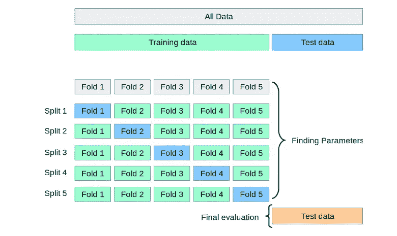

# 学习 k 重交叉验证

> 原文：<https://medium.com/mlearning-ai/learning-k-folds-cross-validations-69b981c91e3a?source=collection_archive---------3----------------------->

## 在本教程中，我将演示在一个监督回归机器学习问题上实现 k 重交叉验证

Photo by [Matthew Henry](https://burst.shopify.com/@matthew_henry?utm_campaign=photo_credit&utm_content=Browse+Free+HD+Images+of+Rows+Of+Cars+In+Junk+Yard+Aerial&utm_medium=referral&utm_source=credit) from [Burst](https://burst.shopify.com/earth?utm_campaign=photo_credit&utm_content=Browse+Free+HD+Images+of+Rows+Of+Cars+In+Junk+Yard+Aerial&utm_medium=referral&utm_source=credit)

在本教程中，您将发现对用于评估机器学习模型技能的 k-fold 交叉验证过程的温和介绍。

完成本教程后，您将了解:

*   对 k 重交叉验证的理解。
*   为什么以及何时需要实施 k 重交叉验证。
*   在 k 倍切片数据集上实现机器学习算法。

# 目录

1.  [了解 k 倍](#65f0)
2.  [在数据集上实现 k-fold](#cf8b)
3.  [总结](#a73b)
4.  [参考文献](#e574)

# №1:了解 k 倍

在我们理解 k-fold 交叉验证之前，理解我们为什么需要这个技术是很重要的？这项技术如何更好地适用于一些经典的机器学习问题数据集，而不是标准的训练测试分割。

*为了解决机器学习问题，分离测试和训练数据的传统方式是使用 sklearn 训练测试分割。*

训练测试分割包括获取数据集并将其分成两个子集。第一个子集用于拟合模型，称为训练数据集。第二个子集不用于训练模型，而是将数据集的输入元素提供给模型，然后进行预测并与期望值进行比较。第二个数据集被称为测试数据集。

**因此，训练测试分割适用于“足够大”的数据集。**

相反，当可用的数据集很小时，训练测试过程是不合适的。原因是当数据集被拆分为训练集和测试集时，训练数据集中没有足够的数据供模型学习输入到输出的有效映射。测试集中也没有足够的数据来有效地评估模型性能。估计的性能可能过于乐观(好)或过于悲观(坏)。

**如果您没有足够的数据，那么一个合适的替代模型评估程序将是 k 倍交叉验证程序。**

by ai.plainenglish.io

交叉验证是一种重采样过程，用于在有限的数据样本上评估机器学习模型。

在 k 倍交叉验证中，数据集被分成 k 倍，并遵循以下一系列步骤

*   数据集被随机打乱。
*   数据集被分成 k 个组。
*   对于每个独特的组:
    -将一个组作为保留或测试数据集
    -将剩余的组作为训练数据集
    -在训练集上拟合模型并在测试集上评估它
    -保留评估分数并丢弃模型
*   使用模型评估分数的样本总结模型的技巧

我在下面的回归问题中实现了上面的一系列步骤，并得到了最终的模型。

[***转到 TOC***](#1903)

# №2:在数据集上实现 k-fold

## 从 Kaggle 导入数据集

为了从 Kaggle 下载数据集，我使用库 **od** 。

要连接 Kaggle，请输入用户 Kaggle 用户名和 API 密钥。

请通读这篇文章，了解从 Kaggle 获取 API 密钥的过程。

 [## 如何使用 Jupyter 笔记本下载 Kaggle 数据集

### 在那里他们相遇并分享他们的知识。不管你是初学者还是专家，Kaggle 可能来过或者可能来…

www.analyticsvidhya.com](https://www.analyticsvidhya.com/blog/2021/04/how-to-download-kaggle-datasets-using-jupyter-notebook/) 

我用熊猫来读取训练和测试数据集。在这里，我访问了一些训练数据集的记录。

## 将数据集分割为 k 倍

让我们检查 k 倍柱的值，以确保分裂是完美的

太好了！！！

我们已经成功地将数据分割成 k 倍

## 实现 K-fold 到随机森林回归器

下面是所有折叠的最终预测，这是测试集上 5 个数组的列表。

太好了！！！我们最终学会了实现 k-folds 交叉验证，并导出了最终的模型结果。

[***转到目录***](#1903)

# №3:摘要

我把我的整个笔记本总结如下

*   首先我们理解了 k 重交叉验证。
*   为什么以及何时使用 k-folds 交叉验证。
*   我们在 Kaggle 上的数据集上实现了 k 重交叉验证。
*   在 k-fold 数据集上实现随机森林回归器。
*   我们得出了最终的模型和预测。

[***转至目录***](#1903)

# №4:引用

*   [https://machinelearningmastery.com/k-fold-cross-validation/](https://jovian.ai/outlink?url=https%3A%2F%2Fmachinelearningmastery.com%2Fk-fold-cross-validation%2F)
*   [https://machine learning mastery . com/train-test-split-for-evaluation-machine-learning-algorithms/](https://jovian.ai/outlink?url=https%3A%2F%2Fmachinelearningmastery.com%2Ftrain-test-split-for-evaluating-machine-learning-algorithms%2F)
*   [https://www.kaggle.com/abhishek/30-days-create-folds](https://jovian.ai/outlink?url=https%3A%2F%2Fwww.kaggle.com%2Fabhishek%2F30-days-create-folds)

我真的希望你们能从这篇文章中学到一些东西。随意👏如果你喜欢你所学的。如果有什么需要我帮忙的，请告诉我。如果有任何帮助，请随时通过 LinkedIn 联系我。