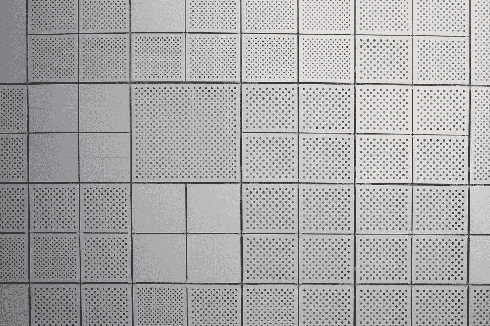

# 通过一个玩具例子学习 NMF

> 原文：<https://medium.com/mlearning-ai/learning-nmf-through-a-toy-example-7aa6d512a6ee?source=collection_archive---------4----------------------->

## 通过一个数学例子学习 NMF 更新规则的机制。

Using NMF, we can understand and analyze the structure of complex matrices for a variety of different applications. Photo by [charlesdeluvio](https://unsplash.com/@charlesdeluvio?utm_source=medium&utm_medium=referral) on [Unsplash](https://unsplash.com?utm_source=medium&utm_medium=referral).

## 概述:什么是 NMF？

在本文中，我们将介绍非负矩阵分解(**【NMF】**)的一种常见实现，这是一类广泛应用于各种领域的流行算法。具体来说，我们将展示*乘法法则* …