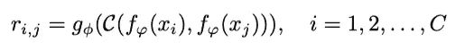
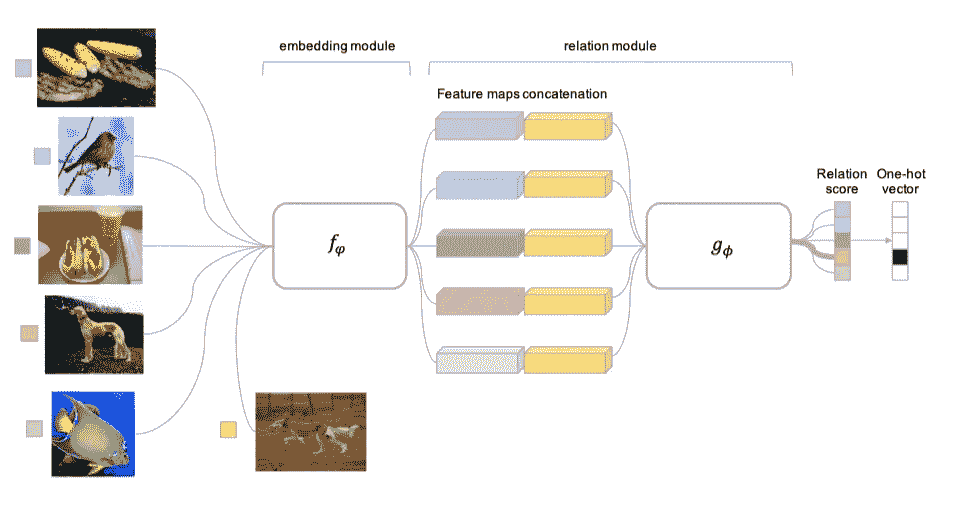
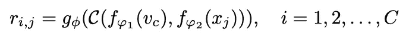
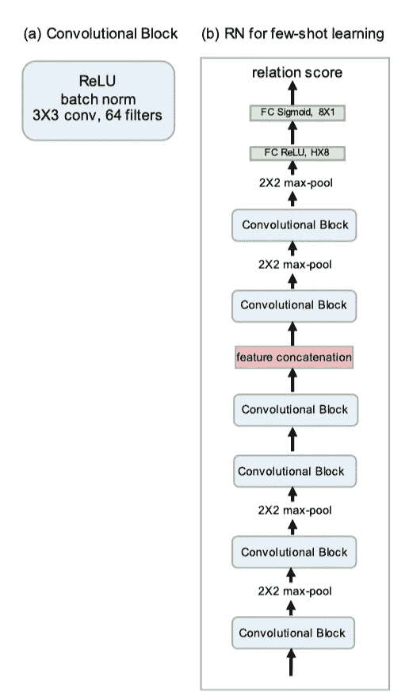
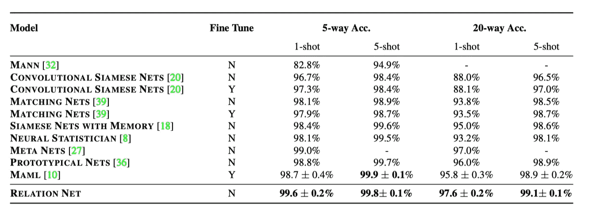
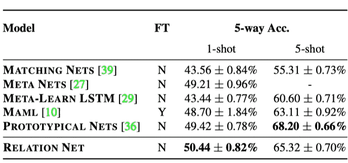

# 学习比较:少量学习的关系网络

> 原文：<https://medium.com/mlearning-ai/learning-to-compare-relation-network-for-few-shot-learning-fa9c40c22701?source=collection_archive---------5----------------------->

# 介绍

在传统的监督机器学习系统中，需要大量的标记数据和多次迭代训练来训练模型的参数。由于注释成本，这严重限制了它们适应新类的可伸缩性和通用性。因此，作者提出了他们的方法称之为 RN，简称关系网络。它从头开始接受端到端的培训。在元学习过程中，它学习距离深度度量来度量输入图像之间的差异。它学习可转移的深度度量，用于比较图像之间或图像与类描述之间的关系。一旦训练了模型，RN 就能够通过计算来自查询样本的输入和来自支持集的输入之间的关系/相似性分数来对新类别的图像进行分类，而无需进一步更新网络。除了在少投学习上取得有希望的表现，他们的网络还可以扩展到零投学习。

# 提议的方法

**少数镜头学习**

作者提出了**二分支关系网络**，通过学习将来自查询集的输入图像与少数镜头标记样本图像进行比较来执行少数镜头分类。网络由两个模块组成: ***嵌入模块*** & ***关系模块*** 。 ***嵌入模块*** 产生查询和支持集图像的表示。然后， ***关系模块*** 对这些嵌入进行比较，以确定它们是否属于同一类。所提出的方法优于先前的方法，更简单(没有 RNNs)和更快(不需要微调)。

查询集和支持集中的图像样本都被采样并馈入嵌入模块以产生它们相应的特征图。然后，两个特征图与操作符 c(⋅(⋅)连接，并被传递到关系模块 *g_ϕ* 中，以生成相似性/关系分数[0，1]。这个关系分数， *r_{i，j}* 将告诉查询输入和支持样本实例之间的接近程度。

sources: [https://arxiv.org/pdf/1711.06025.pdf](https://arxiv.org/pdf/1711.06025.pdf)

均方误差损失用于训练网络，将关系分数回归到地面真实值。具有最接近相似性的配对将获得更接近 1 的值，而不匹配的配对将获得 0。

Figure 1: Relation Network Architecture for a 5-way 1-shot problem with one query example

例如，为了训练 5 路 1 次分类任务，来自 5 个不同类别的每个样本将被采样以构成“支持集”，并且 1 个输入图像将被选择作为“查询集”或被称为“测试集”。在图 1 中，最左边的 5 张图片是“支持集”的图片，而旁边的另一张图片是“查询集”，它将用于与“测试集”进行比较。它们将首先被送入嵌入模块，以从高维向量中提取特征。然后，在关系模块中连接每个特征向量以产生关系分数，确定来自查询集的图像属于哪一类。如图 1 所示，当“查询集”中的特征向量与“支持集”中的狗图像共享相对接近时，关系分数将被给予较高的分数。

**零射击学习**

它通过修改样本分支来输入单个类别描述而不是单个训练图像，从而优雅地将空间扩展到零镜头学习。它学习对齐图像和类别嵌入，并通过预测图像和类别嵌入对是否匹配来执行分类任务。

它包含语义类嵌入向量，而不是为每个 C 训练类给出具有单镜头/k 镜头图像的支持集。作者为图像查询集使用第二个异构嵌入模块。然后应用关系网络。

sources: [https://arxiv.org/pdf/1711.06025.pdf](https://arxiv.org/pdf/1711.06025.pdf)

**网络架构**

四个卷积块用于**嵌入模块**，每个块包含 64-滤波器 3x3 卷积、一层批量归一化和一个 Relu 非线性函数。前两个卷积块包含一个 2x2 max-pooling 层，而后两个没有。而对于 r **关联模块**，它由两个卷积块和两个全连接层组成。每个卷积块是 64 个滤波器的 3×3 卷积，接着是一层批量归一化、Relu 非线性函数，最后是 2×2 最大池层。除了最后的输出层——sigmoid 函数，所有完全连接的层都是 ReLU 函数，以便产生范围从 0 到 1 的关系分数。

Figure 2: Relation Network architecture for few-shot learning.

# 实验和结果

该方法在两个相关任务上进行了评估:Omniglot 和 miniImagenet 数据集上的少镜头分类，以及带属性的动物(AwA)和加州理工学院-加州大学圣迭戈分校 Birds-200–2011 上的零镜头分类。

Table 1: Omniglot few-shot classification.

表 1 显示了 Omniglot 数据集上的少数镜头分类精度。关系网络在 C 路 K-shot 的所有实验设置下实现了最先进的性能，具有更高的平均精度和更低的标准偏差，除了 5 路 5-shot。

Table 2: Few-shot classification accuracies on miniImageNet.

表 2 显示了 miniImagenet 数据集上的少数镜头分类任务的精度。可以看出，所提出的关系网络在 5 路 1 投设置上取得了有希望的性能，并且在 5 路 5 投上取得了有竞争力的结果。模型在 5 路上被训练，每个训练集 1 次 1 镜头的查询和 5 次 5 镜头的查询，训练查询少得多。

与固定度量学习或固定特征相反，关系网络可以被视为学习深度嵌入和学习深度非线性度量。通过使用灵活的函数逼近器来学习相似性，以数据驱动的方式学习好的度量，而不必手动选择适当的度量，如欧几里德、余弦等。用间歇训练来训练网络调整了用于有效的少量学习的嵌入和距离度量。

# 参考

[1][https://arxiv.org/pdf/1711.06025.pdf](https://arxiv.org/pdf/1711.06025.pdf)

[2]Github:【https://github.com/floodsung/LearningToCompare_FSL.git】T2