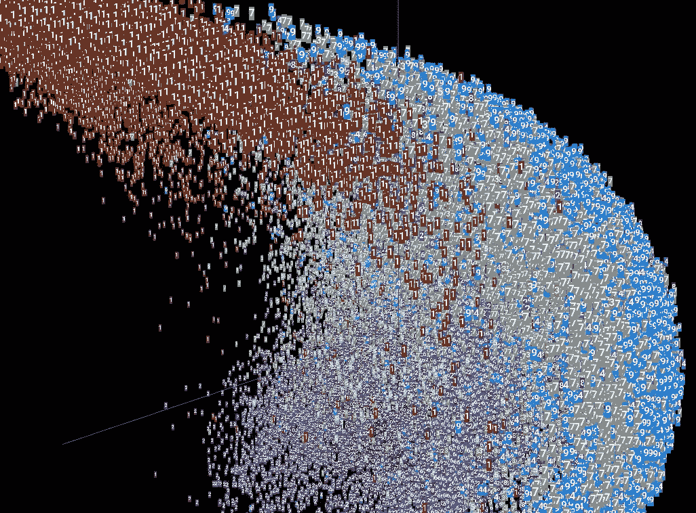
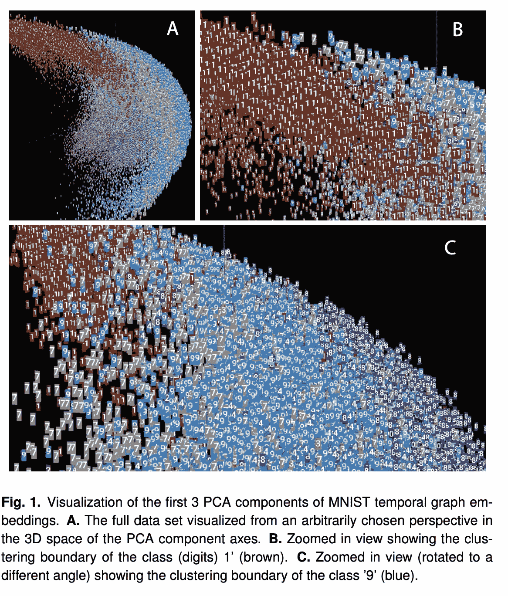
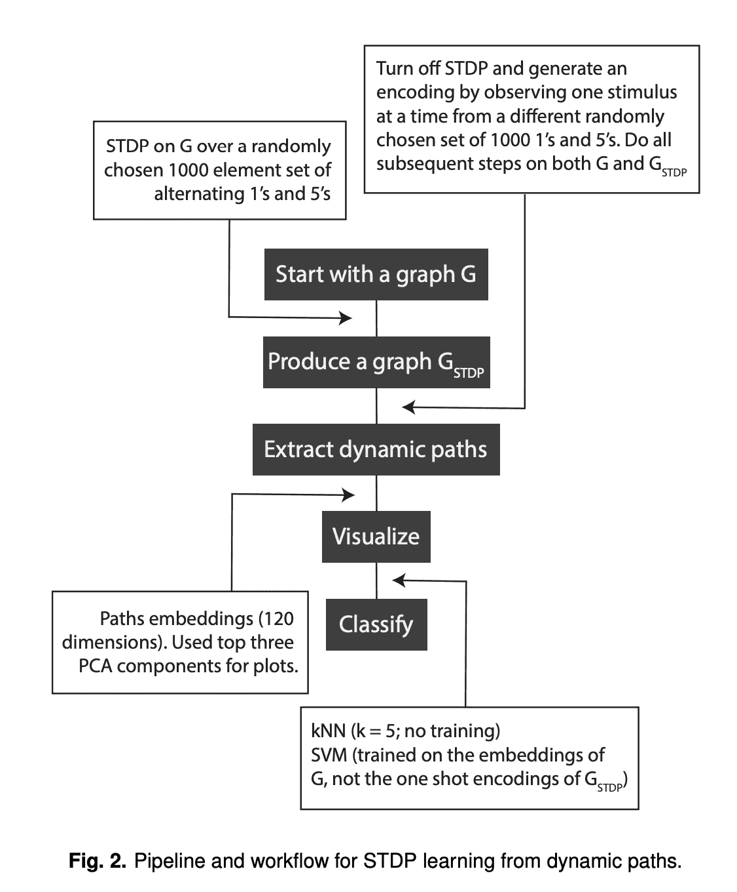
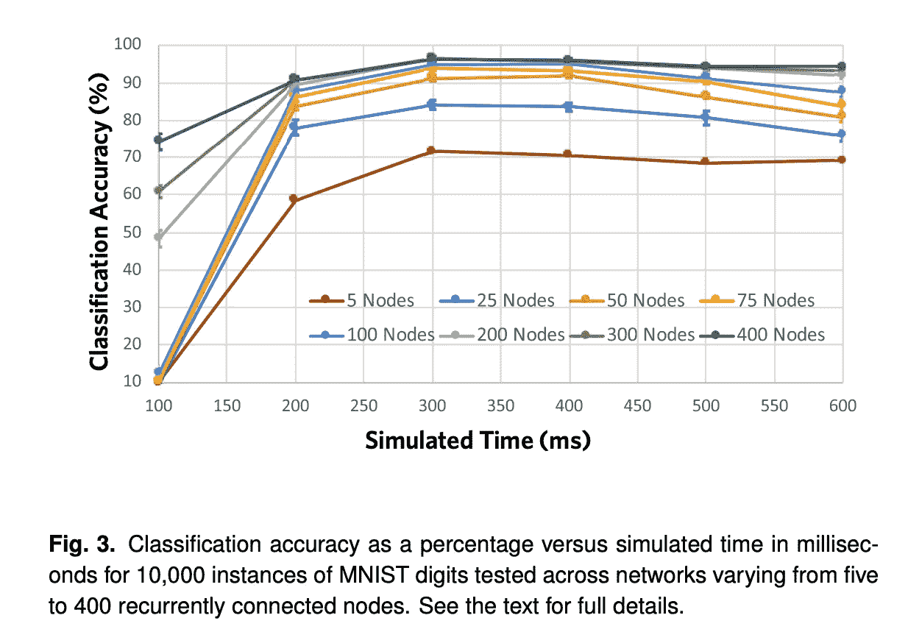

# 神经生物学模型动力学编码的无梯度下降学习

> 原文：<https://medium.com/mlearning-ai/learning-without-gradient-descent-encoded-by-the-dynamics-of-a-neurobiological-model-2ec53c9911a7?source=collection_archive---------1----------------------->

Dynamic clustering and classification of handwritten digits without prior training. Image credit: Christopher White and Gabriel A. Silva

一般来说，许多机器学习(ML)的巨大成功和成就都是基于梯度下降算法的变体，这些算法最小化了某个版本的成本或损失函数。现有算法的核心是利用神经网络中权重的随机收敛，各个节点通常表示为经典感知器模型的某种版本，以及网络捕捉编码输入的潜在非平凡统计关联的能力。然而，一个基本的限制是，需要通过将这些系统暴露于大量的训练样本，以监督或无监督的方式训练这些系统。在某些情况下，这些限制会带来重大问题，例如当没有足够的数据(或足够高质量的数据)用于训练时，或者当学习和分类等任务需要近乎实时地“即时”完成以支持即时推理或决策时。

除了需要大量标记数据进行训练之外，GPT3 等最先进的 ML 模型有 1750 亿个参数，需要庞大的计算基础设施。[仅 GPT3 培训周期的计算成本估计为 460 万美元](https://lambdalabs.com/blog/demystifying-gpt-3/)。ML 中当前的大数据、大计算和大模型趋势不会扩展。虽然一些现有的 ML 可以执行接近实时的学习，但它仍然需要昂贵的预训练模型。显然，ML 需要一个数据、计算和能源效率更高的范例。

在最近的一篇会议论文中，我们介绍了一种全新的 ML 概念方法，试图解决这些限制。[我们利用了我们小组](https://direct.mit.edu/neco/article-abstract/31/12/2492/95612/The-Effect-of-Signaling-Latencies-and-Node?redirectedFrom=fulltext)开发的最新构建和理论框架——源自对空间和时间总和的规范神经生理学原则的抽象和分析。我们表明，当人工神经网络(ANN)用定义的几何和连接结构构建时，该结构和动态变量(传导速度和节点不应期状态)之间的相互作用允许信息(输入)通过网络的合成动态进行编码。传统意义上的调整权重的学习仍然可以发生，但是以一种更有效的方式。不需要网络的先验训练。动态捕捉输入的特征。作为概念的证明，我们使用这些方法对 MNIST 数字进行无监督分类。今年晚些时候，一篇扩展的后续论文将更详细地讨论这种方法，并提供一些额外的结果。

# 理论模型

从概念上讲，该框架对入射到目标下游节点(例如，神经元)上的信号的竞争相互作用进行建模，这些信号沿着来自连接到它的其他上游节点的有向边。该模型考虑了除了连通性之外，由于边的物理几何形状，时间延迟如何在输入离散事件的总和的定时中产生偏移，以及这如何导致目标节点的激活。它捕捉了不同信号如何竞争“激活”它们所连接的节点。该模型的核心是每个节点的不稳定状态的概念。这反映了单个节点级别的内部处理阶段。该模型没有假设任何关于产生这种不应期状态的内部动力。鉴于这些结果，实现了感知器的经典模型的扩展，这是一种几何动态感知器，是神经科学中积分和点火模型的推广。该模型将到达信号和随后的边缘权重的总和的定时约束合并为边缘路径长度和神经元不应期的函数。[完整的细节和数学证明见主要理论论文](https://direct.mit.edu/neco/article-abstract/31/12/2492/95612/The-Effect-of-Signaling-Latencies-and-Node?redirectedFrom=fulltext)。和本[其他论文](https://direct.mit.edu/neco/article-abstract/23/1/183/7618/A-Framework-for-Simulating-and-Estimating-the?redirectedFrom=fulltext)进行额外的相关工作。在这里的结果和讨论中，我们利用了由输入(即，来自 MNIST 数字的激活像素)诱发的模型动态生成的激活路径。MNIST 是一个流行的数据库，包含数千个 0 到 9 之间的手写数字，通常用作 ML 应用程序的测试集——尽管与 ML 社区使用的其他标准化测试集相比，这是一个相当简单的测试集。

本文的其余部分总结了技术细节和结果。直接(在下一节中)或在(最后一节中)结合权重上的 STDP，在有或没有尖峰定时相关可塑性(STDP)的情况下使用所得的计算路径，以对后端分类器的特征进行编码。

# 从无训练的网络动力学导出的结构路径的无监督分类

我们首先探索了使用该模型的激活模式是否可以在没有任何相关学习的情况下有效地分离出输入模式。在这个实验中，我们的模型的基本几何结构由来自随机嵌段模型(SBM)的具有 2 个嵌段的网络组成；构建为 784 节点输入块，与 MNIST 数据的分辨率相匹配，连接到 200 个隐藏节点块。我们应用了来自 MNIST 数据集的 60，000 个训练样本作为输入刺激。对于每个刺激，我们将模型运行 10，000 步，从而生成 60，000 个独特的激活模式或时间图。然后，我们使用它们的时间序列(路径)为这些图生成嵌入。我们通过绘制主成分分析(PCA)的前三个成分来可视化欧氏空间中时态图的每个嵌入(图 1)。使用余弦距离作为距离度量，我们构建了一个 k-最近邻(kNN)分类器，根据最近邻的多数标签来推断输入类标签。使用这种无监督的方法，我们能够在推断正确的 MNIST 输入类别的任务上实现 72%的平均准确度，其中类别 1 实现了 93%的最高准确度，类别 8 实现了 63%的最低准确度。

在下一个实验中，我们将使用 STDP 作为学习规则的模型生成的嵌入与不使用 STDP 的模型生成的嵌入进行了比较(图 2)。

STDP 是一种看似合理的生物算法，可以调整相连神经元之间的突触关联强度。该过程根据信号事件到达的时间调整突触权重。从网络的相同基础几何结构开始，我们随机选择 1000 个类别 1 和 5 的 MNIST 图像实例作为输入刺激。启用 STDP 后，我们用 1000 个图像实例来模拟模型。然后，我们用更新后的权重对图表进行了快照。当我们比较这两个图时，我们观察到 29%的边具有较高的权重，40%的边具有较低的权重，20%成为抑制性的，11%的边权重没有变化。然后，我们进行了两组模拟，每组都有一个 1 级或 5 级的额外刺激；一个利用了 STDP，另一个没有。然后，我们从这些额外的刺激中提取动态路径，并使用与上一段所述相同的方法将其嵌入。使用相同的无监督 kNN 方法，我们推断类标签。对于使用没有 STDP 的动态路径生成的嵌入，我们实现了 61%的准确率来区分两个输入类。但是对于以 STDP 为学习规则的动态路径，我们达到了 82%的准确率。相比之下，如果我们训练一个支持向量机(SVM)，我们能够对来自非 STDP 路径的嵌入实现 91.1%的准确性，对来自 STDP 的嵌入实现 97.6%的准确性。

# 无训练边权重状态空间轨迹的无监督分类

在前面的部分和相关工作中，激活模式生成由网络动态划分的独特时间序列，这些序列能够相对较好地对它们所代表的输入进行分类(假设它们没有被训练这样做)。在这项工作的基础上，我们使用我们的理论模型，测试了 STDP 施加在权重本身上的变化*是否可以将输入编码为合成动力学的函数。与人工神经网络的传统训练和测试阶段相反，我们观察了递归层中权重演变的状态空间轨迹。相同类别的 MNIST 数字的输入导致相似的边权重变化。最后，我们使用一个简单的欧几里德距离加权 kNN (w-kNN，k = 5)来量化边缘权重状态空间轨迹的相似性。*

为了初始化网络，我们使用了神经生物学相关的参数值。权重从均匀分布中选择，使得 70%的边缘是兴奋性的，而 30%是抑制性的。该网络由输入层和递归层组成。我们观察了单次刺激后网络的结果全局动力学，即边权重状态。输入层由同样的 784 个节点组成。我们将循环连接的神经元数量增加到 400 个。我们没有测试更大的网络，因为分类精度在超过 200 个节点时没有显著变化，尽管计算需求增加了。输入节点由特定 MNIST 图像中的非零像素激活。每个输入节点连接到每个循环节点，但是由于边缘延迟的可变性，来自每个输入节点的输出信号在不同的时间到达每个循环节点。单独的模拟进行了 600 毫秒，一个窗口，凭经验超过了最大分类精度的收敛期。对于每个模拟，我们每隔 100 毫秒的模拟时间对重现层中的所有权重进行采样。我们使用 w-kNN 算法中每个时间点的结果向量来确定特定的输入类别。特别地，我们随机选择 9000 个边缘权重向量来建立权重空间，然后使用 w-KNN (n=5)对剩余的 1000 个向量进行分类。我们这样做了十次，以避免权重空间和分类向量中的任何选择偏差。使用欧几里德 w-kNN 分类器度量，在没有训练的 300 ms 模拟时间之后，使用 200 个节点的网络，该模型在 96.49%的时间内准确预测正确的数字(图 3)。我们在循环层测试了从 5 到 400 个节点的不同规模的网络。五节点网络达到了 71.66%的分类准确度峰值。一个 200 节点的网络以最经济的规模实现了最高的精度(96.49%)。对于更大的网络(300 个节点或更大)，分类精度达到 96.48%的峰值，该峰值不随循环层的大小而进一步扩展。此外，所有网络都在大约 300 ms 的模拟时间达到了它们各自的最高精度。

# 下一步是什么

这些初步的概念验证结果显示了如何通过几何网络的动力学以两种不同的方式对图像进行唯一编码，该几何网络能够实现相对高精度的无监督分类，而不需要对网络进行任何训练。我们通过利用具有和不具有 STDP 的激活模式的时间序列，以及动态 STDP 介导的结构边缘权重变化来实现这一点。

据我们所知，这些结果在同类研究中尚属首次。从概念上讲，网络动态捕捉或编码的是这样一个事实，即当应用 STDP 时，相似的图像导致相似的放电模式，从而导致相似的权重变化。换句话说，相同数字类别的向量以相似的方向被推入状态空间。所得到的演化权重状态空间动态足以对表征输入图像的潜在信息进行编码。

关于这种方法如何成功以及为什么成功的许多未决问题仍有待充分探索。然而，网络的几何结构对动态模型施加的[功能约束似乎是如何在无需训练的情况下对信息进行编码和分离的关键。从实践的角度来看，这种全新的机器学习和推理的非梯度下降方法开辟了全新的应用方向和用途。](https://gabriel-silva.medium.com/understanding-the-brains-algorithms-through-the-lens-of-its-geometric-and-temporal-physical-6dbe0c22e16e)

这篇文章是技术论文《重启》**’****'**[**的一部分——对我们的一些技术论文进行了简短的改编，特别强调了神经科学的限制和边界。我们建议读者参考文章链接中的技术论文，以获得完整的细节和引用。**](https://gabriel-silva.medium.com/list/the-technical-paper-reboot-f2b029157440)

 [## Mlearning.ai 提交建议

### 如何成为 Mlearning.ai 上的作家

medium.com](/mlearning-ai/mlearning-ai-submission-suggestions-b51e2b130bfb)