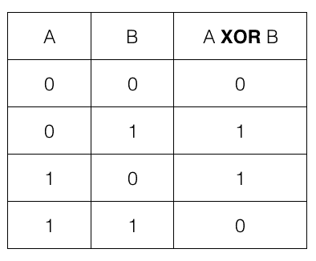
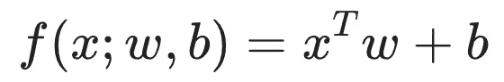
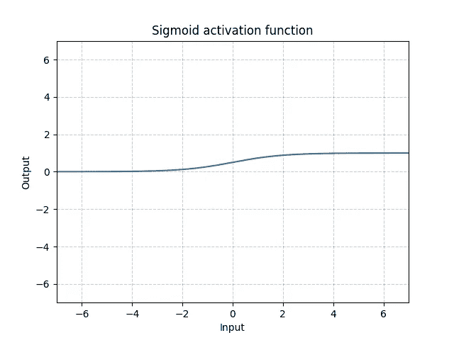
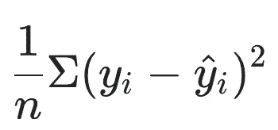

# 用 PyTorch 学习异或

> 原文：<https://medium.com/mlearning-ai/learning-xor-with-pytorch-c1c11d67ba8e?source=collection_archive---------2----------------------->

这是一个神经网络示例的重新创建，用于预测伊恩·古德菲勒、约舒阿·本吉奥和亚伦·库维尔在深度学习书中发现的 XOR 值。

以下是 XOR 真值表:



Source: [https://community.anaplan.com/t5/Idea-Exchange/Add-XOR-formula/idi-p/61192](https://community.anaplan.com/t5/Idea-Exchange/Add-XOR-formula/idi-p/61192)

我们希望根据两个输入 A 和 b 来预测输出。

起初，对于这样一个简单的任务，通过更新感知器的权重和偏差来训练它似乎是一个好主意。然而，XOR 不是非线性函数，因此感知器本身无法学习如何预测这一点。



以上是没有激活功能的单个感知器的等式。它取输入向量的转置，将其与权重向量相乘，并加上偏差向量。在这种情况下，输入向量是[0，0]、[0，1]、[1，0]或[1，1]。单独地，这个基本感知器，不管权重和偏差是什么，都不能准确地预测 XOR 输出，因为它是线性函数，而 XOR 不是。

以下是 PyTorch 中单个感知的代码:

```
# import libraries 
import torch 
import torch.nn as nn # define perceptron
linear = nn.Linear(2, 1) model_params = list(linear.parameters())  # returns weights and biasesprint('Perceptron Weights : ', model_params[0][0].data.numpy()) print('Perceptron Bias :', model_params[1].data.numpy()) >> Perceptron Weights: [0.6110505, 0.20031671]    
   Perceptron Bias: [-0.48146275]
```

请注意，权重和偏差是随机分配的。

这个感知器的输出很简单:([1。, 0.](转置)* [0.6110505，0.20031671])+[-0.48146275]= 0.1296

为了解决单个感知器是线性的这个问题，我们需要给网络增加另一层。这个额外的层被称为 sigmoid 函数。sigmoid 函数是一个非线性激活函数:



Source: [https://pytorch.org/docs/stable/generated/torch.nn.Sigmoid.html](https://pytorch.org/docs/stable/generated/torch.nn.Sigmoid.html)

如果在这个函数中输入 0，如上图所示，输出将是 0.5。代码示例如下所示:

```
import torch.nn.functional as Fprint(F.sigmoid(torch.tensor([0]))) >> tensor([0.500])
```

在上面的代码中，导入了包含 sigmoid 函数的 PyTorch 库“functional”。值为 0 的张量被传递给 sigmoid 函数，输出被打印出来。输出为 0.5。

在 sigmoid 激活函数之后，将添加另一个感知器作为最终层。这为数据创建了 3 层，每个感知器总共有 2 个权重和 2 个偏差:

```
class XOR(nn.Module): def __init__(self): super(XOR, self).__init__() self.linear = nn.Linear(2, 2) self.Sigmoid = nn.Sigmoid() self.linear2 = nn.Linear(2, 1) def forward(self, input): x = self.linear(input) sig = self.Sigmoid(x) yh = self.linear2(sig) return yh
```

上面的代码定义了一个张量大小为 2 x 2 的模型，输入到第一层。然后，第一个线性层输出大小为 2 x 2 的张量，该张量被传递给 sigmoid 函数。该 sigmoid 函数的输出也是一个 2×2 张量，然后被传递到第二线性层，该层输出大小为 1 的张量。

为了训练模型，大量的训练样本将被传递到网络中。网络将用随机权重和偏差初始化。在每个训练示例通过网络后，它将输出一个值，该值是在给定输入(x)的情况下对输出(yhat)的预测。该预测将与实际值(1 或 0)进行比较。

预测产量和实际产量之间的比较将在成本函数中进行。用于此的成本函数将是均方误差成本函数:



该函数简单地取实际值和预测值之间的平方差的平均值。

计算均方误差后，将使用成本函数的梯度更新权重和偏差，以更接近局部或全局最小值。优化的目的是最小化成本函数。当成本函数为 0 时，意味着所有预测值都与实际值相同。

以下是培训代码:

这个模型的完整代码可以在[这里](https://colab.research.google.com/drive/1sKJfB5YAfAUD9PU-SNDGlMdKa9M7yCcH?usp=sharing)找到。

```
xor_network = XOR()
epochs = 1000 
mseloss = nn.MSELoss() 
optimizer = torch.optim.Adam(xor_network.parameters(), lr = 0.03) all_losses = [] 
current_loss = 0 
plot_every = 50 

for epoch in range(epochs): 

    # input training example and return the prediction   
    yhat = xor_network.forward(Xs)

    # calculate MSE loss   
    loss = mseloss(yhat, y)

    # backpropogate through the loss gradiants   
    loss.backward()

    # update model weights   
    optimizer.step()

    # remove current gradients for next iteration   
    optimizer.zero_grad() 

    # append to loss   
    current_loss += loss  

    if epoch % plot_every == 0:       
        all_losses.append(current_loss / plot_every)       
        current_loss = 0 

    # print progress   
    if epoch % 500 == 0:     
        print(f'Epoch: {epoch} completed')
```

这个模型的完整代码可以在[这里](https://colab.research.google.com/drive/1sKJfB5YAfAUD9PU-SNDGlMdKa9M7yCcH?usp=sharing)找到。

在正常情况下，成本函数为 0 意味着对训练数据的高偏差，这将是一个问题。然而，对于只有两个可能的输入和输出被用作例子的小真值表来说，这不是问题。点击阅读更多关于减少偏差[的信息。](https://machinelearningmastery.com/introduction-to-regularization-to-reduce-overfitting-and-improve-generalization-error/)

有许多其他的神经网络结构可以被训练来预测 XOR，这只是一个简单的例子。

在我的博客中查看更多信息。