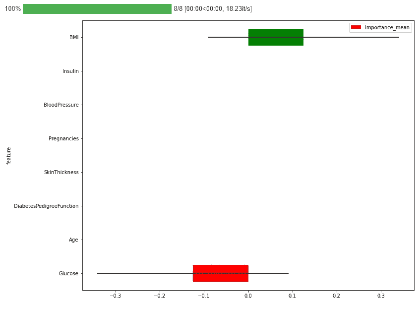

# 忽略一个特征(LOFO)的重要性

> 原文：<https://medium.com/mlearning-ai/leave-one-feature-out-lofo-for-feature-importance-3ed04a60ae40?source=collection_archive---------3----------------------->

## 使用 LOFO 计算数据集中要素的重要性

Feature Importance (Source: By Author)

随着创建机器学习或深度学习的不同算法的出现，模型并不那么困难。我们只需要了解数据集中的目标变量是什么，创建一个合适的模型并运行它。当模型被训练时，它通常…