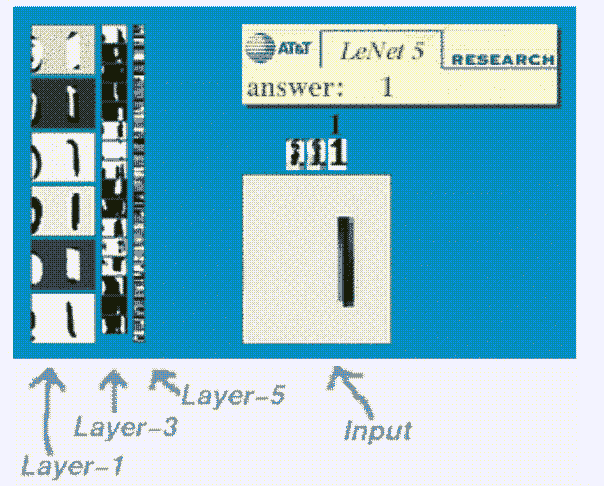
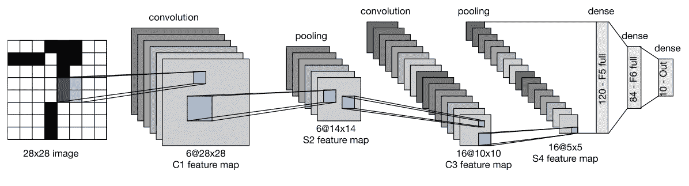
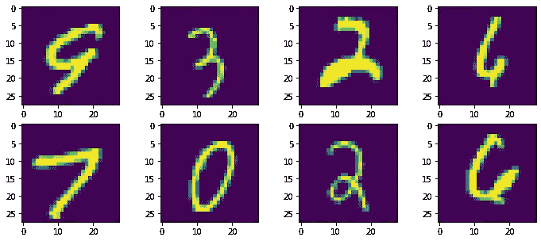
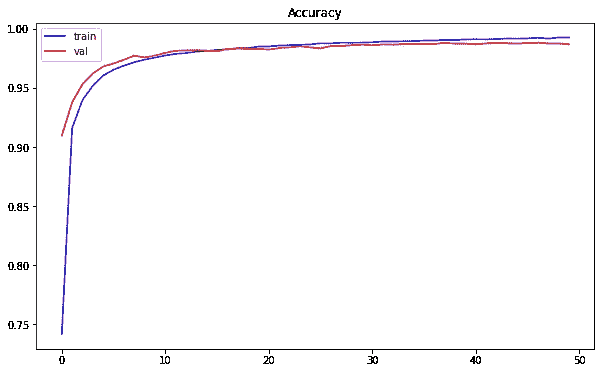
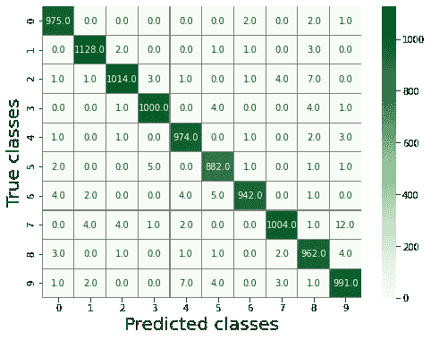
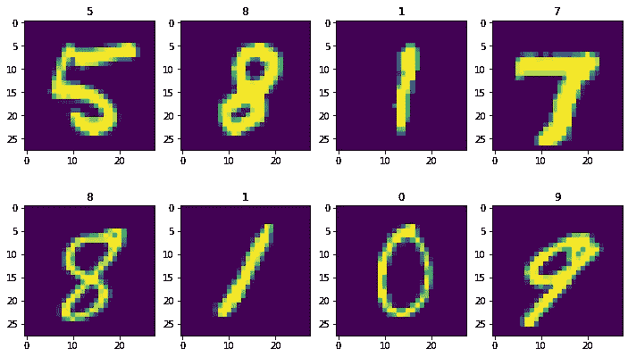

# LeNet 和 MNIST 手写数字识别

> 原文：<https://medium.com/mlearning-ai/lenet-and-mnist-handwritten-digit-classification-354f5646c590?source=collection_archive---------0----------------------->

LeNet(或称 LeNet-5)是 Yann LeCun、Léon Bottou、Yoshua Bengio 和 Patrick Haffner 在 1989 年提出的一种卷积神经网络结构。该网络的第一个目的是识别图像中的手写数字。成功应用于美国邮政提供的手写邮政编码识别 [[1]](http://yann.lecun.com/exdb/publis/pdf/lecun-90c.pdf) 。



[Source](http://yann.lecun.com/exdb/lenet/)

在本文中，我们将探索该网络的体系结构及其在 MNIST 手写数字图像中的应用。

# 一、建筑

LeNet 由 2 个部分组成:

*   第一部分包括交替放置的两个卷积层和两个池层。
*   第二部分由三个完全连接的层组成。

下图描述了 LeNet 的体系结构:



LeNet architecture. [Source](https://d2l.ai/chapter_convolutional-neural-networks/lenet.html#lenet)

在上图中，Cx、Sx、Fx 分别对应于卷积层、子采样层(也称汇集层)和全连接层，其中 x 表示层索引。

*   输入是大小为 28 × 28 的图像
*   C1 是第一个具有 6 个 5× 5 卷积核的卷积层。
*   S2 是输出 6 路 14 × 14 图像的汇聚层。在这种情况下，池窗口大小是 2 × 2 的正方形矩阵。
*   C3 是一个卷积层，有 16 个 5 × 5 大小的卷积核。因此，该层的输出是 16 幅大小为 10 × 10 的特征图像。
*   S4 是一个池层，池窗口大小为 2 × 2。因此，通过该层的图像尺寸减半，它输出 16 幅 5 × 5 尺寸的特征图像。
*   C5 是具有大小为 5 × 5 的 120 个卷积核的卷积层。由于该层的输入与内核大小相同，因此该层的输出大小为 1 × 1。输出中的通道数等于内核的通道数，即 120。因此，该层的输出是 120 幅 1 × 1 大小的特征图像。
*   F6 是具有 84 个神经元的完全连接层，所有神经元都连接到 C5 的输出。
*   输出层由 10 个神经元组成，对应于类的个数(从 0 到 9 的个数)。

# 二、议案 LeNet 在 MNIST 数据识别中的应用

在本部分中，我们将 LeNet 应用于 MNIST 手写数字图像的识别。该网络构建于 Keras 平台:

## 1.正在加载 MNIST 数据集

随机可视化训练集中的一些图像:



## 2.预处理数据

此任务包括以下步骤:

*   将图像重塑为所需的 Keras 大小
*   将整数值转换为浮点值
*   标准化数据
*   热门编码标签

## 3.构建 LeNet 模型

```
LeNet_model = LeNet()
LeNet_model.summary()Model: "sequential"
_________________________________________________________________
Layer (type)                 Output Shape              Param #   
=================================================================
conv2d (Conv2D)              (None, 28, 28, 6)         156       
_________________________________________________________________
max_pooling2d (MaxPooling2D) (None, 14, 14, 6)         0         
_________________________________________________________________
conv2d_1 (Conv2D)            (None, 10, 10, 16)        2416      
_________________________________________________________________
max_pooling2d_1 (MaxPooling2 (None, 5, 5, 16)          0         
_________________________________________________________________
flatten (Flatten)            (None, 400)               0         
_________________________________________________________________
dense (Dense)                (None, 120)               48120     
_________________________________________________________________
dense_1 (Dense)              (None, 10)                1210      
=================================================================
Total params: 51,902
Trainable params: 51,902
Non-trainable params: 0
_________________________________________________________________
```

## 4.培训模式

```
train_model(LeNet_model, X_train, y_train, X_test, y_test)Epoch 1/50
468/468 [==============================] - 35s 5ms/step - loss: 1.5654 - accuracy: 0.5390 - val_loss: 36.5179 - val_accuracy: 0.9097
Epoch 2/50
468/468 [==============================] - 2s 4ms/step - loss: 0.3126 - accuracy: 0.9072 - val_loss: 26.5710 - val_accuracy: 0.9378
...................
...................
...................
Epoch 49/50
468/468 [==============================] - 2s 4ms/step - loss: 0.0249 - accuracy: 0.9927 - val_loss: 6.1983 - val_accuracy: 0.9875
Epoch 50/50
468/468 [==============================] - 2s 4ms/step - loss: 0.0262 - accuracy: 0.9922 - val_loss: 6.0475 - val_accuracy: 0.9869
313/313 [==============================] - 1s 2ms/step - loss: 6.0378 - accuracy: 0.9869
```



Accuracy on training and testing set

## 5.预言；预测；预告

确定混淆矩阵:



随机可视化测试集中的一些图像及其预测标签:



# 三、议案结论

我们已经发现了 LeNet 模型的架构以及如何在 Keras 中实现它。该模型成功地应用于 MNIST 手写数字图像的分类，取得了 98.69%的分类性能。在接下来的文章中，我们将发现一些现代卷积模型以及它们在更复杂问题中的应用。

希望这篇文章对你有帮助。

感谢阅读！

***本文 Github 代码***:[https://Github . com/khu yenle-maths/LeNet _ model _ with _ MNIST _ recognition/blob/main/LeNet _ with _ MNIST _ recognition . ipynb](https://github.com/KhuyenLE-maths/LeNet_model_with_MNIST_recognition/blob/main/LeNet_with_MNIST_recognition.ipynb)

***我的博客页面***:[https://lekhuyen.medium.com/](https://lekhuyen.medium.com/)

________________________________________________________________

## 参考:

[1] Le Cun，y .，Boser，b .，Denker，J. S .，Henderson，d .，Howard，R. E .，Hubbard，w .，& Jackel，L. D. (1989 年 1 月)。基于反向传播网络的手写数字识别。第二届国际神经信息处理系统会议论文集*(第 396-404 页)。*