# 在 Python 中使用精度召回曲线的经验教训

> 原文：<https://medium.com/mlearning-ai/lessons-learned-using-precision-recall-curve-in-python-df003a0db4eb?source=collection_archive---------1----------------------->

这篇文章将讨论我参与的一个迷你项目，以及我从 Python 创建精确召回曲线中学到的经验。

(注意:这篇文章的目的是展示这个项目的优点和缺点)

Dallas, Texas taken on November 22, 2021\. Photo Credit: Muneeza Qureshi

***我的迷你项目目的***

我的迷你项目的目的是评估 ICD-10 编码的敏感性和阳性预测值，该编码用于将新冠肺炎病例与阳性聚合酶链式反应测试结果进行比较。公共健康的意义是新冠肺炎的风险。然而，迄今为止，很少有研究确定 ICD-10 编码在医院数据库中新冠肺炎病例中的敏感性和 PPV。这些研究的一个例子是 Wu 等人的研究结果，该研究显示在加拿大郊区医院中一个 10 编码(U07.1)的估计有效性范围为 49%至 98%。这个范围是值得关注的，因为正确使用代码的有效性应该很高(超过 80%)(1)。此外，很少有研究调查来自非医疗机构的大型公共患者人群数据库(如 Optum 数据库)的敏感性和 PPV。该项目旨在填补这一知识空白。

*输入数据*

原始数据集 COVID Optum 数据库来自 UTHealth。该数据集提供了许多重要的非识别患者信息，包括诊断代码、测试结果、测试日期、订单日期、测试名称和其他医疗信息。该数据集有大约 100 万个观察值，这对于最终项目来说是一个很大的数据集。因此，我通过随机抽样只使用了整个数据集的 0.04%左右。这项研究包括 8 列近 40，000 个观察结果。SARS-新冠肺炎检验(1 代表阳性，0 代表阴性)作为响应变量属于二元分布。此外，2 个可解释变量是分类变量。

*预期输出数据*

将计算没有分类器的混淆矩阵。响应或“y”变量将是阳性和阴性 SARS-COVID19 测试。预测变量或“X”变量将是 U071 的诊断代码和其他诊断代码。为了平衡混淆矩阵，逻辑回归混淆矩阵和精确回忆曲线将用于观察预测变量和反应变量之间的关系。用具有 F1 评分和 AUC 评分的逻辑回归(LR)模型评估整体模型拟合度。

***编程组件***

步骤 1:导入库

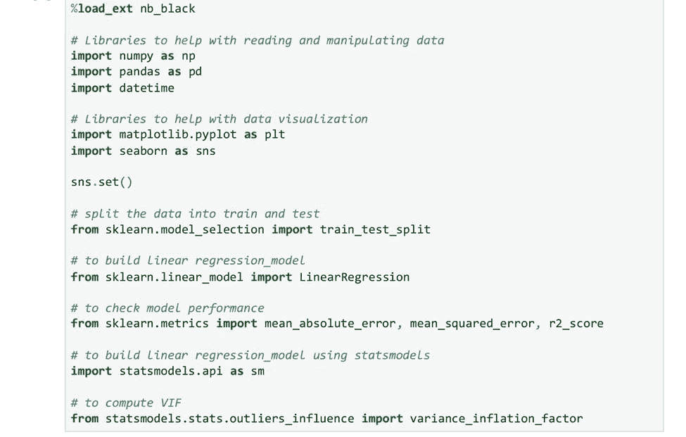

步骤 2:导入 csv 文件。该 csv 文件来自 UTHealth COVID Optum 数据库。

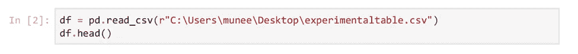

步骤 3:将 PTID 指定为数字

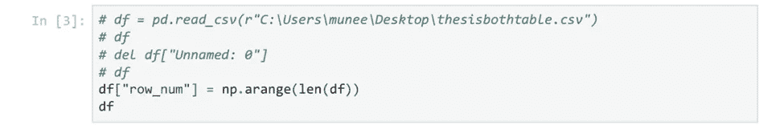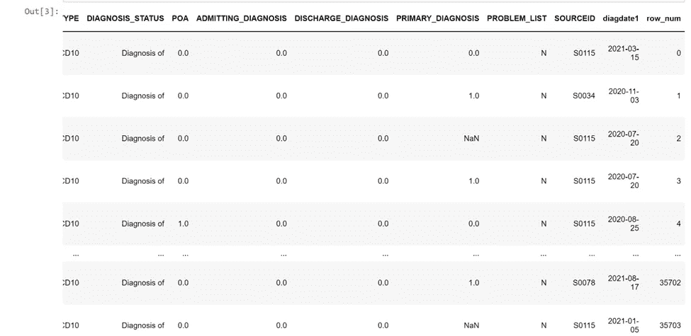

步骤 4:在名为“TEST_RESULT_Dummy”的新列中，将“TEST_RESULT”重新编码为 1 表示阳性，0 表示阴性

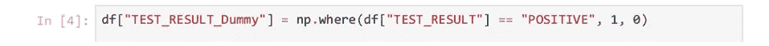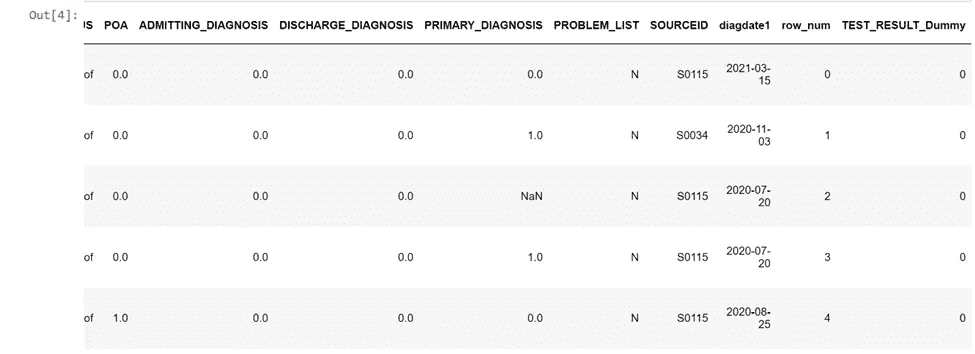

步骤 5:在新列“诊断 _CD_Dummy”中将“诊断 _CD”重新编码为 U071 的 1 和非 U071 的 0

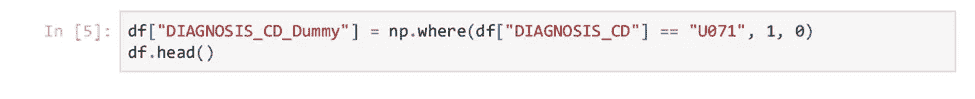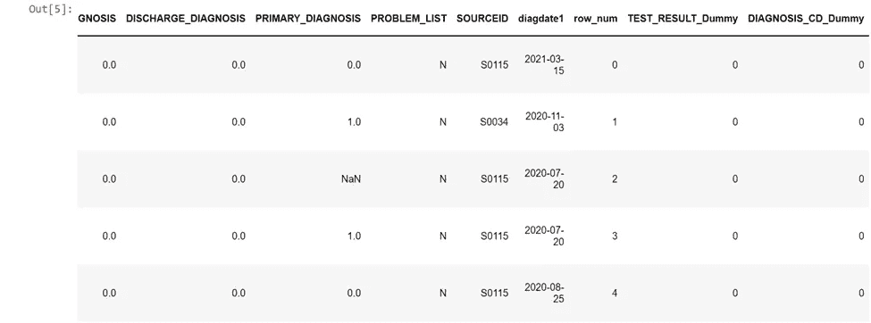

步骤 6:通过计算行数，从 df 计算灵敏度、PPV、NPV 和特异性

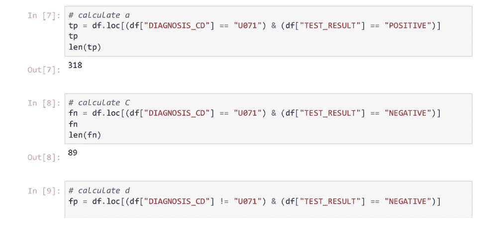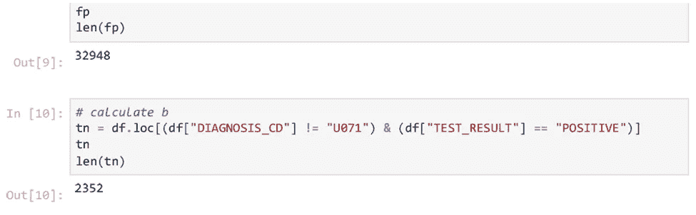

步骤 7:使用代码 df.info()查看每个变量的 dtype

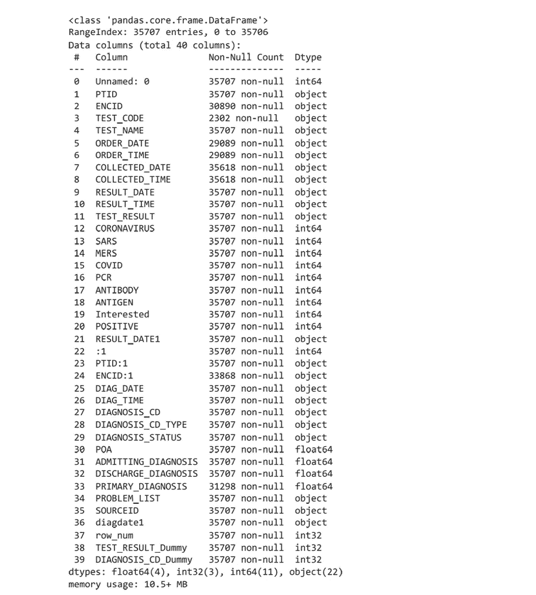

步骤 8:导入库来创建混淆矩阵

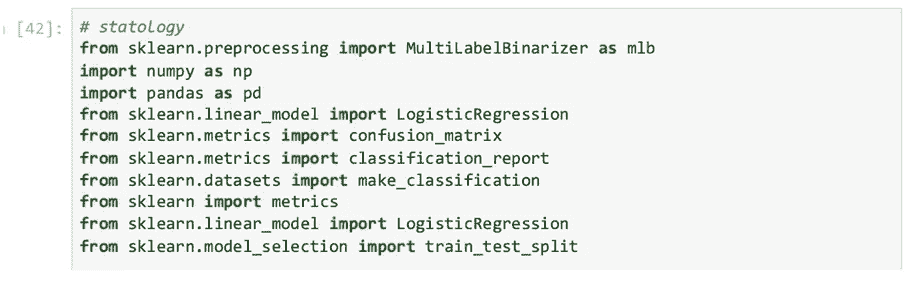

步骤 9:画出没有任何分类器的原始混淆矩阵

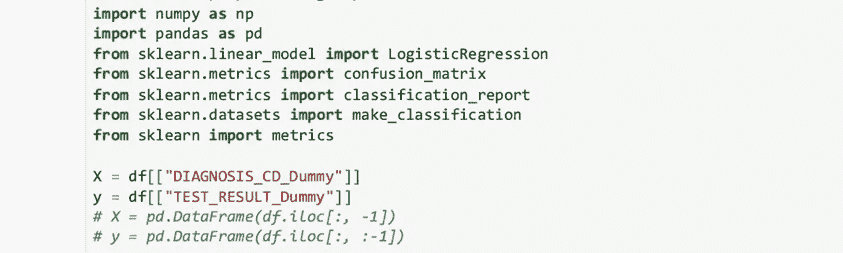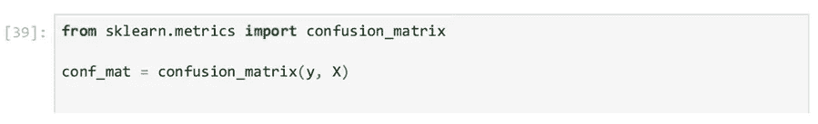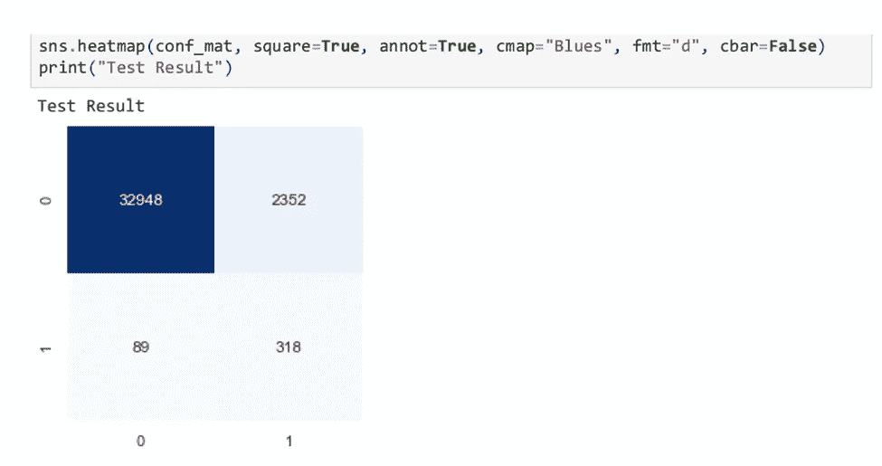

步骤 10:创建逻辑回归混淆矩阵以适应模型

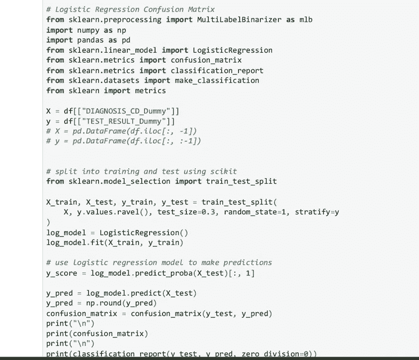

步骤 11:计算精确度、召回率、阈值，绘制精确度-召回率曲线，并绘制具有 F1 分数和 AUC 的逻辑回归模型

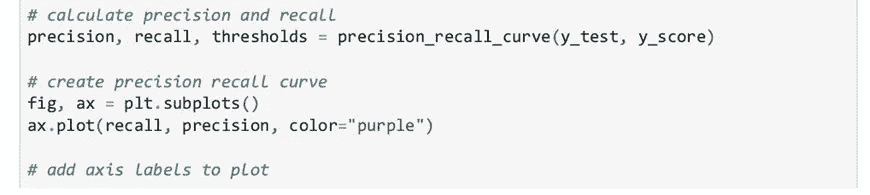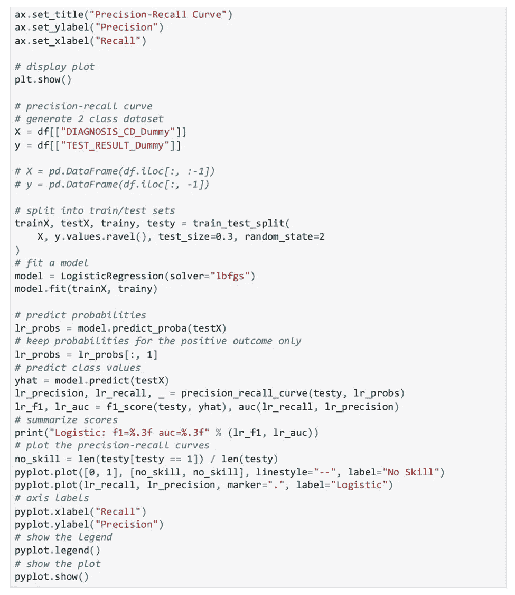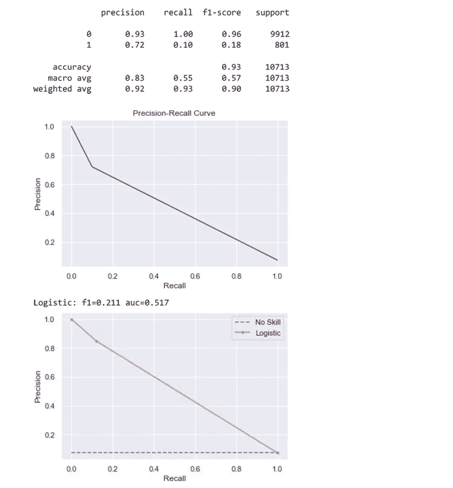

*吸取的经验教训*

创建原始混淆矩阵和 LR 混淆矩阵的步骤是/可能是不正确的，因为 LR 模型显示它是一个坏模型。此外，在混淆矩阵之间和创建 LR 模型的过程中有(或可能有)遗漏的步骤。回过头来看，如果将代码分成更多的片段，而不是 Python 中每个单元的大片段，会更好。这将有助于增加更多的步骤来创建最佳拟合的精确召回曲线模型。

我希望你喜欢这篇文章。请随意在精确召回曲线上留下评论或任何建议。如果你想看到更多这样的内容，喜欢这个帖子，请给我一个关注！感谢您的阅读！

参考资料:

1.  Wu G，D'Souza A，Quan H，Southern D，Youngson E，Williamson T，Eastwood C，和 Xu y . 10 编码对在加拿大住院或急诊就诊的患者的有效性:一项回顾性队列研究。BMJ 公开赛。2022;12(1):1–7.

 [## Mlearning.ai 提交建议

### 如何成为 Mlearning.ai 上的作家

medium.com](/mlearning-ai/mlearning-ai-submission-suggestions-b51e2b130bfb)