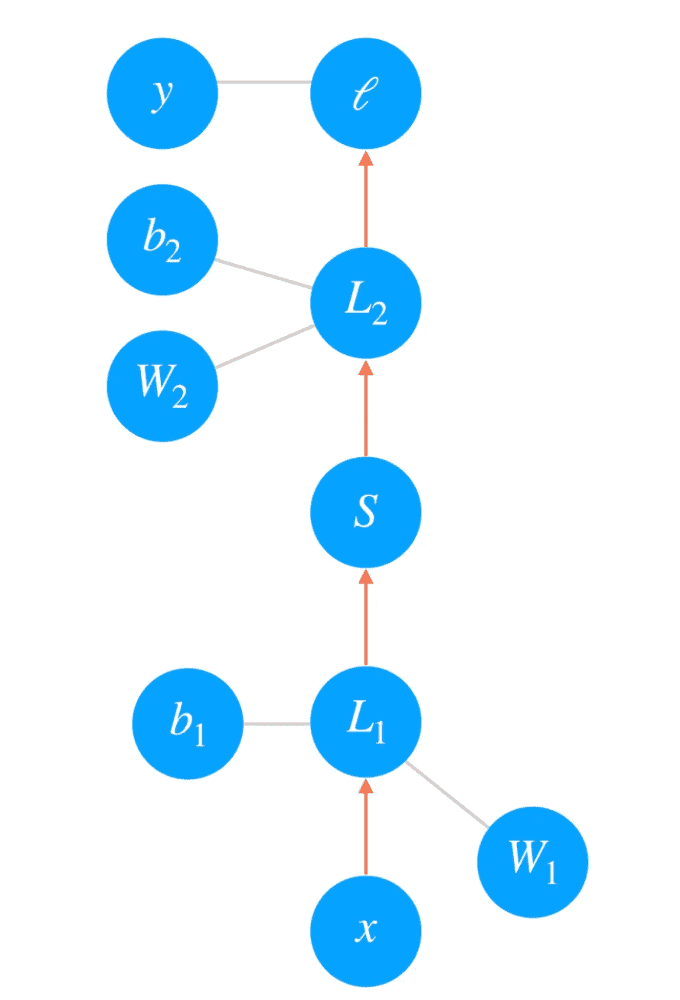
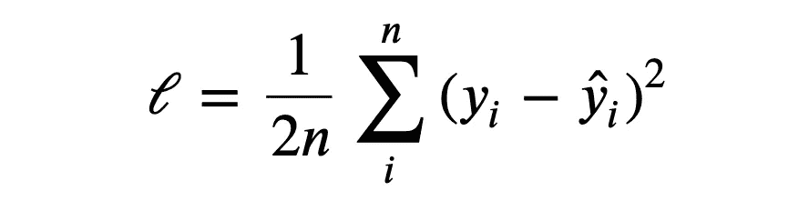
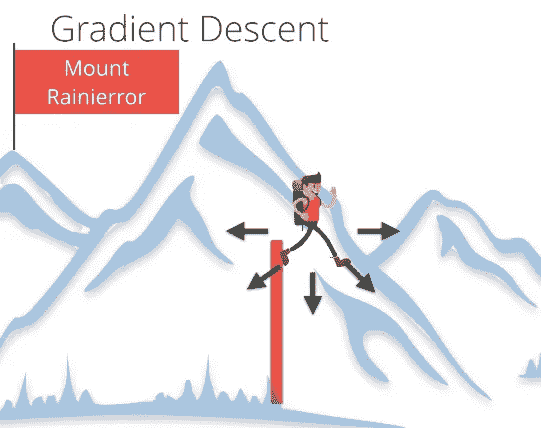
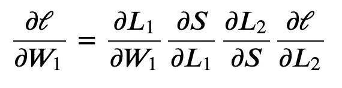
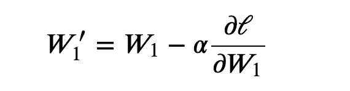
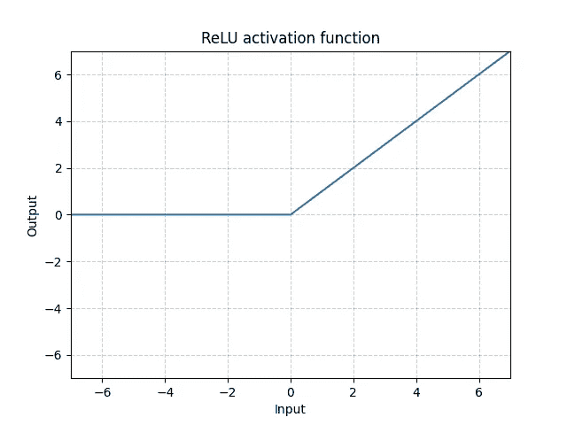
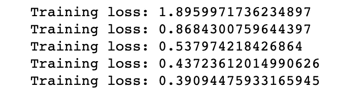
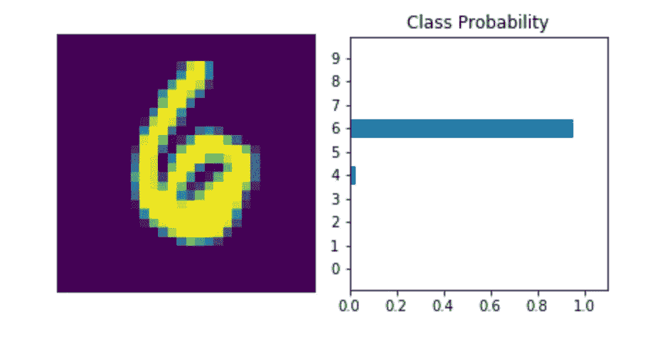

# 让我们在 PyTorch 中构建一个简单的对象分类任务

> 原文：<https://medium.com/mlearning-ai/lets-build-a-simple-object-classification-task-in-pytorch-dea3e6584dd5?source=collection_archive---------3----------------------->

在阅读这个故事之前，我希望你已经阅读了我之前的文章，这些文章将提供关于 [***的基本知识，通过简单的练习理解深度学习——py torch***](/@sandeepkirwai/understand-deep-learning-with-a-simple-exercise-pytorch-4be98cd1ca48)**和* [***DL 感知器工作***](https://becominghuman.ai/do-you-want-to-know-how-perceptron-algorithm-works-internally-e45b757bd19d)*

**

*Image from Udacity Deep Learning Nano Degree Curriculum*

*这里我们将尝试对手写数字(MNIST 数据集)进行分类。在实现对象分类模型之前，我们将首先尝试理解神经网络的几个核心概念，这将有助于我们在实现模型时理解。*

## *前馈网络*

*如果我们试图从单词本身来理解，意思是网络谁在转发方向上工作，这包括网络输入、权重和偏差，它们将被馈送到步骤/激活功能以获得期望的输出/预测。*

**

*FeedForwar pass*

*通常，我们通过向网络显示真实数据的例子(这里是手写数字的图像)来训练网络，然后调整网络参数，使其近似于阶跃/激活函数。
要找到这些参数，我们需要知道网络对实际输出的预测有多差。为此，我们计算一个**损失函数**(也称为成本)，一个预测误差的度量。例如，均方损失常用于回归和二元分类问题。*

**

*Loss calculation*

*其中 n 是训练样本的数量，yi 是真实标签，
是预测标签。*

## *梯度下降*

*通过最小化关于网络参数的这种损耗，我们可以找到损耗最小并且网络能够以高精度预测正确标签的配置。我们用一个叫做**梯度下降**的过程找到这个最小值。梯度是损失函数的斜率，指向变化最快的方向。为了在最少的时间内达到最小值，我们要沿着梯度(向下)走。你可以把这想象成沿着最陡的斜坡下山。*

**

*Image from Udacity Deep Learning Nano Degree Curriculum*

## *反向传播*

*如果我们是建立单层，梯度下降很容易实现。然而，对于更深层次的多层神经网络来说，就像我们已经建立的那样，这就更复杂了。*

*多层网络的训练是通过**反向传播**完成的，这实际上是微积分中链式法则的一个应用。在前馈通道完成后，后馈开始起作用，预测不符合预期，我们将尝试调整损失。如果我们把一个两层网络转换成一个图形表示，这是最容易理解的。*

**

*Image from Udacity Deep Learning Nano Degree Curriculum*

*在网络的正向传递中，我们的数据和操作在这里是自下而上的。我们将输入𝑥通过线性变换 L1，权重为 W1，偏差为 b1。假设，输出然后经过 sigmoid 操作 S 和另一个线性变换 L2。最后，我们计算ℓ.的损失我们用这个损失来衡量网络的预测有多糟糕。目标是调整权重和偏差，使损失最小化。*

*为了用梯度下降来训练权重，我们通过网络反向传播损失的梯度。每个操作在输入和输出之间都有一些梯度。当我们向后发送梯度时，我们将引入的梯度与操作的梯度相乘。从数学上来说，这实际上就是用链式法则计算损耗相对于重量的梯度。*

*所以最终的重量损失与初始重量的比值是这样的*

**

*现在我们尝试计算新更新的权重，使用具有一些学习率的梯度:*

**

*学习率α被设置为使得权重更新步长足够小，使得迭代方法稳定在最小值。*

*在阅读了更多关于神经网络训练的内容后，现在我们准备开始实现我们的对象分类神经网络模型。*

*是时候进行实际的代码实现了*

*为了开始实现，我们首先需要导入 torch 库，并开始编写 NN，我们将需要更多的支持库*

*   *神经网络将提供神经网络结构的基本构件*
*   *`[torchvision](https://pytorch.org/vision/stable/index.html#module-torchvision)`包由流行的数据集、模型架构和计算机视觉的通用图像转换组成。*
*   *Transform 也是 torchvision 提供的工具之一，它将用于操纵数据，并使其适合于训练。像 Pytorch 这样的例子只适用于张量，在这里我们可以传递给 Tensor，它会将现有的输入数据类型转换为张量，规范化有助于 CNN 更好地执行。*
*   *标准化有助于获得一定范围内的数据，并减少偏斜，从而有助于更快更好地学习。此外，为了加入多个任务，我们可以使用 Compose 方法作为管道。*
*   *下一步是从 torchvision 加载 MNIST 数据集并应用定义的变换。*
*   *`Dataset`存储样本及其相应的标签，`DataLoader`在`Dataset`周围包裹一个可重复标签，以便于获取样本。*

*从神经网络模块，我们正在使用顺序的方法，就像一个管道的架构层。
我在这里添加了 3 个隐藏层，在每层的末尾添加了激活功能。*

**现在* ***大问题，*** *如何识别有多少层及其维度以及我们需要使用哪个激活函数。坦率地说，这只是一个简单的实验基础，意味着你试图从任意维度的 2 层开始(通常维度是 28 或 64 的乘积)，然后尝试训练模型，然后通过评估模型结果来逐渐增加或减少层数。**

> ***根据我在互联网上学习和阅读后的经验，我发现在中间隐藏层 ReLU 激活函数效果最好，大多数研究人员在他们发表的论文中也提到了相同的激活。
> 现在从哪个维度开始，通常我在第一个隐藏层中选择更大的维度，比如上面我提到的 784 作为开始，128 作为结束(两者都是 28 的倍数),然后我们可以分别添加更多的层。***

*在顺序模块中*

*   *nn。线性意味着简单的密集/神经网络层，其对输入数据应用线性变换:y = xA^T + b*
*   *nn。ReLU means 按元素应用校正的线性单位函数:
    ReLU(x) = (x)^+ = max(0，x)范围从 0 到 x*

**

*[Source](https://pytorch.org/docs/stable/generated/torch.nn.ReLU.html#torch.nn.ReLU)*

*   *nn。LogSoftmax:通常对于网络最底层的任何分类问题，Softmax 激活函数是给出所有类别概率的最佳组合。但是对于分类问题，LogSoftmax 比普通的 Softmax 要好。[来源](https://datascience.stackexchange.com/questions/40714/what-is-the-advantage-of-using-log-softmax-instead-of-softmax)*
*   *nn。LLLoss:对于 log-softmax 输出，最适合计算损失的是负对数似然损失，`nn.NLLLoss` ( [文档](https://pytorch.org/docs/stable/nn.html#torch.nn.NLLLoss))。*
*   *优化器:我们需要开始训练的最后一部分，是一个优化器，我们将使用它来更新梯度的权重。我们从 PyTorch 的`[optim](https://pytorch.org/docs/stable/optim.html)` [包](https://pytorch.org/docs/stable/optim.html)中获得这些。例如:可以使用`optim.SGD`的随机梯度下降。*

*这里我们提到了随机时期 5 意味着 5 次迭代将训练一个模型来学习输入模式。*

*   *从我们在上面定义的训练加载器，我们迭代图像和各自的标签*
*   *下一步是展平输入平均值，将输入转换为矢量(1 维)*
*   *在开始训练之前，我们将确保优化器应该被赋值为零，所以我们增加了`optimizer.zero_grad()`*
*   *现在，让我们通过将图像传递到模型中来开始训练，并获得输出。*
*   *根据预测产量和实际产量计算损失`criterion(output, labels)`*
*   *计算完损失后，接下来就是启用反向传播`loss.bacwards()`*
*   *相应更新重量和偏差`optimizer.step()`*
*   *门店最终损失`running_loss += loss.items()`*

**

*training loss calculation over each epoch*

*从上面的结果中，我们可以清楚地看到，反向传播实际上是有效的，并且随着每个时代的到来，减少了训练损失。也许随着更多的纪元，损失会更接近于零(局部最小值)*

*现在，在对模型进行训练之后，是时候预测我们的模型是否在对数字进行分类了。*

*   *这里首先要提到的是，我们不需要反向传播`torch.no_grad()` ，因为这里我们只需要根据训练好的模型进行预测*
*   *将单个图像传递给模型以获得对数概率*
*   *应用对数概率的指数得到类的实际概率*
*   *查看结果概率*

**

*看起来很棒。我们的网络找到了模式，并以最大概率预测了正确的类
这里我们尝试了仅具有几个层的简单神经网络，但是当我们将处理复杂的数据集时，那时我们将需要处理更完整的体系结构，或者我可以说已经在大数据集上训练过的 transformer 模型具有非常大的体系结构。
主要难点在于包含 GPU 的大型复杂体系结构的训练时间，可能需要一天以上的时间来训练它们，因此建议将已经训练好的模型用于复杂任务。*

*我希望您已经对对象分类问题以及在 Pytorch 中实现它们所涉及的步骤有了相当多的了解。*

*git Repo—[https://github . com/sndpkirwai/deep-learning-py torch/blob/main/intro-to-py torch/nn-object-class ification-py torch . ipynb](https://github.com/sndpkirwai/deep-learning-pytorch/blob/main/intro-to-pytorch/nn-object-classification-pytorch.ipynb)*

* [## Mlearning.ai 提交建议

### 如何成为 Mlearning.ai 上的作家

medium.com](/mlearning-ai/mlearning-ai-submission-suggestions-b51e2b130bfb)*