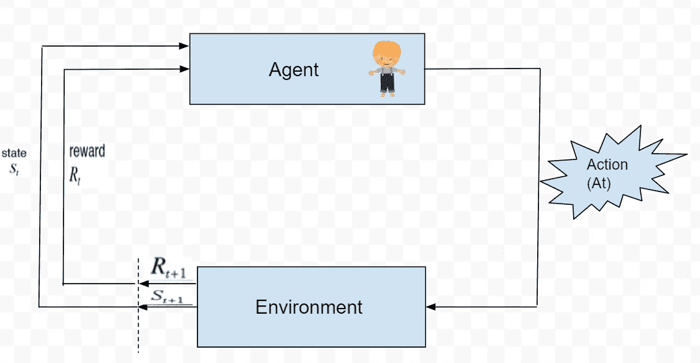

# 让我们解码强化学习

> 原文：<https://medium.com/mlearning-ai/lets-decode-reinforcement-learning-fb0159de2bb9?source=collection_archive---------6----------------------->

在强化学习中，我们有一个代理，它在一个环境中采取行动，并根据该行动获得正奖励或惩罚(负奖励)。

我们最终想要什么？

当然 ***我们希望一系列的行动能让我们获得最大的回报。***

让我们用一个真实的例子来解释这一点。

**比如:**假设你要教你的宠物达到一个目标。因此，在特定的情况下，可能会有不同的行动，比如如果他采取这种行动(a1)，他将获得正奖励(比如两块骨头)，如果他采取其他行动(a2)，他将获得负奖励(比如我们从他收集的总数中拿走 1 块骨头)。所以你的宠物想要最大的奖励，也就是他想要收集的最大数量的骨头。因此，在这个过程中，你的宠物将学会在特定的情况下采取什么样的行动来给他带来最大的回报。

**要点:**所以你的宠物正在从它自己的动作中学习，因为这是一种试错的方法。

**现在让我们用图解的方式:**

**让我们解码上图中的术语..**

**Agent**

**代理**是正在探索环境并将采取行动的人。

**环境**是代理人的世界，代理人将在那里运作。

**动作**就像代理正在采取的一个(步骤或移动)(假设有两个可能的动作，左转或右转，代理可以选择其中任何一个)。

**状态**是代理的当前位置/地点。

**奖励**是环境给予代理人的反馈。可以是正奖励，也可以是负奖励(也就是惩罚)。

**策略**是指将代理的状态映射到动作的过程。

**如何用马尔可夫决策过程公式化 RL 问题？**

1.  首先，它是描述一个环境的数学框架。
2.  马尔可夫决策过程由 ***状态、行动、奖励、状态转移函数*** 即 **P(新状态|当前状态，行动)**组成，它定义了从当前状态转移到新状态的转移概率，并受到我们所选择的行动的影响。
3.  因此，下一个状态取决于当前状态和动作，而不是之前的状态和动作。它满足马尔可夫性质，因此得名马尔可夫决策过程。

***总结:***

马尔可夫决策过程由一个 4 元组定义，它包括

**(S，A，Pa，Ra)**

1.  **状态，**
2.  **动作，**
3.  **概率(新状态|当前状态，动作)，**
4.  **奖励**

 [## Mlearning.ai 提交建议

### 如何成为 Mlearning.ai 上的作家

medium.com](/mlearning-ai/mlearning-ai-submission-suggestions-b51e2b130bfb)