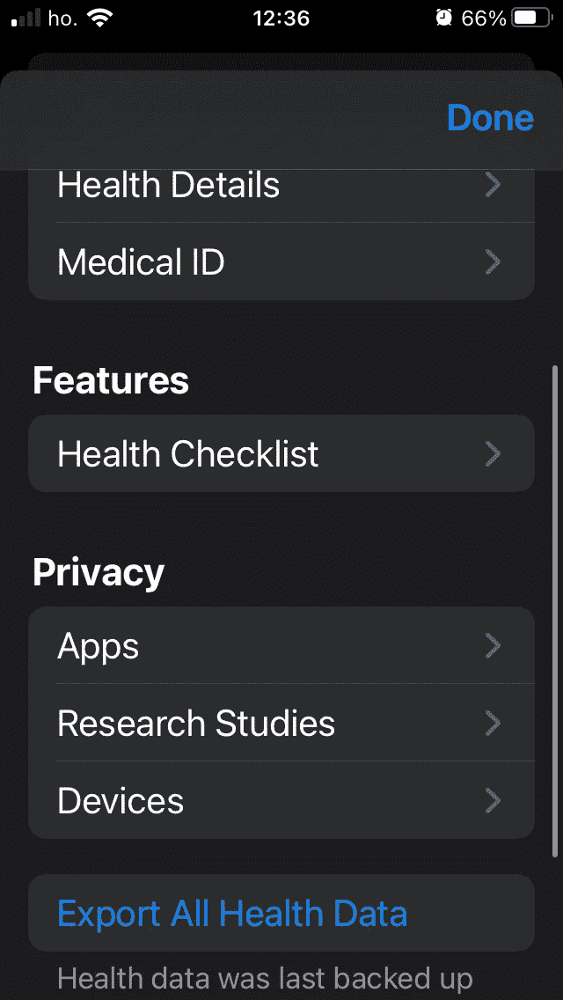
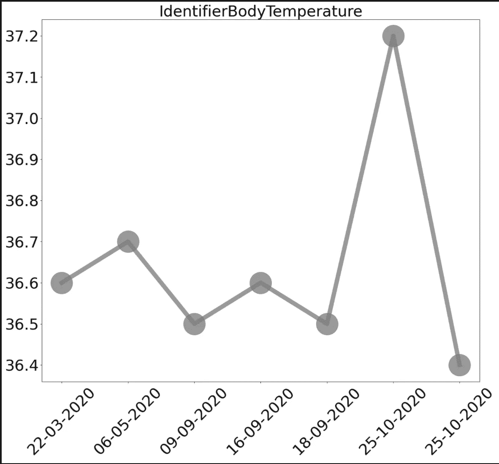
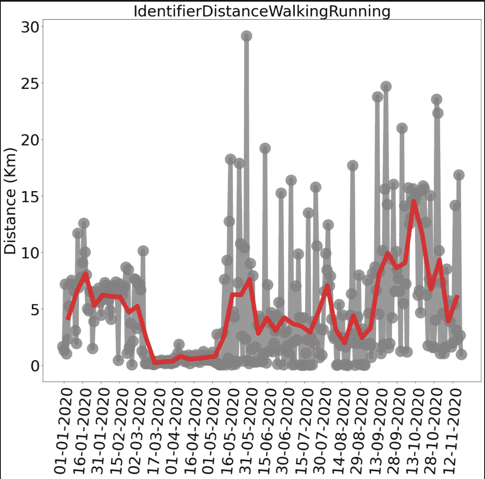
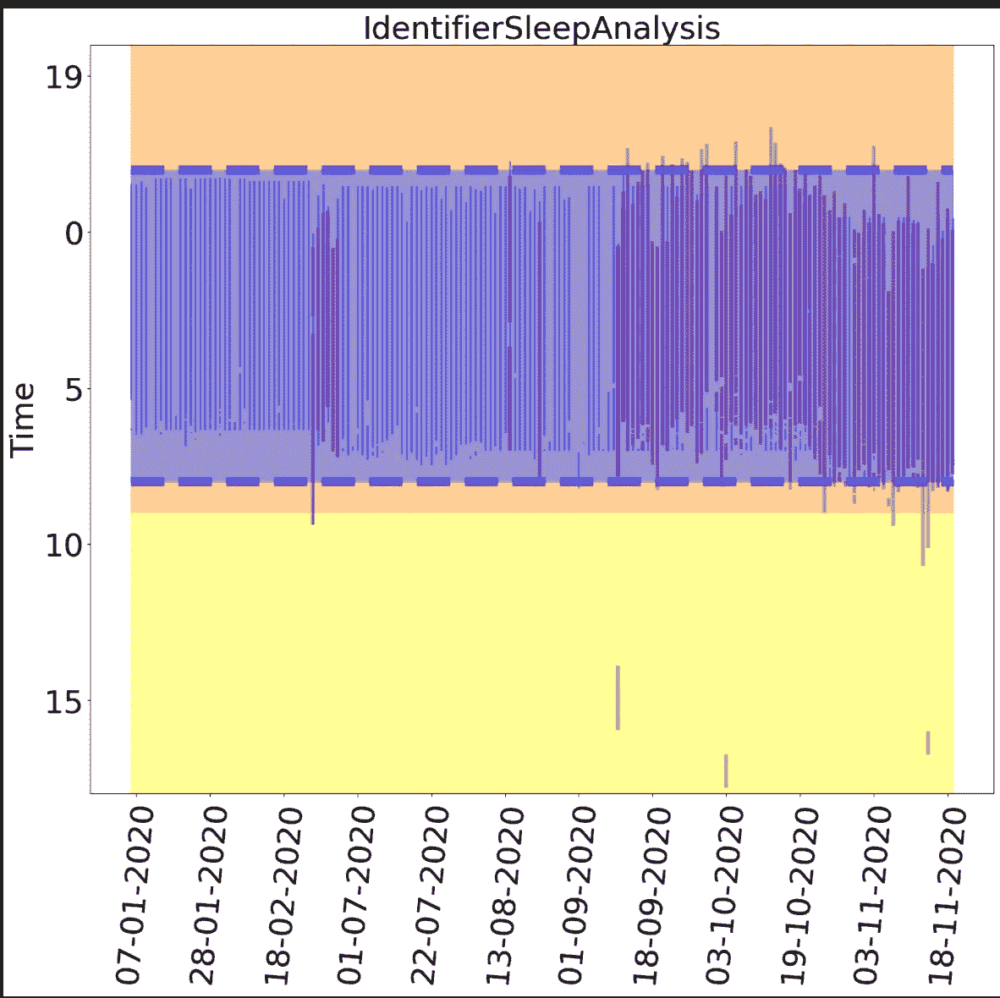

# 让我们挖掘那些苹果健康数据

> 原文：<https://medium.com/mlearning-ai/lets-have-fun-with-those-apple-health-data-91a0f7f07447?source=collection_archive---------2----------------------->


Photo by [Aron Visuals](https://unsplash.com/@aronvisuals?utm_source=medium&utm_medium=referral) on [Unsplash](https://unsplash.com?utm_source=medium&utm_medium=referral)

## 将这些数据从你的手机中移出，获取信息

我们很多人口袋里都有一部 iPhone，它会持续跟踪我们的活动。记录的信息的一些例子是:**步数**、**距离**跑步、体温**温度**、饮食行为等等。

当然，这同样适用于其他品牌的设备，但这里我们将讨论如何特别从 Apple Health 导出。

内含的[苹果健康](https://www.apple.com/ios/health/)应用收集了所有这些数据，作为一名数据科学家，让我们看看我们能从它们身上学到什么。

# 获取数据

在进行分析之前，首先要做的是获取数据。这可以通过苹果健康数据轻松获取。遵循[导出数据指南](https://support.apple.com/en-gb/guide/iphone/iph27f6325b2/ios)我们的健康数据可以导出到 XML 文件。



Export All Health Data. Image by author.

## XML 解析器

使用 [Julia](https://julialang.org/) lightXML 包可以读取导出的数据并开始分析它们。这个包能够*解析*一个 xml 文件，并用整个数据集构建一个树。

[](https://github.com/JuliaIO/LightXML.jl) [## JuliaIO/LightXML.jl

### 这个包是 libxml2 的一个轻量级 Julia 包装器，它提供了一个包含功能的最小接口…

github.com](https://github.com/JuliaIO/LightXML.jl) 

从 Apple 导出的文件有一个名为 *HealthData* 的**根**，其中包含设备中所有可用的条目。

```
xdoc = parse_file(“export.xml”)# get the root elementxroot = root(xdoc) # an instance of XMLElement# print its nameprintln(name(xroot)) # this should print: HealthData
```

健康数据有很多孩子，其中一个有它的**标签**。标签描述了条目中数据的种类。

可用键的一些例子是:

*   HKQuantityTypeIdentifierBodyTemperature
*   hkquantitypeidentifierdistancewalking running
*   HKQuantityTypeIdentifierHeartRate
*   hkquantitypeidentifierstepcount
*   hkquantitypeidentifiersingheartrate
*   hkquantitypeidentifierbloodpres
*   …

完整的列表可从[苹果文档](https://developer.apple.com/documentation/healthkit/data_types)中获得。

```
for child in child_nodes(xroot) if is_elementnode(child)
    e = XMLElement(child)  # this makes an XMLElement instance node_name = name(e) if node_name == "Record" e_dict = attributes_dict(e)
```

特别地，这些孩子具有*值、*开始日期*和*结束日期**

```
record_type = e_dict["type"]date = e_dict["endDate"]
value = parse(Float64, e_dict["value"])
```

## 绘制健康工具包值

为了提取这些值，只需将 xml 标签转换成浮点型数据就可以了。

[](https://github.com/JuliaPy/PyPlot.jl) [## JuliaPy/PyPlot.jl

### 这个模块提供了一个 Julia 接口到 Python 的 Matplotlib 绘图库，特别是到…

github.com](https://github.com/JuliaPy/PyPlot.jl) 

一个例子是用时间表示的体温。



Example of body temperature extracted from Apple Health. Image by author.

# 你跑了多少？

使用*hkquantitytypeidentifierdistancewalking running*可以提取另一个有趣的数据，这特别有用，因为设备会持续收集数据，所以每天都有一个点。



Example of analysis of distance walked. Image from author.

如果一个人能更好地推断趋势，画出平均值并对数据进行**平滑**会很有用。

# 你怎么睡觉？

人们可以绘制的最后一个关键是睡眠时间的表示。在这种情况下，它们需要一些预处理。例如，如果*结束日期*和*开始日期*在同一天，则可能是**午睡**。晚上睡觉，无论如何开始结束结束在两个不同的日子，所以我们必须小心当代表他们。



Example of analysis of sleep windows. Image by author.

一个表示睡眠数据的提议是将 y 轴格式化，使**午夜**为零，并显示**数字**模 24。

```
set_yticklabels([y > 0 ? Int64(round(abs(24 — y) % 24)) : Int64(abs(y)) for y in ax.get_yticks()])
```

# 结论

最后，如果你有一部跟踪你活动的 iPhone，我希望你已经在这里找到了一些将它们从你的手机中移走的见解，让我们把它们视为有用的信息。