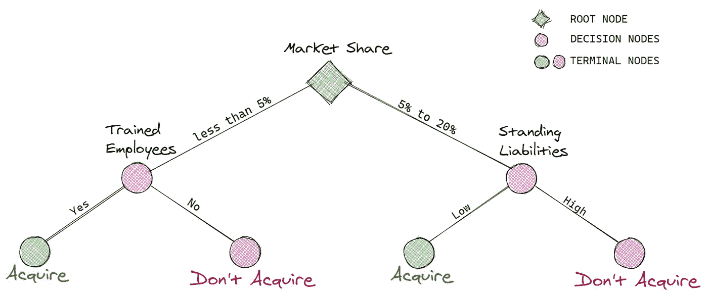
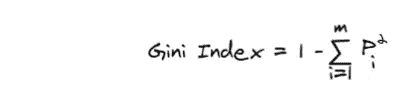
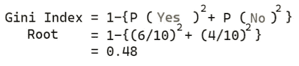
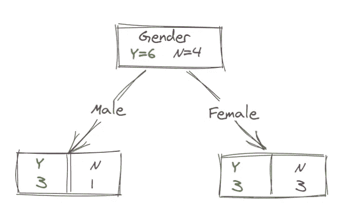
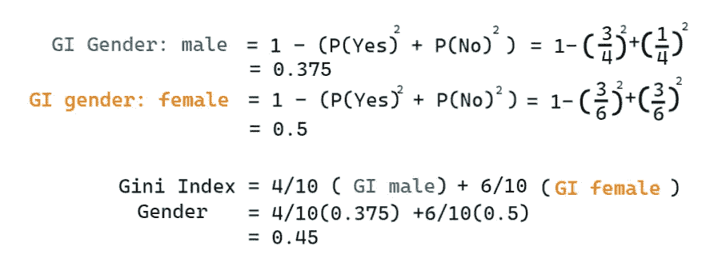
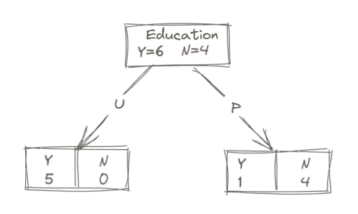
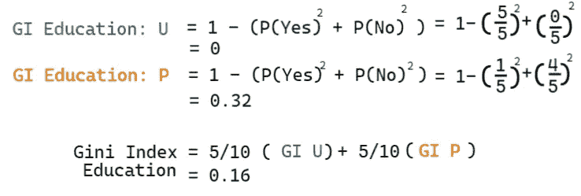

# 让我们做决策树

> 原文：<https://medium.com/mlearning-ai/lets-make-decision-trees-9aa874dc9731?source=collection_archive---------9----------------------->

## 决策树采用分而治之的解决问题方法

Photo by [Jordan McQueen](https://unsplash.com/@jordanfmcqueen?utm_source=unsplash&utm_medium=referral&utm_content=creditCopyText) on [Unsplash](https://unsplash.com/?utm_source=unsplash&utm_medium=referral&utm_content=creditCopyText)

# 介绍

决策树是一种监督学习算法，用于使用流程图的分类，其中每个内部节点表示一个条件(测试)，每个终端节点持有一个类别标签(1 或 0，是或否，默认或非默认)。

让我们用一个例子来理解决策树:

image by author

假设一家大公司想要收购一家在市场上提供类似产品的小型创业公司。现在，高管和管理层必须决定收购这家公司。实时会有多种因素需要考虑，但现在，让我们保持简单。首先，公司将查看市场份额，如果市场份额小于 5 %，则向左移动，如果在 5%到 20%之间(举例来说，不考虑 20%以上)，则向右移动，如图所示。如果创业公司的市场份额低于 5%,但创业公司的员工经过培训，公司将收购创业公司，如果员工没有经过培训，公司将不会收购。现在，如果初创公司的市场份额在 5%至 20%之间，并且长期负债较低，那么公司将收购初创公司，但如果初创公司负债累累，那么公司不会收购。这就是决策树的工作原理。

想象一下，我们不是只有三个特征，而是有许多特征，不是一个创业公司，而是有一个成千上万个创业公司的列表，我们想从这些公司中只收购最好的。这就是决策树在机器学习中的作用。一个巨大的数据集被输入到 DT 模型中，它会根据基尼系数和熵等分割标准(将在后面的部分讨论)在分割后自动构建树。在这里，DT 考虑了所有可能导致最终决策的路径，其中 DT 遵循最佳路径。

# 分类和回归树

是的，我们可以使用决策树进行分类和回归。如果因变量是离散的，我们使用分类，如果是连续的，我们使用回归树。分类树使用基尼指数或熵来分割节点，而回归树使用误差平方和(SSE)来分割。回归树不在本文的讨论范围之内。

注意:CART 是一个二叉树，其中每个节点只分为两个分支。CHAID 可以从一个节点有两个以上的分裂点击这里了解更多。

## 基尼指数计算

基尼系数是一种基于杂质的标准，用于衡量目标属性值的概率分布之间的差异。基尼系数决定了一个特定的特征是否增加了模型的可预测性。基尼系数越高，变量的预测能力越低。

image by author

接近 0 的基尼系数表示分类的纯粹性，较高的基尼系数表示类别的随机分布。这里 ***m*** 是类的数量，而 ***Pi*** 是记录被分类到特定类的概率。

现在让我们用下面的数据来计算基尼指数

image by author

我们的目的是找到哪个特征更适合于分裂 ***性别*** 或 ***教育*** 以分类该人是否从事任何运动。我们将分别计算这两列的基尼系数。让我们首先考虑性别列，拆分后我们得到以下流程图:

让我们计算数据集的基尼系数；

我们有 2 个类(0 和 1)；

image by author

下一步是计算 2 个特征(性别和教育)的基尼系数，并决定哪个特征将被考虑分割。

对于性别:

image by author

image by author

我们将通过加权两个分支的杂质和该分支中的元素数量来计算性别的基尼系数。**杂质测量值为 0.45，因为我们有 45%的时间会错误地标注数据。**

对于教育:

image by author

image by author

我们将通过对两个分支的不纯度和该分支中的元素数量进行加权来计算教育的基尼不纯度。**杂质测量值为 0.16，因为我们大约有 16%的时间会错误地标注数据。**

最后一步是计算两个特征的基尼系数:

*基尼系数(性别)= 0.48–0.45 = 0.03*

*基尼系数(教育)= 0.48–0.16 = 0.32*

***【基尼增益(教育)****>****【基尼增益(性别)***

我们将考虑*教育*而不是*性别*来分割根节点的数据，因为教育领域的基尼收益大于性别领域。

*最大化基尼增益*的特征被考虑用于分裂，决策树在计算基尼增益后递归分裂特征。

**限制**

*   DTs 容易过度拟合:我们执行*修剪*来消除过度拟合。
*   DT 是一种贪婪算法:当使用最佳自变量进行拆分时，模型不会考虑未来状态，如果选择不同的自变量而不是最佳自变量，模型会具有更高的准确性。为了克服这一点，我们执行*交叉验证。*

爱情！活下去！笑！干杯

参考:

[https://www . research gate . net/publication/225237661 _ Decision _ Trees](https://www.researchgate.net/publication/225237661_Decision_Trees)

更多文章:

 [## 集群变得简单

### 使聚集

让 Clusteringmedium.com 变得容易](/geekculture/clustering-made-easy-1fe01dd8048f)  [## 主成分分析

### 一种选择最重要特征的方法

medium.com](/geekculture/principal-component-analysis-3d2b3a0bb93e)  [## 深度学习中需要记住的事情

### 深度学习之旅

medium.com](/geekculture/things-to-remember-in-deep-learning-eca746ed29c8)