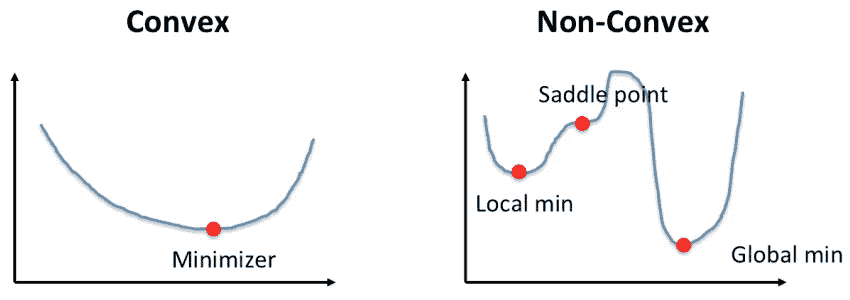
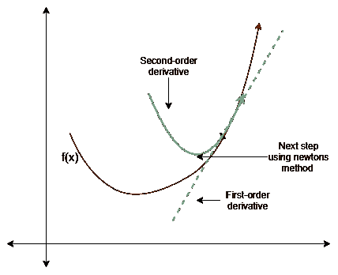

# 优化简介

> 原文：<https://medium.com/mlearning-ai/lets-say-we-are-left-in-the-middle-of-the-mountain-ranges-blind-folded-and-need-to-find-the-89b42d733cc7?source=collection_archive---------5----------------------->

比方说，我们被留在山脉的中间，盲目折叠，需要找到山脉的最低点。

[Source : The spine mountain range](https://eragonroleplay.fandom.com/wiki/The_Spine_Mountain_Range?file=Himalaya_Mountains_1_Nepal_by_CitizenFresh.jpg)

我们最直观的方法之一是感觉地面的坡度。

从我们站的位置，我们试着检查所有可能的最大下坡方向，并朝那个方向移动。

我们每走一步，一次一步，反复迭代，直到在所有可能的方向都没有向下倾斜的点，然后停止。然而，在每一步，都有另外一个决定要做，那就是你一步的大小。

假设你有超能力把你的脚步增加到你想要的大小。所以如果你选择一个很小的步长，你可能要花很长时间才能找到山谷，但是如果你选择一个很大的步长，你会直接从一座山跳到另一座山，错过中间的山谷。所以这是一个我们需要谨慎做出的决定。

Source: [nn-learning-rate](https://www.jeremyjordan.me/nn-learning-rate/)

现在我们有了策略，让我们去实施它。

在优化的情况下，成本函数是山脉，我们的算法对成本函数的形状视而不见，必须找出成本函数的最低点并导出其值。

**假设:**

在这个充满限制的世界里，每个问题的解决方案都有一套假设。

下降算法的一个主要假设是凸性。只有当成本函数是凸的时，这些方法才是可靠的。我们仍然可以在非凸函数上继续尝试，但是鞍点和局部极小值的存在使得算法很难收敛。不要深究函数的凸性，这里有一组图表可以帮助更好地理解。

Source: [Convex/ Non-Convex Functions](https://i.pinimg.com/originals/89/f9/bd/89f9bddacf547661dfc209d4b31c2c12.png)

有两种主要的方法可以帮我们找到最小值:

1.梯度下降

2.牛顿方法

梯度下降法使用一阶导数，而牛顿法使用二阶导数来寻找最小值。

在我们进入微积分和导数之前，那意味着，当梯度下降只是在每个点沿着一个斜率移动时，牛顿法直接跳到近似二阶导数二次曲线的最低点。

First-order and Second-order derivative of a point on the curve

(不那么)无聊的公式:

梯度下降:

其中 xt+1 是下一步，η(η)是步长(学习速率)，∇表示该步的斜率。

Next step using gradient descent

牛顿的方法:

Next step using Newton’s method

Source: [Hessian Matrix](https://brilliant.org/wiki/hessian-matrix/)

其中 xt+1 是下一步，h 是海森矩阵，∇表示该步的斜率。Hessian 是使用偏导数计算的函数 f 的二阶导数。

导数用于计算方程的斜率。一阶导数给出一条线作为特定点的斜率，而二阶导数添加了额外的近似信息，给出另一个二次方程而不是一条线，以估计最小值。

我们之前谈到的步长被称为梯度下降情况下的学习率。这是一个重要的超参数，需要调整算法才能有效收敛。

所以梯度法以给定的步长沿着曲线的斜率不断移动，而牛顿法计算该点的二阶导数，逼近该导数的最小值，直接移动到该点。

Source: [blog.paperspace.com](https://blog.paperspace.com/intro-to-optimization-in-deep-learning-gradient-descent/)

因此，牛顿法通常比梯度下降法收敛得快

尽管牛顿的方法收敛得更快，但在实践中，处理大量数据集将显著增加参数空间，因此计算 Hessian 矩阵的逆矩阵在计算上变得昂贵，并且需要非常大的存储空间。所以在机器学习/深度学习应用中使用它实际上是不可能的，因为它需要计算 hessian 矩阵的逆矩阵。

这是一篇关于最优化下降算法的介绍性文章。梯度下降的变体和普通随机梯度下降的扩展，如 Momentum、RMSProp 和 Adam 将在接下来的帖子中介绍。

这篇文章是机器学习优化系列的第二部分。

在此处检查[零件-1！](/nerd-for-tech/how-does-lagrange-optimization-work-fae0fcd9e674)