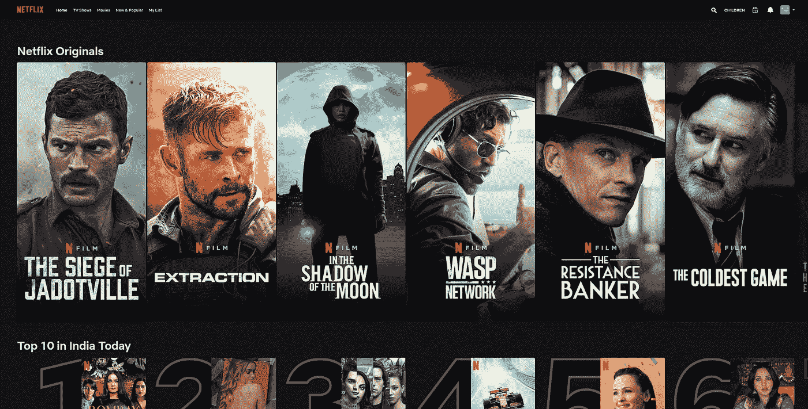

# 让我们谈谈数字服务中的个性化…

> 原文：<https://medium.com/mlearning-ai/lets-talk-about-personalization-in-digital-services-3104ff486bef?source=collection_archive---------6----------------------->

个性化是设计一些东西来满足某人的个人需求的行为。这是以客户为中心的设计的圣杯。该公司实际上是在为个人客户量身定制体验。这意味着一个产品将向不同的客户提供完全不同的体验，从而有效地成为完全不同的产品！

那不是很棒吗？

是的，它是。

服务的个性化由来已久。最初仅限于少数行业，最近由于在当今信息时代易于实施，它获得了关注。[网飞效应](https://www.forbes.com/sites/blakemorgan/2019/02/19/what-is-the-netflix-effect/?sh=443c97155640)只是增强了其作为向客户提供体验的“技术”的可信度。

为什么不呢！

> **如果福特有机会交付个性化的 T 型车，而对交付周期或库存几乎没有影响，它肯定不会采用它闻名的大规模生产流程。**

Netflix Home Page uses personalization to showcase relevant contents from its huge library.

今天的数字服务利用其专有算法来猜测客户的最佳体验。从显示什么内容到如何显示，都由算法控制。这些算法不仅考虑了关于客户先前如何评估服务的信息，还考虑了具有相似偏好的客户如何评估服务。这在很大程度上定义了脸书、YouTube、Instagram 和 OTT 视频平台等服务。像我们的大脑一样，机器学习算法也依赖模式识别来建立模型。随着大数据处理的发展，这些算法只会限制对客户的了解。

> 网飞不仅使用个性化来决定在主页上显示什么内容，甚至决定你喜欢某个特定标题的缩略图。所有这一切都是为了让你开始另一个系列…

来自不同服务的不同算法在设计方式上有所不同，这是由它们的主要目标决定的。通常，算法的设计要牢记公司想要追求的某些指标。例如，Instagram 希望让用户参与到应用程序中，从而产生广告收入。网飞想让你接触多本书，这样你就不会退订了。这些公司目标驱动算法的创建和更新。

由于网飞效应，个性化已成为当今的热门话题。现在，每个人都想通过向他们的客户提供个性化的内容来从他们的竞争对手那里获得优势。在某些行业，主要是娱乐和消费，它已经成为不同品牌的平衡点。然而，目前算法紧密集成的方式缺乏一个至关重要的人类因素:惊喜元素，随机性！

当前的实现基于客户(或类似客户之一)如何访问其服务，并试图相应地预测客户的偏好。预测客户的行为是好的，但是如果我们继续这样做，我们就忽略了一个事实，即当前的技术只是服务于访问网站的用户，而不是客户本身。因为顾客是算法所不知道的许多体验的混合体。除非客户习惯于人工智能做出的“可预测”预测，否则个性化算法无法独自创建真实的客户资料，以正确预测需要向客户提供什么。没有必要为了让算法变得伟大和独特而纠结于了解客户的一切。

> 预测客户的行为是好的，但是如果我们继续这样做，我们就忽略了一个事实，即当前的技术只是服务于访问网站的用户，而不是客户本身。

这正是 Apple Music 在 Spotify 受欢迎的背后挽救其消失的做法。Spotify 严重依赖算法及其预测能力，这使得目前几乎不可能有任何其他音乐流媒体服务上市。苹果音乐敢于用它的收音机试水，由真人而不是算法混合。这不仅能让顾客探索新唱片，甚至还能激发顾客对一种已经很久没有听过的音乐类型的兴趣！在这里，苹果故意选择不要太个性化。它接受了一个事实，即客户档案不仅仅是某人听的最后 5 首歌。我想让你从这篇文章中学到的最重要的东西是了解用户和客户之间的区别。下一步是更好的算法。一旦我们接受了这一点，有改进余地的算法就会自动产生。

> 除非客户习惯于人工智能做出的“可预测”预测，否则个性化算法无法独自创建真实的客户资料，以正确预测需要向客户提供什么。

真正的个性化体验也会给用户主动训练算法的机会。它会制造快乐的意外，并等待即时反馈，为客户调整设置。YouTube 利用多个按钮来帮助它微调算法，以适应人们喜欢的视频类型。然而，它以一种让用户公开代表某些东西的方式来呈现选项。如果你正在训练你的算法，这是不理想的。这也是 Instagram 期待不再在帖子上显示赞数的确切原因！

YouTube makes use of multiple buttons which help it fine tune its algorithm to what kind of video a person would like.

再来说说我前面提到的反馈。反馈是用户向算法提供的信息，算法随后使用反馈来调整用户的个性化设置。理想的方法是记录用户得到的每个印象的反馈。怎么做:通过设计阻力最小的动作按钮。如果用户喜欢或不喜欢平台上的某些东西，他/她不应该被告知算法而不知所措。应该鼓励用户参与到这些约定中来，而他们实现这一点的方法是询问反馈，而不要让用户感到害怕。

> 真正的个性化体验也给用户主动训练算法的机会。

Asking for feedback is the key to build Personalization Algorithm

网飞只用两个按钮:拇指朝上和拇指朝下。除了告诉算法偏好之外，没有其他选择的含义。并且用户参与其中，因为她/他知道偏好没有向公众显示。正是这种想法让网飞成为了个性化之王和市场领导者。

> 改善的理想方法是记录算法建议的每个印象的反馈。

事实上，即使一些大公司仍在致力于个性化，这意味着还有很大的改进余地。现在是时候了，个性化将不再被视为一个区分点，而是一个对等点。这为许多新公司打开了大门，让它们拿出最好的水平，力争上游。我很高兴看到科技行业(现在一切都是科技，不是吗？)利用个性化为客户提供更好的体验。

现在是观察未来发展的最佳时机。