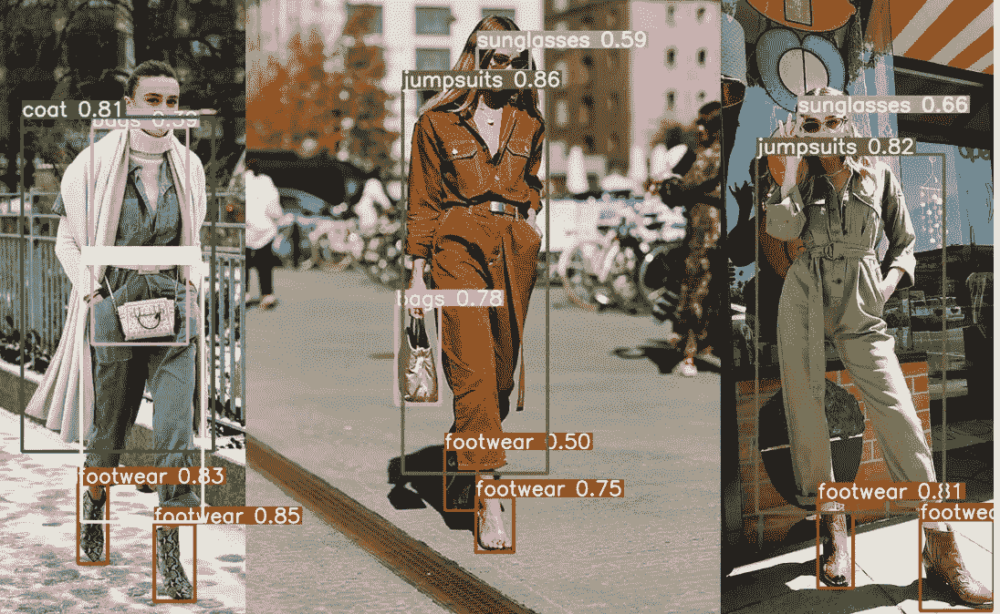

# YOLOv8:物体检测中你必须知道的一个概念——信箱

> 原文：<https://medium.com/mlearning-ai/letterbox-in-object-detection-77ee14e5ac46?source=collection_archive---------0----------------------->

## 介绍如何使用信箱在对象检测，包括在 YOLO 系列。

# 介绍

在物体检测中，有一个图像处理过程叫做信箱。如果你不熟悉背景，你可能会想知道 letterbox 到底代表什么？什么…