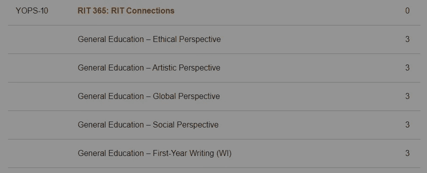
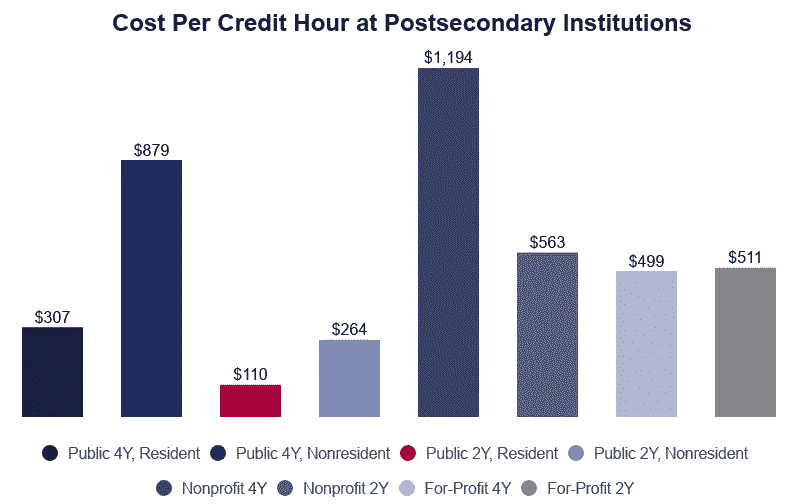
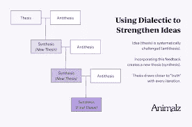
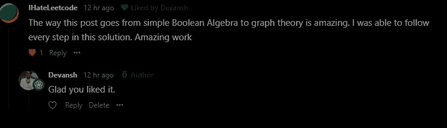

# 文科会让你更擅长机器学习

> 原文：<https://medium.com/mlearning-ai/liberal-arts-will-make-you-better-at-machine-learning-e16e246c596?source=collection_archive---------4----------------------->

## 任何人告诉你，否则应该被忽略

作为一个参与教育领域的人，我喜欢关注这个领域的讨论。最近，网上最大的争论之一是关于大学毕业要求。更具体地说，争论围绕着一个工程师学习像哲学、写作和经济学这样的东西是否有任何好处。正如大多数互联网辩论一样，有一些重要的观点和许多不好的论点。在这篇文章中，我将与你分享最重要的论点，以及我的观点(标题很明显)。然而，我不是标准的“文科会让你成为一个更全面的人”，而是告诉你学习各种文科会如何帮助你的机器学习之旅。

# 背景

我们先来了解一下这场争论背后的背景。大学让 STEM 领域的学生去做非专业相关的课程。例如，作为计算机科学和计算数学双学位，我被迫学习文化人类学、化学和伦理学等课程。如果我没有通过这些课程，我就不能从大学毕业。

A screenshot from my university's Computer Science Roadmap for the Freshman Year. That’s 15 credits of completely unrelated courses. There’s more in the second year.

喜欢这个系统的人总是谈论这是一个学习新思想的好方法，否则你将不会接触到。你还会遇到来自完全不同专业/兴趣的人，这在专业相关的课程中并不常见。这增加了“大学经历”,因为你会遇到不同背景的人并向他们学习。*都是好东西，那又有什么问题呢？*

批评者认为，不算“不必要”课程的额外学分费用，大学已经够贵的了。更不用说，这些课程会变得极其困难，给学生增加很多额外的课程负担。最后，许多学生对课程非常不感兴趣，只是为了满足要求而上课(我在化学课上就是这样做的)。所以他们从这项研究中得不到长期的好处。

Remember this is the cost per credit hour. Most courses are multiple credit hours. Picture and Data taken from educationdata.org

这比乍看上去要昂贵得多。[根据教育数据倡议](https://educationdata.org/cost-of-a-college-class-or-credit-hour#:~:text=College%20Cost%20Per%20Credit%20Hour&text=The%20average%20cost%20per%20credit,cost%20per%20course%20is%20%243%2C242.)的这篇文章，任何四年制大学的课程平均成本为**636 美元**。这一数字膨胀到**1092 美元**，这是任何私立四年制大学每学分的平均费用。这意味着在我大一的时候，我在这些高等教育课程上花费了超过 15000 美元。鉴于大学及其掠夺性定价的历史，许多人将额外课程视为抢钱之举也就不足为奇了。

# 这种教育方式的经验

回顾我的经历和我交谈过的人的经历，这是一个大杂烩。有些人玩得很开心(伦理学很有趣)，有些人讨厌他们的选修课(我对化学过敏)。没有一种方法可以准确概括不同群体对多个主题的感受。然而，大多数人认为我们在非相关领域有太多的必修课。无论如何都要接受。

# 文科如何让自己更擅长产品设计和机器学习

到目前为止，我并不十分赞同混合式教育。然而，让我告诉你一些具体的例子，额外的课程实际上在机器学习方面帮助了我。这将有助于你找出哪些领域应该投入时间。我会链接一些你可以用来学习它们的资源。

This model is simplistic, but it’s quite powerful

1.  写作:学习写作对我来说是一个很大的启示。我的大学让我们写学术论文，这非常有用。学会将写作视为一种话语，将对话框架视为论题-对偶-综合之间的相互作用(如果你想了解这个概念，请查阅黑格尔的著作)帮助我以更好的方式构建我的论点和主张。 [UChicago 有很棒的以这种方式写作的视频](https://www.youtube.com/watch?v=vtIzMaLkCaM&ab_channel=UChicagoSocialSciences)。
2.  **经济学:** [数学对于好的机器学习来说至关重要，因为它让你以可以量化的方式来描述情况。经济学也是如此。经济学非常适合学习如何建立评估价值、后悔和损失等抽象概念的框架。你不必深入研究就能获得学习经济学的许多好处。《经济学解释》、《货币与宏观》、《货币如何运作》等频道是 YouTube 上让你迷上这一领域的绝佳频道。**当我在 ForeOptics 工作，必须找到分析地缘政治风险的方法时，经济学给了我直接的帮助。**](https://youtu.be/b8WjF-6Bhqc)
3.  **哲学**:很多人认为这个“没用”。哲学不仅迫使你学会如何表达和评估论点(对提案很有帮助)，它还会让你的头脑向如此多的想法敞开大门。你知道吗，二进制数字系统以及所有的计算机都是受一本 9 世纪的中国哲学书的启发。每个讨论都有哲理，只要找到你最感兴趣的话题，就可以投入进去。
4.  **逻辑:**对于哲学兄弟来说，逻辑至关重要。学习逻辑不仅会在现实世界中为你服务，而且在机器学习和数据科学中也至关重要。逻辑教你如何识别错误的前提和推论，这将有助于你选择特征，建立实验，并得出结论。[基于逻辑的机器学习也是一个东西。](http://www.doc.ic.ac.uk/~shm/Papers/lbml.pdf)

这些只是我能通过我的个人经历说出的对我有直接帮助的例子。我确信有很多无形的方式帮助了我。像《思考的快慢》和《非理性的好处》这样的书让我更加意识到自己的偏见和逻辑缺陷。《上瘾:如何打造养成习惯的产品》是那些寻求打造产品(或与屏幕成瘾作斗争)的人的杰作。“Jugaad 创新”帮助我认识到**简单+经济高效胜过大量功能+昂贵。**

# 最后一句话/你应该做什么

正如你所看到的，文科肯定会帮助你的机器学习之旅。机器学习的很大一部分在于在多个领域之间建立联系，文科可以作为帮助你连接各个领域的粘合剂。

我故意远离通常的“学习这一切让你变得全面”因为它不够具体。相反，我提出了事情如何在我的机器学习中帮助了我个人。这些细节将帮助你更好地指导自己的学习。

Photo by [🇸🇮 Janko Ferlič](https://unsplash.com/@itfeelslikefilm?utm_source=medium&utm_medium=referral) on [Unsplash](https://unsplash.com?utm_source=medium&utm_medium=referral)

最后一个例子，我将在我的每周编码时事通讯《编码采访变得简单》([你可以在这里了解更多信息](https://codinginterviewsmadesimple.substack.com/about))中使用我的建议经验。这是一份免费的每周时事通讯，致力于帮助人们通过编码面试。成员中最常见的问题之一是无法将概念之间的点连接起来。这使得他们在大多数问题需要你把点联系起来之前退缩了。

What a perfect username haha. We all hate Leetcode

拿 [2SAT 问题](https://codinginterviewsmadesimple.substack.com/p/solutionproblem-25-boolean-satisfiabilitydropbox?r=4tnbw&utm_campaign=post&utm_medium=web)来说。这是面试中最难解决的问题之一。解决方案要求您将逻辑 or 和 and 转换为蕴涵(逻辑和布尔代数)，然后将该语句转换为蕴涵图。然后我们用图论来寻找最优解。[你可以在这里看到解决方案](https://codinginterviewsmadesimple.substack.com/p/solutionproblem-25-boolean-satisfiabilitydropbox?r=4tnbw&utm_campaign=post&utm_medium=web)。我之所以能够连贯地连接所有这些领域，是因为文科。学习多个文科领域教你把各种想法之间的点点滴滴联系起来。

所以，你应该多花点时间学习这些“没用”的技能来推进你的事业。如果所有认知上的好处还不足以说服你，那么所有机器学习/软件开发相关的好处应该可以。那么你应该如何着手呢？很高兴你问了。

找到你感兴趣的东西。互联网上有很多很棒的社区。YouTube、Twitter 和 Medium 都有很棒的社区(包括我们自己的社区),有大量关于各种话题的活跃讨论。下次你碰到 ML/Tech 新闻，不要只想着技术细节，想想它会如何影响社会。想想实施的经济成本，它取代/增加了社会的哪些方面。当你遇到有人引用一项研究或事实时，试着想想这项研究有哪些替代结论/延伸(参见直接转入数据科学和机器学习)。这些都将有助于你养成把事情联系起来的习惯。

Spiderman has some interesting themes you can look into. Photo by [Road Trip with Raj](https://unsplash.com/@roadtripwithraj?utm_source=medium&utm_medium=referral) on [Unsplash](https://unsplash.com?utm_source=medium&utm_medium=referral)

你不仅仅局限于非小说。书籍、电影/漫画/漫画、YouTube 视频都很棒，因为它们总是有内在的主题/假设。文科之所以伟大，是因为它们本质上是综合性的。你可以找到有趣的方面，不管你的兴趣是什么。只要你积极参与到内容中，你就会获得收益。你也不会失去上大学的大笔资金。

# 联系我:

insta gram:[https://www.instagram.com/iseethings404/](https://www.instagram.com/iseethings404/)

在推特上给我发消息:【https://twitter.com/Machine01776819 

我的 LinkedIn:【https://www.linkedin.com/in/devansh-devansh-516004168/】T4

 [## Mlearning.ai 提交建议

### 如何成为 Mlearning.ai 上的作家

medium.com](/mlearning-ai/mlearning-ai-submission-suggestions-b51e2b130bfb)